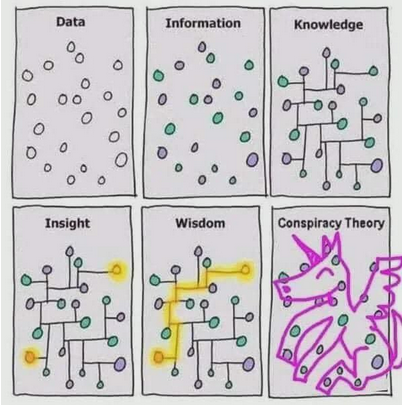

# Вступ до курсу: Знання, Інженерія та Якість коду
## Про що цей курс і чому саме Java?

Цей курс присвячений вивченню мови **Java**, ключових компонентів, як-от **Java Collections Framework**, та стандартних **алгоритмів**, що є основою для будь-якого програміста.

**Чому саме Java?** У світі, де щороку з'являються нові мови, Java залишається фундаментальним і надзвичайно затребуваним інструментом з кількох причин:
* **Enterprise-стандарт:** Java є домінуючою мовою для розробки великих, надійних серверних систем, якими користуються банки, страхові компанії та гіганти електронної комерції.
* **Android розробка:** Це одна з офіційних мов для створення нативних додатків для найбільшої мобільної платформи у світі.
* **Надійність та безпека:** Строга типізація та керована пам'ять (JVM) роблять Java передбачуваною та стійкою до багатьох класів помилок.
* **Величезна екосистема:** Мільйони розробників, тисячі бібліотек та потужні фреймворки (як-от Spring) дозволяють вирішувати будь-які задачі.

Але головна мета курсу — не просто передати вам набір даних чи інформації. Наша ціль — це **Знання** та, в кінцевому підсумку, **Мудрість**. Ми будемо вчитися перетворювати розрізнені факти на структуровані знання, знаходити в них глибинні зв'язки (Insight) і застосовувати їх для вирішення складних завдань (Wisdom).



***

## Структура курсу та наш фінальний проєкт

Щоб одразу розуміти, як ми будемо працювати, ось структура нашого курсу:
* **Лекції:** Теоретична база, розбір концепцій та принципів.
* **Практичні заняття:** Закріплення теорії через вирішення задач та написання коду.
* **Домашні завдання:** Самостійна робота для відточування навичок.
* **Фінальний проєкт:** Комплексне завдання, де ви застосуєте всі отримані знання для створення повноцінного продукту.

**Приклад нашого фінального проєкту:**
Протягом курсу ми будемо розробляти спрощену **систему управління бібліотекою**. Цей проєкт допоможе нам зробити всі теоретичні концепції практичними. Ми використаємо **Java Collections** для зберігання даних про книги та читачів, застосуємо принципи **SOLID** для створення гнучкої та розширюваної архітектури, а весь процес розробки будемо вести в **Git** для ефективної командної роботи.

***

## Хто такий інженер-програміст?

Важливо розуміти різницю між просто написанням коду та розробкою програмного забезпечення.

* **Написання програми vs. Розробка ПЗ:** Перше — це вирішення конкретної, часто ізольованої задачі. Друге — це комплексний процес створення, підтримки та розвитку системи, що вимагає інженерного підходу.
* **Ремісничий підхід vs. Індустріальний підхід:** Ремісник може створити унікальний, майстерний виріб. Але для створення великих, надійних систем, над якими працюють команди, потрібен індустріальний підхід: стандарти, процеси та дисципліна.

**Ключові якості успішного інженера-програміста:**
* **Знання та навички:** Фундаментальна база.
* **Здатність до навчання (Learnability):** Технології змінюються, і вміння швидко вчитися є критичним.
* **Самостійність:** Вміння знаходити рішення та брати на себе відповідальність.
* **Комунікативні навички:** Робота в команді — це 90% успіху.
* **Акуратність та своєчасність:** Повага до дедлайнів та увага до деталей.

***

## Принципи якісного коду

Якісний код — це фундамент надійного програмного забезпечення. Існують перевірені часом принципи, які допомагають цього досягти.

### Загальні принципи

* **Java Code Convention:** Дотримання єдиного стилю кодування для полегшення читання та підтримки коду в команді.
* **DRY (Don't Repeat Yourself / Не повторюйся):** "Кожна частина знання в системі повинна мати єдине, недвозначне та авторитетне представлення". Уникайте дублювання коду.
* **KISS (Keep It Simple, Stupid / Роби простіше):** Забороняє використовувати складніші засоби, ніж це необхідно. Найпростіше рішення — зазвичай найкраще.
* **YAGNI (You Ain't Gonna Need It / Тобі це не знадобиться):** Не додавайте функціонал "про всяк випадок". Реалізовуйте тільки те, що дійсно потрібно зараз.

### Принципи об'єктно-орієнтованого дизайну: SOLID

Це п'ять фундаментальних принципів, що роблять систему гнучкою, зрозумілою та легкою для підтримки.

* **S — Single Responsibility Principle (Принцип єдиного обов'язку):** Клас повинен мати лише одну причину для змін, тобто виконувати лише один обов'язок.
* **O — Open/Closed Principle (Принцип відкритості/закритості):** Програмні сутності (класи, модулі) мають бути відкритими для розширення, але закритими для модифікації.
* **L — Liskov Substitution Principle (Принцип підстановки Барбари Лісков):** Об'єкти в програмі повинні бути замінними на екземпляри їхніх підтипів без зміни коректності виконання програми.
* **I — Interface Segregation Principle (Принцип розділення інтерфейсу):** Краще мати багато спеціалізованих інтерфейсів, ніж один загального призначення.
* **D — Dependency Inversion Principle (Принцип інверсії залежностей):** Модулі вищого рівня не повинні залежати від модулів нижчого рівня. Обидва повинні залежати від абстракцій.

***

## Інструменти інженера: Система контролю версій (VCS)

Система контролю версій (наприклад, **Git**) — це програмне забезпечення, що допомагає керувати змінами в інформації (найчастіше — у вихідному коді). Це один з найважливіших інструментів в індустріальній розробці.

**Основні можливості VCS:**
* Зберігати безліч версій одного й того ж документа.
* Повертатися до попередніх версій у будь-який момент.
* Визначати, хто, коли і які саме зміни вніс.
* Ефективно працювати в команді над одним проєктом.

Ось як спрощено виглядає робочий процес з VCS:

```mermaid
graph TD;
    A[Поточна версія файлу] -->|1. Вносите зміни| B(Відредагований файл);
    B -->|2. Робите 'commit'| C(Нова збережена версія);
    A -->|3. Можна повернутися до старої версії| C;
    C --> A;
````

-----

## Перші кроки: Налаштування середовища

Щоб бути готовими до перших практичних занять, будь ласка, встановіть наступне програмне забезпечення:

  * **JDK (Java Development Kit):** Це основа для розробки на Java. Рекомендована версія — 17 або вище. Завантажити можна з [Oracle JDK](https://www.oracle.com/java/technologies/downloads/) або [OpenJDK](https://adoptium.net/).
  * **IDE (Середовище розробки):** Програма для написання коду. Рекомендую **IntelliJ IDEA Community Edition** — це безкоштовний, потужний та зручний інструмент. Завантажити можна з [офіційного сайту JetBrains](https://www.jetbrains.com/idea/download/).
  * **Git:** Система контролю версій, яку ми будемо використовувати протягом всього курсу. Завантажити можна з [офіційного сайту Git](https://git-scm.com/downloads).

-----

## Контрольні питання

1.  **Теорія знань.** Опишіть своїми словами ієрархію "Дані → Інформація → Знання → Мудрість". Чому для інженера-програміста важливо прагнути до рівня "Знання", а не зупинятися на "Інформації"?

2.  **Вибір технології.** Поясніть, чому Java залишається актуальною мовою програмування для великих комерційних систем (Enterprise), згадавши щонайменше дві її ключові характеристики з лекції.

3.  **Принципи коду.** Поясніть принцип **DRY (Don't Repeat Yourself)**. Наведіть гіпотетичний приклад дублювання коду в програмі та поясніть, до яких проблем це може призвести.

4.  **Інженерний підхід.** Чому система контролю версій (VCS), така як Git, є абсолютно необхідною для **індустріального підходу** до розробки, але може бути менш критичною для простого **написання програми** в рамках ремісничого підходу?