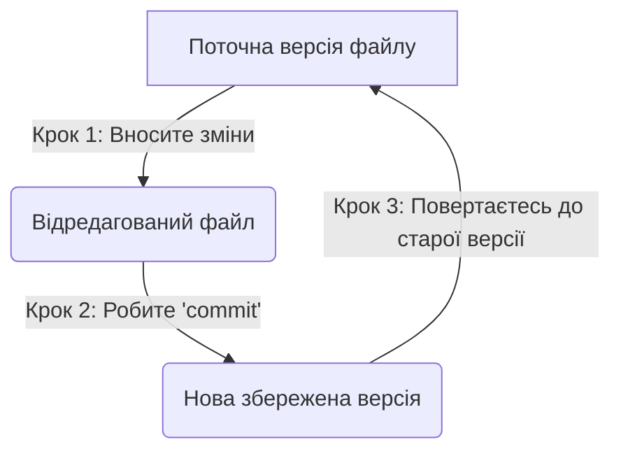

# Лекція 0: Вступ до курсу: Знання, Інженерія та Якість коду

Привіт усім\! Вітаю вас на нашому курсі. Мене звати Віталій, і цей семестр ми проведемо разом, занурюючись у світ Java.

Але перш ніж ми почнемо, давайте швидко синхронізуємось.

## ⚡ Експрес-опитування: На старт\!

1.  Який у вас досвід роботи з C++ (або іншими мовами) з минулого семестру? (1 - нічого не пам'ятаю, 5 - готовий писати складні програми).
2.  Чого ви очікуєте від Java? Що ви про неї чули?
3.  Хто чув акронім **"SOLID"**?

Наші очікування (відповідь)

  * **Чого я очікую від вас:** Цей курс розрахований на те, що ви вже маєте базове розуміння програмування з курсу C++. Ми не будемо вчити, що таке `if` або `for`.
  * **Чого вам очікувати від мене:** Ми будемо фокусуватися на тому, як Java реалізує знайомі вам концепції, і, що найважливіше, — як будувати **надійні програмні системи**.

-----

## Про що цей курс і чому саме Java?

Цей курс присвячений вивченню мови **Java**, ключових компонентів, як-от **Java Collections Framework**, та стандартних **алгоритмів**, що є основою для будь-якого програміста.

**Чому саме Java?** У світі, де щороку з'являються нові мови, Java залишається фундаментальним і надзвичайно затребуваним інструментом з кількох причин:

  * **Enterprise-стандарт:** Java є домінуючою мовою для розробки великих, надійних серверних систем, якими користуються банки, страхові компанії та гіганти електронної комерції.
  * **Android розробка:** Це одна з офіційних мов для створення нативних додатків для найбільшої мобільної платформи у світі.
  * **Надійність та безпека:** Строга типізація та керована пам'ять (JVM) роблять Java передбачуваною та стійкою до багатьох класів помилок.
  * **Величезна екосистема:** Мільйони розробників, тисячі бібліотек та потужні фреймворки (як-от Spring) дозволяють вирішувати будь-які задачі.

Але головна мета курсу — не просто передати вам набір даних чи інформації. Наша ціль — це **Знання** та, в кінцевому підсумку, **Мудрість**. Ми будемо вчитися перетворювати розрізнені факти на структуровані знання, знаходити в них глибинні зв'язки (Insight) і застосовувати їх для вирішення складних завдань (Wisdom).

-----

## Від C++ до Проектування ПЗ: Наш новий фокус

У попередньому курсі ми з вами детально розглядали C++ як мову програмування. Ми познайомилися з її основними концепціями: базовими конструкціями, класами, шаблонами (templates) та об'єктно-орієнтованим програмуванням в цілому. Це дало нам міцний фундамент розуміння того, як програми працюють на низькому рівні.

У цьому курсі, вивчаючи Java, ми зміщуємо наш фокус з "як написати код" на **"як проектувати програмне забезпечення"**. Ми будемо розглядати мову не просто як набір синтаксичних правил, а як інструмент для побудови гнучких, масштабованих та надійних систем. Основна увага буде приділена таким концепціям, як **шаблони проектування (design patterns)**, **інверсія залежностей (dependency inversion)**, **впровадження залежностей (dependency injection)** та багатьом іншим інженерним підходам.

Цей семестр закладе основу, а вже в другому семестрі ми підемо ще далі: будемо розглядати, як побудована робота команд розробки і як відбувається повний цикл життя ПЗ — від первинних вимог замовника до готового до експлуатації продукту.

## Структура курсу та наш фінальний проєкт

Щоб одразу розуміти, як ми будемо працювати, ось структура нашого курсу:

  * **Лекції:** Теоретична база, розбір концепцій та принципів.
  * **Практичні заняття:** Закріплення теорії через вирішення задач та написання коду.
  * **Домашні завдання:** Самостійна робота для відточування навичок.
  * **Фінальний проєкт:** Комплексне завдання, де ви застосуєте всі отримані знання.

### Наш "Кінцевий Продукт": Проєктування Модульної Гри

Дотримуючись нашої філософії "кінцевий продукт, а не диплом", наш фінальний проєкт буде зосереджений на **інженерії та дизайні**.

  * **Завдання:** Ви (самостійно або в парі) оберете одну з запропонованих **консольних ігор** (наприклад, "Блекджек", "Морський бій", "Бики і корови") для реалізації.
  * **Фокус:** Головною метою буде **не** складність самої гри, а **якість вашого проєкту (дизайну)**.
  * **Процес:** Вам потрібно буде пройти всі етапи інженерної роботи:
    1.  **Описати вимоги** до гри (`readme.md`).
    2.  **Спроєктувати модульний дизайн**, що базується на принципах **SOLID** та **DIP** (абстракції, інтерфейси).
    3.  **Зробити просту імплементацію**, яка відповідає вашому дизайну.
    4.  **Захистити** не стільки код, скільки **архітектурні рішення**, які ви прийняли.

Таким чином, ваш "продукт" — це не просто `.java` файли, а **`readme.md` файл з обґрунтуванням вашого дизайну** та гнучка система, готова до розширення.

(Ми присвятимо цьому окремий методичний посібник [Фінальний Проєкт: Проєктування Консольної Гри](n01_final_project.md)).

-----

## Хто такий інженер-програміст?

Важливо розуміти різницю між просто написанням коду та розробкою програмного забезпечення.

  * **Написання програми vs. Розробка ПЗ:** Перше — це вирішення конкретної, часто ізольованої задачі. Друге — це комплексний процес створення, підтримки та розвитку системи, що вимагає інженерного підходу.
  * **Ремісничий підхід vs. Індустріальний підхід:** Ремісник може створити унікальний, майстерний виріб. Але для створення великих, надійних систем, над якими працюють команди, потрібен індустріальний підхід: **стандарти, процеси та дисципліна.**

### 🤔 Питання до групи

Як ви думаєте, які "стандарти" або "процеси" в індустріальній розробці є найважливішими для команди з 10 людей, що працює над одним проєктом?

Моя думка...

На мій погляд, це:

1.  **Єдина система контролю версій (Git):** Щоб не затирати роботу один одного.
2.  **Єдиний стиль кодування (Code Convention):** Щоб код виглядав так, ніби його писала одна людина.
3.  **Автоматизовані тести:** Щоб бути впевненим, що нові зміни не зламали старий функціонал.
4.  **Чіткий дизайн (Архітектура):** Щоб усі розуміли, де і який код має знаходитись (напр., SOLID).
    

**Ключові якості успішного інженера-програміста:**

  * **Знання та навички:** Фундаментальна база.
  * **Здатність до навчання (Learnability):** Технології змінюються, і вміння швидко вчитися є критичним.
  * **Самостійність:** Вміння знаходити рішення та брати на себе відповідальність.
  * **Комунікативні навички:** Робота в команді — це 90% успіху.
  * **Акуратність та своєчасність:** Повага до дедлайнів та увага до деталей.

-----

## Принципи якісного коду

Якісний код — це фундамент надійного програмного забезпечення. Існують перевірені часом принципи, які допомагають цього досягти.

### Загальні принципи

  * **Java Code Convention:** Дотримання єдиного стилю кодування для полегшення читання та підтримки коду в команді.
  * **DRY (Don't Repeat Yourself / Не повторюйся):** "Кожна частина знання в системі повинна мати єдине, недвозначне та авторитетне представлення". Уникайте дублювання коду.
  * **KISS (Keep It Simple, Stupid / Роби простіше):** Забороняє використовувати складніші засоби, ніж це необхідно. Найпростіше рішення — зазвичай найкраще.
  * **YAGNI (You Ain't Gonna Need It / Тобі це не знадобиться):** Не додавайте функціонал "про всяк випадок". Реалізовуйте тільки те, що дійсно потрібно зараз.

### Принципи об'єктно-орієнтованого дизайну: SOLID

Це п'ять фундаментальних принципів, що роблять систему гнучкою, зрозумілою та легкою для підтримки.

  * **S — Single Responsibility Principle (Принцип єдиного обов'язку):** Клас повинен мати лише одну причину для змін, тобто виконувати лише один обов'язок.
  * **O — Open/Closed Principle (Принцип відкритості/закритості):** Програмні сутності (класи, модулі) мають бути відкритими для розширення, але закритими для модифікації.
  * **L — Liskov Substitution Principle (Принцип підстановки Барбари Лісков):** Об'єкти в програмі повинні бути замінними на екземпляри їхніх підтипів без зміни коректності виконання програми.
  * **I — Interface Segregation Principle (Принцип розділення інтерфейсу):** Краще мати багато спеціалізованих інтерфейсів, ніж один загального призначення.
  * **D — Dependency Inversion Principle (Принцип інверсії залежностей):** Модулі вищого рівня не повинні залежати від модулів нижчого рівня. Обидва повинні залежати від абстракцій.

(Ми детально розберемо ці принципи на [Лекції 5](05_solid.md) та закріпимо їх на [Практикумі 5](p05_solid.md))

-----

## Інструменти інженера: Система контролю версій (VCS)

Система контролю версій (наприклад, **Git**) — це програмне забезпечення, що допомагає керувати змінами в інформації (найчастіше — у вихідному коді). Це один з найважливіших інструментів в індустріальній розробці.

**Основні можливості VCS:**

  * Зберігати безліч версій одного й того ж документа.
  * Повертатися до попередніх версій у будь-який момент.
  * Визначати, хто, коли і які саме зміни вніс.
  * Ефективно працювати в команді над одним проєктом.

Ось як спрощено виглядає робочий процес з VCS:

(Детальніше про те, як ми будемо використовувати Git, див. у [Практикум 0: Робочий процес з Git та GitHub](p00_git_github.md))

-----

## Перші кроки: Налаштування середовища

Щоб бути готовими до перших практичних занять, будь ласка, встановіть наступне програмне забезпечення:

  * **JDK (Java Development Kit):** Це основа для розробки на Java. Рекомендована версія — 17 або вище. Завантажити можна з [Oracle JDK](https://www.oracle.com/java/technologies/downloads/) або [OpenJDK](https://openjdk.org/projects/jdk/).
  * **IDE (Середовище розробки):** Програма для написання коду. Рекомендую **IntelliJ IDEA Community Edition** — це безкоштовний, потужний та зручний інструмент. Завантажити можна з [офіційного сайту JetBrains](https://www.jetbrains.com/idea/download/).
  * **Git:** Система контролю версій, яку ми будемо використовувати протягом всього курсу. Завантажити можна з [офіційного сайту Git](https://git-scm.com/downloads).

Наша перша практична робота буде присвячена налаштуванню Git ([Практикум 0](p00_git_github.md)), а друга — знайомству з Maven ([Практикум 1](p01_maven.md)), який є ключовим інструментом для збірки проєктів.

-----

## ✅ Контрольні питання

1.  **Теорія знань.** Опишіть своїми словами ієрархію "Дані → Інформація → Знання → Мудрість". Чому для інженера-програміста важливо прагнути до рівня "Знання", а не зупинятися на "Інформації"?
2.  **Вибір технології.** Поясніть, чому Java залишається актуальною мовою програмування для великих комерційних систем (Enterprise), згадавши щонайменше дві її ключові характеристики з лекції.
3.  **Принципи коду.** Поясніть принцип **DRY (Don't Repeat Yourself)**. Наведіть гіпотетичний приклад дублювання коду в програмі та поясніть, до яких проблем це може призвести.
4.  **Інженерний підхід.** Чому система контролю версій (VCS), така як Git, є абсолютно необхідною для **індустріального підходу** до розробки, але може бути менш критичною для простого **написання програми** в рамках ремісничого підходу?

Відповіді (спробуйте спочатку відповісти самі)

1.  **Ієрархія знань:** "Дані" — це сирі, необроблені факти (напр., `10, 20, 15`). "Інформація" — це оброблені дані в контексті (напр., `Температура за останні 3 дні: 10, 20, 15`). "Знання" — це розуміння закономірностей (напр., `Температура зростає вдень і падає вночі`). "Мудрість" — це застосування знань для прийняття рішень (напр., `Якщо температура падає, треба вмикати опалення`). Інженер не може бути ефективним, маючи лише "інформацію"; він повинен розуміти "знання" (закономірності), щоб будувати системи.
2.  **Java в Enterprise:** 1) **Надійність та безпека:** Завдяки роботі через JVM та автоматичному управлінню пам'яттю (GC), програми на Java менш схильні до помилок, пов'язаних з витоком пам'яті. 2) **Платформонезалежність:** Великі компанії часто мають різноманітний парк серверів (Linux, Windows); Java-додаток, написаний один раз, буде працювати скрізь. 3) **Екосистема:** Наявність потужних фреймворків (як Spring) для побудови складних систем.
3.  **DRY:** Принцип "Не повторюйся". Приклад: у вас є код для перевірки email на валідність, і ви скопіювали його в 5 різних місць програми. Якщо завтра бізнес-вимоги до валідності email зміняться, вам доведеться шукати і виправляти всі 5 копій. Це призводить до помилок, оскільки ви гарантовано забудете виправити одну з них.
4.  **VCS для індустрії:** В індустріальному підході над одним проєктом одночасно працюють десятки людей. Без VCS неможливо: 1) **Об'єднувати** зміни від різних розробників. 2) **Відстежувати**, хто саме вніс помилку. 3) **Безпечно повертатися** до стабільної версії, якщо нова функція "все зламала". Ремісник, що працює сам, може (хоч і не повинен) обходитися без цього, оскільки він єдиний, хто торкається коду.

