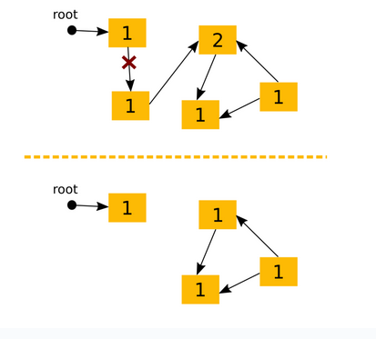
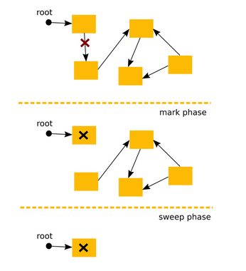
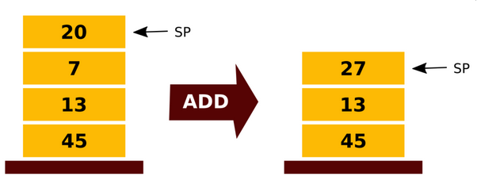
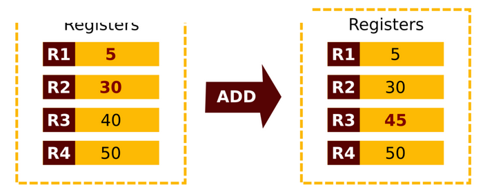
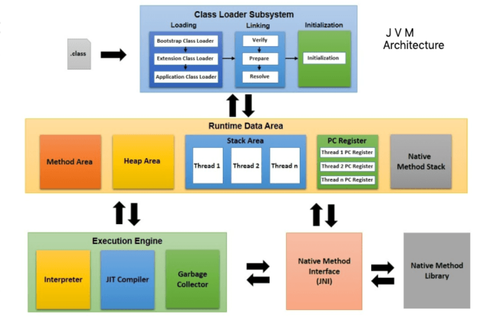
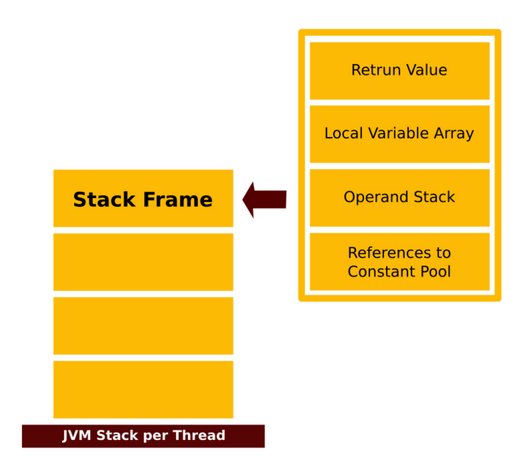
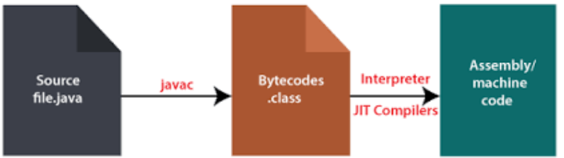

## Лекція 1: Архітектура Java та порівняльний аналіз

## Історія та філософія Java


Історія Java починається у 1991 році в компанії Sun Microsystems як дослідницький проєкт "Oak" ("Дуб"), який очолював Джеймс Гослінг, "батько Java". Початковою метою була розробка мови для інтерактивного телебачення та приставок.

Проєкт керувався п'ятьма головними цілями, які й визначили філософію Java:
1.  **Об'єктно-орієнтованість:** Мова мала бути побудована навколо концепції об'єктів.
    ```java
    // Simple Java class
    public class Person {
    private String name;
    public Person(String name) { this.name = name; }
    public String getName() { return name; }
    }
    ```
2.  **Платформонезалежність:** Одна й та сама програма повинна виконуватися на різних операційних системах.
3.  **Підтримка мережевих технологій:** Мова мала бути готовою до роботи в мережі.
4.  **Безпечне виконання коду:** Можливість безпечно запускати код з віддалених джерел.
5.  **Простота у використанні:** Мова мала бути легкою для вивчення.

У 1994 році "Oak" було перейменовано на **Java**, і з цього моменту почався її стрімкий розвиток.

# Ключові етапи еволюції Java

Цей перелік висвітлює найважливіші події в історії Java, які мали найбільший вплив на розвиток мови та її екосистеми.

***

### 💡 1991–1996: Народження

* **1991:** У компанії Sun Microsystems стартує дослідницький проєкт "Green Project" (пізніше "Oak"), який очолює Джеймс Гослінг.
* **1995:** Відбувається перший публічний анонс мови, яку перейменовано на Java.
* **1996:** Виходить перша офіційна версія **JDK 1.0**.

***

### 🏛️ 1997–2002: Становлення платформи

* **1997 (JDK 1.1):** З'являється технологія **JIT-компіляції** (Just-In-Time), яка значно прискорює виконання програм, та **JDBC** (Java Database Connectivity) для роботи з базами даних.
* **1998 (J2SE 1.2):** Революційний реліз, що представив **Java Collections Framework** — фундаментальний набір структур даних, який використовується і сьогодні.
* **2000 (J2SE 1.3):** Інтеграція віртуальної машини **HotSpot JVM**, яка стала промисловим стандартом і забезпечила величезний стрибок у продуктивності.

***

### 🚀 2004–2014: Золота ера мови

* **2004 (Java SE 5 "Tiger"):** Один з найважливіших релізів в історії мови. Додано **Generics (узагальнення)**, **Annotations**, **Autoboxing** та покращено цикли. Це назавжди змінило те, як пишеться код на Java.
* **2009:** Компанія **Oracle купує Sun Microsystems**, стаючи новим опікуном платформи Java.
* **2014 (Java SE 8):** Друга революція в мові. З'являються **Lambda-вирази** та **Stream API**, що привносять у Java елементи функціонального програмування. Також додано новий **Date and Time API**.

***

### ⚡ 2017–наш час: Сучасність та новий ритм

* **2017 (Java SE 9):** Впровадження **системи модулів (Project Jigsaw)**, що стало найбільшою архітектурною зміною платформи з часів її створення.
* **2018 (Java SE 10):** Java переходить на **новий 6-місячний цикл релізів**, що дозволяє швидше доставляти нові функції розробникам.
* **LTS (Long-Term Support):** З'являються версії з довготривалою підтримкою, які стають стандартом для корпоративного сектору. Ключовими LTS-версіями є **Java 11 (2018)**, **Java 17 (2021)** та наступні.

### Порівняння з C++: Фундаментальні відмінності

Перш ніж занурюватися в Java, важливо зрозуміти її ключові відмінності від її ідеологічного попередника, C++.

### Сильні сторони C++

  * **Гнучкість парадигми:** C++ не змушує використовувати об'єктно-орієнтоване програмування (ООП), а лише підтримує його. Це дозволяє програмісту обирати найкращий підхід для конкретної задачі.

  * **Узагальнене програмування (Templates):** Ключове слово `template` дозволяє писати узагальнені реалізації алгоритмів та структур даних. Наприклад, у C можна було написати узагальнений список, використовуючи `void*`, що не є типобезпечним:

    ```c
    struct element_t {
        struct element_t *next, *prev;
        void *element;
    };
    ```

    C++ шаблони дозволяють зробити те ж саме, але повністю типобезпечно:

    ```cpp
    template <typename T>
    struct element_t {
        element_t<T> *next, *prev;
        T element;
    };
    ```

  * **Велика стандартна бібліотека (STL):** C++ має доступ до стандартних бібліотек C, а також до власної потужної бібліотеки шаблонів (STL). STL містить готові реалізації найпопулярніших алгоритмів (пошук, сортування) та структур даних (мапи, множини, списки, дерева), які програміст може легко адаптувати під свої потреби, просто вказавши потрібні типи.

-----

###  Сильні сторони Java

  * **Потужні стандартні бібліотеки:** Java пропонує власні контейнери, які в деяких випадках є більш гнучкими, ніж STL. Наприклад, `priority_queue` в C++ STL не підтримує операцію `decrease-key`, необхідну для ефективної реалізації алгоритмів Прима та Дейкстри. Також Java має вбудовані бібліотеки для роботи з великими числами (**BigInteger**), **регулярними виразами** та геометрією, що значно спрощує вирішення багатьох задач.
  * **Виняткова обробка помилок (Exception Handling):** Java значно перевершує C++ у цьому аспекті. Відстежити помилку, як-от вихід за межі масиву (`ArrayIndexOutOfBound`), у Java набагато простіше.
```java
        try {
            int[] arr = new int[2];
            System.out.println(arr[5]);
        } catch (ArrayIndexOutOfBoundsException e) {
            System.out.println("Index out of bounds!");
        }
```
  * **Продуктивність:** Java може бути дещо повільнішою за C++, що іноді призводить до помилки "Time Limit Exceeds" (TLE) у задачах, критичних до часу виконання.

-----

###  Ключові відмінності у розробці

| Критерій | C++ | Java |
| :--- | :--- | :--- |
| **Продуктивність** | Швидша компіляція та виконання. | Може бути повільнішою через роботу через JVM. |
| **Багатослівність** | Зазвичай менш багатослівний. | Вимагає більше синтаксичних конструкцій, що дає детальний контроль, але збільшує обсяг коду. |
| **Зв'язок клас/файл** | Немає обмежень на імена файлів та класів. | Ім'я файлу **обов'язково** має збігатися з іменем публічного класу всередині нього. |
| **Ввід/Вивід** | Механізм вводу/виводу є відносно простим. | Вивід простий, але ввід даних може бути складнішим. |
| **Компіляція** | Тільки компілятор. | Компілятор (в байт-код) та інтерпретатор. |
| **Множинне успадкування** | **Підтримується**. | **Не підтримується**. |
| **Сфери застосування** | Критичні до продуктивності програми: ігри, високопродуктивні обчислення (HPC), вбудовані системи, де потрібна пряма взаємодія з "залізом". | Веб-розробка, корпоративні (Enterprise) додатки, розробка під Android. |

---

### Головна ідея Java: Віртуальна машина (VM)

**Віртуальна машина (VM)** — це абстрактна обчислювальна архітектура, яка не залежить від "заліза". По суті, це програма, що працює всередині вашої операційної системи (Windows, macOS, Linux) і створює для інших програм ілюзію роботи на універсальному, стандартизованому комп'ютері.

Головна мета VM — забезпечити **платформонезалежне середовище**, яке приховує деталі апаратного забезпечення та операційної системи. Це дозволяє програмі, написаній для VM, виконуватися однаково на будь-якій платформі, де ця VM встановлена.

Зазвичай, VM реалізовані з використанням **інтерпретатора**, а для досягнення високої продуктивності використовують **JIT-компіляцію** (Just-In-Time).

---

### Переваги та недоліки VM-підходу

#### Переваги ✅
* **Платформонезалежність:** Реалізує знаменитий принцип "Write once, run anywhere" ("Напиши один раз, запускай будь-де").
* **Спрощена модель програмування:** Розробнику не потрібно думати про низькорівневі особливості різних систем.
* **Безпека:** Код виконується в ізольованому середовищі, що захищає операційну систему.
* **Оптимізації:** VM може застосовувати специфічні оптимізації для різного "заліза".

#### Недоліки ❌
* **Додаткові витрати на виконання (Overhead):** Програми, що працюють через VM, зазвичай повільніші за нативний код, який виконується напряму.
* **Не підходить для системного програмування:** VM не використовують для написання драйверів чи операційних систем.

---

### Основні компоненти VM

Віртуальна машина складається з кількох ключових систем, що забезпечують її роботу:
* **Автоматичне управління пам'яттю** (Garbage Collection) 
* **Інтерпретатор** (Interpreter) 
* **Система керування потоками** (Threading system) 
* **Система безпеки** (Security) 
* **JIT-компілятор** (Just-In-Time compiler) 

---

### Автоматичне управління пам'яттю та Garbage Collection (GC)

Однією з ключових функцій віртуальної машини є автоматичне управління пам'яттю. Її головна задача — визначати, коли об'єкт більше не використовується програмою, і звільняти (переробляти) пам'ять, яку він займав. У VM цей процес абстрагований від розробника; наприклад, мова може забороняти ручне створення вказівників на адреси в пам'яті.

Існує кілька підходів до реалізації збирача сміття (Garbage Collector, GC).

---

### Підхід 1: Підрахунок посилань (Reference Counting)

**Ідея**
* Для кожного об'єкта ведеться лічильник, скільки інших об'єктів на нього посилаються. 
* Коли створюється нове посилання на об'єкт, лічильник збільшується; коли посилання видаляється (або перевизначається), лічильник зменшується. 
* Якщо лічильник об'єкта досягає нуля, збирач сміття видаляє цей об'єкт і зменшує лічильники всіх об'єктів, на які він посилався. 

**Проблеми**
* **Накладні витрати:** Постійне оновлення лічильників створює додаткове навантаження під час виконання програми, особливо при роботі зі стеком. 
* **Циклічні залежності:** Цей підхід не може виявити та видалити групи об'єктів, які посилаються один на одного, але на які більше немає зовнішніх посилань. 



---

### Підхід 2: Позначити та очистити (Mark and Sweep)

**Ідея**
1.  **Зупинка світу ("Stop the world"):** Робота основної програми призупиняється. 
2.  **Фаза позначення (Mark phase):** GC починає з "кореневих" точок (наприклад, локальних змінних у стеку) і рекурсивно проходить по всіх доступних об'єктах, позначаючи їх як "живі". 
3.  **Фаза очищення (Sweep phase):** GC проходить по всій купі (heap) і видаляє всі об'єкти, які не були позначені. 
4.  Знімаються всі позначки, і робота програми відновлюється. 

**Проблеми**
* **"Stop the world":** Призупинка програми може викликати помітні затримки ("лаги"), особливо в інтерактивних додатках. 
* **Повільна робота на великих купах:** Цю проблему вирішують **генераційні збирачі сміття (generational collectors)**. 
* **Фрагментація пам'яті:** Після видалення об'єктів у купі можуть залишатися "дірки", що ускладнює виділення пам'яті для великих нових об'єктів. Цю проблему вирішують **ущільнюючі збирачі сміття (compacting collectors)**. 



---

### Рушій виконання: Інтерпретатор та архітектури VM

**Інтерпретатор** — це частина рушія виконання (Execution Engine), яка працює як віртуальний процесор. Його завдання — декодувати та виконувати віртуальні, архітектурно-нейтральні інструкції (байт-код) без попередньої компіляції в нативний машинний код. Код, що виконується інтерпретатором, працює повільніше, ніж скомпільований нативний код. 

**Основні концепції інтерпретатора:** 
* Він використовує структури даних для зберігання інструкцій та операндів (даних, що обробляються). 
* Для операцій виклику функцій використовується **стек викликів (call stack)**. 
* **Лічильник команд (Instruction Pointer)** вказує на наступну інструкцію, яку потрібно виконати. 
* **Віртуальний "CPU" (диспетчер інструкцій)** відповідає за отримання, декодування та виконання кожної інструкції. 

Архітектура віртуальної машини визначає, як вона працює з операндами для інструкцій. Існують два основні підходи: стековий та регістровий. 

---

### Стекова архітектура VM (Stack-based)

Це архітектура, яку використовують Java, Smalltalk та більшість інших віртуальних машин. 
* **Принцип роботи:** Всі операнди для операцій зберігаються у стеку. Інструкції беруть значення з вершини стеку, обробляють їх і кладуть результат назад на вершину стеку за принципом **LIFO (Last in, First Out)**. 



#### Переваги та недоліки
* **Переваги:**
    * Простота реалізації для різних апаратних архітектур. 
    * Легко адресувати операнди за допомогою вказівника стеку; VM не потрібно знати їхні конкретні адреси. 
* **Недоліки:**
    * Для виконання однієї простої операції (наприклад, додавання) потрібно виконати кілька інструкцій (завантажити перший операнд, завантажити другий, виконати операцію, зберегти результат), що є менш ефективним. 

---

### Регістрова архітектура VM (Register-based)

Цей підхід використовують небагато VM, наприклад, Lua, Dalvik (стара VM в Android) та Parrot VM (Perl6). 
* **Принцип роботи:** Операнди зберігаються у віртуальних регістрах, подібно до того, як це відбувається у реальному CPU. Кожна інструкція містить адреси (номери регістрів) операндів, з якими вона працює. 



#### Переваги та недоліки
* **Переваги:**
    * Потенційно швидша за стекову архітектуру. 
    * Немає накладних витрат на операції push/pop зі стеку, інструкції виконуються швидше. 
    * Потрібно менше інструкцій для однієї операції. 
    * Легше оптимізувати підпрограми, оскільки тимчасові значення зазвичай залишаються в регістрах. 
* **Недоліки:**
    * Менш портативна, оскільки робить більше припущень щодо цільового "заліза". 
    * Інструкції більші за розміром, оскільки їм потрібно явно вказувати адреси операндів. 

---

### Оптимізація виконання: JIT та AOT компіляція

Інтерпретація байт-коду є гнучкою, але повільною. Для вирішення цієї проблеми існують більш просунуті техніки.

#### JIT (Just-In-Time) компіляція
* Це механізм для покращення продуктивності програм, що працюють на основі байт-коду.
* Його суть полягає в тому, що віртуальні інструкції компілюються в нативні інструкції "на льоту", тобто безпосередньо перед або під час виконання програми.
* JIT-компіляція зазвичай викликає невелику затримку на старті програми через час, необхідний для завантаження та компіляції байт-коду.

#### AOT (Ahead-Of-Time) компіляція
* При цьому підході байт-код компілюється в нативні інструкції заздалегідь, **до** запуску програми.
* Програма, що скомпільована заздалегідь (AOT), може запускатися швидше, ніж та, що покладається виключно на JIT-компіляцію.

---

### Безпека коду (Code Security)

* Віртуальна машина Java розроблена з філософією безпеки, завдяки якій жодна програма користувача не може "зламати" хост-машину.
* Код може виконуватися лише у чітко визначених межах.
* Одним з прикладів є **типобезпечний доступ до даних (type-safe data access)**.
* Інші механізми безпеки включають **верифікатори коду (code verifiers)** та **верифікатори стеку (stack verifiers)**.

---

### Порівняння віртуальних машин

Існує багато різних реалізацій віртуальних машин, кожна зі своїми архітектурними особливостями.

**Порівняльна таблиця ключових VM:**

| Віртуальна машина | Архітектура | Управління пам'яттю | Безпека | JIT | AOT |
| :--- | :--- | :--- | :--- | :--- | :--- |
| **JVM** (Java) | Стекова | Автоматичне | Так | Так | Так |
| **ART** (Android) | Регістрова | Автоматичне | Так | Так | Так |
| **CLR** (.NET) | Стекова | Автоматичне або ручне | Так | Так | Так |
| **Dalvik** (старий Android) | Регістрова | Автоматичне | Так | Так | Ні |
| **BEAM** (Erlang) | Регістрова | Автоматичне | ? | Так | Так |

---

### Специфікації та реалізації JVM

#### Специфікації Java

Робота платформи Java регулюється трьома основними документами (специфікаціями):
* **Java Language Specification:** Описує синтаксис та семантику самої мови Java.
* **Java Virtual Machine Specification:** Описує архітектуру та роботу JVM.
* **Java Standard Edition APIs:** Описує стандартну бібліотеку класів.

---

#### Реалізації JVM

Хоча специфікація JVM є єдиною, існує кілька її реалізацій.
* **HotSpot/Oracle JDK:** Референтна реалізація, що розробляється та підтримується Oracle.
* **OpenJDK:** Опен-сорсна версія, яку ми будемо використовувати.
* **IBM J9:** Реалізація від компанії IBM.
* **Azul Zing/Prime:** JVM, що на 100% сумісна з Java та базується на Oracle HotSpot. Вона оптимізована для Linux , підтримує дуже великі обсяги купи (до 512 GB) і також відома під назвою Azul Zulu.

---

### Основні компоненти архітектури JVM

Віртуальна машина Java складається з трьох основних, високорівневих компонентів:
* **Class Loader** (Завантажувач класів) 
* **Runtime Data Areas** (Області даних часу виконання) 
* **Execution Engine** (Рушій виконання) 



---

#### Class Loader (Завантажувач класів)

* Класи в Java завантажуються в систему динамічно (лише коли вони потрібні) за допомогою завантажувача класів.
* Існує кілька завантажувачів, і програміст може створювати нові.
* Завантажувачі класів пов'язані один з одним в ієрархічній моді.
* Цей механізм гарантує, що кожен клас існує у власному просторі імен, що унеможливлює конфлікти.

---

### Детальний огляд областей даних (Runtime Data Areas)

Віртуальна машина Java визначає різні області даних, що використовуються під час виконання програми. Деякі з них створюються при старті JVM і існують протягом усього життєвого циклу програми, тоді як інші є **специфічними для кожного потоку** (per-thread) і створюються та знищуються разом з ним.

Основні області даних включають:
* PC Register (Регістр лічильника команд) 
* Stack (Стек) 
* Native Method Stack (Стек нативних методів) 
* Heap (Купа) 
* Method Area (Область методів) 
* Runtime Constant Pool (Пул констант часу виконання) 

---

#### PC Register (Регістр лічильника команд)
* Кожен потік виконання має свій власний регістр PC (Program Counter).
* Він містить адресу інструкції JVM, яка виконується в даний момент.
* Якщо метод, що виконується, є **нативним** (написаним не на Java), значення PC Register є невизначеним.
* Регістри в JVM не використовуються для передачі параметрів чи повернення значень з методів.

---

#### Stack (Стек)
* Це область пам'яті, де зберігаються методи, локальні змінні та проміжні результати обчислень.
* Кожен потік має свій приватний стек, який створюється разом із потоком.
* Стек зберігає **фрейми (frames)**. Для кожного методу, що викликається, створюється новий фрейм, який "наштовхується" на стек. Коли метод завершує роботу, його фрейм видаляється зі стеку.
* Всі інструкції байт-коду беруть операнди зі стеку, виконують над ними операції і повертають результат назад у стек.
* Посилання на змінні (як примітивні, так і об'єктні) зберігаються у стеку.

##### Stack Frame (Фрейм стеку)
Кожен фрейм містить:
* **Local Variable Array** (Масив локальних змінних).
* **Operand Stack** (Стек операндів).
* **References to Constant Pool** (Посилання на Пул констант класу, в якому виконується метод).
* **Return Value** (Значення, що повертається).



---

#### Native Method Stack (Стек нативних методів)
* Це окремий стек для коду, написаного на інших мовах (наприклад, C/C++).
* Використовується, наприклад, для операцій вводу/виводу, які часто реалізовані як нативні методи для взаємодії з апаратним забезпеченням чи ОС.
* В Oracle JVM нативні методи можуть бути реалізовані через **JNI (Java Native Interface)**.

---

#### Heap (Купа)
* Це область пам'яті, де зберігаються **екземпляри класів (об'єкти)**.
* Купа є **спільною для всіх потоків** у додатку.
* Це головний об'єкт для роботи **збирача сміття (Garbage Collection)**.
* Змінні-члени класу (поля) зберігаються в Купі, на відміну від локальних змінних методу, які зберігаються у Стеці.

---

#### Method Area (Область методів)
* Ця область є **спільною для всіх потоків**.
* Вона зберігає структури, що описують самі класи: **код методів та конструкторів**, дані полів, метадані та **Пул констант часу виконання**.
* Логічно є частиною Купи.
* У версіях HotSpot JVM до 8 ця область називалася **PermGen space**. У версії 8 і новіших вона знаходиться в **Metaspace**.

---

#### Runtime Constant Pool (Пул констант часу виконання)
* Це представлення таблиці `_constant_pool` з файлу `.class` під час виконання програми.
* Містить константи кожного класу та інтерфейсу, а також усі посилання на методи та поля.
* Коли у коді зустрічається посилання на метод чи поле, JVM використовує цей пул для знаходження фактичної адреси в пам'яті.

---

### Формат файлу `.class`, байт-код та типи даних

#### Зв'язок з реальним комп'ютером

Основні компоненти віртуальної машини Java дуже близько імітують функції реального комп'ютера. Цю структуру можна розбити на 7 основних частин:
* Набір регістрів 
* Стек 
* Середовище виконання 
* Купа (Heap), що очищується збирачем сміття 
* Пул констант 
* Область зберігання методів 
* Набір інструкцій 

---

#### Файл `.class` та байт-код

**Файл `.class`** — це бінарний файл з чітко визначеним форматом, який створюється компілятором `javac` з вашого файлу `.java`.  Кожен такий файл містить повний опис одного класу чи інтерфейсу. 



Код методів у файлі `.class` скомпільовано в **байт-код**. 

**Байт-код** — це набір низькорівневих, незалежних від апаратного забезпечення та операційної системи інструкцій, які виконуються віртуальною машиною Java.  Це проміжна мова, схожа на асемблер, що використовує стек операндів та масив регістрів (локальних змінних). 

---

#### Структура файлу `.class`

Файл `.class` має наступну структуру:
* **Магічне число (`CAFEBABE`):** Перші чотири байти, що ідентифікують файл як валідний клас Java. 
* **Версія (minor/major):** Наступні 4 байти, що вказують, для якої версії Java скомпільовано клас. 
* **Пул констант (Constant Pool):** Таблиця, де зберігаються більшість константних значень. 
* **Прапори доступу (Flags):** Визначають, чи є файл класом або інтерфейсом, та його видимість (public, private, abstract). 
* **Цей клас (This class):** Індекс у пулі констант, що вказує на поточний клас. 
* **Суперклас (Super class):** Індекс у пулі констант, що вказує на батьківський клас. 
* **Інтерфейси (Interfaces):** Кількість та індекси реалізованих інтерфейсів у пулі констант. 
* Описи полів, методів та їх атрибутів.

#### Пул констант (The Constant Pool)

* Пул констант — це таблиця, де зберігаються більшість літеральних константних значень. 
* Сюди входять різноманітні числа, рядки, імена ідентифікаторів, посилання на класи та методи, а також дескриптори типів. 
* Коли байт-код посилається на якийсь літерал (наприклад, ім'я методу), він робить це через його індекс у пулі констант. 

---

## Типи даних у Java

Як і мова програмування, віртуальна машина Java працює з двома видами типів: **примітивними (primitive)** та **ссилочними (reference)**. Відповідно, існують і два види значень, які можуть зберігатися у змінних, передаватися як аргументи та повертатися методами: примітивні значення та ссилочні значення. 

### Примітивні типи (Primitive Types)
* Примітивні типи даних, що підтримуються JVM, включають числові типи, тип `boolean` та тип `returnAddress`. 
* Значення типу `returnAddress` є вказівниками на опкоди інструкцій віртуальної машини. З усіх примітивних типів, тільки `returnAddress` не пов'язаний напряму з типами мови програмування Java. 

### Ссилочні типи (Reference Types)
* Існує три види ссилочних типів: типи класів, типи масивів та типи інтерфейсів. 
* Їхні значення — це посилання на динамічно створені екземпляри класів, масиви, або екземпляри класів чи масивів, що реалізують інтерфейси. 

-----

## Контрольні питання

1.  **Загальна концепція.** Поясніть принцип **"Write once, run anywhere"**. Опишіть повний шлях від файлу `.java` до виконання коду на машині, згадавши роль компілятора, байт-коду, інтерпретатора та JIT-компілятора.

2.  **Порівняльний аналіз.** Назвіть дві ключові переваги C++ над Java та дві ключові переваги Java над C++, базуючись на матеріалі лекції.

3.  **Архітектура VM.** Порівняйте архітектури стекових (Stack-based) та регістрових (Register-based) віртуальних машин. Назвіть по одній перевазі та одному недоліку для кожної. Яку архітектуру використовує стандартна JVM?

4.  **Управління пам'яттю.** Опишіть різницю між **Купою (Heap)** та **Стеком (Stack)** в JVM. Які дані зберігаються в кожній з цих областей, і як пов'язаний їхній життєвий цикл з потоками (threads) та методами?

5.  **Garbage Collection.** Алгоритм збирання сміття "Reference Counting" має фундаментальну проблему. Назвіть цю проблему. Який інший алгоритм, розглянутий у лекції, вирішує цю проблему, і який основний недолік має він сам?

6.  **Формат файлу `.class`.** Що таке **Пул констант (Constant Pool)** і яку роль він відіграє при виконанні наступного рядка коду: `System.out.println("Hello, World!");`?

7.  **Типи даних.** Поясніть, що буде збережено у змінних `a` та `b`, і в якій області пам'яті (Стек чи Купа) будуть розміщені дані та/або посилання для кожної з них:

    ```java
    int a = 100;
    String b = "example";
    ```