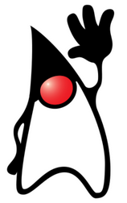

# Лекція 1: Архітектура Java та порівняльний аналіз

> **Декларація курсу.** Академічна доброчесність та авторство матеріалів — у [DISCLAIMER.md](DISCLAIMER.md).


## Експрес-опитування: З C++ у Java

Перш ніж ми зануримось в архітектуру Java, давайте пригадаємо дещо з минулого семестру:

1.  Що, на вашу думку, було найбільшою перевагою C++?
2.  Що було найскладнішим? (Наприклад: управління пам'яттю, шаблони, компіляція?)
3.  Чого ви очікуєте від Java, знаючи, що вона вирішує деякі з цих проблем?

<details markdown="1">
<summary>Наші очікування (відповідь)</summary>

  * **Що було складним у C++:** Багато хто назве ручне управління пам'яттю (`new`/`delete`). Це одна з ключових проблем, яку Java вирішує за допомогою автоматичного збирача сміття (Garbage Collector).
  * **Чого очікувати від Java:** Вищого рівня абстракції. Нам більше не потрібно турбуватися про "залізо". Ми будемо писати код для "віртуальної машини", що дає нам безпеку та платформонезалежність, але, як ми побачимо, має свою ціну.

</details>

## Історія та філософія Java



Історія Java починається у 1991 році в компанії Sun Microsystems як дослідницький проєкт "Oak" ("Дуб"), який очолював Джеймс Гослінг, "батько Java". Початковою метою була розробка мови для інтерактивного телебачення та приставок.

Проєкт керувався п'ятьма головними цілями, які й визначили філософію Java:

1.  **Об'єктно-орієнтованість:** Мова мала бути побудована навколо концепції об'єктів. (Ми почнемо розбирати, як це реалізовано, у [Практикумі 2: Класи, Інтерфейси та Наслідування](p02_class.md))
    ```java
    // Simple Java class
    public class Person {
    private String name;
    public Person(String name) { this.name = name; }
    public String getName() { return name; }
    }
    ```
2.  **Платформонезалежність:** Одна й та сама програма повинна виконуватися на різних операційних системах.
3.  **Підтримка мережевих технологій:** Мова мала бути готовою до роботи в мережі.
4.  **Безпечне виконання коду:** Можливість безпечно запускати код з віддалених джерел.
5.  **Простота у використанні:** Мова мала бути легкою для вивчення.

У 1994 році "Oak" було перейменовано на **Java**, і з цього моменту почався її стрімкий розвиток.

# Ключові етапи еволюції Java

Цей перелік висвітлює найважливіші події в історії Java, які мали найбільший вплив на розвиток мови та її екосистеми.

-----

### 1991–1996: Народження

  * **1991:** У компанії Sun Microsystems стартує дослідницький проєкт "Green Project" (пізніше "Oak"), який очолює Джеймс Гослінг.
  * **1995:** Відбувається перший публічний анонс мови, яку перейменовано на Java.
  * **1996:** Виходить перша офіційна версія **JDK 1.0**.

-----

### 1997–2002: Становлення платформи

  * **1997 (JDK 1.1):** З'являється технологія **JIT-компіляції** (Just-In-Time), яка значно прискорює виконання програм, та **JDBC** (Java Database Connectivity) для роботи з базами даних.
  * **1998 (J2SE 1.2):** Революційний реліз, що представив **Java Collections Framework** — фундаментальний набір структур даних, який використовується і сьогодні.
  * **2000 (J2SE 1.3):** Інтеграція віртуальної машини **HotSpot JVM**, яка стала промисловим стандартом і забезпечила величезний стрибок у продуктивності.

-----

### 2004–2014: Золота ера мови

  * **2004 (Java SE 5 "Tiger"):** Один з найважливіших релізів в історії мови. Додано **Generics (узагальнення)**(детально розібрано у [Практикумі 3: Вступ до Generics](p03_generics.md)), **Annotations**, **Autoboxing** та покращено цикли. Це назавжди змінило те, як пишеться код на Java.
  * **2009:** Компанія **Oracle купує Sun Microsystems**, стаючи новим опікуном платформи Java.
  * **2014 (Java SE 8):** Друга революція в мові. З'являються **Lambda-вирази** та **Stream API**, що привносять у Java елементи функціонального програмування. Також додано новий **Date and Time API**.

-----

### 2017–наш час: Сучасність та новий ритм

  * **2017 (Java SE 9):** Впровадження **системи модулів (Project Jigsaw)**, що стало найбільшою архітектурною зміною платформи з часів її створення.
  * **2018 (Java SE 10):** Java переходить на **новий 6-місячний цикл релізів**, що дозволяє швидше доставляти нові функції розробникам.
  * **LTS (Long-Term Support):** З'являються версії з довготривалою підтримкою, які стають стандартом для корпоративного сектору. Ключовими LTS-версіями є **Java 11 (2018)**, **Java 17 (2021)** та наступні.

### Порівняння з C++: Фундаментальні відмінності

Перш ніж занурюватися в Java, важливо зрозуміти її ключові відмінності від її ідеологічного попередника, C++.

### Сильні сторони C++

  * **Гнучкість парадигми:** C++ не змушує використовувати об'єктно-орієнтоване програмування (ООП), а лише підтримує його. Це дозволяє програмісту обирати найкращий підхід для конкретної задачі.

  * **Узагальнене програмування (Templates):** Ключове слово `template` дозволяє писати узагальнені реалізації алгоритмів та структур даних. Наприклад, у C можна було написати узагальнений список, використовуючи `void*`, що не є типобезпечним:

    ```c
    struct element_t {
        struct element_t *next, *prev;
        void *element;
    };
    ```

    C++ шаблони дозволяють зробити те ж саме, але повністю типобезпечно:

    ```cpp
    template <typename T>
    struct element_t {
        element_t<T> *next, *prev;
        T element;
    };
    ```

  * **Велика стандартна бібліотека (STL):** C++ має доступ до стандартних бібліотек C, а також до власної потужної бібліотеки шаблонів (STL). STL містить готові реалізації найпопулярніших алгоритмів (пошук, сортування) та структур даних (мапи, множини, списки, дерева), які програміст може легко адаптувати під свої потреби, просто вказавши потрібні типи.

-----

### Сильні сторони Java

  * **Потужні стандартні бібліотеки:** Java пропонує власні контейнери, які в деяких випадках є більш гнучкими, ніж STL. Наприклад, `priority_queue` в C++ STL не підтримує операцію `decrease-key`, необхідну для ефективної реалізації алгоритмів Прима та Дейкстри. Також Java має вбудовані бібліотеки для роботи з великими числами (**BigInteger**), **регулярними виразами** та геометрією, що значно спрощує вирішення багатьох задач.
  * **Виняткова обробка помилок (Exception Handling):** Java значно перевершує C++ у цьому аспекті. Відстежити помилку, як-от вихід за межі масиву (`ArrayIndexOutOfBound`), у Java набагато простіше.

    ```java
    try {
        int[] arr = new int[2];
        System.out.println(arr[5]);
    } catch (ArrayIndexOutOfBoundsException e) {
        System.out.println("Index out of bounds!");
    }
    ```

  * **Продуктивність:** Java може бути дещо повільнішою за C++, що іноді призводить до помилки "Time Limit Exceeds" (TLE) у задачах, критичних до часу виконання.

#### Бонус: Сучасний Switch vs C++

У C++ (та старих версіях Java) оператор `switch` був громіздким і вимагав постійного `break`. Сучасна Java (12+) пропонує **Switch Expressions**, які повертають значення.

**Старий стиль (C++/Java 8):**
```java
int result;
switch(x) {
    case 10: 
        result = 100; 
        break;
    case 20: 
        result = 120; 
        break;
    default: 
        result = 1000;
}
````

**Сучасний стиль (Java 17+):**

```java
// Лаконічно, без break, одразу повертає значення
int result = switch(x) {
    case 10 -> 100;
    case 20 -> 120;
    default -> 1000;
};
```

-----

### Ключові відмінності у розробці

| Критерій | C++ | Java |
| :--- | :--- | :--- |
| **Продуктивність** | Швидша компіляція та виконання. | Може бути повільнішою через роботу через JVM. |
| **Багатослівність** | Зазвичай менш багатослівний. | Вимагає більше синтаксичних конструкцій, що дає детальний контроль, але збільшує обсяг коду. |
| **Зв'язок клас/файл** | Немає обмежень на імена файлів та класів. | Ім'я файлу **обов'язково** має збігатися з іменем публічного класу всередині нього. |
| **Ввід/Вивід** | Механізм вводу/виводу є відносно простим. | Вивід простий, але ввід даних може бути складнішим. |
| **Компіляція** | Тільки компілятор. | Компілятор (в байт-код) та інтерпретатор. |
| **Множинне успадкування** | **Підтримується**. | **Не підтримується**. |
| **Сфери застосування** | Критичні до продуктивності програми: ігри, високопродуктивні обчислення (HPC), вбудовані системи, де потрібна пряма взаємодія з "залізом". | Веб-розробка, корпоративні (Enterprise) додатки, розробка під Android. |

-----

## Архітектура JVM: дві частини

Далі лекція розбита на дві частини. Рекомендуємо читати їх послідовно.

### [Частина 1a: Життєвий цикл Java-програми](01a_jvm_lifecycle.md)

Від вихідного коду до виконання на машині:

  * Віртуальна машина (VM) та її переваги й недоліки
  * Інтерпретатор, стекова та регістрова архітектури VM
  * JIT та AOT компіляція
  * Безпека коду, порівняння VM, специфікації та реалізації JVM
  * Class Loader, файл `.class`, байт-код, пул констант
  * Примітивні та посилальні типи даних

### [Частина 1b: Memory Model та Garbage Collection](01b_jvm_memory_gc.md)

Як JVM керує пам'яттю під час виконання:

  * Алгоритми GC: підрахунок посилань, Mark and Sweep
  * Stop-the-world, фрагментація пам'яті та їхній вплив на продуктивність
  * Runtime Data Areas: Stack, Heap, Method Area та інші
  * Сила посилань (Strong, Soft, Weak, Phantom)

-----

## Контрольні питання

1.  **Загальна концепція.** Поясніть принцип **"Write once, run anywhere"**. Опишіть повний шлях від файлу `.java` до виконання коду на машині, згадавши роль компілятора, байт-коду, інтерпретатора та JIT-компілятора.
2.  **Порівняльний аналіз.** Назвіть дві ключові переваги C++ над Java та дві ключові переваги Java над C++, базуючись на матеріалі лекції.
3.  **Архітектура VM.** Порівняйте архітектури стекових (Stack-based) та регістрових (Register-based) віртуальних машин. Назвіть по одній перевазі та одному недоліку для кожної. Яку архітектуру використовує стандартна JVM?
4.  **Управління пам'яттю.** Опишіть різницю між **Купою (Heap)** та **Стеком (Stack)** в JVM. Які дані зберігаються в кожній з цих областей, і як пов'язаний їхній життєвий цикл з потоками (threads) та методами?
5.  **Garbage Collection.** Алгоритм збирання сміття "Reference Counting" має фундаментальну проблему. Назвіть цю проблему. Який інший алгоритм, розглянутий у лекції, вирішує цю проблему, і який основний недолік має він сам?
6.  **Формат файлу `.class`.** Що таке **Пул констант (Constant Pool)** і яку роль він відіграє при виконанні наступного рядка коду: `System.out.println("Hello, World!");`?
7.  **Типи даних.** Поясніть, що буде збережено у змінних `a` та `b`, і в якій області пам'яті (Стек чи Купа) будуть розміщені дані та/або посилання для кожної з них:
    ```java
    int a = 100;
    String b = "example";
    ```

<details markdown="1">
<summary>Відповіді (спробуйте спочатку відповісти самі)</summary>

1.  **(Загальна концепція):** Принцип **"Write once, run anywhere" (WORA)** означає, що скомпільований Java-код (`.class` файл) може працювати на будь-якій операційній системі чи пристрої, для якого існує реалізація віртуальної машини Java (JVM).

      * **Повний шлях:**
        1.  **`.java` (Вихідний код):** Ви пишете код мовою Java.
        2.  **Компілятор (`javac`):** Перетворює ваш `.java` файл на `.class` файл.
        3.  **`.class` (Байт-код):** Це універсальний, проміжний код, незалежний від "заліза".
        4.  **JVM (Виконання):** JVM на конкретній ОС (Windows, Linux...) завантажує цей `.class` файл.
        5.  **Інтерпретатор:** Починає *негайно* виконувати байт-код, рядок за рядком.
        6.  **JIT-компілятор (Just-In-Time):** Паралельно аналізує, які частини коду виконуються найчастіше ("гарячі" точки), і компілює *лише їх* у швидкий нативний машинний код, специфічний для цієї ОС. Це значно прискорює роботу програми.

2.  **(Порівняльний аналіз):**

      * **Переваги C++ над Java:**
        1.  **Продуктивність:** C++ компілюється напряму в машинний код, тому зазвичай працює швидше (немає "посередника" у вигляді VM).
        2.  **Гнучкість/Контроль:** Підтримує множинне успадкування, шаблони (templates) та пряме управління пам'яттю, що дає більше контролю.
      * **Переваги Java над C++:**
        1.  **Автоматичне управління пам'яттю (GC):** Не потрібно вручну викликати `delete`, що запобігає витокам пам'яті та багатьом помилкам.
        2.  **Платформонезалежність (WORA):** Байт-код працює на будь-якій JVM без перекомпіляції. (Також: потужна та безпечна обробка винятків).

3.  **(Архітектура VM):**

      * **Стекова (Stack-based) VM:**
          * **Принцип:** Використовує стек для операндів. Інструкції (напр., `iadd`) неявно беруть дані з вершини стеку і кладуть результат назад.
          * **Перевага:** Легко реалізувати на будь-якій архітектурі (портативність), інструкції компактні.
          * **Недолік:** Потребує більше інструкцій для однієї операції (завантажити, завантажити, додати, зберегти), що може бути повільніше.
      * **Регістрова (Register-based) VM:**
          * **Принцип:** Використовує віртуальні регістри. Інструкції (`add R1, R2, R3`) явно вказують адреси операндів.
          * **Перевага:** Потребує менше інструкцій для операції, потенційно швидша.
          * **Недолік:** Інструкції більші за розміром, складніша реалізація, менша портативність.
      * **JVM:** Стандартна JVM використовує **стекову (Stack-based)** архітектуру.

4.  **(Управління пам'яттю):**

      * **Стек (Stack):**
          * **Що зберігає:** Фрейми методів. Кожен фрейм містить локальні змінні примітивних типів (напр., `int x = 10`) та **посилання** на об'єкти (які живуть у Купі).
          * **Життєвий цикл:** **Приватний для кожного потоку (Thread).** Фрейм створюється при вході в метод і автоматично знищується при виході з нього.
      * **Купа (Heap):**
          * **Що зберігає:** **Всі об'єкти** (екземпляри класів, напр., `new Person()`) та масиви.
          * **Життєвий цикл:** **Спільна для всіх потоків.** Об'єкт живе доти, доки на нього існує хоча б одне посилання. Пам'ять звільняється **Збирачем сміття (Garbage Collector)**.

5.  **(Garbage Collection):**

      * **Проблема "Reference Counting":** Він не може обробити **циклічні залежності** (коли об'єкт А посилається на Б, а Б посилається на А, але на них більше ніхто не посилається). Їхні лічильники ніколи не стануть нулем.
      * **Альтернатива:** Алгоритм **"Mark and Sweep" (Позначити та очистити)**. Він вирішує проблему циклів, оскільки "позначає" лише ті об'єкти, до яких можна дістатися з кореневих точок.
      * **Недолік "Mark and Sweep":** 1) Необхідність "зупинки світу" (Stop-the-World) для виконання, що викликає "лаги", та 2) Фрагментація пам'яті (дірки в Купі).

6.  **(Формат файлу `.class`):**

      * **Пул констант** — це таблиця всередині файлу `.class`, яка зберігає всі літерали (як-от рядки, числа) та символічні посилання (назви класів, полів, методів), необхідні для цього класу.
      * **Роль у `System.out.println("Hello, World!");`:**
        1.  Рядок `"Hello, World!"` зберігається у Пулі констант як літерал.
        2.  Посилання на клас `System`, поле `out` та метод `println` також зберігаються там як символічні посилання.
        3.  Байт-код використовує індекси для посилання на ці записи, щоб виконати команду.

7.  **(Типи даних):**

      * **`int a = 100;`**
          * `a` — це примітивний тип.
          * Саме значення `100` буде збережено безпосередньо у змінній `a` на **Стеку** (у фреймі поточного методу).
      * **`String b = "example";`**
          * `b` — це посилальний тип (об'єкт).
          * Об'єкт рядка `"example"` буде створено в **Купі** (Heap) (у спеціальній області String Pool).
          * Змінна `b`, яка зберігається на **Стеку**, буде містити лише **посилання** (адресу) на цей об'єкт у Купі.

</details>
