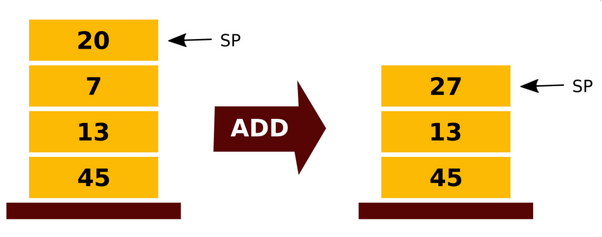
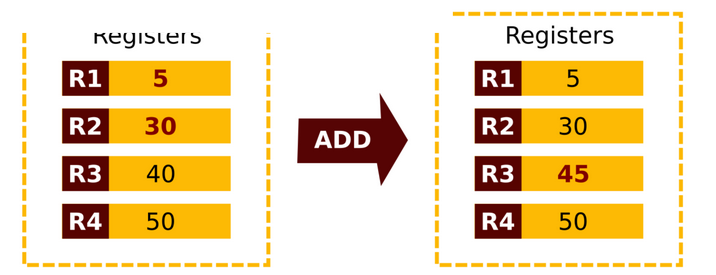
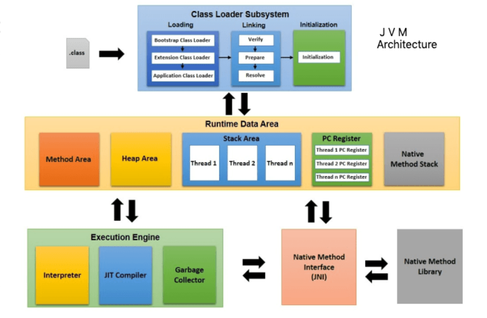
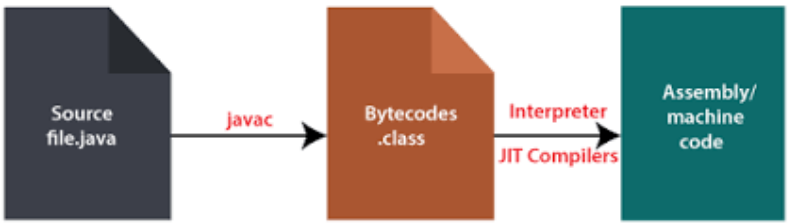

# Лекція 1a: Життєвий цикл Java-програми (Class Loader → Байт-код → JIT/AOT)

> **Декларація курсу.** Академічна доброчесність та авторство матеріалів — у [DISCLAIMER.md](DISCLAIMER.md).

← [Лекція 1: Вступ](01_what_is_java.md) | [Частина 1b: Memory Model та GC](01b_jvm_memory_gc.md) →

### Головна ідея Java: Віртуальна машина (VM)

**Віртуальна машина (VM)** — це абстрактна обчислювальна архітектура, яка не залежить від "заліза". По суті, це програма, що працює всередині вашої операційної системи (Windows, macOS, Linux) і створює для інших програм ілюзію роботи на універсальному, стандартизованому комп'ютері.

Головна мета VM — забезпечити **платформонезалежне середовище**, яке приховує деталі апаратного забезпечення та операційної системи. Це дозволяє програмі, написаній для VM, виконуватися однаково на будь-якій платформі, де ця VM встановлена.

Зазвичай, VM реалізовані з використанням **інтерпретатора**, а для досягнення високої продуктивності використовують **JIT-компіляцію** (Just-In-Time).

-----

### Переваги та недоліки VM-підходу

#### Переваги

  * **Платформонезалежність:** Реалізує знаменитий принцип "Write once, run anywhere" ("Напиши один раз, запускай будь-де").
  * **Спрощена модель програмування:** Розробнику не потрібно думати про низькорівневі особливості різних систем.
  * **Безпека:** Код виконується в ізольованому середовищі, що захищає операційну систему.
  * **Оптимізації:** VM може застосовувати специфічні оптимізації для різного "заліза".

#### Недоліки

  * **Додаткові витрати на виконання (Overhead):** Програми, що працюють через VM, зазвичай повільніші за нативний код, який виконується напряму.
  * **Не підходить для системного програмування:** VM не використовують для написання драйверів чи операційних систем.

-----

### Основні компоненти VM

Віртуальна машина складається з кількох ключових систем, що забезпечують її роботу:

  * **Автоматичне управління пам'яттю** (Garbage Collection) — детально у [частині 1b](01b_jvm_memory_gc.md)
  * **Інтерпретатор** (Interpreter)
  * **Система керування потоками** (Threading system)
  * **Система безпеки** (Security)
  * **JIT-компілятор** (Just-In-Time compiler)

-----

### Рушій виконання: Інтерпретатор та архітектури VM

**Інтерпретатор** — це частина рушія виконання (Execution Engine), яка працює як віртуальний процесор. Його завдання — декодувати та виконувати віртуальні, архітектурно-нейтральні інструкції (байт-код) без попередньої компіляції в нативний машинний код. Код, що виконується інтерпретатором, працює повільніше, ніж скомпільований нативний код.

**Основні концепції інтерпретатора:** \* Він використовує структури даних для зберігання інструкцій та операндів (даних, що обробляються).

  * Для операцій виклику функцій використовується **стек викликів (call stack)**.
  * **Лічильник команд (Instruction Pointer)** вказує на наступну інструкцію, яку потрібно виконати.
  * **Віртуальний "CPU" (диспетчер інструкцій)** відповідає за отримання, декодування та виконання кожної інструкції.

Архітектура віртуальної машини визначає, як вона працює з операндами для інструкцій. Існують два основні підходи: стековий та регістровий.

-----

### Стекова архітектура VM (Stack-based)

Це архітектура, яку використовують Java, Smalltalk та більшість інших віртуальних машин.

  * **Принцип роботи:** Всі операнди для операцій зберігаються у стеку. Інструкції беруть значення з вершини стеку, обробляють їх і кладуть результат назад на вершину стеку за принципом **LIFO (Last in, First Out)**.

#### Переваги та недоліки

  * **Переваги:**
      * Простота реалізації для різних апаратних архітектур.
      * Легко адресувати операнди за допомогою вказівника стеку; VM не потрібно знати їхні конкретні адреси.
  * **Недоліки:**
      * Для виконання однієї простої операції (наприклад, додавання) потрібно виконати кілька інструкцій (завантажити перший операнд, завантажити другий, виконати операцію, зберегти результат), що є менш ефективним.

-----

### Регістрова архітектура VM (Register-based)

Цей підхід використовують небагато VM, наприклад, Lua, Dalvik (стара VM в Android) та Parrot VM (Perl6).

  * **Принцип роботи:** Операнди зберігаються у віртуальних регістрах, подібно до того, як це відбувається у реальному CPU. Кожна інструкція містить адреси (номери регістрів) операндів, з якими вона працює.

#### Переваги та недоліки

  * **Переваги:**
      * Потенційно швидша за стекову архітектуру.
      * Немає накладних витрат на операції push/pop зі стеку, інструкції виконуються швидше.
      * Потрібно менше інструкцій для однієї операції.
      * Легше оптимізувати підпрограми, оскільки тимчасові значення зазвичай залишаються в регістрах.
  * **Недоліки:**
      * Менш портативна, оскільки робить більше припущень щодо цільового "заліза".
      * Інструкції більші за розміром, оскільки їм потрібно явно вказувати адреси операндів.

-----

### Оптимізація виконання: JIT та AOT компіляція

Інтерпретація байт-коду є гнучкою, але повільною. Для вирішення цієї проблеми існують більш просунуті техніки.

#### JIT (Just-In-Time) компіляція

  * Це механізм для покращення продуктивності програм, що працюють на основі байт-коду.
  * Його суть полягає в тому, що віртуальні інструкції компілюються в нативні інструкції "на льоту", тобто безпосередньо перед або під час виконання програми.
  * JIT-компіляція зазвичай викликає невелику затримку на старті програми через час, необхідний для завантаження та компіляції байт-коду.

#### AOT (Ahead-Of-Time) компіляція

  * При цьому підході байт-код компілюється в нативні інструкції заздалегідь, **до** запуску програми.
  * Програма, що скомпільована заздалегідь (AOT), може запускатися швидше, ніж та, що покладається виключно на JIT-компіляцію.

-----

### Безпека коду (Code Security)

  * Віртуальна машина Java розроблена з філософією безпеки, завдяки якій жодна програма користувача не може "зламати" хост-машину.
  * Код може виконуватися лише у чітко визначених межах.
  * Одним з прикладів є **типобезпечний доступ до даних (type-safe data access)**.
  * Інші механізми безпеки включають **верифікатори коду (code verifiers)** та **верифікатори стеку (stack verifiers)**.

-----

### Порівняння віртуальних машин

Існує багато різних реалізацій віртуальних машин, кожна зі своїми архітектурними особливостями.

**Порівняльна таблиця ключових VM:**

| Віртуальна машина | Архітектура | Управління пам'яттю | Безпека | JIT | AOT |
| :--- | :--- | :--- | :--- | :--- | :--- |
| **JVM** (Java) | Стекова | Автоматичне | Так | Так | Так |
| **ART** (Android) | Регістрова | Автоматичне | Так | Так | Так |
| **CLR** (.NET) | Стекова | Автоматичне або ручне | Так | Так | Так |
| **Dalvik** (старий Android) | Регістрова | Автоматичне | Так | Так | Ні |
| **BEAM** (Erlang) | Регістрова | Автоматичне | ? | Так | Так |

-----

### Специфікації та реалізації JVM

#### Специфікації Java

Робота платформи Java регулюється трьома основними документами (специфікаціями):

  * **Java Language Specification:** Описує синтаксис та семантику самої мови Java.
  * **Java Virtual Machine Specification:** Описує архітектуру та роботу JVM.
  * **Java Standard Edition APIs:** Описує стандартну бібліотеку класів.

#### Реалізації JVM

Хоча специфікація JVM є єдиною, існує кілька її реалізацій.

  * **HotSpot/Oracle JDK:** Референтна реалізація, що розробляється та підтримується Oracle.
  * **OpenJDK:** Опен-сорсна версія, яку ми будемо використовувати.
  * **IBM J9:** Реалізація від компанії IBM.
  * **Azul Zing/Prime:** JVM, що на 100% сумісна з Java та базується на Oracle HotSpot. Вона оптимізована для Linux, підтримує дуже великі обсяги купи (до 512 GB) і також відома під назвою Azul Zulu.

-----

### Основні компоненти архітектури JVM

Віртуальна машина Java складається з трьох основних, високорівневих компонентів:

  * **Class Loader** (Завантажувач класів)
  * **Runtime Data Areas** (Області даних часу виконання) — детально у [частині 1b](01b_jvm_memory_gc.md)
  * **Execution Engine** (Рушій виконання)

-----

#### Class Loader (Завантажувач класів)

  * Класи в Java завантажуються в систему динамічно (лише коли вони потрібні) за допомогою завантажувача класів.
  * Існує кілька завантажувачів, і програміст може створювати нові.
  * Завантажувачі класів організовані в ієрархію, що нагадує деревовидною структуру. Вони працюють за принципом делегування: коли потрібно завантажити клас, дочірній завантажувач спочатку "запитує" у свого батьківського, чи не завантажував той цей клас раніше. І так далі вгору по ієрархії.
  * Цей механізм створює унікальний "простір імен" (namespace) для кожного завантажувача. Завдяки цьому, два класи з однаковим повним іменем (наприклад, com.library.utils.Helper), завантажені різними завантажувачами, не будуть конфліктувати між собою, оскільки для JVM це будуть два абсолютно різні класи.

-----

### Детальний огляд областей даних (Runtime Data Areas)

Віртуальна машина Java визначає різні області даних, що використовуються під час виконання програми. Деякі з них створюються при старті JVM і існують протягом усього життєвого циклу програми, тоді як інші є **специфічними для кожного потоку** (per-thread) і створюються та знищуються разом з ним.

Основні області даних включають:

  * PC Register (Регістр лічильника команд)
  * Stack (Стек)
  * Native Method Stack (Стек нативних методів)
  * Heap (Купа)
  * Method Area (Область методів)
  * Runtime Constant Pool (Пул констант часу виконання)

> Детальний опис кожної області та управління пам'яттю — у [частині 1b: Memory Model та GC](01b_jvm_memory_gc.md).

-----

### Файл `.class` та байт-код

**Файл `.class`** — це бінарний файл з чітко визначеним форматом, який створюється компілятором `javac` з вашого файлу `.java`.  Кожен такий файл містить повний опис одного класу чи інтерфейсу.

Код методів у файлі `.class` скомпільовано в **байт-код**.

**Байт-код** — це набір низькорівневих, незалежних від апаратного забезпечення та операційної системи інструкцій, які виконуються віртуальною машиною Java.  Це проміжна мова, схожа на асемблер, що використовує стек операндів та масив регістрів (локальних змінних).

-----

#### Структура файлу `.class`

Файл `.class` має наступну структуру:

  * **Магічне число (`CAFEBABE`):** Перші чотири байти, що ідентифікують файл як валідний клас Java.
  * **Версія (minor/major):** Наступні 4 байти, що вказують, для якої версії Java скомпільовано клас.
  * **Пул констант (Constant Pool):** Таблиця, де зберігаються більшість константних значень.
  * **Прапори доступу (Flags):** Визначають, чи є файл класом або інтерфейсом, та його видимість (public, private, abstract).
  * **Цей клас (This class):** Індекс у пулі констант, що вказує на поточний клас.
  * **Суперклас (Super class):** Індекс у пулі констант, що вказує на батьківський клас.
  * **Інтерфейси (Interfaces):** Кількість та індекси реалізованих інтерфейсів у пулі констант.
  * Описи полів, методів та їх атрибутів.

#### Пул констант (The Constant Pool)

  * Пул констант — це таблиця, де зберігаються більшість літеральних константних значень.
  * Сюди входять різноманітні числа, рядки, імена ідентифікаторів, посилання на класи та методи, а також дескриптори типів.
  * Коли байт-код посилається на якийсь літерал (наприклад, ім'я методу), він робить це через його індекс у пулі констант.

-----

## Типи даних у Java

Як і мова програмування, віртуальна машина Java працює з двома видами типів: **примітивними (primitive)** та **посилальними (reference)**. Відповідно, існують і два види значень, які можуть зберігатися у змінних, передаватися як аргументи та повертатися методами: примітивні значення та посилальні значення.

### Примітивні типи (Primitive Types)

  * Примітивні типи даних, що підтримуються JVM, включають числові типи, тип `boolean` та тип `returnAddress`.
  * Значення типу `returnAddress` є вказівниками на опкоди інструкцій віртуальної машини. З усіх примітивних типів, тільки `returnAddress` не пов'язаний напряму з типами мови програмування Java.

-----

### Посилальні типи (Reference Types)

  * Існує три види посилальних типів: типи класів, типи масивів та типи інтерфейсів.
  * Їхні значення — це посилання на динамічно створені екземпляри класів, масиви, або екземпляри класів чи масивів, що реалізують інтерфейси.

← [Лекція 1: Вступ](01_what_is_java.md) | [Частина 1b: Memory Model та GC](01b_jvm_memory_gc.md) →
