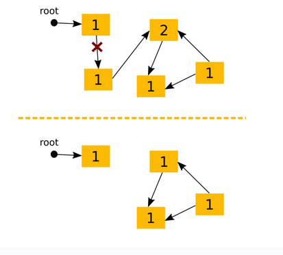
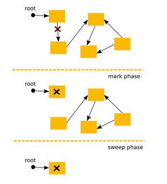
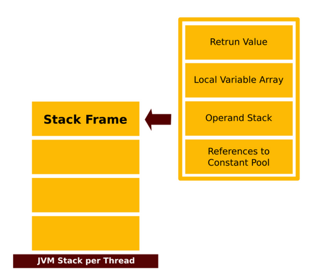

# Лекція 1b: Memory Model та Garbage Collection

> **Декларація курсу.** Академічна доброчесність та авторство матеріалів — у [DISCLAIMER.md](DISCLAIMER.md).

← [Лекція 1: Вступ](01_what_is_java.md) | [Частина 1a: Життєвий цикл](01a_jvm_lifecycle.md) →

### Автоматичне управління пам'яттю та Garbage Collection (GC)

Однією з ключових функцій віртуальної машини є автоматичне управління пам'яттю. Її головна задача — визначати, коли об'єкт більше не використовується програмою, і звільняти (переробляти) пам'ять, яку він займав. У VM цей процес абстрагований від розробника; наприклад, мова може забороняти ручне створення вказівників на адреси в пам'яті.

Існує кілька підходів до реалізації збирача сміття (Garbage Collector, GC).

-----

### Підхід 1: Підрахунок посилань (Reference Counting)

**Ідея**

  * Для кожного об'єкта ведеться лічильник, скільки інших об'єктів на нього посилаються.
  * Коли створюється нове посилання на об'єкт, лічильник збільшується; коли посилання видаляється (або перевизначається), лічильник зменшується.
  * Якщо лічильник об'єкта досягає нуля, збирач сміття видаляє цей об'єкт і зменшує лічильники всіх об'єктів, на які він посилався.

**Проблеми**

  * **Накладні витрати:** Постійне оновлення лічильників створює додаткове навантаження під час виконання програми, особливо при роботі зі стеком.
  * **Циклічні залежності:** Цей підхід не може виявити та видалити групи об'єктів, які посилаються один на одного, але на які більше немає зовнішніх посилань.



-----

### Підхід 2: Позначити та очистити (Mark and Sweep)

**Ідея**

1.  **Зупинка світу ("Stop the world"):** Робота основної програми призупиняється.
2.  **Фаза позначення (Mark phase):** GC починає з "кореневих" точок (наприклад, локальних змінних у стеку) і рекурсивно проходить по всіх доступних об'єктах, позначаючи їх як "живі".
3.  **Фаза очищення (Sweep phase):** GC проходить по всій купі (heap) і видаляє всі об'єкти, які не були позначені.
4.  Знімаються всі позначки, і робота програми відновлюється.

**Проблеми**

  * **"Stop the world":** Призупинка програми може викликати помітні затримки ("лаги"), особливо в інтерактивних додатках.
  * **Повільна робота на великих купах:** Цю проблему вирішують **генераційні збирачі сміття (generational collectors)**.
  * **Фрагментація пам'яті:** Після видалення об'єктів у купі можуть залишатися "дірки", що ускладнює виділення пам'яті для великих нових об'єктів. Цю проблему вирішують **ущільнюючі збирачі сміття (compacting collectors)**.



-----

### PC Register (Регістр лічильника команд)

PC Register (Program Counter) — це специфічна для кожного потоку (per-thread) область пам'яті в JVM, яка містить адресу поточної інструкції байт-коду, що виконується.

  * Ізоляція потоків: Кожен потік виконання (Thread) має свій власний, незалежний PC Register. Це забезпечує коректне відстеження точки виконання для кожного потоку в багатопоточному середовищі.
  * Вміст регістра: Регістр зберігає returnAddress або вказівник на опкод поточної інструкції байт-коду. Після виконання інструкції, лічильник автоматично оновлюється, вказуючи на наступну інструкцію.
  * Виконання нативних методів: Під час виконання нативного методу (коду, реалізованого не на Java), вміст PC Register є невизначеним (undefined), оскільки виконання відбувається поза контролем JVM і її моделі байт-коду.

-----

#### Stack (Стек)

  * Це область пам'яті, де зберігаються методи, локальні змінні та проміжні результати обчислень.
  * Кожен потік має свій приватний стек, який створюється разом із потоком.
  * Стек зберігає **фрейми (frames)**. Для кожного методу, що викликається, створюється новий фрейм, який "наштовхується" на стек. Коли метод завершує роботу, його фрейм видаляється зі стеку.
  * Всі інструкції байт-коду беруть операнди зі стеку, виконують над ними операції і повертають результат назад у стек.
  * Посилання на змінні (як примітивні, так і об'єктні) зберігаються у стеку.

##### Stack Frame (Фрейм стеку)

Кожен фрейм містить:

  * **Local Variable Array** (Масив локальних змінних).
  * **Operand Stack** (Стек операндів).
  * **References to Constant Pool** (Посилання на Пул констант класу, в якому виконується метод).
  * **Return Value** (Значення, що повертається).



-----

#### Native Method Stack (Стек нативних методів)

  * Це окремий стек для коду, написаного на інших мовах (наприклад, C/C++).
  * Використовується, наприклад, для операцій вводу/виводу, які часто реалізовані як нативні методи для взаємодії з апаратним забезпеченням чи ОС.
  * В Oracle JVM нативні методи можуть бути реалізовані через **JNI (Java Native Interface)**.

-----

#### Heap (Купа)

  * Це область пам'яті, де зберігаються **екземпляри класів (об'єкти)**.
  * Купа є **спільною для всіх потоків** у додатку.
  * Це головний об'єкт для роботи **збирача сміття (Garbage Collection)**.
  * Змінні-члени класу (поля) зберігаються в Купі, на відміну від локальних змінних методу, які зберігаються у Стеці.

-----

#### Method Area (Область методів)

  * Ця область є **спільною для всіх потоків**.
  * Вона зберігає структури, що описують самі класи: **код методів та конструкторів**, дані полів, метадані та **Пул констант часу виконання**.
  * Логічно є частиною Купи.
  * У версіях HotSpot JVM до 8 ця область називалася **PermGen space**. У версії 8 і новіших вона знаходиться в **Metaspace**.

-----

#### Runtime Constant Pool (Пул констант часу виконання)

  * Це представлення таблиці `_constant_pool` з файлу `.class` під час виконання програми.
  * Містить константи кожного класу та інтерфейсу, а також усі посилання на методи та поля.
  * Коли у коді зустрічається посилання на метод чи поле, JVM використовує цей пул для знаходження фактичної адреси в пам'яті.

-----

### Сила посилань: Як Garbage Collector приймає рішення

У Java не всі посилання однакові. **Сила посилання** визначає, наскільки "міцно" воно утримує об'єкт у пам'яті, і є головним критерієм для Збирача сміття (Garbage Collector) при прийнятті рішення, чи можна видаляти об'єкт.

#### Strong Reference (Сильне посилання)

Це звичайний, стандартний тип посилання, який ми використовуємо.

```java
String name = "Java"; // 'name' - це сильне посилання
```

**Правило:** Доки на об'єкт існує хоча б одне **сильне посилання**, Збирач сміття **ніколи** не видалить цей об'єкт з пам'яті. Це гарантує, що об'єкти, якими ви активно користуєтесь, не зникнуть.

#### Soft Reference (М'яке посилання)

Це менш сильний тип посилання. Об'єкти, на які існують тільки м'які посилання, будуть видалені Збирачем сміття лише тоді, коли JVM **критично не вистачає пам'яті**.

  * **Коли використовувати:** Ідеально підходить для реалізації **кешів**, які повинні зберігати дані якомога довше, але можуть бути очищені, щоб уникнути `OutOfMemoryError`.

#### Weak Reference (Слабке посилання)

Це ще слабший тип посилання. Об'єкти, на які існують тільки слабкі посилання, будуть видалені при **першому ж циклі** роботи Збирача сміття.

  * **Коли використовувати:** Зазвичай використовується для зберігання метаданих або для реалізації "канонічних" мап (наприклад, `WeakHashMap`), де ключі можуть бути видалені, якщо на них не залишилося сильних посилань ззовні.

#### Phantom Reference (Фантомне посилання)

Це найслабший тип посилання. Воно використовується не для доступу до об'єкта (його `get()` завжди повертає `null`), а для того, щоб отримати сповіщення **після того, як об'єкт вже був видалений** Збирачем сміття.

  * **Коли використовувати:** Застосовується у дуже специфічних випадках для виконання дій по очищенню ресурсів (`cleanup`) після того, як об'єкт гарантовано знищений.

-----

### Підсумкова таблиця

| Тип посилання | Коли GC видаляє об'єкт? | Основне застосування |
| :--- | :--- | :--- |
| **Strong** | **Ніколи**, доки існує хоча б одне таке посилання. | Звичайна робота з об'єктами. |
| **Soft** | Тільки коли JVM **критично не вистачає пам'яті**. | Реалізація кешів. |
| **Weak** | При **наступному циклі** роботи GC. | Зберігання метаданих, слабкі мапи. |
| **Phantom** | Об'єкт вже видалено; посилання лише дає сигнал про це. | Складні операції по очищенню ресурсів (`post-mortem cleanup`). |

← [Лекція 1: Вступ](01_what_is_java.md) | [Частина 1a: Життєвий цикл](01a_jvm_lifecycle.md) →
