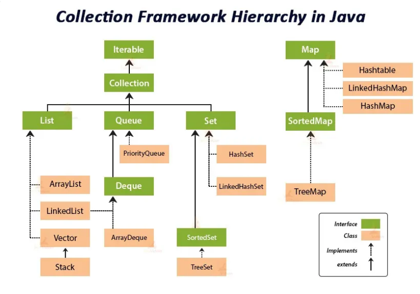

# Лекція 2: Java Collections Framework — Основи

## Навіщо потрібні колекції?

Більшість роботи будь-якої програми — це обробка даних. Нам постійно потрібно отримувати списки користувачів, адрес, товарів, а потім сортувати їх, шукати в них щось або порівнювати. Тому знання колекцій — це фундаментальна навичка для будь-якого розробника, і одне з найчастіших питань на співбесідах.

Для зберігання даних у нас вже є **масиви**. Вони чудово справляються зі зберіганням кількох значень в одному місці. Але у них є одне критичне обмеження: **розмір масиву є фіксованим** і задається при його створенні.

Саме цю проблему вирішують **колекції**. Термін "колекція" походить від латинського *collectio* — "збирання". По суті, колекція — це **контейнер для зберігання групи об'єктів (елементів)**, розмір якого може динамічно змінюватися.

---

## Огляд Java Collections Framework (JCF)

**Java Collections Framework (JCF)** — це набір класів та інтерфейсів, які надають потужну та уніфіковану архітектуру для роботи з групами об'єктів. JCF пропонує готовий набір інструментів для ефективної роботи зі списками, множинами, чергами та мапами.

### Ієрархія колекцій

Одне з найчастіших питань на співбесідах — "намалюйте ієрархію колекцій". Ось як вона виглядає:

---

## Основні Інтерфейси

Ієрархія JCF побудована на наборі ключових інтерфейсів.

#### `Iterable<E>`
Найвищий інтерфейс в ієрархії. Він визначає лише один метод, який дозволяє "проходитись" по елементах колекції. Будь-який об'єкт, що реалізує `Iterable`, можна використовувати у циклі `for-each`.

#### `Collection<E>`
Це кореневий інтерфейс ієрархії (за винятком `Map`). Він представляє групу об'єктів, відомих як елементи, і визначає базові методи для роботи з ними: `add()`, `remove()`, `contains()`, `size()`, `isEmpty()` та інші.

Від `Collection` наслідуються три основні інтерфейси: `List`, `Set` та `Queue`.

#### `List<E>` (Список)
* **Головна риса:** Впорядкована колекція (елементи зберігаються в тому порядку, в якому їх додали), яка **дозволяє дублікати**.
* **Коли використовувати:** Коли важливий порядок елементів або коли вам потрібен доступ до елемента за його індексом.
* **Основні реалізації:** `ArrayList`, `LinkedList`, `Vector`.

#### `Set<E>` (Множина)
* **Головна риса:** Колекція, яка зберігає **тільки унікальні елементи**. Порядок елементів, як правило, не гарантується.
* **Коли використовувати:** Коли вам потрібно зберігати набір унікальних значень, наприклад, список унікальних користувачів.
* **Основні реалізації:** `HashSet`, `LinkedHashSet`, `TreeSet`.

#### `Queue<E>` (Черга)
* **Головна риса:** Колекція, призначена для зберігання елементів перед їх обробкою. Зазвичай працює за принципом **FIFO (First-In, First-Out)** — "першим прийшов, першим пішов".
* **Коли використовувати:** Для будь-яких задач, що нагадують чергу: обробка запитів, черга на друк тощо.
* **Основні реалізації:** `LinkedList`, `PriorityQueue`, `ArrayDeque`.

#### `Map<K, V>` (Мапа, або Словник)
* **Важливо:** Інтерфейс `Map` **не наслідується** від `Collection`, оскільки він працює не з окремими елементами, а з парами **"ключ-значення"**.
* **Головна риса:** Зберігає унікальні ключі та відповідні їм значення. Кожному ключу відповідає не більше одного значення.
* **Коли використовувати:** Коли потрібно зберігати дані, які легко шукати за унікальним ідентифікатором (ключем). Наприклад, "ID користувача" -> "Об'єкт користувача".
* **Основні реалізації:** `HashMap`, `LinkedHashMap`, `TreeMap`, `Hashtable`.

---

## Коли що використовувати? Шпаргалка

| Вам потрібно... | Використовуйте... | Приклад реалізації |
| :--- | :--- | :--- |
| ...зберігати елементи за індексом і допускати дублікати? | `List` | `ArrayList` |
| ...зберігати тільки унікальні елементи (порядок неважливий)? | `Set` | `HashSet` |
| ...зберігати пари "ключ-значення" для швидкого пошуку? | `Map` | `HashMap` |
| ...обробляти елементи в порядку їх додавання (FIFO)? | `Queue` | `LinkedList` |
| ...зберігати унікальні елементи у відсортованому порядку? | `SortedSet` | `TreeSet` |

---

## Практична частина

Зразки коду для роботи з основними видами колекцій можна знайти у цьому репозиторії:
* **[Колекція прикладів коду](https://github.com/vplanto/java/tree/main/collections-samples)**

---

## Контрольні питання

1.  **Ієрархія.** Назвіть три основні інтерфейси, що наслідуються від `Collection`. Яка їхня ключова відмінність щодо порядку елементів та наявності дублікатів?

2.  **Концепція.** Чому інтерфейс `Map` не є частиною ієрархії `Collection` (тобто, не наслідується від нього)?

3.  **Застосування.** Вам потрібно зберегти список студентів, що зареєструвалися на курс. Кожен студент може зареєструватися лише один раз, і вам неважливий порядок, у якому вони реєструвалися. Яку саме реалізацію колекції (`ArrayList`, `HashSet` чи `HashMap`) ви оберете і чому?