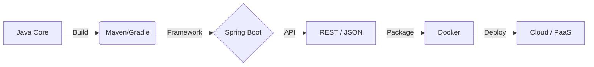

# Лекція 0: Engineering Mindset. Вступ до курсу

**Аудиторія:** 2-й курс (Junior Strong)
**Ціль:** Змінити мислення студента з "я пишу код" на "я будую систему". Пояснити правила гри, методологію Vibe Coding та структуру оцінювання.

---

## 1. Відкрита дискусія (Warm-up)

**Контекст:** Ми часто чуємо: "Головне, щоб працювало". Але в інженерії "працює" — це лише початок.

**Питання до аудиторії:**
Уявіть два шматки коду, які роблять одне й те саме (наприклад, переказ коштів):
1.  **Hackathon Code:** Написаний за ніч під енергетиками. Змінні типу `a`, `b`, жодного тесту, хардкод паролів, але демо працює ідеально.
2.  **Enterprise Code:** Написаний за 2 місяці. Покритий тестами, пройшов 3 стадії рев'ю, розгорнутий через CI/CD пайплайн.

**Питання:** Якщо з точки зору користувача результат однаковий (гроші переказано), за що бізнес платить у 100 разів більше у другому випадку? У чому **фундаментальна інженерна різниця**?

👀 Розгорнути відповідь та аналіз (натисніть тут)

### 1. Ціна помилки (Cost of Error)
* **Хакатон:** Баг = "Ой, перепрошую, зараз перезапущу". Ціна = $0.
* **Enterprise:** Баг у білінгу = втрата мільйонів доларів, судові позови, штрафи від регуляторів або втрата ліцензії. Інженерія — це **управління ризиками**.

### 2. Життєвий цикл (Software Lifecycle)
* **Хакатон:** Парадигма *"Write once, run once, throw away"*. Код живе 24 години. Його не треба підтримувати.
* **Enterprise:** Код живе 5-10 років. Його будуть читати та змінювати люди, які ще навіть не народилися, коли ви писали цей метод. Тому **Readability (Читабельність) > Write Speed (Швидкість написання)**.

### 3. Масштаб команди (Collaboration)
* **Хакатон:** 1-2 людини. Ви тримаєте всю архітектуру в голові (Mental Model).
* **Enterprise:** 50-100+ розробників. Ніхто не знає всієї системи. Без автотестів, документації та чистого коду система перетворюється на "Legacy Monster", якого бояться чіпати.

> **Інженерний Висновок:**
> **Програміст (Coder)** фокусується на тому, щоб код запрацював.
> **Інженер (Engineer)** фокусується на тому, щоб код **продовжував працювати** при зміні навантаження, команди та бізнес-вимог.

## 2. Зміна парадигми: Coder vs Engineer

Ми починаємо з тези, яка може здатися контрінтуїтивною для курсу програмування:
**"Code is a Liability" (Код — це пасив).**

Активом є працююча система, що приносить гроші. Код — це те, що треба писати, тестувати, деплоїти, охороняти і читати. Чим менше коду ви напишете для вирішення задачі — тим кращим інженером ви є.

### Битва світів: Pet Project проти Enterprise

Більшість вашого досвіду до цього моменту — це лабораторні роботи або власні пет-проєкти. В Enterprise світі правила змінюються кардинально.

| Характеристика | Pet Project (Coder Mindset) | Enterprise (Engineer Mindset) |
| :--- | :--- | :--- |
| Мета | "Щоб запрацювало" | "Щоб можна було підтримувати 5 років" |
| Середовище | Localhost ("Works on my machine") | Cloud / Kubernetes / Distributed |
| Команда | Я один (Solo) | 10-100+ людей (Team Friction) |
| Документація | Код самодокументований (ні) | ADR, API Specs, Diagrams |
| Ціна зміни | 0 хвилин (переписав і забув) | Тижні (Review, QA, Deploy, Migration) |
| Головний ворог | Синтаксичні помилки | Складність (Complexity) та Хаос |

### Хто такий Інженер?

👀 Визначення (натисніть, щоб розгорнути)

Інженер — це не той, хто знає всі методи `Stream API` напам'ять.

**Інженер — це людина, яка керує складністю та ризиками.**
Ваша задача:
1.  Зрозуміти проблему (часто вона не в коді).
2.  Знайти найдешевше та найнадійніше рішення.
3.  Реалізувати його так, щоб наступний розробник не проклинав вас через рік.

> **Правило курсу:** Ми оцінюємо не те, як швидко ви пишете код, а те, наскільки стійкі та зрозумілі рішення ви будуєте.

## 3. Навігація курсу (Roadmap)

Цей семестр — це подорож від "Hello World" в консолі до повноцінного хмарного сервісу.
Перш ніж заглибитися в деталі, поглянемо на **Tech Stack Graph**, який ви освоїте:

**Наша кінцева точка:** Ви напишете REST API на Spring Boot, запакуєте його в Docker-контейнер і розгорнете в Інтернеті (Render/AWS), щоб ним могли користуватися реальні люди.

Курс розділено на 4 логічні блоки:

### Блок 1: Процеси та Вимоги (Lectures 0-3)
Перш ніж відкрити IDE, інженер має зрозуміти ЩО ми будуємо.
* Ключові теми: SDLC (Software Development Life Cycle), Agile/Scrum, Робота з Jira, Git Flow.
* Результат: Ви розумієте, звідки беруться задачі і як їх декомпозувати.

### Блок 2: Якість та Архітектурні Характеристики (Lectures 4-6)
Ми визначаємо правила гри.
* Ключові теми: NFRs (Non-Functional Requirements), Scalability, Availability, QA Strategy, Static Analysis.
* Результат: Ви можете порахувати навантаження на систему "на серветці" до написання коду.

### Блок 3: Технічна Реалізація (Lectures 7-9 + Spring Labs)
Тільки тепер ми починаємо писати код.
* Ключові теми: API Design (REST), Spring Boot Ecosystem, Docker & Containers.
* Результат: REST API, запаковане в Docker-контейнер і розгорнуте у хмарі.

### Блок 4: System Design (Lectures 10-11)
Вищий пілотаж. Об'єднуємо компоненти у систему.
* Ключові теми: Розподілені системи, CAP-теорема, Load Balancers, Caching strategies.
* Результат: Захист архітектури (System Design Interview) на прикладі реального сервісу (URL Shortener).

---

### Інженерний Інсайт: Чому такий порядок?

👀 Чому ми вчимо NFRs (Лекція 4) раніше, ніж пишемо API (Лекція 7)?

Це найпоширеніше питання: "Чому ми не кодимо одразу?"

**Відповідь:** Тому що код — це лише інструмент реалізації вимог.
Якщо ви не знаєте NFR (наприклад, що система має витримувати 10,000 запитів на секунду), ви напишете стандартний код, який "працює на моїй машині", але впаде в першу хвилину продакшену.

**Архітектура залежить від обмежень (Constraints):**
* Для 10 користувачів -> Моноліт + SQL.
* Для 10 мільйонів -> Мікросервіси + NoSQL + Kafka.

Код однаковий (Java), але **Архітектура** — протилежна. Тому спочатку NFR, потім — код.

## 4. 📖 Engineering Dictionary (Axioms)

Інженерія — це точна наука. Щоб будувати складні системи, ми повинні говорити однією мовою.
Нижче — список термінів ("Аксіом"), які ви зобов'язані розуміти, а не просто завчити.

### 📐 The Math Bridge (Переклад для математиків)

Для студентів Прикладної Математики ми підготували словник-адаптер:

| Інженерний термін | Суть | Математична аналогія / Інтерпретація |
| :--- | :--- | :--- |
| **Stateless** | Сервер не пам'ятає попередній запит. | **Pure Function:** $y = f(x)$. Результат залежить *виключно* від аргументів. Відсутність побічних ефектів (Side Effects) та пам'яті. |
| **Idempotency** | Повторення дії не ламає систему. | **Idempotence:** Операція, де $f(f(x)) = f(x)$. (Натискання кнопки "Оплатити" двічі не знімає кошти двічі). |
| **CI/CD Pipeline** | Шлях коду в продакшн. | **DAG (Directed Acyclic Graph):** Направлений ациклічний граф, де вузол $B$ (Deploy) не може початись, доки не завершиться вузол $A$ (Test). |
| **Latency** | Затримка відповіді. | **Delta ($\Delta t$):** Час проходження сигналу ребром графа. Критичний параметр для Real-time систем. |
| **CAPEX vs OPEX** | Власне залізо vs Хмара. | **Optimization Task:** Мінімізація функції витрат. CAPEX — ступінчаста функція (Step function), OPEX — лінійна ($y = kx$). |

### 🏗️ Technical Vocabulary (Core Expectations)

Розгорнути повний список технічних вимог

**1. Process & Tools**
* **Git Flow:** Стандарт роботи з версіями. Гілки `feature/`, `develop`, `master`.
* **Artifacts:** Зібрані бінарні файли (`.jar`, Docker Image). Це "Торт", а не "Рецепт" (Code).
* **Containerization:** Ізоляція процесу (Docker). Гарантія того, що оточення на Dev збігається з Prod.

**2. Architecture & Quality (NFRs)**
* **Scalability:** Здатність системи рости. Якщо $Load \times 10$, то ми додаємо сервери, а не переписуємо код.
* **Availability:** SLA (Service Level Agreement). Вимірюється в "дев'ятках" (99.9% доступності).
* **Static Analysis:** Автоматична перевірка коду роботом (SonarQube) до того, як його побачить людина.

**3. Implementation & Distributed Systems**
* **RESTful API:** Стандарт обміну даними (JSON over HTTP).
* **Dependency Injection (DI):** Патерн, де об'єкти не створюють свої залежності (`new Service()`), а отримують їх ззовні.
* **CAP Theorem:** Фундаментальне обмеження: неможливо одночасно мати Consistency, Availability та Partition Tolerance.

## 5. Методологія: Vibe Coding Protocol

Ми офіційно визнаємо: у 2026 році писати весь код руками — це неефективно.
Тому ми переходимо на **Vibe Coding Protocol** — методологію, де AI виконує роль "робочої сили", а ви — роль Архітектора.

**Повний протокол:** [vibe_coding.md](vibe_coding.md)

### Нові правила гри

👀 Що дозволено, а за що буде "Hard Fail" (натисніть тут)

Дозволено (Green Zone):
1.  AI Generation: Використовувати ChatGPT, Claude, GitHub Copilot для генерації 100% коду.
2.  Copy-Paste: Копіювати рішення зі StackOverflow або документації.
3.  Boilerplate: Починати проєкт з готових шаблонів.

Заборонено (Red Zone — миттєва перездача):
1.  Magic Code: Залишати код, який ви не можете пояснити ("Воно працює, я не чіпав, це AI написав").
2.  Blind Trust: Вірити коментарям AI (вони часто брешуть про версії бібліотек).
3.  Security Leaks: Хардкодити паролі/токени, бо так згенерував AI.

### Концепція AI Ownership

Ви не можете сказати на захисті: *"Ну, це Copilot так згенерував"*.
З моменту, коли код потрапив у ваш репозиторій (Git Commit), **ви стаєте його одноосібним власником**.

Інженерна відповідальність:
* Якщо AI написав вразливий SQL-запит — це ваша вразливість.
* Якщо AI використав застарілу бібліотеку — це ваш технічний борг.
* Ви — Архітектор. AI — ваш Стажер. За помилки стажера відповідає Архітектор.

### Engineering Language Protocol

Чому англійська — це не опція, а інструмент (натисніть)

В IT немає "локальних" інженерів. Вся світова база знань існує англійською.

* **AI Prompts:** LLM (ChatGPT/Claude) "думають" англійською. Промпт *"Refactor this to use Strategy Pattern"* дасть значно точніший і якісніший код, ніж його аналог українською.
* **Documentation:** JavaDocs, назви змінних, Git Commits, Pull Requests — **тільки англійською**.
* **Terminology:** Ми не перекладаємо технічні терміни, щоб не втрачати суть.
    * "Впровадження залежностей" -> Dependency Injection.
    * "Стійкість до поділу" -> Partition Tolerance.

> **Правило курсу:** Весь код, коментарі в коді та промпти для AI — **English only**. Обговорення в аудиторії — українською.

## 6. Система оцінювання та Екзамен

Забудьте про "здав лабораторну — отримав галочку".
В інженерії ми оцінюємо **результат** (Product) та **процес** (Process).

### Структура балів (The Vibe Coding Score)

Ваша фінальна оцінка складається з трьох рівноцінних компонентів. Ви не можете отримати "відмінно", просто написавши робочий код, якщо він нечитабельний або ви не розумієте, як він працює.

| Категорія | Вага | Що оцінюється |
| :--- | :--- | :--- |
| Hard Skills | 60% | **"It Works & Clean"**. Функціонал працює, тести проходять, код відповідає стандартам Clean Code. |
| AI Ownership | 20% | **"Defense"**. Здатність пояснити кожну анотацію та рядок коду, згенерованого AI. Якщо ви "пливете" у власному коді — цей бал стає 0. |
| **Soft Skills** | **20%** | **"Teamwork & Discipline"**. Це не про "ввічливість". Це про **Communication Protocols**. Якість Git-комітів, зрозумілість документації та здатність працювати в режимі "Distributed System" (команда). |

### Math Insight: Optimization via Parallelization

Чому "Single Player Mode" — це тупикова гілка еволюції (натисніть)

Для прикладної математики це задача оптимізації обчислювальної потужності.
Уявіть, що ви — найпотужніший процесор у світі. Але ви — **Single Core**.

* **Solo Dev:** Ви виконуєте завдання послідовно. Час виконання: $T = O(N)$.
* **Team Dev:** Ви розпаралелюєте задачу на $k$ розробників (Nodes). Час: $T = O(\frac{N}{k}) + \text{Overhead}$.

**Soft Skills** — це і є цей **Synchronization Overhead** (витрати на комунікацію).
* Якщо ваші Soft Skills погані (токсичність, незрозумілі повідомлення) — Overhead прямує до нескінченності, і система входить у стан **Deadlock**.
* Якщо хороші — ви отримуєте майже лінійне прискорення.

> **Висновок:** Ми оцінюємо Soft Skills, бо без них ви не масштабуєтесь. Ви залишаєтесь "локальним скриптом", а не будуєте "Enterprise System".

### Формат Іспиту (Architecture Defense)

Іспит проходить не за білетами "що таке поліморфізм", а у форматі професійної співбесіди та Code Review.

👀 Деталі екзаменаційного процесу (натисніть тут)

**Частина 1: Code Review (Spring Boot)**
* Ви відкриваєте свій репозиторій з проєктом семестру.
* Екзаменатор вибирає випадковий клас (наприклад, `SecurityConfig` або `OrderController`).
* **Завдання:** Пояснити, чому тут використано саме цю анотацію/патерн, і що станеться, якщо її прибрати.

**Частина 2: System Design Interview**
* Ви отримуєте архітектурну задачу (на основі матеріалів Модулів 4-5).
* *Приклад:* "Як змінити твій сервіс, щоб він витримав 10,000 запитів на секунду?" або "Що буде, якщо Redis впаде?".
* **Мета:** Перевірити мислення (CAP-теорема, масштабування), а не пам'ять.

> **Порада:** Якщо ви використовували AI для написання коду, витратьте час на те, щоб *прочитати* і *зрозуміти* його. Це єдиний спосіб скласти цей іспит.

## 7. Екзаменаційний пул (Exam Questions)

Це не просто питання для самоперевірки. Це **реальні білети**, які випадуть вам на захисті.
Підготовка до іспиту починається сьогодні.

### Block 1: Mindset & Philosophy

**Питання 1: У чому фундаментальна різниця між "Кодером" (Coder) та "Інженером" (Engineer)?**

👀 Еталонна відповідь

* **Кодер** фокусується на написанні коду, щоб вирішити поточну задачу ("Make it work"). Його горизонт планування — дні.
* **Інженер** фокусується на життєвому циклі продукту. Він керує складністю, ризиками та вартістю підтримки ("Make it maintainable"). Його горизонт — роки.
* *Ключова фраза:* "Інженер знає, що код — це пасив, а працююча архітектура — це актив".

**Питання 2: Поясніть концепцію "Code is a Liability" (Код — це пасив).**

👀 Еталонна відповідь

Кожен рядок коду вимагає:
1.  Тестування.
2.  Рев'ю.
3.  Підтримки та оновлення бібліотек.
4.  Часу на прочитання новим розробником.

Тому найкращий інженерний код — це той, який **не довелося писати** (використання готових бібліотек, SaaS-рішень або спрощення бізнес-вимог). Чим менше коду, тим менше багів.

### Block 2: Process & Vibe Coding

**Питання 3: Що таке "AI Ownership" у контексті Vibe Coding Protocol?**

👀 Еталонна відповідь

Це принцип відповідальності. Студент має право згенерувати 100% коду за допомогою AI, але з моменту коміту в Git він стає **одноосібним власником** цього коду.
На захисті фраза "це написав AI, я не знаю, як воно працює" призводить до миттєвої нездачі (Hard Fail). Ви зобов'язані розуміти кожен рядок, навіть якщо не писали його руками.

**Питання 4: Чому етап NFR (Non-Functional Requirements) має йти ДО написання коду?**

👀 Еталонна відповідь

Тому що NFR (навантаження, безпека, доступність) визначають **Архітектуру**.
Якщо ми не знаємо, що система має витримувати 10k RPS, ми оберемо стандартну архітектуру, яка впаде під навантаженням. Змінити архітектуру, коли код вже написано — це переписати систему з нуля. Тому спочатку обмеження, потім реалізація.

### Block 3: SDLC Lifecycle

**Питання 5: Назвіть ціну виправлення помилки на етапі Requirements vs Production.**

👀 Еталонна відповідь

Залежність експоненційна:
* **Requirements:** $1 (Виправити текст у Jira).
* **Development:** $10 (Переписати метод).
* **Testing:** $100 (Перезібрати білд, прогнати регресію).
* **Production:** $10,000+ (Втрата клієнтів, репутаційні ризики, екстрені хотфікси вночі).
Саме тому ми інвестуємо час у проектування та тести.

