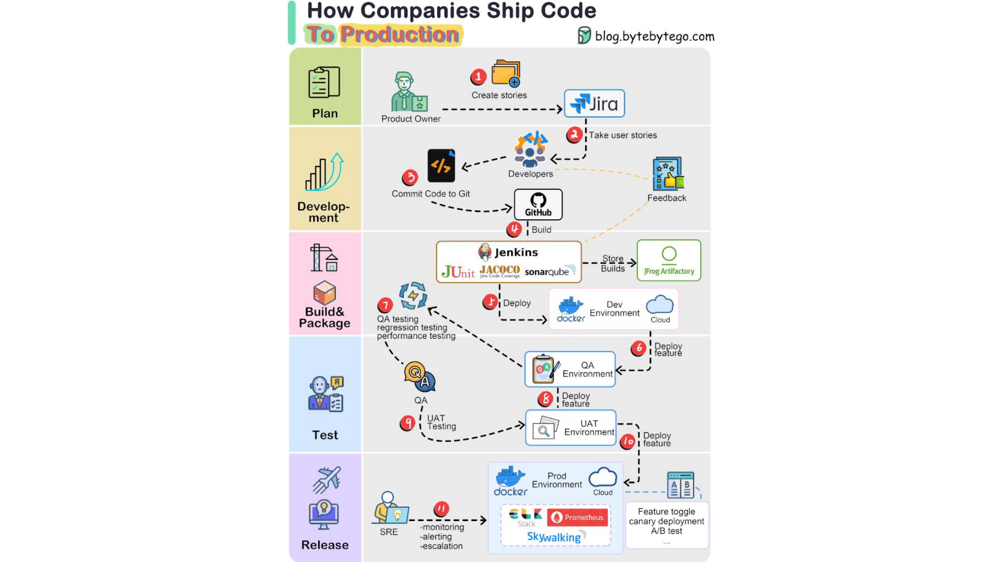

# Лекція 1: SDLC. Життєвий цикл програмного забезпечення

**Аудиторія:** 2-й курс (Junior Strong)
**Ціль:** Показати «виробничий конвеєр» (Factory), де написання коду — це лише один з етапів. Розібрати ролі, методології та інфраструктуру доставки коду.

> **English version:** [English](en/01_sdlc.md) | **Незнайоме слово?** → [Глосарій курсу](glossary.md)

---

## 1. Відкрита дискусія (Warm-up)

**Контекст:** Багато початківців вважають, що робота програміста закінчується, коли код запрацював у IntelliJ IDEA. Але в реальному проєкті між «написав код» та «клієнт побачив фічу» проходить складний шлях.

**Питання до групи:**
Уявіть, що ви написали ідеальний інтернет-магазин. Він працює на вашому ноутбуці.
Чому не можна просто скопіювати `.jar` файл на сервер через FTP, запустити його і піти пити каву?
Навіщо індустрія витрачає мільярди на **Jira** *(система задач і багів)*, **Git** *(контроль версій коду)*, **CI/CD** *(автоматична збірка і доставка)*, **Docker** *(контейнери — ізольоване середовище)* та утримує **3 різні середовища** (Dev, QA, Prod)?

👀 Розгорнути відповідь та аналіз (натисніть тут)

### 1. Фактор "Автобуса" (The Bus Factor)
* **FTP-підхід:** Ви єдиний, хто знає, який файл ви завантажили. Якщо ви захворієте (або вас "зіб'є автобус"), ніхто не зможе оновити сайт.
* **SDLC-підхід:** Всі зміни зафіксовані в **Jira** та **Git**. Будь-який інший інженер може продовжити вашу роботу через 5 хвилин.

### 2. Відтворюваність (Reproducibility)
* **FTP-підхід:** "На моїй машині працює". Ви забули, що у вас встановлена Java 21, а на сервері — Java 8. Сайт впав.
* **SDLC-підхід:** **Docker** гарантує, що середовище однакове всюди. **CI (Continuous Integration)** автоматично збирає проєкт на чистому сервері, перевіряючи, чи не забули ви додати файл.

### 3. Вартість відкату (Rollback Strategy)
* **FTP-підхід:** Ви залили нову версію, і вона зламала кошик. Щоб повернути стару, треба шукати старий файл на диску. Час простою: години.
* **SDLC-підхід:** `git revert` або кнопка в **Jenkins** "Rollback to previous build". Час відновлення: секунди.

> **Інженерний Висновок:**
> Інструменти SDLC існують не для того, щоб ускладнити вам життя, а щоб зробити процес розробки **передбачуваним** та **незалежним від однієї людини**.

## 2. The Big Picture: Від Ідеї до Моніторингу

Ми часто фокусуємося на написанні коду, забуваючи, що код — це лише "паливо" для великої машини, яка називається **SDLC (Software Development Life Cycle)**.

[Image of Software Development Life Cycle stages]

### 6 Етапів життя будь-якого софту

Розглянемо класичний цикл. В Enterprise жоден рядок коду не з’являється «просто так» — він проходить усі ці ворота.

1. Requirements Analysis (Аналіз Вимог)

* **Хто:** Product Owner (PO), Business Analyst (BA).
* **Що відбувається:** Бізнес каже "Хочу кнопку 'Купити'". Аналітик перетворює це на технічне завдання (Ticket в Jira).
* **Артефакт:** User Stories, Specifications.
* **Інженерний фокус:** Якщо тут допущена помилка ("кнопка має бути червона, а не синя"), її виправлення коштує $1.

2. Design (Проектування)

* **Хто:** Solution Architect, Tech Lead.
* **Що відбувається:** Ми не пишемо код. Ми малюємо діаграми (C4 Model), обираємо базу даних (SQL vs NoSQL) та погоджуємо API контракти.
* **Артефакт:** Architecture Blueprint, API Swagger, DB Schema.
* **Інженерний фокус:** Тут визначається, чи впаде система під навантаженням.

3. Implementation (Розробка)

* **Хто:** Developers (Frontend, Backend).
* **Що відбувається:** Власне Coding. Перетворення діаграм на класи та функції.
* **Артефакт:** Source Code (Git Commits).
* **Інженерний фокус:** Clean Code, Unit Tests.

4. Testing (Тестування)

* **Хто:** QA Engineers (Manual + Automation).
* **Що відбувається:** Перевірка відповідності коду вимогам (з етапу 1).
* **Артефакт:** Bug Reports, Test Plans.
* **Інженерний фокус:** Quality Gates. Якщо тести не проходять — код повертається на етап 3.

5. Deployment (Розгортання)

* **Хто:** DevOps / Platform Engineers.
* **Що відбувається:** Код перетворюється на бінарний файл (Docker Image) і запускається на серверах.
* **Артефакт:** Running Containers, Release Notes.
* **Інженерний фокус:** CI/CD Pipeline. "It works on my machine" тут вже не працює.

6. Maintenance (Підтримка)

* **Хто:** SRE (Site Reliability Engineers), Support L1/L2.
* **Що відбувається:** Моніторинг помилок, реагування на інциденти, патчинг.
* **Артефакт:** Logs, Alerts, Post-Mortems.
* **Інженерний фокус:** MTTD (Mean Time To Detect) — як швидко ми дізнаємося, що щось зламалося?

> **Ключовий інсайт:** Розробник бере активну участь в етапах 2, 3, 4 та 5. Якщо ви думаєте, що ваше місце тільки в пункті 3 — ви Кодер, а не Інженер.

## 3. Roles & Responsibilities: Хто є хто?

В університеті ви часто граєте роль "Людини-оркестру": ви самі придумуєте задачу, кодите її, тестуєте і деплоїте. В Enterprise це **антипатерн**.
Чіткий поділ відповідальності — єдиний спосіб не збожеволіти на великому проєкті.

### Insight: The "Lone Wolf" Trap

Чому математики та олімпіадники часто страждають в Enterprise (натисніть)

Математика та спортивне програмування — це часто **індивідуальні дисципліни**. Ви самі проти задачі.
Проте Інженерія — це **командний спорт**.

* **Solo:** Ви можете самотужки довести теорему або написати алгоритм QuickSort.
* **Team:** Ви **не можете** побудувати Google Maps, Uber або Banking System самотужки.

> **Алегорія:** Собачу будку можна збудувати самому за вихідні. Хмарочос вимагає архітекторів, кранівників, електриків та бетонщиків. Якщо ви спробуєте збудувати хмарочос самотужки, ви помрете від старості ще на етапі фундаменту.

**Complex Systems cannot be built alone.** Ваша цінність як Senior-інженера визначається не тим, як швидко ви кодите, а тим, як ефективно ви інтегруєте свій код у роботу 50 інших людей.

### Головні дійові особи

1. PM vs PO (Project Manager vs Product Owner)

Це найчастіша плутанина.
* **Product Owner (PO):** Відповідає за **"Що"** (What). Він каже: "Нам потрібна функція оплати ApplePay, бо конкуренти її мають". Він пріоритезує беклог.
* **Project Manager (PM):** Відповідає за **"Коли"** (When). Він каже: "Ми не встигнемо зробити ApplePay до Різдва, давайте перенесемо". Він слідкує за бюджетом і строками.

> *Інсайт:* Якщо PO приносить нову фічу, PM — той, хто запитує "А що ми викинемо з цього спринта, щоб встигнути?".

2. Developer vs QA (Conflict of Interest)

Чому розробник не може тестувати свій код?
* **Психологія:** Ви підсвідомо тестуєте "happy path" (шлях, де все працює), бо ви написали цей код.
* **QA Engineer:** Його робота — **зламати** вашу логіку. Він вводить `-1` у поле віку або спецсимволи в поле імені.
* **DevOps:** Це не "сис адмін". Це інженер, який автоматизує процес доставки коду. Якщо ви передаєте `.jar` файл поштою — у вас немає DevOps.

3. Full Stack Myth vs T-Shaped Skills

Бізнес любить вакансії "Full Stack Developer", бо це економія. Але в реальності:
* **Full Stack:** Часто означає "пишу посередній бекенд і кривий фронтенд".
* **T-Shaped Engineer:** Ви експерт в одній зоні (наприклад, Java Backend — вертикальна паличка T), але маєте базові знання в суміжних (Frontend, DB, Cloud — горизонтальна перекладина). Це ідеал.

### Хто винен, коли все впало?

* Якщо впало на локальному комп'ютері -> **Dev**.
* Якщо баг проліз на Production -> **QA** (пропустив тест-кейс).
* Якщо сервер ліг від навантаження -> **DevOps/Architect** (не налаштували Scaling).
* Якщо ми зробили фічу, яка нікому не потрібна -> **Product Owner**.

## 4. Methodology Battle: Waterfall vs Agile

Коли ви пишете код самостійно, ваша методологія — "Хаос".
Коли працює команда, потрібні правила. В індустрії йде вічна війна між двома підходами: **"Планувати все наперед"** (Waterfall) та **"Адаптуватися на ходу"** (Agile).

[Image of Agile vs Waterfall methodology diagram]

Waterfall (Водоспад)

* **Принцип:** Класичний інженерний підхід. Ви не починаєте будувати дах, поки не залили фундамент. Етапи йдуть суворо послідовно: Requirements -> Design -> Code -> Test -> Deploy.
* **Правило:** Повернутися на попередній етап **неможливо** (або дуже дорого).
* **Де живе:** Медицина, Космос (NASA), Будівництво, Атомна енергетика.
* **Чому:** Ви не можете випустити "бета-версію" кардіостимулятора або "задеплоїти хотфікс" на ракету, яка вже злетіла. Тут ціна помилки — життя, тому планування займає 80% часу.

Agile (Гнучка розробка)

* **Принцип:** "Ми не знаємо, що ми будуємо, але ми дізнаємося це в процесі". Розробка розбивається на короткі цикли (Ітерації/Спринти).
* **Правило:** Працюючий продукт важливіший за вичерпну документацію. Клієнт бачить результат кожні 2 тижні.
* **Де живе:** Web Development, Startups, GameDev.
* **Чому:** Ринок змінюється швидше, ніж ви пишете ТЗ. Поки ви писали план на рік, конкуренти вже випустили MVP і забрали клієнтів.

Scrum vs Kanban (Битва фреймворків)

Agile — це філософія. Scrum та Kanban — це конкретні інструкції (фреймворки), як її реалізувати.

| Характеристика | Scrum (Скрам) | Kanban (Канбан) |
| :--- | :--- | :--- |
| **Ритм** | **Спринти** (фіксований час, зазвичай 2 тижні). | **Потік** (Flow). Задачі йдуть конвеєром без зупинок. |
| **Зміни** | Під час спринта змінювати скоуп (набір задач) **не можна**. | Можна додавати задачі в будь-який момент, якщо є місце. |
| **Ключова метрика** | **Velocity** (скільки сторі-поінтів зробили за спринт). | **Lead Time** (час від створення тікета до деплою). |
| Філософія | "Ми комітимось зробити це за 2 тижні". | "Stop starting, start finishing" (Ліміти WIP). |

> **Інженерний висновок:** Якщо у вас стартап або розробка нового продукту — обирайте **Scrum**. Якщо ви підтримка (Support) і задачі падають хаотично — обирайте **Kanban**.

## 5. The Tooling Zoo: Інструментарій Інженера

Якщо ви прийдете на співбесіду і скажете "я просто пишу код в Notepad++", вас не наймуть.
Enterprise-розробка вимагає володіння стандартним "зоопарком" інструментів. Кожен етап SDLC має свій De Facto стандарт.

1. Tracking & Knowledge (Jira + Confluence)

* **Jira:** Головний інструмент керування задачами. Тут живуть Тікети (Tickets). Правило: "Немає тікета — немає роботи".
* **Confluence:** База знань (Wiki). Тут живуть вимоги, архітектурні діаграми та онбордінг-гайди.
* **Чому це важливо:** Коли через 2 роки ви запитаєте "Чому ми зробили цю дивну милицю?", відповідь буде не в коді, а в коментарях до закритого тікета в Jira.

2. Communication & Collaboration (Slack + Miro)

* **Slack / Microsoft Teams:** Це не просто "чат для мемів". Це шина повідомлень (Message Bus) для вашої команди. Сюди падають алерти з Prod, статуси білдів CI/CD та термінові питання.
* **Miro:** Нескінченна дошка для малювання архітектури. Код показує "Як", Miro показує "Що і Навіщо".

### Інженерний погляд: Communication Latency
У розподілених системах швидкість роботи обмежена мережевою затримкою (Network Latency). У командній роботі діють ті самі закони:
* **Email:** High Latency (асинхронно, відповідь за 24+ години). Блокує прогрес.
* **Slack/Huddles:** Low Latency (синхронно/асинхронно, хвилини).
* **Miro:** Zero Latency for Context. (Замість того, щоб 2 години пояснювати структуру БД словами, ви кидаєте лінк на схему).

**Мета інструментів:** Зменшити лаг передачі інформації між мозком Архітектора та руками Розробника.

3. Source Control (Git + GitHub/GitLab)

* **Git:** Система контролю версій.
* **GitHub/GitLab:** Хостинг репозиторіїв + інструмент для Code Review (Pull Requests).
* **Engineering Focus:** Ми використовуємо Git не просто щоб "зберегти файли", а щоб бачити історію змін (Blame) та паралельно працювати над різними фічами (Branching).

4. CI/CD (Jenkins / GitLab CI)

* **Role:** Робот-автоматизатор.
* **CI (Continuous Integration):** Кожен коміт запускає тести та збірку.
* **CD (Continuous Delivery/Deployment):** Автоматична доставка зібраного коду на сервер.
* **Чому це важливо:** Людина може забути прогнати тести перед релізом. Робот — ніколи.

5. Quality Gates (SonarQube)

* **Role:** Автоматичний ревізор коду.
* **SonarQube:** Сканує код на наявність багів, вразливостей (Security Hotspots) та "запахів коду" (Code Smells).
* **Правило:** Якщо Quality Gate не пройдено (наприклад, покриття тестами < 80%), CI-сервер відхилить ваш білд.

6. Artifact Repository (Nexus / Artifactory)

* **Role:** Склад готової продукції (Immutable Binaries).
* **Metaphor:**
    * **Git** = Книга рецептів (Source Code).
    * **Nexus** = Склад готових, запакованих страв.
    * **Rule:** Prod-сервер не "готує" (build), він тільки "розігріває" (deploy).

### Math Insight: Immutability & Determinism

В інженерії ми прагнемо, щоб процес розгортання був **Детермінованою функцією**: $Deploy(Version) \to State$.
Для цього аргумент $Version$ має бути **Immutable** (незмінним).

Ми розділяємо два типи артефактів:
1.  **SNAPSHOT (Mutable):** Версія `1.0.0-SNAPSHOT`. Це "змінна". Ми оновлюємо її 20 разів на день під час розробки (Dev).
2.  **RELEASE (Immutable):** Версія `1.0.0`. Це **Константа**.
    * **Інженерний закон:** Релізний артефакт **ніколи** не перезаписується. Якщо ви знайшли баг у `1.0.0`, ви не "фіксите і перезаливаєте" файл. Ви випускаєте нову версію `1.0.1`.
    * **Чому:** Якщо `v1.0.0` сьогодні відрізняється від `v1.0.0` вчора — ви втрачаєте відтворюваність системи. Це хаос.

7. Observability (Prometheus + Grafana + ELK)

* **Role:** Приладова панель пілота.
* **Tools Stack:**
    * **Prometheus:** База даних часових рядів (Time Series DB). Збирає метрики (CPU, Memory, RPS).
    * **Grafana:** Візуалізація. Малює красиві графіки на основі даних з Prometheus.
    * **ELK Stack (Elasticsearch, Logstash, Kibana):** Пошуковик по логах. Дозволяє знайти конкретну помилку серед мільйонів записів.
    * **Zipkin/Jaeger:** Розподілений трейсинг (Distributed Tracing). Показує, де саме загальмував запит у ланцюжку мікросервісів.

### Math Insight: Control Theory & Statistics

Для математика Моніторинг — це **Зворотний зв'язок (Feedback Loop)** у системі керування. Без нього система стає розімкненою (Open-loop) і нестабільною.

**Why Average is a Lie:**
В інженерії ми майже ніколи не дивимось на середнє арифметичне (Mean).
* **Приклад:** 99 запитів пройшли за 10мс, а 1 запит — за 10 хвилин.
* **Average:** ~6 секунд. Виглядає "норм".
* **P99 (99-й перцентиль):** 10 хвилин. Це катастрофа.

**SRE (Site Reliability Engineering)** — це прикладна статистика. Ми оптимізуємо систему по **Tail Latency** (P95, P99), тому що саме там живуть найдорожчі проблеми і найзліші користувачі.

## 6. Environments: Де живе код?

Вам може здатися, що існує лише два стани: "код у мене в IDE" та "код в інтернеті".
В Enterprise-світі шлях від ноутбука до реального користувача пролягає через **5 ізольованих середовищ (Environments)**.
Ігнорування цього правила — гарантований спосіб покласти продакшн.

1. Local (Локальне середовище)

* **Власник:** Розробник.
* **Характеристика:** Тут панує хаос. Можна ламати все, перезапускати базу даних щохвилини, дебажити з точками зупинки.
* **Проблема:** Фраза "Works on my machine" народжується тут. Те, що працює у вас, не обов'язково запрацює на Linux-сервері.

2. Dev (Development Environment)

* **Власник:** Team Lead / CI Server.
* **Призначення:** "Смітник" для інтеграції. Сюди автоматично деплоїться код з гілки `develop` кожні 15 хвилин.
* **Статус:** Нестабільне. Може не працювати половину дня, бо хтось залив баг.
* **Мета:** Перевірити, чи збираються різні шматки коду (Frontend + Backend) разом.

3. QA (Quality Assurance)

* **Власник:** QA Team.
* **Призначення:** "Чиста операційна". Розробникам сюди вхід заборонено (тільки читання логів).
* **Статус:** Стабільне. Сюди деплоять тільки конкретні версії (Release Candidates).
* **Мета:** Тестувальники повинні бути впевнені: якщо знайшли баг — це баг коду, а не того, що розробник прямо зараз перезавантажує сервер.

4. UAT (User Acceptance Testing / Staging)

* **Власник:** Product Owner / Client.
* **Призначення:** Демонстрація замовнику. Це точна копія Продакшену (Pre-Prod) з анонімізованими реальними даними.
* **Мета:** Клієнт клікає кнопки і каже "Ок, я це купую" або "Переробіть".

5. Prod (Production)

* **Власник:** DevOps / SRE / Бізнес.
* **Призначення:** "Священна земля". Тут знаходяться реальні гроші та користувачі.
* **Правило крові:** Прямий доступ розробника (SSH/DB write) на Prod суворо заборонено (Security Compliance). Зміни потрапляють сюди тільки через CI/CD пайплайн.

> **Інженерний висновок:** Чим далі вправо по цьому ланцюжку, тим **дорожче** коштує помилка і тим суворіший контроль доступу.

### Math Insight: Multi-Factor Optimization (Cost vs Risk)

Для прикладної математики вибір інфраструктури — це не просто мінімізація функції вартості $f(x) = Cost$, а задача **багатофакторної оптимізації** з жорсткими обмеженнями (Constraints).

Ми балансуємо між **CAPEX/OPEX** (Гроші) та **Security/Compliance** (Ризики/Контроль).

| Параметр | On-Premise (Власний сервер) | Cloud (AWS / Render.com) |
| :--- | :--- | :--- |
| **Financial Model** | **CAPEX** (Ступінчаста функція). Платимо $10k на старті. | **OPEX** (Лінійна функція). Платимо $0.01/хв за споживання. |
| **Scaling** | Ригідність. Купівля нового сервера = 2 тижні. | Гнучкість. Auto-scaling за 2 хвилини. |
| **Security Model** | **Total Control.** Ви самі будуєте "стіну" і налаштовуєте фаєрволи. | **Shared Responsibility.** Провайдер захищає "залізо", ви захищаєте лише свій код. |
| **Data Sovereignty** | **Local.** Сервер фізично стоїть в Одесі. Ви знаєте, де ваші байти. | **Distributed.** Дані можуть бути у Франкфурті чи Огайо. Це ризик для GDPR/ДССЗЗІ. |
| **Optimization Goal** | Minimize $Risk$ (Banking, Military). | Minimize $Time\text{-}to\text{-}Market$ (Startups). |

> **Інженерний висновок:**
> Часто ми обираємо On-Premise не тому, що це дешевше, а тому що **Constraint** "Дані не повинні покидати межі країни" є критичним. У хмарі ви міняєте **Контроль** на **Швидкість**.

> **Чому ми використовуємо Render.com у курсі?**
> Тому що для навчального проєкту (MVP) нам потрібно мінімізувати **Time-to-Market** та **Setup Cost**. Хмара дозволяє отримати Prod-середовище за 0 гривень і 2 хвилини.

## 7. Екзаменаційний пул (Exam Questions)

Це питання, які випадуть на захисті. Жодної теорії заради теорії — тільки перевірка розуміння процесів.

**Питання 1: У чому полягає конфлікт інтересів між Розробником та QA, і чому це корисно для продукту?**

👀 Еталонна відповідь

* **Конфлікт:** Розробник хоче довести, що код **працює** (щоб закрити задачу). QA хоче довести, що код **не працює** (щоб знайти баги до релізу).
* **Користь:** Цей конфлікт створює систему стримувань і противаг (Checks and Balances). Якби розробник сам тестував свій код, він би несвідомо оминав граничні випадки (Bias), що призвело б до багів на проді.

**Питання 2: Чому методологія Waterfall вважається "небезпечною" для стартапів, але обов'язковою для медицини?**

👀 Еталонна відповідь

* **Стартапи:** Waterfall вимагає повного планування наперед. Для стартапу це смерть, бо вимоги змінюються щотижня (Agile краще). Ви ризикуєте витратити бюджет на продукт, який нікому не потрібен.
* **Медицина:** Тут ціна помилки — життя. Ви не можете "рухатися швидко і ламати речі" (Agile), коли пишете софт для апарату МРТ. Тут потрібна сувора послідовність та документація кожного кроку, яку гарантує Waterfall.

**Питання 3: Навіщо потрібен Artifact Repository (Nexus), якщо у нас вже є Git?**

👀 Еталонна відповідь

* **Git** зберігає **вихідний код** (текст). Він не призначений для великих бінарних файлів.
* **Nexus/Artifactory** зберігає **зібрані артефакти** (`.jar`, Docker Images), які пройшли тести.
* **Навіщо:** Production-сервер не повинен мати доступу до Git і компіляторів. Він має завантажувати лише перевірений, незмінний ("заморожений") бінарний файл з Nexus. Це гарантує, що на проді працює саме те, що тестували.

