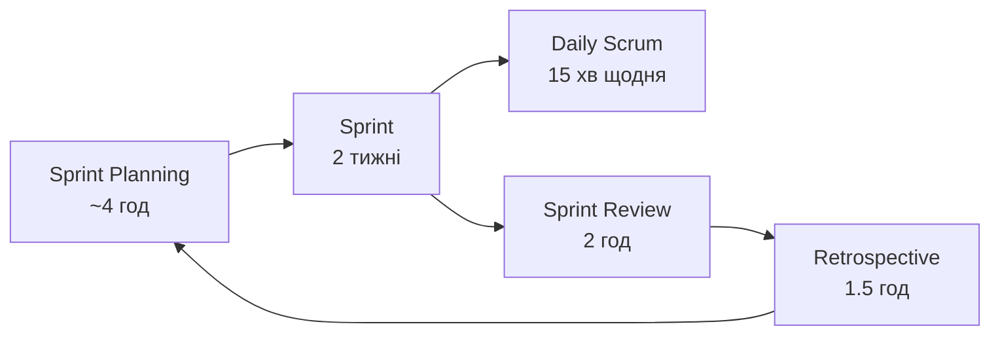
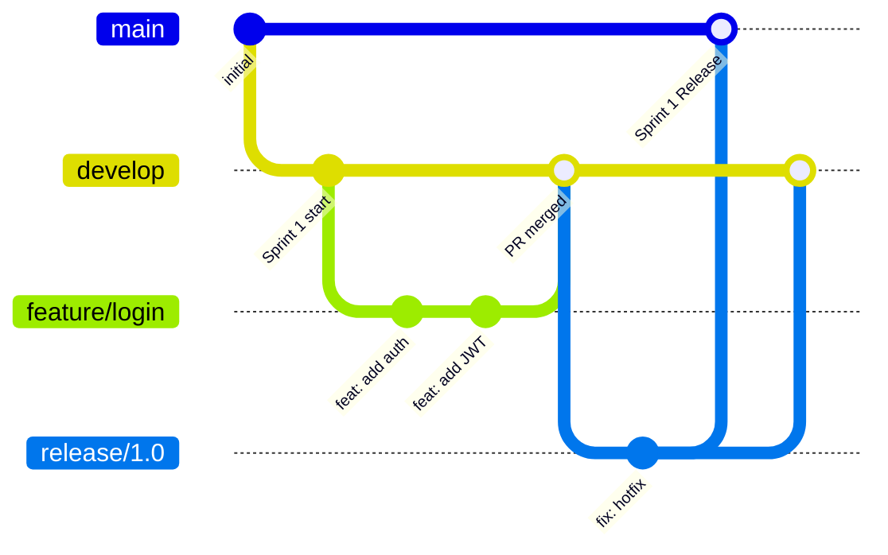

# Лекція 2: Delivery Methodology. Як ми доставляємо цінність?

**Аудиторія:** 2-й курс (Junior Strong)
**Ціль:** Показати, що «написати код» і «доставити цінність клієнту» — це не одне і те саме. Розібрати, як Agile/Scrum/Kanban перетворюють хаотичну розробку на передбачуваний виробничий конвеєр.

> **English version:** [English](en/02_delivery_methodology.md) | **Незнайоме слово?** → [Глосарій курсу](glossary.md)

---

## 1. Відкрита дискусія (Warm-up)

**Контекст:** В Лекції 1 (SDLC) ми дізналися, що між «написав код» і «клієнт побачив фічу» — ціла «фабрика». Сьогодні ми ідемо всередину цієї фабрики.

**Питання до аудиторії:**
Ваша команда отримала список із 50 задач: новий UI, оптимізація бази, безпека, дві нові фічі, які хоче бізнес «ще вчора».

Як ви вирішите:
1. **Що** робити в першу чергу?
2. **Хто** це робить?
3. Як узнати, що ви **рухаєтесь правильно**, а не ходите по колу?

<details markdown="1">
<summary>Розгорнути відповідь та аналіз</summary>

На це питання немає «правильної» відповіді, якщо у вас немає **методології доставки (Delivery Methodology)**.

Без методології команда потрапляє в одну з трьох класичних пасток.

Пастка перша: «Все терміново». Бізнес оголошує всі 50 задач найвищим пріоритетом. Команда паралізована, бо реального пріоритету немає. Нічого не рухається.

Пастка друга: «Найголосніший перемагає». Задачі беруться не за цінністю, а за тим, хто сильніше тисне. Технічний борг накопичується, реальні проблеми ховаються.

Пастка третя: «Почали багато — закінчили нічого». Команда паралельно веде 20 задач. Жодна не закінчена. Клієнт нічого не отримав за 3 місяці.

> Методологія доставки — це не бюрократія. Це система прийняття рішень: що робимо ЗАРАЗ і як ми знаємо, що рухаємося.

</details>

## 2. Проблема: Чому код сам по собі — це не цінність

Уявіть два проєкти за 6 місяців роботи:

**Проєкт А (без методології):**
Команда 4 місяці пише «модуль авторизації», потім 2 місяці «ядро логіки». Через 6 місяців — нічого не готове до показу замовнику.

**Проєкт Б (з Agile):**
Через 2 тижні — базовий MVP. Клієнт дає фідбек: «Нам взагалі не потрібна ця фіча, хочемо інше». Команда розвертає корабель і за наступні 2 тижні робить правильну річ.

### The Cost of Late Feedback (Вартість пізнього зворотного зв'язку)

```
Час виявлення помилки       Вартість виправлення
────────────────────────────────────────────────
На етапі Requirements    →  $1 (виправити текст)
На етапі Design          →  $10 (переробити схему)
На етапі Development     →  $100 (переписати модуль)
На етапі Testing         →  $1,000 (регресія, пошук)
На Production (клієнт)   →  $10,000+ (репутація, гроші)
```

**Agile — це інструмент для отримання зворотного зв'язку якомога раніше.**
Не «бути гнучким». Саме — виявляти помилки дешево.

---

## 3. Agile: Маніфест і чотири цінності

Agile — це не фреймворк і не набір правил. Це **філософія**, сформульована 2001 року групою практиків у [Agile Manifesto](https://agilemanifesto.org/).

### Чотири основні цінності Agile

| Цінуємо більше | Над |
| :--- | :--- |
| **Individuals and interactions** (Люди та взаємодія) | Processes and tools (Процеси та інструменти) |
| **Working software** (Працюючий продукт) | Comprehensive documentation (Повна документація) |
| **Customer collaboration** (Співпраця з клієнтом) | Contract negotiation (Переговори за контрактом) |
| **Responding to change** (Реакція на зміни) | Following a plan (Виконання плану) |

<details markdown="1">
<summary>Інженерний коментар: що це означає на практиці?</summary>

Це не означає «ми не пишемо документацію» або «нам не потрібні процеси». Якщо довелося обирати між живою людиною і написаним регламентом — обирайте живу людину.

Приклад. Регламент каже: зустріч по четвергах о 14:00. Архітектор зараз у Варшаві, питання блокує трьох розробників. Правильне рішення — телефонувати прямо зараз, не чекати четверга.

> «Agile» ≠ «хаос». Agile вимагає дисципліни. Але це self-discipline команди, а не бюрократичний регламент.

</details>

---

## 4. Methodology Battle (Детальніше): Waterfall vs Agile

В Лекції 1 ми познайомилися з цим протистоянням. Тепер підемо глибше — в конкретні ситуації, де кожен підхід або рятує, або вбиває проєкт.

<details markdown="1">
<summary>Кейс 1: Коли Waterfall вбиває стартап</summary>

Стартап отримав інвестиції. Команда 8 місяців пише ТЗ, проєктує базу даних, погоджує UI. Через 8 місяців — ні рядка коду.

Ринок змінився за ці 8 місяців. Конкурент вийшов із схожим MVP за 6 тижнів і забрав першу хвилю користувачів. Waterfall передбачає, що вимоги відомі та стабільні. Для стартапу це хибне припущення.

</details>

<details markdown="1">
<summary>Кейс 2: Коли Agile вбиває систему керування атомним реактором</summary>

DevOps-команда атомної станції вирішила: «Будемо робити спринти по 2 тижні, щоб швидко виправляти баги».

Система управління реактором — сертифікований продукт (IEC 61508). Кожна зміна потребує верифікації та валідації. «Швидкий хотфікс у спринт» без повного ре-тестування — кримінальна відповідальність. Де ціна помилки — людське життя, Waterfall є юридичною та інженерною необхідністю.

</details>

### Вибір методології — це Trade-off

```
Параметр              Waterfall            Agile
────────────────────────────────────────────────
Вимоги                Фіксовані            Змінюються
Feedback loop         Місяці–Роки          Дні–Тижні
Документація          Повна на старті      Just-in-time
Ціна зміни            Висока               Низька
Де застосовується     Медицина, Авіація,   Web, SaaS,
                      Будівництво, Держ.   Startups, GameDev
```

---

## 5. Scrum: механіка доставки

Scrum — найпопулярніший Agile-фреймворк. Він визначає ролі, заходи та артефакти.

### 5.1 Три ролі в Scrum


<details markdown="1">
<summary>1. Product Owner (PO) — «Що будувати?»</summary>

Product Owner — єдина людина, яка вирішує, що потрапляє в Product Backlog і в якому порядку. Він представляє інтереси бізнесу, пріоритезує беклог і не диктує команді, як реалізувати — тільки що потрібно.

Типова помилка: PO намагається задовольнити кожного стейкхолдера і ставить «All High Priority». Команда паралізована, коли все однаково термінове.

PO вирішує, яка задача принесе найбільше ROI (Return on Investment) за найменший час розробки.

</details>

<details markdown="1">
<summary>2. Scrum Master (SM) — «Як нам рухатися краще?»</summary>

Scrum Master — не менеджер і не начальник. Це «слуга-лідер» (Servant Leader): веде церемонії, захищає команду від зовнішніх перешкод, усуває блокери.

Типова помилка: SM перетворюється на «Scrum Police» — формально веде мітинги, але не вирішує реальних проблем.

Головна відмінність від PM: Project Manager відповідає за план і бюджет, Scrum Master — за ефективність процесу.

</details>

<details markdown="1">
<summary>3. Development Team (Dev Team) — «Як реалізувати?»</summary>

Самоорганізована команда 3–9 людей, яка перетворює задачі на готовий продукт. Кросфункціональна: в команді є всі необхідні навички (Backend, Frontend, QA). Команда сама вирішує, як реалізувати задачу, і бере на себе Commitment у спринт.

Collective Ownership: немає «мого» коду. Весь код — командна відповідальність. Якщо розробник захворів, інший продовжує роботу без паузи.

</details>

### 5.2 Заходи Scrum (Ceremonies)



<details markdown="1">
<summary>Sprint Planning — старт ітерації</summary>

Meta — відповісти на два питання: що команда може зробити за цей Sprint (Sprint Goal) і як саме (розбивка на задачі).

Вхід — пріоритезований Product Backlog від PO. Вихід — Sprint Backlog: чіткий список задач на 2 тижні.

Практичне правило: якщо задачу не можна виконати за одну робочу сесію (≤8 год) — розбийте її далі.

</details>

<details markdown="1">
<summary>Daily Scrum — синхронізація команди (15 хвилин)</summary>

Кожен учасник відповідає на три питання: що зробив вчора для Sprint Goal, що зробить сьогодні, що блокує.

Антипатерн: Daily перетворюється на «звіт для менеджера». 15 хвилин розтягуються на годину. Команда починає ненавидіти Daily.

З інженерного погляду Daily — це Distributed System Health Check. Кожен вузол (розробник) репортує стан. Якщо вузол завис, SM усуває блокер.

</details>

<details markdown="1">
<summary>Sprint Review — демо для стейкхолдерів</summary>

Мета — показати живий, робочий продукт реальним стейкхолдерам. Не PowerPoint зі скриншотами. Не «ми майже готові». Тільки те, що відповідає Definition of Done.

Definition of Done (DoD) — список того, що означає «зроблено», узгоджений командою до початку спринтів: код написано та відрев'юено, тести пройдені, задеплоєно на QA, документацію оновлено.

</details>

<details markdown="1">
<summary>Retrospective — вдосконалення процесу</summary>

Мета — покращити процес, а не продукт. Це внутрішня зустріч команди. Три питання: що пройшло добре і треба продовжувати; що гальмувало; які конкретні дії беремо на наступний спринт.

Blameless Culture: ми шукаємо системні проблеми, а не винних. Якщо в продакшн потрапив баг, питання не «Хто написав цей код?», а «Чому наш процес дозволив цьому статися?»

Приклад результату ретро:
* Погано: «Нам потрібно краще тестувати» — розмито, нічого не зміниться.
* Добре: «З наступного спринту кожна задача має мінімум 1 unit-тест. Reviewer перевіряє наявність тесту перед Approve» — конкретно, перевіряється.

</details>

### 5.3 Артефакти Scrum

| Артефакт | Хто власник | Що містить |
| :--- | :--- | :--- |
| **Product Backlog** | Product Owner | Повний список усіх бажаних функцій, відсортований за пріоритетом |
| **Sprint Backlog** | Dev Team | Задачі, які команда взяла на цей Sprint |
| **Increment** | Dev Team | Робочий, протестований продукт після кожного Sprint |

---

## 6. Kanban: потокова модель

Kanban походить із Toyota Production System (1950-ті). Японське слово «看板» означає «візуальна картка».

Відмінність від Scrum проста: Kanban не має спринтів. Задачі рухаються через дошку безперервним потоком.

### 6.1 Kanban Board

```
TODO          IN PROGRESS (WIP Limit: 3)    REVIEW       DONE
─────────     ──────────────────────────     ──────       ──────
[Задача 1]    [Задача 3]                     [Задача 6]   [Задача 7]
[Задача 2]    [Задача 4]                                  [Задача 8]
[Задача 5]    [Задача 9]                                  [Задача 10]
              ← колонка ЗАПОВНЕНА →
              Нову задачу взяти не можна!
```

### 6.2 WIP Limit — серце Kanban

WIP (Work In Progress) Limit — максимальна кількість задач, що одночасно знаходяться в роботі.

<details markdown="1">
<summary>Чому WIP Limit прискорює, а не обмежує?</summary>

**Математична аналогія:** Закон Літтла (Little's Law):

$$\text{Lead Time} = \frac{\text{WIP}}{\text{Throughput}}$$

Де:
* **Lead Time** — час від створення задачі до її завершення.
* **WIP** — кількість задач в роботі.
* **Throughput** — кількість задач, що завершуються за одиницю часу.

**Висновок:** Якщо ми зменшуємо WIP при постійному Throughput — Lead Time скорочується.

**Реальний приклад:** Команда має 10 задач у стовпці «In Progress». Кожна рухається повільно. Vibe-кодер перемикається між задачами = Context Switch Overhead. Якщо WIP Limit = 3, задачі 1-3 завершуються швидше, і тільки потім беремо 4-6.

> **Інженерний принцип:** «Stop Starting, Start Finishing» (Зупини початок, почни завершення).

</details>

### 6.3 Scrum vs Kanban: Коли що обирати?

| Характеристика | Scrum | Kanban |
| :--- | :--- | :--- |
| **Ритм** | Спринти (2 тижні) | Безперервний потік |
| **Зміни** | Не можна під час Спринта | Будь-коли (якщо є місце в WIP) |
| **Ролі** | PO, SM, Dev Team | Немає обов'язкових ролей |
| **Ключова метрика** | Velocity (SP/Sprint) | Lead Time (дні) |
| **Застосування** | Розробка нового продукту | Підтримка, DevOps, Helpdesk |

---

## 7. Метрики доставки

Якщо ви не вимірюєте рух — ви не керуєте ним. Ось метрики, якими команди реально користуються.

### 7.1 Velocity (Scrum)

**Velocity** — кількість Story Points, виконаних командою за Sprint.

```
Sprint 1: 23 SP ─────────────────────────────────
Sprint 2: 31 SP ──────────────────────────────────────
Sprint 3: 27 SP ────────────────────────────────────
Sprint 4: 29 SP ─────────────────────────────────────
                 Середня Velocity ≈ 27.5 SP
```

**Для чого:** Прогнозування. Якщо в backlog залишилось 110 SP, а Velocity = 27.5 → потрібно ще ~4 спринти (2 місяці).

**Антипатерн:** Використовувати Velocity для порівняння між командами. У кожної команди своя calibration Story Points. Порівнювати Velocity різних команд — це як порівнювати температуру по Цельсію та Кельвіну без конвертації.

### 7.2 Lead Time та Cycle Time (Kanban)

```
Задача створена ──────────────────────── Задача завершена
      │                                         │
      └────── Lead Time (повний час) ───────────┘
                   │              │
              Очікування     Cycle Time
               (черга)       (активна робота)
```

**Lead Time** = час від створення задачі до її завершення (з очікуванням).
**Cycle Time** = час активної роботи над задачею.

**Практичне застосування:** Якщо Lead Time = 14 днів, а Cycle Time = 2 дні — 12 днів задача просто **чекає**. Де bottleneck? Потрібно перевірити WIP Limit кожної колонки.

### 7.3 Burndown Chart

<details markdown="1">
<summary>Як читати Burndown Chart</summary>

```
SP  ▲
40  │\
35  │ \  ← ідеальна лінія
30  │  \
25  │   \  ← реальна лінія (вище = ми відстаємо)
20  │    ●
15  │     ●
10  │      ●
 5  │       \
 0  └─────────────→ Дні Спринта
    1  3  5  7  9
```

* **Ідеальна лінія** (пряма): рівномірне завершення задач.
* **Реальна лінія вище ідеальної**: ми відстаємо, Sprint Goal під загрозою.
* **Пласка реальна лінія** (не спадає): задачі не завершуються — щось блокує.

</details>

---

## 8. Delivery в реальному Enterprise: Git Flow

Методологія — це не тільки Jira і мітинги. Вона пронизує технічний процес аж до роботи з Git.

### 8.1 Git Flow та Спринт



**Кожен Sprint = один Release** (або Release Candidate):
* Фічі розробляються у `feature/` гілках.
* Гілки вливаються в `develop` через Pull Request (Code Review).
* Наприкінці Спринта — `release/` гілка, тестування, деплой.

### 8.2 Definition of Done (DoD)

DoD — контракт якості, узгоджений командою. «Код написано» — не DoD.

| Перевірка | Хто відповідає | Автоматизовано? |
| :--- | :--- | :--- |
| Код скомпільовано без помилок | Dev | ✅ CI |
| Unit тести пройдені (>80% coverage) | Dev | ✅ CI |
| Code Review виконано (min 1 Approve) | Dev | ✅ GitHub PR Rules |
| SonarQube Quality Gate пройдено | Dev | ✅ CI |
| Задеплоєно на QA-середовище | DevOps | ✅ CD |
| QA виконало smoke-тест | QA | ❌ Вручну |
| PO прийняв задачу | PO | ❌ Вручну |

---

## 9. Delivery як розподілена система

<details markdown="1">
<summary>Математична аналогія для розробників</summary>

Уявіть Scrum-команду як розподілену систему:

* Кожен розробник = вузол (Node) у кластері.
* Daily Scrum = Health Check.
* WIP Limit = Queue Depth Limit.
* Retrospective = Post-Mortem із коригуванням конфігурації.
* Velocity = Throughput кластера.

Закон Конвея (Conway's Law):
> «Організації проєктують системи, які копіюють структуру їхніх комунікацій.»

Якщо команда розбита на «Backend-відділ» і «Frontend-відділ» — система матиме жорстку межу між Backend і Frontend з усіма проблемами інтеграції. Agile-команди кросфункціональні саме тому, щоб цей закон працював на нас.

</details>

---

## 10. Екзаменаційний пул (Exam Questions)

Це реальні питання, які прозвучать на захисті.

**Питання 1: У чому принципова різниця між Scrum і Kanban? Наведіть приклад, де ви б обрали кожен з них.**

<details markdown="1">
<summary>Еталонна відповідь</summary>

Scrum — це ітерації фіксованої довжини. Scope спринта не змінюється. Підходить для розробки нового продукту, де потрібна чітка мета і прогноз.

Kanban — безперервний потік. Задачі додаються і виконуються без фіксованих циклів. Підходить для Support/Ops-команд, де задачі нерівномірні та непередбачувані.

Приклад: нова фіча — Scrum Sprint, виправлення Production-bugів — Kanban.

</details>

**Питання 2: Що таке WIP Limit і чому він скорочує Lead Time?**

<details markdown="1">
<summary>Еталонна відповідь</summary>

WIP Limit — максимальна кількість задач, що одночасно знаходяться в роботі в конкретній колонці.

За Законом Літтла: `Lead Time = WIP / Throughput`. При фіксованому Throughput зменшення WIP безпосередньо зменшує Lead Time.

Окрім математики є проста причина: зменшення WIP скорочує Context Switching. Розробник, який веде 5 задач одночасно і «ефективніший» ніж той, хто веде 1 — це міф. Мозок (і CPU) найефективніший при послідовному виконанні.

</details>

**Питання 3: Що таке Definition of Done (DoD) і навіщо він потрібен?**

<details markdown="1">
<summary>Еталонна відповідь</summary>

Definition of Done — список критеріїв, яким повинна відповідати задача, щоб вважатися завершеною. Це контракт якості всередині команди.

Без DoD виникають ситуації: Dev каже «готово» (код написано), QA каже «не готово» (немає тестів), PO каже «не готово» (на QA-середовищі не задеплоєно). DoD знімає цю неоднозначність. Якщо задача не пройшла всі критерії DoD — вона не йде в Sprint Review.

</details>

**Питання 4: Що таке Velocity і чому її не можна використовувати для порівняння команд?**

<details markdown="1">
<summary>Еталонна відповідь</summary>

Velocity — кількість Story Points, що команда завершує за Sprint. Використовується для прогнозування: якщо Velocity = 30 SP/Sprint, а в backlog залишилось 90 SP — потрібно ще 3 спринти.

Порівнювати Velocity між командами не можна, бо Story Points — відносна міра. Команда А може оцінити «Зробити авторизацію» у 5 SP, Команда Б — у 13 SP. Velocity 50 у Команди А не означає, що вона вдвічі продуктивніша за Команду Б з Velocity 25.

</details>

**Питання 5: Що перевіряє Retrospective і чим вона відрізняється від Sprint Review?**

<details markdown="1">
<summary>Еталонна відповідь</summary>

Sprint Review — огляд продукту. Показуємо стейкхолдерам, що побудували. Ціль — зворотний зв'язок від бізнесу.

Retrospective — огляд процесу. Внутрішня зустріч команди. Ціль — покращити те, як ми працюємо.

Приклади: Sprint Review: «Клієнт дав фідбек — синя кнопка краща за зелену». Retrospective: «Ми 3 дні чекали на ревью PR — у наступному спринті лімітуємо час очікування до 4 годин».

</details>

---

**[⬅️ Лекція 1: SDLC](01_sdlc.md)** | **[Лекція 3: Definition of Requirements ➡️](03_requirements.md)**

**[⬅️ Повернутися до головного меню курсу](index.md)**
