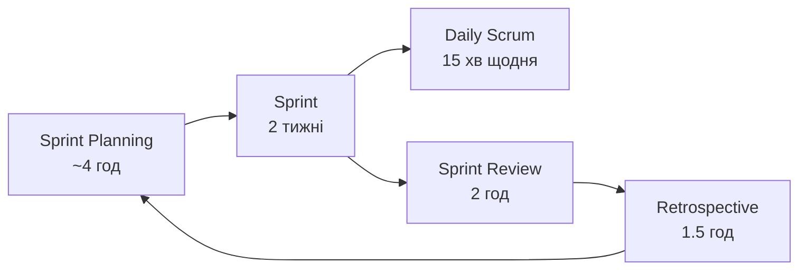
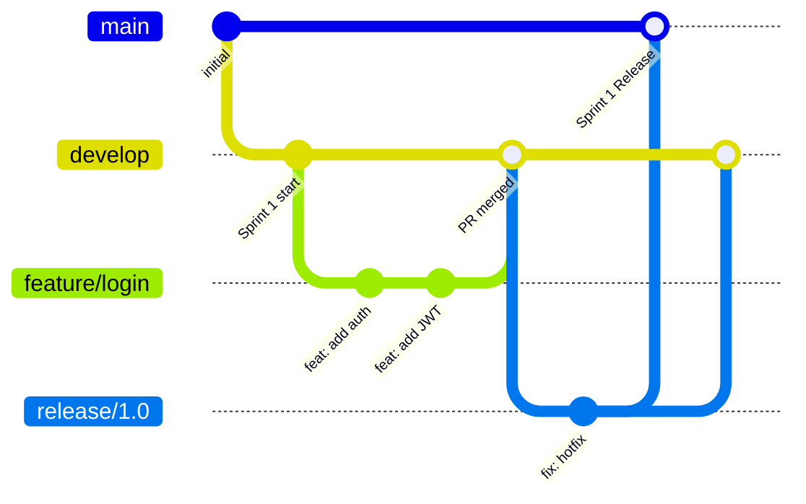

# Лекція 2: Delivery Methodology. Як ми доставляємо цінність?

**Аудиторія:** 2-й курс (Junior Strong)
**Ціль:** Показати, що «написати код» і «доставити цінність клієнту» — це не одне і те саме. Розібрати, як Agile/Scrum/Kanban перетворюють хаотичну розробку на передбачуваний виробничий конвеєр.

> **English version:** [English](en/02_delivery_methodology.md) | **Незнайоме слово?** → [Глосарій курсу](glossary.md)

---

## 🔥 Реальна історія: $600 мільйонів та сайт, який впав у перший день

**1 жовтня 2013 року.** Президент США Барак Обама оголосив запуск [Healthcare.gov](https://healthcare.gov) — онлайн-маркетплейсу, де 30+ мільйонів американців без страховки могли вперше придбати медичну страховку. Проєкт тривав **3,5 роки**, коштував платникам податків близько **$600 мільйонів**.

О 8:00 ранку сайт відкрився. О 8:07 він ліг.

За перший тиждень зареєструватись змогли лише **6 (шість) людей**. Через місяць — менше 27 000 з 7 мільйонів очікуваних.

**Що пішло не так?**

Пізніше з'ясувалося, що проблема була не тільки технічна:

- **Waterfall без ітерацій.** Вимоги збирались роками. Жодного раннього тестування з реальним навантаженням. Перше «повноцінне» тестування — за два тижні до релізу.
- **55 підрядників.** Кожен писав свій шматок, ніхто не відповідав за ціле. Інтеграція відбулась у самому кінці.
- **Страх ескалювати.** Розробники знали про проблеми за місяці, але ніхто не наважився сказати: «Ми не готові». Дедлайн — публічна обіцянка президента.
- **Жодного DoD.** «Готово» означало «написано». Не «протестовано під навантаженням 50 000 одночасних користувачів».

Через 6 тижнів паніки уряд залучив окрему кризову команду — **«Tech Surge»**. 60 інженерів з Google, Red Hat, Oracle. Вони **за 2 місяці** переписали критичні частини системи, запустили Agile-процес із тижневими ітераціями, щоденними check-in'ами і чіткими метриками.

Сайт запрацював.

> 💡 Це не провал технологій. Це провал **методології доставки**. Якби вони мали 6-тижневий зворотній зв'язок від реальних користувачів замість 3,5 років теоретичного планування — ціна помилки була б у 1000 разів менша.

---

## 1. Відкрита дискусія (Warm-up)

**Контекст:** В Лекції 1 (SDLC) ми дізналися, що між «написав код» і «клієнт побачив фічу» — ціла «фабрика». Сьогодні ми ідемо всередину цієї фабрики.

**Питання до аудиторії:**
Ваша команда отримала список із 50 задач: новий UI, оптимізація бази, безпека, дві нові фічі, які хоче бізнес «ще вчора».

Як ви вирішите:
1. **Що** робити в першу чергу?
2. **Хто** це робить?
3. Як дізнатися, що ви **рухаєтесь правильно**, а не ходите по колу?

<details markdown="1">
<summary>Розгорнути відповідь та аналіз</summary>

На це питання немає «правильної» відповіді, якщо у вас немає **методології доставки (Delivery Methodology)**.

Без методології команда потрапляє в одну з трьох класичних пасток.

Пастка перша: «Все терміново». Бізнес оголошує всі 50 задач найвищим пріоритетом. Команда паралізована, бо реального пріоритету немає. Нічого не рухається.

Пастка друга: «Найголосніший перемагає». Задачі беруться не за цінністю, а за тим, хто сильніше тисне. Технічний борг накопичується, реальні проблеми ховаються.

Пастка третя: «Почали багато — закінчили нічого». Команда паралельно веде 20 задач. Жодна не закінчена. Клієнт нічого не отримав за 3 місяці.

> Методологія доставки — це не бюрократія. Це система прийняття рішень: що робимо ЗАРАЗ і як ми знаємо, що рухаємося.

</details>

---

## 1а. Питання до аудиторії: $1 000 000 та 30 днів

> 🎯 **Ситуація:** Вам дають **$1 000 000** і ставлять задачу:
> побудувати завод з виробництва пластмас у м. Одеса за **30 днів**.
>
> **Ваші дії?**

Перш ніж читати далі — спробуйте відповісти самостійно.

<details markdown="1">
<summary>Розгорнути аналіз та мораль</summary>

**Чому це питання важливіше за правильну відповідь?**

Правильної відповіді немає — і в цьому весь сенс.

За 30 днів побудувати повноцінний завод з нуля фізично неможливо: дозволи в Україні займають місяці, будівництво — роки, монтаж промислового обладнання — від 3 місяців. $1M — замало навіть на фундамент сучасного виробництва.

**Але завдання менеджера — не сказати «неможливо».**

Ось що реально зробить досвідчений керівник:

| Дія | Чому це важливо |
| :--- | :--- |
| **Уточнить вимоги** | «Завод» — це 10 000 м² чи одна лінія? Яка продукція? Яка потужність? | 
| **Розбере обмеження** | Що з дозволами? Є земля/будівля? Чи можна орендувати готове приміщення? |
| **Знайде альтернативу** | Оренда існуючого виробництва + модернізація під задачу — це реально за 30 днів |
| **Узгодить scope** | «За $1M та 30 днів — ось що реально. Якщо потрібно більше — збільшуємо бюджет або час» |
| **Зберере команду** | Юрист, технолог-хімік, підрядник, постачальник обладнання — паралельно, з першого дня |

**Мораль:**

> 💡 **За що платять керівникам — не за відповіді, а за правильні питання.**
> Менеджер — це не людина, яка знає все. Це людина, яка в умовах невизначеності, обмежених ресурсів і жорстких дедлайнів **знаходить рішення, де інші бачать тупик**.

Розробники часто думають: «Менеджер нічого не кодить — за що йому платять?»

Відповідь у цьому прикладі: менеджер — це той, хто перетворює хаотичне «побудуй завод за 30 днів» на конкретний реалістичний план. Саме це і є Delivery: не магія, а **управління невизначеністю через правильний процес**.

І саме тому існують delivery-методології — щоб у кожному проєкті хтось ставив ці питання системно, а не чекав, поки хаос сам себе організує.

</details>

## 2. Проблема: Чому код сам по собі — це не цінність

### Історичний екскурс: Еволюція Project Management

Як ми прийшли до сучасних методологій? Розвиток управління проєктами пройшов кілька ключових етапів:

*   **До 1958 року:** Від ремісничої системи до людських відносин (Craft system to human relations).
*   **1960-х:** Планування та координація активностей (Scheduling, Coordinating activities).
*   **1970-х:** Командна робота, співпраця між учасниками, визначення ролей (Teamwork, Cooperation between participants, role definition).
*   **1980-х:** Зменшення невизначеності, прийняття стабільних рішень (Uncertainty reduction, Making stable decisions).
*   **1990-х:** Одночасність, швидкість реагування, віртуальна координація (Simultaneity, Responsiveness, Virtual coordination).
*   **2000-х:** Адаптація, глобалізація, віртуальна співпраця (Adaptation, Globalization, Virtual collaboration).

Саме постійне прискорення змін та зростання невизначеності змусили індустрію шукати нові підходи, переходячи від жорсткого планування до адаптивності.

### Сучасні методології впровадження (Implementation Methodologies - NOW)

Сьогодні різні компанії використовують різні методології впровадження залежно від вимог проєкту, команди та клієнта:

*   **Waterfall Methodology (Каскадна методологія):**
    *   Великі програми трансформації (Large transformation programs).
    *   Складні інтеграційні середовища (Complex Integration Environments).
    *   Кілька вендорів, системних інтеграторів (SI) та IT-відділів, яким необхідна синхронізація та координація.
*   **Agile Methodology (Scrum, XP, Kanban):**
    *   Швидке створення прототипів та постачання ключових можливостей (Rapid prototyping and delivery).
    *   Підтримує нечіткі вимоги (Supports unclear requirements).
    *   Менші за розміром команди (Smaller team sizes).
*   **Iterative/Phased Methodology (Ітеративна/Фазова методологія):**
    *   Так званий «міні-вотерфол» (mini-waterfall).
    *   Стратегія швидких перемог (Quick win strategy) із фазовою міграцією продуктів та/або даних.
    *   Поступове згортання застарілих (legacy) застосунків.

Уявіть два проєкти за 6 місяців роботи:

**Проєкт А (без методології):**
Команда 4 місяці пише «модуль авторизації», потім 2 місяці «ядро логіки». Через 6 місяців — нічого не готове до показу замовнику.

**Проєкт Б (з Agile):**
Через 2 тижні — базовий MVP. Клієнт дає фідбек: «Нам взагалі не потрібна ця фіча, хочемо інше». Команда розвертає корабель і за наступні 2 тижні робить правильну річ.

### The Cost of Late Feedback (Вартість пізнього зворотного зв'язку)

```
Час виявлення помилки       Вартість виправлення
────────────────────────────────────────────────
На етапі Requirements    →  $1 (виправити текст)
На етапі Design          →  $10 (переробити схему)
На етапі Development     →  $100 (переписати модуль)
На етапі Testing         →  $1,000 (регресія, пошук)
На Production (клієнт)   →  $10,000+ (репутація, гроші)
```

**Agile — це інструмент для отримання зворотного зв'язку якомога раніше.**
Не «бути гнучким». Саме — виявляти помилки дешево.

---

## 3. Agile: Маніфест і чотири цінності

Agile — це не фреймворк і не набір правил. Це **філософія**, сформульована 2001 року групою практиків у [Agile Manifesto](https://agilemanifesto.org/).

### Чотири основні цінності Agile

| Цінуємо більше | Над |
| :--- | :--- |
| **Individuals and interactions** (Люди та взаємодія) | Processes and tools (Процеси та інструменти) |
| **Working software** (Працюючий продукт) | Comprehensive documentation (Повна документація) |
| **Customer collaboration** (Співпраця з клієнтом) | Contract negotiation (Переговори за контрактом) |
| **Responding to change** (Реакція на зміни) | Following a plan (Виконання плану) |

<details markdown="1">
<summary>Інженерний коментар: що це означає на практиці?</summary>

Це не означає «ми не пишемо документацію» або «нам не потрібні процеси». Якщо довелося обирати між живою людиною і написаним регламентом — обирайте живу людину.

Приклад. Регламент каже: зустріч по четвергах о 14:00. Архітектор зараз у Варшаві, питання блокує трьох розробників. Правильне рішення — телефонувати прямо зараз, не чекати четверга.

> «Agile» ≠ «хаос». Agile вимагає дисципліни. Але це self-discipline команди, а не бюрократичний регламент.

</details>

---

## 4. Methodology Battle (Детальніше): Waterfall vs Agile

В Лекції 1 ми познайомилися з цим протистоянням. Тепер підемо глибше — в конкретні ситуації, де кожен підхід або рятує, або вбиває проєкт.

<details markdown="1">
<summary>📁 Реальний кейс: ФБР витратило $170 млн — і викинуло все в смітник</summary>

**2001 рік.** Після терактів 11 вересня Конгрес США виділив ФБР $170 мільйонів на систему Virtual Case File (VCF) — єдину цифрову базу для слідчих, яка мала замінити мільйони паперових справ.

Обрали класичний **Waterfall**: спочатку зібрати всі вимоги, потім проєктувати, потім писати код, потім здавати.

**Що пішло не так:**

Вимоги збирались прямо в розпал реорганізації ФБР після 9/11. За 3 роки розробки Бюро змінило 400 000 (чотириста тисяч!) вимог. Водоспаду це не передбачено — він йшов далі за старими вимогами.

**2005 рік.** Директор ФБР Роберт Мюллер оголосив:

> *«Ми припиняємо Virtual Case File. Система непридатна для використання.»*

Жоден агент ФБР так і не відкрив VCF у бойових умовах. Всі $170 мільйонів — списані.

**Чому Waterfall тут провалився:** Він вимагає, що вимоги відомі та стабільні на старті. Але у ФБР після 9/11 організація перебудовувалась у реальному часі. Система, яку проєктували у 2001-му, не відповідала ФБР зразка 2005 року. Жоден Waterfall не може «повернутися назад» і переробити фундамент без втрати всього.

> 💡 **Висновок:** Waterfall — чудовий інструмент там, де вимоги стабільні: будівництво мосту, запуск ракети, медичне обладнання. Там, де реальність змінюється швидше ніж рік — він стає пасткою.

</details>

<details markdown="1">
<summary>🎵 Реальний кейс: Spotify переписав правила того, як 2000 людей роблять Agile</summary>

**2008 рік.** Spotify — 30 розробників, один офіс, усі сидять разом. Scrum працює чудово.

**2012 рік.** Spotify — 300+ розробників, 4 офіси в різних країнах. Класичний Scrum почав тріщати: мітинги ставали величезними, команди заважали одна одній, рішення зависали в черзі узгодження.

**Проблема:** Як масштабувати Agile, коли компанія зростає в 10 разів?

Замість того щоб найняти більше Scrum Masters і збільшити спринти, Spotify **вигадав власну модель**:

| Рівень | Що це | Розмір |
| :--- | :--- | :--- |
| **Squad** (Загін) | Автономна міні-команда, як маленький стартап. Повна відповідальність за свій продукт. | 6–12 осіб |
| **Tribe** (Плем'я) | Колекція Squads, що працюють в одній зоні. | до 100 осіб |
| **Chapter** (Розділ) | Горизонтальна спільнота фахівців однієї спеціальності (усі iOS-розробники компанії). | — |
| **Guild** (Гільдія) | Неформальна спільнота за інтересами (усі, хто любить безпеку або тестування). | — |

**Ключова ідея — Squad автономія:** Squad не чекає дозволу від центру, щоб задеплоїти. Вони самі вирішують *що* будувати і *як* будувати — у межах своєї зони. Це «Agile в масштабі».

**Результат:** Spotify доставляє фічі незалежно в десятках команд паралельно, не маючи єдиного «release train». У 2020 році компанія виросла до 7000+ співробітників, зберігши швидкість маленького стартапу.

> 💡 **Висновок:** Agile — це не тільки Jira та спринти. Це мислення, яке можна масштабувати. Spotify показав, що навіть 2000+ розробників можуть працювати без класичної ієрархії «начальник підписав → беремо фічу».

</details>

<details markdown="1">
<summary>🏭 Реальний кейс: General Electric — коли навіть Spotify не рятує від хаосу 5000 розробників</summary>

**2015 рік.** General Electric — одна з найбільших промислових компаній у світі — оголосила амбіційний план: стати «цифровою індустріальною компанією». Вони будували **Predix** — хмарну IoT-платформу для авіадвигунів, турбін і медичного обладнання.

Масштаб: **5 000+ розробників**, 100+ команд, офіси в США, Індії, Угорщині.

Вони спробували Spotify-модель з автономними Squad-командами. Результат:
- Команди робили несумісні API.
- Одна команда будувала фічу, яку паралельно будувала інша.
- Деплой однієї частини системи ламав три інші.
- Не було синхронізованого «що ми всі доставимо клієнту за квартал?»

**Рішення — SAFe (Scaled Agile Framework).**

SAFe додав рівень, якого не вистачало: **Agile Release Train (ART)** — «потяг», у якому 50–125 людей із різних команд рухаються в одному ритмі. Раз на квартал — **PI Planning** (Program Increment Planning): дводенна сесія, де ВСІ команди разом планують, узгоджують залежності між собою і визначають єдину мету на 3 місяці.

**Що змінилось після SAFe:**

- Час виходу нової фічі на ринок скоротився з **18 місяців до 3-4 місяців**.
- Кількість «несподіваних» конфліктів між командами при деплої впала на 60%.
- Уперше за роки всі 100+ команд знали відповідь на запитання: *«Що ми здаємо клієнту в кінці цього кварталу?»*

> 💡 **Висновок:** SAFe — це не «важкий Waterfall замість Agile». Це координаційний шар *над* Agile-командами. Він потрібен там, де одного «Squad автономія» вже не достатньо, бо сотні команд мають рухатися в одному напрямі. Ціна SAFe — бюрократія. Виграш — передбачуваність у масштабі.

</details>


### Вибір методології — це Trade-off

```
Параметр              Waterfall            Agile
────────────────────────────────────────────────
Вимоги                Фіксовані            Змінюються
Feedback loop         Місяці–Роки          Дні–Тижні
Документація          Повна на старті      Just-in-time
Ціна зміни            Висока               Низька
Де застосовується     Медицина, Авіація,   Web, SaaS,
                      Будівництво, Держ.   Startups, GameDev
```

---

## 5. Scrum: механіка доставки

Scrum — найпопулярніший Agile-фреймворк. Він визначає ролі, заходи та артефакти.

### 5.1 Три ролі в Scrum


<details markdown="1">
<summary>1. Product Owner (PO) — «Що будувати?»</summary>

Product Owner — єдина людина, яка вирішує, що потрапляє в Product Backlog і в якому порядку. Він представляє інтереси бізнесу, пріоритезує беклог і не диктує команді, як реалізувати — тільки що потрібно.

Типова помилка: PO намагається задовольнити кожного стейкхолдера і ставить «All High Priority». Команда паралізована, коли все однаково термінове.

PO вирішує, яка задача принесе найбільше ROI (Return on Investment) за найменший час розробки.

</details>

<details markdown="1">
<summary>2. Scrum Master (SM) — «Як нам рухатися краще?»</summary>

Scrum Master — не менеджер і не начальник. Це «слуга-лідер» (Servant Leader): веде церемонії, захищає команду від зовнішніх перешкод, усуває блокери.

Типова помилка: SM перетворюється на «Scrum Police» — формально веде мітинги, але не вирішує реальних проблем.

Головна відмінність від PM: Project Manager відповідає за план і бюджет, Scrum Master — за ефективність процесу.

</details>

<details markdown="1">
<summary>3. Development Team (Dev Team) — «Як реалізувати?»</summary>

Самоорганізована команда 3–9 людей, яка перетворює задачі на готовий продукт. Кросфункціональна: в команді є всі необхідні навички (Backend, Frontend, QA). Команда сама вирішує, як реалізувати задачу, і бере на себе Commitment у спринт.

Collective Ownership: немає «мого» коду. Весь код — командна відповідальність. Якщо розробник захворів, інший продовжує роботу без паузи.

</details>

### 5.2 Заходи Scrum (Ceremonies)


```mermaid
graph LR
    A[Sprint Planning\n~4 год] --> B[Sprint\n2 тижні]
    B --> C[Daily Scrum\n15 хв щодня]
    B --> D[Sprint Review\n2 год]
    D --> E[Retrospective\n1.5 год]
    E --> A
```

<details markdown="1">
<summary>Product Backlog Refinement (Sprint Grooming) — підготовка до Planning</summary>

У **Scrum Guide** це називається **Product Backlog Refinement**; у командах ту саму діяльність часто називають **Sprint Grooming** або **Backlog Grooming**. Це **не окрема обов’язкова церемонія з фіксованим слотом**, а **регулярна активність** протягом спринту: уточнення User Stories і **Acceptance Criteria**, оцінка в Story Points, дроблення завеликих елементів, з’ясування залежностей і ризиків разом із PO.

**Навіщо:** щоб на **Sprint Planning** зверху backlog був уже **зрозумілий і придатний для відбору**, а не вперше «відкривався» зі списку в залі. Refinement відповідає на питання *«чи ми розуміємо задачу і скільки вона коштує в SP?»*; Planning — на *«що саме беремо в цей спринт і яка Sprint Goal?»*

Практика на курсі (воркшоп VARTA): [Sprint Grooming і Sprint Planning](workshop/plan.md#grooming-and-planning), симуляція церемоній — [практикум Scrum](workshop_02_agile.md).

</details>

<details markdown="1">
<summary>Sprint Planning — старт ітерації</summary>

Meta — відповісти на два питання: що команда може зробити за цей Sprint (Sprint Goal) і як саме (розбивка на задачі).

**Вхід** — пріоритезований Product Backlog від PO; топ-елементи бажано попередньо **пройти Backlog Refinement** (див. блок вище), інакше зустріч розтягується на уточнення формулювань замість зобов’язання на спринт. **Вихід** — Sprint Backlog (чіткий список задач на 2 тижні) і узгоджена **Sprint Goal**.

Практичне правило: якщо задачу не можна виконати за одну робочу сесію (≤8 год) — розбийте її далі.

</details>

<details markdown="1">
<summary>Daily Scrum — синхронізація команди (15 хвилин)</summary>

Кожен учасник відповідає на три питання: що зробив вчора для Sprint Goal, що зробить сьогодні, що блокує.

Антипатерн: Daily перетворюється на «звіт для менеджера». 15 хвилин розтягуються на годину. Команда починає ненавидіти Daily.

З інженерного погляду Daily — це Distributed System Health Check. Кожен вузол (розробник) репортує стан. Якщо вузол завис, SM усуває блокер.

</details>

<details markdown="1">
<summary>Sprint Review — демо для стейкхолдерів</summary>

Мета — показати живий, робочий продукт реальним стейкхолдерам. Не PowerPoint зі скриншотами. Не «ми майже готові». Тільки те, що відповідає Definition of Done.

Definition of Done (DoD) — список того, що означає «зроблено», узгоджений командою до початку спринтів: код написано та відрев'юено, тести пройдені, задеплоєно на QA, документацію оновлено.

</details>

<details markdown="1">
<summary>Retrospective — вдосконалення процесу</summary>

Мета — покращити процес, а не продукт. Це внутрішня зустріч команди. Три питання: що пройшло добре і треба продовжувати; що гальмувало; які конкретні дії беремо на наступний спринт.

Blameless Culture: ми шукаємо системні проблеми, а не винних. Якщо в продакшн потрапив баг, питання не «Хто написав цей код?», а «Чому наш процес дозволив цьому статися?»

Приклад результату ретро:
* Погано: «Нам потрібно краще тестувати» — розмито, нічого не зміниться.
* Добре: «З наступного спринту кожна задача має мінімум 1 unit-тест. Reviewer перевіряє наявність тесту перед Approve» — конкретно, перевіряється.

</details>

<details markdown="1">
<summary>😤 Реальний кейс: Коли Scrum-церемонії перетворились на тортури — і команда збунтувалась</summary>

**2012 рік. Чикаго. Середня product-компанія, ~40 розробників.**

Команда прийшла до Agile з великим ентузіазмом. Найняли Scrum Master'а, купили Jira, налаштували 2-тижневі спринти. Перші місяці — все чудово.

Через рік картина змінилась. Ось типовий понеділок розробника:

```
09:00 — Daily Standup (15 хв → по факту 45 хв, бо PM питає статус кожної задачі)
10:00 — Backlog Refinement (2 год — оцінюємо Story Points для задач, яких ніхто не бачив)
11:00 — Нарешті сідаємо писати код
12:00 — Обід
13:00 — Технічна нарада (не заплановано, «термінова»)
14:30 — Код
15:30 — Один на один з TL
16:00 — Sprint Planning (почали два тижні тому, треба доузгодити)
17:30 — Всі йдуть додому
```

Реальний код — **2-3 години** на день. Все інше — церемонії.

З'явився термін: **«Dark Scrum»** — поняття, яке ввів Рон Джеффріс (один зі співавторів Agile Manifesto):
> *«Scrum у неправильних руках перетворюється на знаряддя тиску на розробників, а не на інструмент їхнього звільнення.»*

**Що зробила компанія Basecamp (37signals):**

Джейсон Фрід і Девід Хайнемайер Хансон (автори Ruby on Rails і фреймворку Bootstrap) **викинули Scrum повністю**. У своїй книзі «It Doesn't Have to Be Crazy at Work» вони описали власну методологію — **Shape Up**:

- Замість 2-тижневих спринтів — **6-тижневі цикли**.
- Жодних щоденних standup'ів. Жодного Backlog Grooming.
- Замість Jira — «pitch»: одна сторінка з описом проблеми та грубим рішенням.
- Команда з 2-3 людей **повністю автономна** на ці 6 тижнів. Ніхто не заходить і не питає статус.
- Після 6 тижнів — «cooldown»: 2 тижні на технічний борг і відпочинок.

**Результат:** Basecamp (продукт) вони підтримують командою з **~50 людей**, маючи мільйони активних користувачів і нульовий зовнішній венчурний капітал.

> 💡 **Висновок:** Церемонії Scrum — це **інструмент, а не мета**. Daily займає 15 хвилин тільки якщо це справжній health-check команди, а не звіт для менеджера. Якщо ви витрачаєте більше часу на розмови про роботу, ніж на саму роботу — щось пішло не так.

</details>

### 5.3 Артефакти Scrum

| Артефакт | Хто власник | Що містить |
| :--- | :--- | :--- |
| **Product Backlog** | Product Owner | Повний список усіх бажаних функцій, відсортований за пріоритетом |
| **Sprint Backlog** | Dev Team | Задачі, які команда взяла на цей Sprint |
| **Increment** | Dev Team | Робочий, протестований продукт після кожного Sprint |

---

## 6. Kanban: потокова модель

Kanban походить із Toyota Production System (1950-ті). Японське слово «看板» означає «візуальна картка».

Відмінність від Scrum проста: Kanban не має спринтів. Задачі рухаються через дошку безперервним потоком.

### 6.1 Kanban Board

```
TODO          IN PROGRESS (WIP Limit: 3)    REVIEW       DONE
─────────     ──────────────────────────     ──────       ──────
[Задача 1]    [Задача 3]                     [Задача 6]   [Задача 7]
[Задача 2]    [Задача 4]                                  [Задача 8]
[Задача 5]    [Задача 9]                                  [Задача 10]
              ← колонка ЗАПОВНЕНА →
              Нову задачу взяти не можна!
```

### 6.2 WIP Limit — серце Kanban

WIP (Work In Progress) Limit — максимальна кількість задач, що одночасно знаходяться в роботі.

<details markdown="1">
<summary>Чому WIP Limit прискорює, а не обмежує?</summary>

**Математична аналогія:** Закон Літтла (Little's Law):

$$\text{Lead Time} = \frac{\text{WIP}}{\text{Throughput}}$$

Де:
* **Lead Time** — час від створення задачі до її завершення.
* **WIP** — кількість задач в роботі.
* **Throughput** — кількість задач, що завершуються за одиницю часу.

**Висновок:** Якщо ми зменшуємо WIP при постійному Throughput — Lead Time скорочується.

**Реальний приклад:** Команда має 10 задач у стовпці «In Progress». Кожна рухається повільно. Vibe-кодер перемикається між задачами = Context Switch Overhead. Якщо WIP Limit = 3, задачі 1-3 завершуються швидше, і тільки потім беремо 4-6.

> **Інженерний принцип:** «Stop Starting, Start Finishing» (Зупини початок, почни завершення).

</details>

### 6.3 Scrum vs Kanban: Коли що обирати?

| Характеристика | Scrum | Kanban |
| :--- | :--- | :--- |
| **Ритм** | Спринти (2 тижні) | Безперервний потік |
| **Зміни** | Не можна під час Спринта | Будь-коли (якщо є місце в WIP) |
| **Ролі** | PO, SM, Dev Team | Немає обов'язкових ролей |
| **Ключова метрика** | Velocity (SP/Sprint) | Lead Time (дні) |
| **Застосування** | Розробка нового продукту | Підтримка, DevOps, Helpdesk |

---

## 7. Метрики доставки

Цей розділ було винесено в окрему лекцію через його об'ємність та важливість. 
👉 **Перейти до: [Лекція 2a: Метрики доставки](02a_metrics.md)** 

---

## 8. Delivery в реальному Enterprise: Git Flow

Методологія — це не тільки Jira і мітинги. Вона пронизує технічний процес аж до роботи з Git.

### 8.1 Git Flow та Спринт


```mermaid
gitGraph
   commit id: "initial"
   branch develop
   checkout develop
   commit id: "Sprint 1 start"
   branch feature/login
   checkout feature/login
   commit id: "feat: add auth"
   commit id: "feat: add JWT"
   checkout develop
   merge feature/login id: "PR merged"
   branch release/1.0
   checkout release/1.0
   commit id: "fix: hotfix"
   checkout main
   merge release/1.0 id: "Sprint 1 Release"
   checkout develop
   merge release/1.0
```

**Кожен Sprint = один Release** (або Release Candidate):
* Фічі розробляються у `feature/` гілках.
* Гілки вливаються в `develop` через Pull Request (Code Review).
* Наприкінці Спринта — `release/` гілка, тестування, деплой.

### 8.2 Definition of Done (DoD)

DoD — контракт якості, узгоджений командою. «Код написано» — не DoD.

<details markdown="1">
<summary>Що таке DoD і навіщо він потрібен?</summary>

**DoD = список критеріїв**, яким повинна відповідати задача, щоб вважатися завершеною.

**Навіщо він потрібен?**

Без DoD кожен розуміє «готово» по-своєму:
- Dev каже *«готово»* → він написав код
- QA каже *«не готово»* → немає тестів
- PO каже *«не готово»* → не задеплоєно на QA

DoD знімає цю неоднозначність. Якщо задача не пройшла всі критерії — вона **не йде в Sprint Review**.

**Приклад DoD для типової задачі:**

| Перевірка | Хто відповідає | Автоматизовано? |
| :--- | :--- | :--- |
| Код скомпільовано без помилок | Dev | ✅ CI |
| Unit тести пройдені (>80% coverage) | Dev | ✅ CI |
| Code Review виконано (min 1 Approve) | Dev | ✅ GitHub PR Rules |
| SonarQube Quality Gate пройдено | Dev | ✅ CI |
| Задеплоєно на QA-середовище | DevOps | ✅ CD |
| QA виконало smoke-тест | QA | ❌ Вручну |
| PO прийняв задачу | PO | ❌ Вручну |

> 💡 **Healthcare.gov** — яскравий приклад відсутності DoD. «Готово» означало «написано», але ніхто не перевірив поведінку під навантаженням 50 000 одночасних користувачів.

</details>


---

## 9. Delivery як розподілена система

<details markdown="1">
<summary>Математична аналогія для розробників</summary>

Уявіть Scrum-команду як розподілену систему:

* Кожен розробник = вузол (Node) у кластері.
* Daily Scrum = Health Check.
* WIP Limit = Queue Depth Limit.
* Retrospective = Post-Mortem із коригуванням конфігурації.
* Velocity = Throughput кластера.

Закон Конвея (Conway's Law):
> «Організації проєктують системи, які копіюють структуру їхніх комунікацій.»

Якщо команда розбита на «Backend-відділ» і «Frontend-відділ» — система матиме жорстку межу між Backend і Frontend з усіма проблемами інтеграції. Agile-команди кросфункціональні саме тому, щоб цей закон працював на нас.

</details>

---

## 10. Екзаменаційний пул (Exam Questions)

Це реальні питання, які прозвучать на захисті.

**Питання 1: У чому принципова різниця між Scrum і Kanban? Наведіть приклад, де ви б обрали кожен з них.**

<details markdown="1">
<summary>Еталонна відповідь</summary>

Scrum — це ітерації фіксованої довжини. Scope спринта не змінюється. Підходить для розробки нового продукту, де потрібна чітка мета і прогноз.

Kanban — безперервний потік. Задачі додаються і виконуються без фіксованих циклів. Підходить для Support/Ops-команд, де задачі нерівномірні та непередбачувані.

Приклад: нова фіча — Scrum Sprint, виправлення Production-багів — Kanban.

</details>

**Питання 2: Що таке WIP Limit і чому він скорочує Lead Time?**

<details markdown="1">
<summary>Еталонна відповідь</summary>

WIP Limit — максимальна кількість задач, що одночасно знаходяться в роботі в конкретній колонці.

За Законом Літтла: `Lead Time = WIP / Throughput`. При фіксованому Throughput зменшення WIP безпосередньо зменшує Lead Time.

Окрім математики є проста причина: зменшення WIP скорочує Context Switching. Розробник, який веде 5 задач одночасно і «ефективніший» ніж той, хто веде 1 — це міф. Мозок (і CPU) найефективніший при послідовному виконанні.

</details>

**Питання 3: Що таке Definition of Done (DoD) і навіщо він потрібен?**

<details markdown="1">
<summary>Еталонна відповідь</summary>

Definition of Done — список критеріїв, яким повинна відповідати задача, щоб вважатися завершеною. Це контракт якості всередині команди.

Без DoD виникають ситуації: Dev каже «готово» (код написано), QA каже «не готово» (немає тестів), PO каже «не готово» (на QA-середовищі не задеплоєно). DoD знімає цю неоднозначність. Якщо задача не пройшла всі критерії DoD — вона не йде в Sprint Review.

</details>

**Питання 4: Що таке Velocity і чому її не можна використовувати для порівняння команд?**

<details markdown="1">
<summary>Еталонна відповідь</summary>

Velocity — кількість Story Points, що команда завершує за Sprint. Використовується для прогнозування: якщо Velocity = 30 SP/Sprint, а в backlog залишилось 90 SP — потрібно ще 3 спринти.

Порівнювати Velocity між командами не можна, бо Story Points — відносна міра. Команда А може оцінити «Зробити авторизацію» у 5 SP, Команда Б — у 13 SP. Velocity 50 у Команди А не означає, що вона вдвічі продуктивніша за Команду Б з Velocity 25.

</details>

**Питання 5: Що перевіряє Retrospective і чим вона відрізняється від Sprint Review?**

<details markdown="1">
<summary>Еталонна відповідь</summary>

Sprint Review — огляд продукту. Показуємо стейкхолдерам, що побудували. Ціль — зворотний зв'язок від бізнесу.

Retrospective — огляд процесу. Внутрішня зустріч команди. Ціль — покращити те, як ми працюємо.

Приклади: Sprint Review: «Клієнт дав фідбек — синя кнопка краща за зелену». Retrospective: «Ми 3 дні чекали на ревью PR — у наступному спринті лімітуємо час очікування до 4 годин».

</details>

---

**[⬅️ Лекція 1: SDLC](01_sdlc.md)** | **[Лекція 3: Definition of Requirements ➡️](03_requirements.md)**

**[⬅️ Повернутися до головного меню курсу](index.md)**
