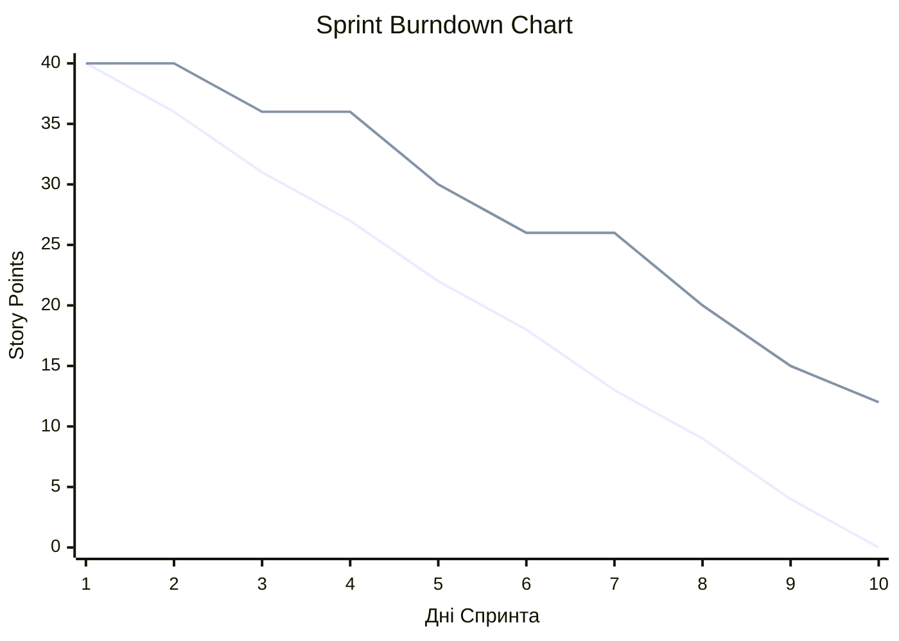

# Лекція 2a: Метрики доставки (Delivery Metrics)

**Аудиторія:** 2-й курс (Junior Strong)
**Зв'язок з теорією:** [Лекція 2: Delivery Methodology](02_delivery_methodology.md)
**Ціль:** Зрозуміти, як вимірювати процес розробки та ефективність команд за допомогою кількісних метрик.

> **English version:** [English](en/02a_metrics.md) | **Незнайоме слово?** → [Глосарій курсу](glossary.md)

---

## 🔥 Реальна історія: Wells Fargo — коли метрика вбила культуру

**2002–2016 роки.** Wells Fargo — один із найбільших банків США. Менеджмент поставив команді продажів чітку метрику: **кожен клієнт має мати в середньому 8 банківських продуктів** (рахунків, кредитних карток, страховок).

Метрика була вимірювана, прозора, автоматично відстежувалася. Ідеальний KPI.

Але щось пішло не так.

Співробітники, яких оцінювали та преміювали за цією метрикою, знайшли "рішення":
- Відкривати клієнтам **рахунки без їхнього відома**.
- Переводити гроші між рахунками для імітації активності.
- Підписувати клієнтів на послуги, яких ті не замовляли.

За 14 років так було створено **3,5 мільйони** фіктивних акаунтів.

**2016 рік.** Скандал вибухнув. Результат:
- Штраф $185 мільйонів від регулятора.
- CEO Джон Стамп пішов у відставку.
- Акції впали, репутація зруйнована.
- Конгрес США провів публічні слухання.

> 💡 Цей феномен отримав назву **Goodhart's Law**:
> *«Як тільки міра стає ціллю — вона перестає бути гарною мірою.»*

Менеджери Wells Fargo вимірювали **кількість продуктів**, думаючи, що вимірюють **якість обслуговування клієнтів**. Між цими двома речами — прірва.

**Це не виняток.** Та сама динаміка вбиває команди розробки, коли:
- Velocity стає метрикою оцінки розробника → Points inflation, фіктивні задачі
- Test Coverage стає метрикою → тести які нічого не перевіряють
- Кількість commit'ів → дрібні, безглузді коміти для показника

---

## 7. Метрики доставки

Якщо ви не вимірюєте рух — ви не керуєте ним. Ось метрики, якими команди реально користуються.

### 7.1 Velocity (Scrum)

**Velocity** — кількість Story Points, виконаних командою за Sprint.

```
Sprint 1: 23 SP ─────────────────────────────────
Sprint 2: 31 SP ──────────────────────────────────────
Sprint 3: 27 SP ────────────────────────────────────
Sprint 4: 29 SP ─────────────────────────────────────
                 Середня Velocity ≈ 27.5 SP
```

**Для чого:** Прогнозування. Якщо в backlog залишилось 110 SP, а Velocity = 27.5 → потрібно ще ~4 спринти (2 місяці).

**Антипатерн:** Використовувати Velocity для порівняння між командами. У кожної команди своя calibration Story Points. Порівнювати Velocity різних команд — це як порівнювати температуру по Цельсію та Кельвіну без конвертації.

<details markdown="1">
<summary>📊 Case Study: Відносність Velocity (Relative Velocity)</summary>

Оскільки ми не можемо порівнювати абсолютні Story Points між командами, ліди використовують **Відносне Velocity**.

Це відношення часу, який команда витратила на корисну розробку фіч (створення цінності), до загального доступного робочого часу у спринті (вимірюється у відсотках). 

**Формула:** `(Час на продуктивну роботу / Загальний час команди) * 100%`

**Як інженерний лідер читає цю метрику:**
* **≥ 70%:** Чудовий показник (здорова команда). Процеси налагоджені. (100% не буває в принципі через дейлі, ріфайнменти, ретроспективи та context-switching).
* **< 70%:** Команді потрібна системна допомога. Забагато часу йде на overhead: нечіткі вимоги, технічний борг, ручне розгортання або нескінченні корпоративні мітинги.
* **≤ 20%:** Команда де-факто **заблокована**. Вона не працює, а бореться з інфраструктурою (немає доступів, DevOps не підняв стенд, архітектура заблокована зовнішнім вендором).

</details>

### 7.2 Lead Time та Cycle Time (Kanban)

```
Задача створена ──────────────────────── Задача завершена
      │                                         │
      └────── Lead Time (повний час) ───────────┘
                   │              │
              Очікування     Cycle Time
               (черга)       (активна робота)
```

**Lead Time** = час від створення задачі до її завершення (з очікуванням).
**Cycle Time** = час активної роботи над задачею.

**Практичне застосування:** Якщо Lead Time = 14 днів, а Cycle Time = 2 дні — 12 днів задача просто **чекає**. Де bottleneck? Потрібно перевірити WIP Limit кожної колонки.

### 7.3 Burndown Chart

<details markdown="1">
<summary>Як читати Burndown Chart</summary>



* **Ідеальна лінія** (пряма): рівномірне та ідеальне завершення задач кожного дня.
* **Реальна лінія вище ідеальної**: ми відстаємо, Sprint Goal під загрозою (задачі накопичуються або не закриваються).
* **Пласкі ділянки на реальній лінії**: задачі довго в статусі "In Progress" або "Code Review" і не переходять в "Done" (щось блокує).
* **Реальна лінія нижче ідеальної**: команда випереджає графік (буває рідко, або задачі були переоцінені).

</details>

---

## 8. Рольові метрики (Role-Specific Metrics)

> 🔗 **Зв'язок з ролями на проєкті ([Лекція 1a](01a_project_roles.md)):**
> Метрики доставки (Velocity, Lead Time) описують ефективність команди в цілому. Однак кожна роль на проєкті має власні показники успішності (Evaluation Metrics):

### 8.1 Бізнес та Управління (Business & Management)
* **Account Manager:** CSAT (Customer Satisfaction — індекс задоволеності клієнта), Margin (маржинальність), Revenue зростання.
* **Program Director / PM (On-Site):** Program Delivery на час / за бюджетом. Утримання Scope (об'єму робіт) під контролем.
* **PM (Off-Site):** Утилізація команди (Utilization — відсоток часу, який команда витрачає на оплачувану клієнтом роботу), Delivery Predictability (передбачуваність релізів).

### 8.2 Архітектура та Технічний Менеджмент (Architecture & Tech Leadership)
* **Engineering Sponsor:** Загальна технічна успішність, відсутність критичних архітектурних провалів на рівні всієї програми.
* **Solution Architect:** Відповідність Non-Functional Requirements (NFRs — швидкість, масштабованість, безпека), системна стабільність.
* **Cloud Architect:** Cloud Bill (FinOps — оптимізація витрат на хмару), Cloud Security & Availability.
* **Technical Manager / Stream Lead:** Delivery на час, Code Quality (якість коду), швидкість вирішення технічних блокерів, Velocity конкретного стріму.

### 8.3 Вимоги та Якість (Requirements & Quality)
* **BA Lead (Business Analyst):** Повнота беклогу, відсоток задач у статусі Ready for Dev (готових до розробки).
* **QA Manager / QA:** Escaped Defects (кількість багів, що потрапили на Production), Test Coverage (покриття коду тестами), **Quality Gates** (статус проходження автоматизованих та ручних перевірок перед релізом).
* **SME (Subject Matter Expert):** Швидкість вирішення доменних (бізнесових) питань для команди.

---

## 9. Case Studies: Коли метрики працюють і коли вбивають

Неможливо говорити про метрики без реальних прикладів з індустрії. Що відбувається, коли метрики ігноруються або, навпаки, коли процес доставки працює як годинник?

<details markdown="1">
<summary>💭 Чому ми розбираємо переважно негативні приклади?</summary>

Це не випадково — і це не песимізм.

**Причина 1: Помилки запам'ятовуються краще.**
Когнітивна психологія підтверджує: **негативний досвід** залишає сильніший слід у пам'яті, ніж позитивний (так звана *negativity bias*). Розбираючи провали, ви набагато краще засвоїте *чому* метрика важлива, ніж читаючи абстрактні поради «вимірюйте Lead Time».

**Причина 2: Провали — це публічні дані.**
FBI витратило $170 млн і списало VCF — це судові протоколи, звіти Конгресу, журналістські розслідування. Успіхи компанії *не* розкривають деталі: як саме Spotify будував свою модель — відомо лише з однієї статті 2012 року, яка сама по собі є маркетингом.

**Причина 3: Інженер вчиться на post-mortem.**
Post-mortem (розбір аварії) — це базова інженерна практика. Google, Amazon, Cloudflare публікують детальні post-mortem після кожного major outage. Саме так індустрія накопичує знання: не «у нас все добре», а «ось що пішло не так і чому».

**Причина 4: Провали показують межі.**
USPS витрачала мільярди на IT-проєкти і провалювала їх. Wells Fargo показав межу між «гарна метрика» і «метрика, якою зловживають». Ці межі — і є те, що відрізняє досвідченого інженера від джуніора.

> 🎯 Мета: не злякатися, а **розпізнавати патерни провалів** заздалегідь — поки ціна помилки ще мала.

</details>

### ❌ Case Study: Лондонський Аеропорт Хітроу, Термінал 5 (Коли все йде не так)

**Контекст:** У 2008 році відкривався новий Термінал 5 (Т5) у Хітроу. Найскладнішою частиною була нова IT-система сортування багажу (Baggage Handling System). 
**Проблема доставки:** Команда менеджерів орієнтувалася на хибну метрику — **"Відсоток написаного коду" (Scope Completion)**, ігноруючи **Lead Time** реального тестування (Integration Testing). 
Кожен підрядник (а їх було багато) звітував, що його модуль готовий на 100%. Але інтеграційне тестування всієї системи відкладали на самий кінець (класичний Waterfall антипатерн). 
**Результат:** У день відкриття система сортування багажу лягла. Багаж застряг, співробітники не могли авторизуватися, возики губилися.
**Наслідок:** 
* Понад 42,000 валіз втрачено в перші ж дні.
* 500+ рейсів скасовано.
* Збитки понад £16 мільйонів та колосальний репутаційний удар.
**Урок метрик:** Якщо ваша Delivery-метрика не враховує час від "код написаний" до "код успішно працює в інтеграції з іншими" (тобто, ви перериваєте Cycle Time на етапі розробки, забуваючи про тестування) — ви йдете до катастрофи.

**🔧 Інженерний висновок:**
```
Антипатерн Хітроу:
  Метрика: "Відсоток написаного коду" (Scope Completion)
  Що вимірює: Активність розробників
  Що пропускає: Системна інтеграція, реальна готовність

Правильна метрика:
  Lead Time = час від «старт задачі» до «живе на Production»
  Cycle Time розбити на стадії: Dev → Review → QA → Integration → Done
  Якщо Integration-фаза не вимірюється окремо — ризик прихований
```
> Правило: **ніколи не звітуйте про готовність компонента без інтеграційного тесту.** «Мій модуль готовий» без перевірки у системі — не готовність.

### ✅ Case Study: The Ethereum Merge (Коли метрики рятують)

**Контекст:** У вересні 2022 року мережа Ethereum здійснила історичний перехід з Proof-of-Work на Proof-of-Stake (подія "The Merge"). Це була найскладніша міграція в історії програмного забезпечення — як "заміна двигуна літака під час польоту". Задіяно сотні незалежних розробників з усього світу (різні клієнти: Geth, Prysm, Teku тощо).
**Як працювали метрики:** Розробники Ethereum не використовували "Velocity" в класичному корпоративному розумінні, оскільки не мали єдиного беклогу. Натомість вони фокусувалися на **Quality Gates** (метриках якості доставки):
1. **Testnet Cycles:** Скільки циклів тестування пройдено на тіньових мережах (Shadow Forks) без критичних падінь. Метрика успіху: 0 ескейп-дефектів (Escaped Defects) у консенсусі на тестовій мережі.
2. **Client Diversity (Різноманітність клієнтів):** Метрика, що показувала відсоток використання різних імплементацій. Якщо один клієнт (наприклад, Geth) мав >66% мережі, реліз відкладався, бо баг у ньому міг би "вбити" весь Ethereum. Команди знижували цей показник перед запуском.
**Результат:** The Merge пройшов абсолютно безшовно. Жодна транзакція не загубилася, мережа не зупинялася ні на секунду.
**Урок метрик:** Успішна доставка надскладних систем — це не про "встигнути до дати" (Velocity), а про безкомпромісне дотримання метрик якості (Test Coverage, Escaped Defects) та контроль ризиків. Команда готова перенести реліз, якщо метрики якості не світяться "зеленим".

**🔧 Інженерний висновок:**
```
Модель якісних воріт Ethereum (Quality Gates):

  Gate 1: Shadow Fork Tests
    → 0 consensus failures за N циклів → можна йти далі

  Gate 2: Client Diversity
    → Жоден клієнт не має > 33% мережі → можна йти далі

  Gate 3: Escaped Defects on Testnet
    → 0 критичних дефектів на Goerli/Ropsten → можна йти далі

  Gate 4: Community Readiness
    → 95%+ нод оновлені → Deploy
```
Це **не Scrum Velocity, не Lead Time** — це система якісних воріт, де *кожна метрика є умовою для наступного кроку*.

> Правило: **для high-stakes систем (фінанси, безпека, інфраструктура) будуйте явні Quality Gates**, а не просто відстежуйте швидкість. Ворота можна автоматизувати — і саме так CI/CD pipeline з обов'язковими перевірками стає вашим особистим Ethereum Merge у мікромасштабі.

---

**[⬅️ Лекція 2: Delivery Methodology](02_delivery_methodology.md)** | **[Лекція 3: Definition of Requirements ➡️](03_requirements.md)**

**[⬅️ Повернутися до головного меню курсу](index.md)**
