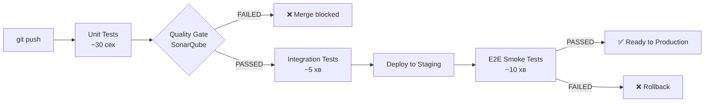

# Лекція 6: QA Strategy. Як не стати командою, яка боїться деплоїти

**Аудиторія:** 2-й курс (Junior Strong)
**Ціль:** Зрозуміти, що якість — це не відділ, а процес. Навчитись будувати стратегію тестування від unit-тесту до production-моніторингу.

> **English version:** [English](en/06_qa_strategy.md)

---

## 1. Відкрита дискусія (Warm-up)

**Сценарій:** П'ятниця, 17:45. Treба задеплоїти «маленьку» зміну — виправили одне поле у формі. Тімлід питає: «Чи ми впевнені, що нічого не зламаємо?»

Питання до групи:
1. Що ви відповісте?
2. Як би ви відповіли, якби у вас були автотести?
3. Чи є команди, які деплоять у п'ятницю вечір без страху?

<details markdown="1">
<summary>Розгорнути відповідь</summary>

Є. Amazon деплоїть тисячі разів на день. Netflix — кілька разів на годину. Google — безперервно.

Різниця не в сміливості команди. Різниця в тому, що вони побудували систему, яка ловить регресію автоматично за секунди.

Страх деплоїти — це симптом. Причина — відсутність або недостатність автоматизованого тестування.

QA-стратегія — це відповідь на питання: «Звідки ми знаємо, що система працює коректно після кожної зміни?»

</details>

---

## 2. Піраміда тестування

Піраміда тестування (Test Pyramid, Mike Cohn, 2009) — фундаментальна модель, яка показує, яких тестів має бути більше і яких менше.

```
                  /\
                 /E2E\          ← Мало, повільні, дорогі
                /______\
               /        \
              / Integration\    ← Середньо, перевіряють договори
             /____________\
            /              \
           /   Unit Tests   \   ← Багато, швидкі, дешеві
          /________________\
```

### Unit Tests — основа

Unit-тест перевіряє одну функцію, метод або клас ізольовано від зовнішніх залежностей.

```java
// Що тестуємо: розрахунок знижки
@Test
void should_apply_10_percent_discount_for_premium_user() {
    // Given
    PricingService service = new PricingService();
    Order order = new Order(BigDecimal.valueOf(100), UserType.PREMIUM);

    // When
    BigDecimal result = service.calculateFinalPrice(order);

    // Then
    assertThat(result).isEqualByComparingTo(BigDecimal.valueOf(90));
}
```

Зовнішніх залежностей немає: ні бази, ні мережі, ні файлової системи. Тест виконується за мілісекунди. Таких тестів має бути сотні або тисячі.

<details markdown="1">
<summary>Що заміщати через Mock і коли Mock — антипатерн</summary>

Mock — підробка зовнішньої залежності. Ви говорите: «Замість реального репозиторію — поверни ось ці дані».

```java
// Mock репозиторію
UserRepository mockRepo = mock(UserRepository.class);
when(mockRepo.findById(1L)).thenReturn(Optional.of(new User("Alice", UserType.PREMIUM)));

OrderService service = new OrderService(mockRepo);
```

Коли Mock виправданий: зовнішня система (БД, HTTP-сервіс, черга) і ваша мета — тестувати бізнес-логіку, а не з'єднання.

Коли Mock — антипатерн: якщо ви MockуЄте саму бізнес-логіку для тестування іншої бізнес-логіки — ви тестуєте Mock, а не код.

</details>

### Integration Tests — перевіряємо кордони

Integration-тест перевіряє, що компоненти системи правильно взаємодіють між собою або із зовнішніми системами.

```java
@SpringBootTest
@AutoConfigureMockMvc
class OrderControllerIntegrationTest {

    @Autowired MockMvc mockMvc;

    @Test
    void should_return_order_by_id() throws Exception {
        mockMvc.perform(get("/orders/1"))
               .andExpect(status().isOk())
               .andExpect(jsonPath("$.id").value(1))
               .andExpect(jsonPath("$.status").value("CONFIRMED"));
    }
}
```

Тут реально піднімається Spring-контекст, реально читається БД (test database). Тест важчий і повільніший, але він перевіряє реальний HTTP-шлях.

### E2E Tests — сценарії кінцевого користувача

E2E (End-to-End) тест імітує реального користувача в реальному браузері або через реальний API.

```python
# Selenium / Playwright
def test_user_can_place_order():
    driver.get("https://staging.shop.com")
    driver.find_element(By.ID, "product-123").click()
    driver.find_element(By.ID, "add-to-cart").click()
    driver.find_element(By.ID, "checkout").click()
    # ...
    assert "Замовлення підтверджено" in driver.page_source
```

E2E тести повільні (хвилини), крихкі (UI змінився — тест зламався), дорогі в підтримці. Їх має бути мало — тільки для критичних user journeys (оплата, реєстрація, авторизація).

---

## 3. Антипатерни тестування

### Ice Cream Cone (Перевернута піраміда)

```
         /E2E\ ← Тисячі E2E тестів (50 хв pipeline)
        /______\
       /Integr. \
      /___________\
     /  Unit Tests  \ ← Майже немає
    /__________________\
```

Це найпоширеніший антипатерн у командах без TDD-культури. Наслідки: CI/CD пайплайн займає годину, тести падають за незрозумілих причин, розробники вимикають тести «тимчасово».

### Pesticide Paradox

Якщо одні і ті самі тести запускаються роками без зміни — вони перестають знаходити нові баги. Тести треба оновлювати разом із кодом.

### Тести без assertions

```java
@Test
void test_create_order() {
    orderService.create(new Order(...));
    // Немає assertThat, verify, нічого
}
```

Тест завжди зелений. Завжди марний.

---

## 4. Static Analysis: SonarQube і Quality Gates

Static Analysis — аналіз коду без його запуску. Знаходить проблеми до того, як вони потрапляють у production.

### Що аналізує SonarQube

| Категорія | Приклад | Наслідок |
| :--- | :--- | :--- |
| Bugs | Null pointer без перевірки | NullPointerException на production |
| Vulnerabilities | SQL через рядкову конкатенацію | SQL Injection |
| Code Smells | Метод довжиною 300 рядків | Неможливо підтримувати |
| Duplications | Той самий блок скопійований 5 разів | Виправлення в одному місці, забули в інших |
| Coverage | Модуль без тестів | Регресія непомітна |

### Quality Gate — автоматична перевірка перед merge

Quality Gate — набір умов, при яких merge або деплой блокується автоматично:

```yaml
# Типовий Quality Gate
conditions:
  - metric: coverage
    op: LT
    value: 80        # Якщо coverage < 80% — БЛОК
  - metric: new_bugs
    op: GT
    value: 0         # Якщо є нові баги — БЛОК
  - metric: new_vulnerabilities
    op: GT
    value: 0         # Якщо є нові вразливості — БЛОК
  - metric: duplicated_lines_on_new_code
    op: GT
    value: 3         # Якщо дублювання > 3% — БЛОК
```

Quality Gate — це «автоматизований рецензент», який ніколи не втомлюється і не забуває перевірити.

---

## 5. Тестування в CI/CD пайплайні

Стратегія тестування без інтеграції в пайплайн — це паперова стратегія. Тести мають запускатись автоматично.



**Fail Fast** — тести мають падати якомога раніше і з мінімальним feedback loop:
- Unit Tests: секунди (запускаються локально на кожен commit)
- Static Analysis: 1-2 хвилини (CI на кожен push)
- Integration Tests: 5-10 хвилин (CI на кожен PR)
- E2E: 10-30 хвилин (тільки перед деплоєм на staging)

---

## 6. Test Coverage: що це і чому 100% — не ціль

Coverage — відсоток рядків коду, виконаних під час тестів.

```
Total lines: 1,000
Lines executed by tests: 750
Coverage: 75%
```

**Чому 100% coverage — антипатерн:**

100% coverage означає, що кожен рядок виконується. Це не означає, що кожна поведінка перевіряється.

```java
// Coverage 100% — тест існує
@Test
void test_add() {
    int result = calculator.add(2, 2);
    // Результат не перевіряємо (немає assertThat)
}
// Але behavior не протестована
```

Реальна ціль: 70-80% coverage для бізнес-логіки, з акцентом на критичні шляхи, а не на геттери і сетери.

**Mutation Testing** — просунутий рівень: автоматично змінює код (мутує) і перевіряє, чи падають тести. Якщо тест не помічає, що `>` замінено на `>=` — тест неповний.

---

## 7. QA в різних методологіях

### TDD (Test-Driven Development)

Пишемо тест *до* коду. Цикл: Red → Green → Refactor.

```
1. RED:    Пишемо тест, що падає (бо коду ще немає)
2. GREEN:  Пишемо мінімальний код, щоб тест пройшов
3. REFACTOR: Покращуємо код, тести залишаються зеленими
```

TDD не про тестування — це про дизайн. Якщо важко написати тест до функції — функція, мабуть, робить занадто багато.

### BDD (Behavior-Driven Development)

Тести пишуться мовою бізнесу, зрозумілою PO і QA:

```gherkin
Feature: Знижки для преміум-користувачів

  Scenario: 10% знижка для преміум при замовленні від 100 грн
    Given користувач має статус "premium"
    And в кошику товар вартістю 150 грн
    When користувач оформлює замовлення
    Then фінальна сума становить 135 грн
```

BDD-сценарії — це одночасно документація і автотест. PO може читати і перевіряти логіку без знання Java.

---

## 8. Екзаменаційний пул (Exam Questions)

**Питання 1: Поясніть піраміду тестування. Чому E2E-тестів має бути мало?**

<details markdown="1">
<summary>Еталонна відповідь</summary>

Піраміда: Unit (багато, швидкі) → Integration (середньо) → E2E (мало, повільні).

E2E тести повільні (хвилини vs мілісекунди для unit), крихкі щодо UI-змін, складні в підтримці і дорогі в запуску. Якщо E2E тестів більшість — pipeline займає годину, і команда вимикає тести «щоб не гальмувати».

E2E тести потрібні для критичних user journeys (реєстрація, оплата), де важливо перевірити весь шлях цілком. Для ізольованої логіки — unit.

</details>

**Питання 2: Що таке Quality Gate і який зв'язок з NFR?**

<details markdown="1">
<summary>Еталонна відповідь</summary>

Quality Gate — набір автоматичних умов (coverage, нові баги, вразливості, дублювання), при порушенні яких merge або деплой блокується.

Зв'язок з NFR: Maintainability — NFR. Quality Gate — механізм імплементації цього NFR. «Coverage ≥ 80%» у Quality Gate = NFR «підтримуваність» у конкретному вимірюваному критерії. NFR без Quality Gate — це побажання, а не вимога.

</details>

**Питання 3: Як Mock-об'єкти пов'язані з тестовою ізоляцією? Наведіть приклад правильного і неправильного використання.**

<details markdown="1">
<summary>Еталонна відповідь</summary>

Mock ізолює тестований код від зовнішніх залежностей — щоб тест перевіряв виключно одну одиницю логіки.

Правильно: Mock репозиторію щоб тестувати сервісний шар без реальної БД. `when(repo.findById(1)).thenReturn(user)` — контролюємо вхідні дані, перевіряємо логіку сервісу.

Неправильно: Mock самого сервісу щоб тестувати контролер, і при цьому перевіряємо тільки, що сервіс «викликався». Такий тест не перевіряє жодної реальної поведінки — він тільки верифікує, що ви написали `service.processOrder(order)`.

</details>

**Питання 4: Команда має 95% coverage, але production все одно падає від багів. Як таке можливо?**

<details markdown="1">
<summary>Еталонна відповідь</summary>

Coverage вимірює, які рядки *виконались*, а не які *поведінки* перевірено. Можна мати:

- Тести без assertions (рядки виконані, поведінка не перевірена).
- Тести на «happy path», але не на граничні випадки (null, порожній список, від'ємне число).
- Тести, що перевіряють те, що хоче побачити розробник, а не те, що очікує система.

95% coverage — необхідна, але не достатня умова якості. Mutation Testing і Code Review виявляють те, що coverage пропускає.

</details>

---

**[⬅️ Лекція 5: NFR Discovery](05_nfr_late_discovery.md)** | **[Лекція 7: API Design ➡️](07_api_design.md)**

**[⬅️ Повернутися до головного меню курсу](index.md)**
