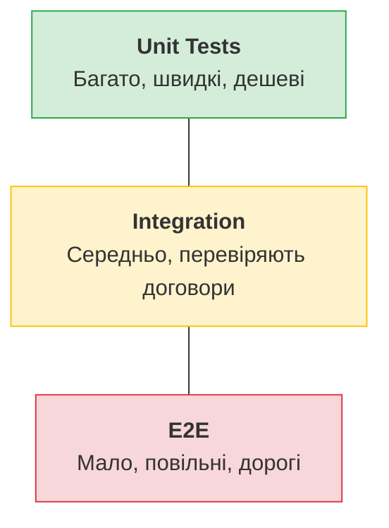
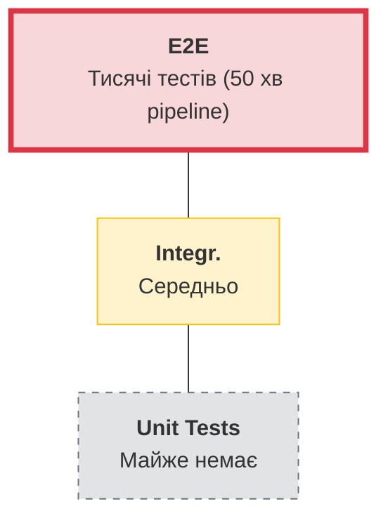
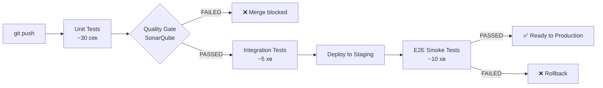

# Лекція 6: QA Strategy. Як не стати командою, яка боїться деплоїти

**Аудиторія:** 2-й курс (Junior Strong)
**Ціль:** Зрозуміти, що якість — це не відділ, а процес. Навчитись будувати стратегію тестування від unit-тесту до production-моніторингу.

> **English version:** [English](en/06_qa_strategy.md)

---

> 💡 **Анекдот:**
> Тестувальник заходить у бар. Замовляє 1 кухоль пива. Замовляє 0 кухлів. Замовляє 999999999 кухлів. Замовляє ящірку. Замовляє -1 кухоль. Замовляє 'qwerty' кухлів. 
> Усе працює чудово! 
> Перший реальний користувач заходить у бар і запитує, де тут туалет. Бар миттєво спалахує і згорає вщент.
> 
> *Мораль:* Якими б вичерпними не здавалися ваші тести, реальний світ завжди знайде непередбачуваний сценарій. Саме тому потрібна не просто папка "tests", а комплексна QA Стратегія.

---

## 1. Вступ: STLC та Ручне vs Автоматизоване тестування

### STLC (Software Testing Life Cycle)
Якість продукту не виникає магічним чином в кінці розробки. Вона формується через послідовні етапи **STLC** — життєвого циклу тестування:
1. **Requirement Analysis:** тестувальник аналізує вимоги ще до написання коду для виявлення суперечностей (наприклад, у NFR).
2. **Test Planning:** визначення ресурсів та загальної стратегії тестування.
3. **Test Case Development:** написання тестових сценаріїв та розробка автотестів.
4. **Test Execution:** запуск тестів (ручний або в CI/CD пайплайні).
5. **Test Closure:** збір метрик якості та аналіз результатів.
Тестування — це комплексний процес управління якістю етапу за етапом, а не лише "завершальний етап кодингу".

### Manual vs Automation Testing
- **Manual Testing (Ручне):** Тестувальник "руками" проходить сценарії. Незамінне для оцінки UI/UX, Exploratory testing та перевірки складної нової логіки.
- **Automation Testing (Автоматизоване):** Скрипти, що імітують дії користувача або звертаються напряму до коду чи API. 
Сучасна стратегія CI/CD **цілком покладається на автоматизацію**. Наша мета — *швидкий зворотний зв'язок (fast feedback)*. Людина може перевіряти форму оплати 5 хвилин, автотест зробить це за 50 мілісекунд.

> 🚨 **Case Study: "Тестуємо в кінці" (Ігнорування ранніх стадій STLC)**
> Команда розробників півроку створювала новий модуль фінансової звітності. QA-інженера залучили лише за тиждень до релізу на фінальному етапі "Test Execution". Перший же тест показав, що система округлює податки до цілого числа, що грубо порушувало бухгалтерські стандарти (помилка на етапі Requirement Analysis). Оскільки архітектура бази даних і код не підтримували дробові числа для цього поля, виправлення зайняло цілий місяць, а реліз був зірваний. **Урок:** STLC має починатися паралельно з написанням вимог. Значно дешевше змінити букву в документі до початку розробки, ніж міняти типи колонок у БД перед релізом.

---

## 1. Відкрита дискусія (Warm-up)

**Сценарій:** П'ятниця, 17:45. Treба задеплоїти «маленьку» зміну — виправили одне поле у формі. Тімлід питає: «Чи ми впевнені, що нічого не зламаємо?»

Питання до групи:
1. Що ви відповісте?
2. Як би ви відповіли, якби у вас були автотести?
3. Чи є команди, які деплоять у п'ятницю вечір без страху?

<details markdown="1">
<summary>Розгорнути відповідь</summary>

Є. Amazon деплоїть тисячі разів на день. Netflix — кілька разів на годину. Google — безперервно.

Різниця не в сміливості команди. Різниця в тому, що вони побудували систему, яка ловить регресію автоматично за секунди.

Страх деплоїти — це симптом. Причина — відсутність або недостатність автоматизованого тестування.

QA-стратегія — це відповідь на питання: «Звідки ми знаємо, що система працює коректно після кожної зміни?»

</details>

---

## 2. Піраміда тестування

Піраміда тестування (Test Pyramid, Mike Cohn, 2009) — фундаментальна модель, яка показує, яких тестів має бути більше і яких менше.

### Класифікація за доступом до коду
- **White Box Testing (Білий ящик):** Тестувальник бачить і маніпулює кодом напряму. Класичний приклад — *Unit Tests*, де перевіряється кожен рядок коду.
- **Black Box Testing (Чорний ящик):** Перевірка функціональності без доступу до внутрішнього коду. Система розглядається як "чорний ящик", куди ми подаємо вхідні дані і слідкуємо за результатом. Класичний приклад — *E2E Tests*.
- **Grey Box Testing (Сірий ящик):** Поєднання підходів (маємо доступ до БД або структури даних, але тестуємо сценарії). Класичний приклад — *Integration Tests*.


```mermaid
graph TD
    Unit["<b>Unit Tests</b><br/>Багато, швидкі, дешеві"] 
    Integration["<b>Integration</b><br/>Середньо, перевіряють договори"]
    E2E["<b>E2E</b><br/>Мало, повільні, дорогі"]

    Unit --- Integration --- E2E
    
    style Unit fill:#d4edda,stroke:#28a745
    style Integration fill:#fff3cd,stroke:#ffc107
    style E2E fill:#f8d7da,stroke:#dc3545
```

### Unit Tests — основа

Unit-тест перевіряє одну функцію, метод або клас ізольовано від зовнішніх залежностей.

```java
// Що тестуємо: розрахунок знижки
@Test
void should_apply_10_percent_discount_for_premium_user() {
    // Given
    PricingService service = new PricingService();
    Order order = new Order(BigDecimal.valueOf(100), UserType.PREMIUM);

    // When
    BigDecimal result = service.calculateFinalPrice(order);

    // Then
    assertThat(result).isEqualByComparingTo(BigDecimal.valueOf(90));
}
```

Зовнішніх залежностей немає: ні бази, ні мережі, ні файлової системи. Тест виконується за мілісекунди. Таких тестів має бути сотні або тисячі.

<details markdown="1">
<summary>Що заміщати через Mock і коли Mock — антипатерн</summary>

Mock — підробка зовнішньої залежності. Ви говорите: «Замість реального репозиторію — поверни ось ці дані».

```java
// Mock репозиторію
UserRepository mockRepo = mock(UserRepository.class);
when(mockRepo.findById(1L)).thenReturn(Optional.of(new User("Alice", UserType.PREMIUM)));

OrderService service = new OrderService(mockRepo);
```

Коли Mock виправданий: зовнішня система (БД, HTTP-сервіс, черга) і ваша мета — тестувати бізнес-логіку, а не з'єднання.

Коли Mock — антипатерн: якщо ви MockуЄте саму бізнес-логіку для тестування іншої бізнес-логіки — ви тестуєте Mock, а не код.

</details>

> 🚨 **Case Study: Модульне тестування в мобільній розробці (MVVM)**
> У мобільному Android/iOS додатку з архітектурою MVVM (Model-View-ViewModel), команда розробників тестувала логіку екрану (`ViewModel`), але при цьому тести робили реальні HTTP-запити до бекенда. Через це тести постійно падали при проблемах з мережею, а CI працював по 10 хвилин. **Вирішення (Unit Test):** Тестування логіки `ViewModel` ізольовано. Створення моку (Mock) для шару `Repository`. Тепер тест передає моковані дані з "локальної" бази у `ViewModel` і миттєво перевіряє, як змінюється стан `LiveData/StateFlow`, взагалі не чекаючи відповіді від сервера і не залежачи від підключення.

### Integration Tests — перевіряємо кордони

Integration-тест перевіряє, що компоненти системи правильно взаємодіють між собою або із зовнішніми системами.

```java
@SpringBootTest
@AutoConfigureMockMvc
class OrderControllerIntegrationTest {

    @Autowired MockMvc mockMvc;

    @Test
    void should_return_order_by_id() throws Exception {
        mockMvc.perform(get("/orders/1"))
               .andExpect(status().isOk())
               .andExpect(jsonPath("$.id").value(1))
               .andExpect(jsonPath("$.status").value("CONFIRMED"));
    }
}
```

Тут реально піднімається Spring-контекст, реально читається БД (test database). Тест важчий і повільніший, але він перевіряє реальний HTTP-шлях.

#### Стратегії інтеграції модулів:
- **Top-Down (Зверху вниз):** Інкрементний підхід. Тестування починається з верхніх рівнів (наприклад, UI або Controllers), підміняючи нижчі модулі (Services, Repositories) через Stubs/Mocks.
- **Bottom-Up (Знизу вгору):** Інкрементний підхід. Спочатку тестуються базові компоненти (БД, Repositories), а потім до них підключаються вищі шари. Використовуються Test Drivers для імітації викликів згори.
- **Big Bang (Великий вибух):** Неінкрементний підхід. Усі компоненти одразу збираються разом і тестуються одночасно. Використовується для складних потоків даних, хоча локалізувати помилку в разі падіння дуже важко.

> 🚨 **Case Study: Ілюзія успіху через H2 (In-Memory DB)**
> Розробники використовували легку H2 Database для інтеграційних тестів замість реального PostgreSQL, щоб тести бігали швидше. Усі тести проходили ідеально. На production (PostgreSQL) скрипт впав, оскільки використовував специфічний синтаксис H2, якого не розумів Postgres, а також H2 ігнорував деякі складні `FOREIGN KEY` constraints. **Урок:** Інтеграційні тести повинні використовувати базу даних або оточення, максимально наближені до production (наприклад, через Testcontainers).

### E2E Tests — сценарії кінцевого користувача

E2E (End-to-End) тест імітує реального користувача в реальному браузері або через реальний API.

```python
# Selenium / Playwright
def test_user_can_place_order():
    driver.get("https://staging.shop.com")
    driver.find_element(By.ID, "product-123").click()
    driver.find_element(By.ID, "add-to-cart").click()
    driver.find_element(By.ID, "checkout").click()
    # ...
    assert "Замовлення підтверджено" in driver.page_source
```

E2E тести повільні (хвилини), крихкі (UI змінився — тест зламався), дорогі в підтримці. Їх має бути мало — тільки для критичних user journeys (оплата, реєстрація, авторизація).

> 🚨 **Case Study: "Блукаючий" E2E тест (Flaky Test)**
> Компанія мала 300 E2E тестів у Selenium. Кожного релізу 3-5 тестів випадково падали через таймаути мережі або неспівпадіння верстки (хтось змінив назву CSS-класу). QA-інженер витрачав по 4 години щодня просто перезапускаючи пайплайн, поки всі тести не ставали зеленими. Згодом команда перестала довіряти тестам і почала їх ігнорувати. **Урок:** E2E тестів має бути переконливий мінімум. Якщо тест нестабільний (flaky) — його треба або терміново лагодити, або видаляти, або переносити на рівень Integration.

---

## 3. Антипатерни тестування

### Ice Cream Cone (Перевернута піраміда)


```mermaid
graph TD
    E2E["<b>E2E</b><br/>Тисячі тестів (50 хв pipeline)"]
    Integration["<b>Integr.</b><br/>Середньо"]
    Unit["<b>Unit Tests</b><br/>Майже немає"]

    E2E --- Integration --- Unit

    style E2E fill:#f8d7da,stroke:#dc3545,stroke-width:4px
    style Integration fill:#fff3cd,stroke:#ffc107
    style Unit fill:#e2e3e5,stroke:#6c757d,stroke-dasharray: 5 5
```

Це найпоширеніший антипатерн у командах без TDD-культури. Наслідки: CI/CD пайплайн займає годину, тести падають за незрозумілих причин, розробники вимикають тести «тимчасово».

> 🚨 **Case Study: Заручники E2E**
> Стартап написав 500 E2E тестів і жодного Unit-тесту, щоб тестувати продукт "швидше" та "з точки зору юзера". Через два роки додавання нового простого поля у формі займало 2 дні: 1 година на написання коду і 15 годин на оновлення сотень існуючих E2E тестів, які зламалися через зміну локаторів на сторінці або додане поле. Гнучкість (agility) команди впала до нуля.

### Pesticide Paradox

Якщо одні і ті самі тести запускаються роками без зміни — вони перестають знаходити нові баги. Тести треба оновлювати разом із кодом.

### Тести без assertions

```java
@Test
void test_create_order() {
    orderService.create(new Order(...));
    // Немає assertThat, verify, нічого
}
```

Тест завжди зелений. Завжди марний.

> 🚨 **Case Study: "Успішна" оплата на $0**
> Модуль проведення платежів мав 95% покриття коду. Але тест складався лише з підготовки об'єкта та виклику `paymentService.process()`. Коли через баг інтеграції платіжний шлюз почав повертати помилку "Transaction Failed", код мовчки ковтав Exception. Оскільки тест не мав жодного `assertThat(status).isEqualTo("SUCCESS")`, він гордо горів зеленим, поки компанія три дні безкоштовно відвантажувала товар без реального списання коштів.

---

## 4. Static Analysis: SonarQube і Quality Gates

Static Analysis — аналіз коду без його запуску. Знаходить проблеми до того, як вони потрапляють у production.

### Що аналізує SonarQube

| Категорія | Приклад | Наслідок |
| :--- | :--- | :--- |
| Bugs | Null pointer без перевірки | NullPointerException на production |
| Vulnerabilities | SQL через рядкову конкатенацію | SQL Injection |
| Code Smells | Метод довжиною 300 рядків | Неможливо підтримувати |
| Duplications | Той самий блок скопійований 5 разів | Виправлення в одному місці, забули в інших |
| Coverage | Модуль без тестів | Регресія непомітна |

### Quality Gate — автоматична перевірка перед merge

Quality Gate — набір умов, при яких merge або деплой блокується автоматично:

```yaml
# Типовий Quality Gate
conditions:
  - metric: coverage
    op: LT
    value: 80        # Якщо coverage < 80% — БЛОК
  - metric: new_bugs
    op: GT
    value: 0         # Якщо є нові баги — БЛОК
  - metric: new_vulnerabilities
    op: GT
    value: 0         # Якщо є нові вразливості — БЛОК
  - metric: duplicated_lines_on_new_code
    op: GT
    value: 3         # Якщо дублювання > 3% — БЛОК
```

Quality Gate — це «автоматизований рецензент», який ніколи не втомлюється і не забуває перевірити.

> 🚨 **Case Study: "Терміновий хотфікс у п'ятницю"**
> Тімлід вирішив терміново залити фікс у production ввечері, сказавши адмінам обійти (bypass) Quality Gate у SonarQube, бо "це всього один рядок, і тести довго йдуть". Цей рядок містив не закритий `InputStream`, що призвело до витоку пам'яті (Memory Leak). У суботу вранці всі сервери впали з `OutOfMemoryError`. Static Analysis знав про це відразу і кидав помилку Critical Blocker, але її свідомо проігнорували через людський фактор.

---

## 5. Тестування в CI/CD пайплайні

Стратегія тестування без інтеграції в пайплайн — це паперова стратегія. Тести мають запускатись автоматично.


```mermaid
graph LR
    A[git push] --> B[Unit Tests\n~30 сек]
    B --> C{Quality Gate\nSonarQube}
    C -->|FAILED| D[❌ Merge blocked]
    C -->|PASSED| E[Integration Tests\n~5 хв]
    E --> F[Deploy to Staging]
    F --> G[E2E Smoke Tests\n~10 хв]
    G -->|PASSED| H[✅ Ready to Production]
    G -->|FAILED| I[❌ Rollback]
```

**Fail Fast** — тести мають падати якомога раніше і з мінімальним feedback loop:
- Unit Tests: секунди (запускаються локально на кожен commit)
- Static Analysis: 1-2 хвилини (CI на кожен push)
- Integration Tests: 5-10 хвилин (CI на кожен PR)
- E2E: 10-30 хвилин (тільки перед деплоєм на staging)

### Інші важливі види тестування в CI/CD:
- **Smoke Testing (Димове тестування):** Швидка перевірка базових критичних функцій системи (наприклад, "чи коректно запускається застосунок", "чи працює логін") перед глибоким і дорогим аналізом чи повним циклом E2E.
- **Regression Testing (Регресійне тестування):** Виконання набору автотестів після внесення змін до коду, щоб перевірити, чи не зламали ці нові зміни старий, вже працюючий функціонал.
- **UAT (User Acceptance Testing):** Фінальний етап тестування перед релізом, який виконується з боку замовника або кінцевих користувачів, щоб підтвердити, що продукт відповідає бізнес-вимогам.

> 🚨 **Case Study: Зворотний зв'язок довжиною в обід**
> Команда налаштувала пайплайн так: спочатку 15 хв збирався великий Docker-image, потім він деплоївся на тестовий стенд (10 хв), потім розгорталася тестова БД, а ТІЛЬКИ ПОТІМ запускалися Unit-тести. Розробник робив коміт, йшов на обід, а за 45 хвилин отримував помилку: бракує крапки з комою у функції або не пройшов лінтер. **Урок:** Fail Fast. Найдешевші перевірки (компіляція, Unit-тести, лінтери, статика) повинні падати в перші ж секунди пайплайну на найперших кроках.

---

## 6. Test Coverage: що це і чому 100% — не ціль

Coverage — відсоток рядків коду, виконаних під час тестів.

```
Total lines: 1,000
Lines executed by tests: 750
Coverage: 75%
```

**Чому 100% coverage — антипатерн:**

100% coverage означає, що кожен рядок виконується. Це не означає, що кожна поведінка перевіряється.

```java
// Coverage 100% — тест існує
@Test
void test_add() {
    int result = calculator.add(2, 2);
    // Результат не перевіряємо (немає assertThat)
}
// Але behavior не протестована
```

Реальна ціль: 70-80% coverage для бізнес-логіки, з акцентом на критичні шляхи, а не на геттери і сетери.

**Mutation Testing** — просунутий рівень: автоматично змінює код (мутує) і перевіряє, чи падають тести. Якщо тест не помічає, що `>` замінено на `>=` — тест неповний.

> 🚨 **Case Study: Ілюзія якості та Геттери**
> Менеджмент впровадив жорсткий KPI: "Усі команди повинні мати мінімум 90% Test Coverage, інакше заборонені релізи". Розробники за вихідні підняли покриття коду з 40% до 95%, написавши автогенератори пустих тестів або тести на всі існуючі Getters/Setters та мапери (POJO об'єкти без логіки). Покриття стало "ідеальним" на папері, але багів у складній бізнес-логіці стало більше, оскільки ніхто не тестував складні крайні випадки (Edge cases). Метрика стала ціллю і повністю втратила свій первинний сенс (Закон Гудхарта).

---

## 7. QA в різних методологіях

### TDD (Test-Driven Development)

Пишемо тест *до* коду. Цикл: Red → Green → Refactor.

```
1. RED:    Пишемо тест, що падає (бо коду ще немає)
2. GREEN:  Пишемо мінімальний код, щоб тест пройшов
3. REFACTOR: Покращуємо код, тести залишаються зеленими
```

TDD не про тестування — це про дизайн. Якщо важко написати тест до функції — функція, мабуть, робить занадто багато.

> 🚨 **Case Study: Тест після коду (Test-Last Development)**
> Розробник три дні писав величезний і геніальний клас `OrderProcessor` на 800 рядків із жорстко зашитими залежностями від БД, HTTP-клієнта зовні, Logger-а та Notification-сервісу. На четвертий день він спробував написати на цей клас Unit-тест. Щоб просто ініціалізувати об'єкт, довелося скомпонувати 7 моків і 5 вкладених залежностей. Створення сетапу для тесту (Arrange) зайняло 200 рядків і один день болю. Обурений кодер сказав, що "Unit-тести марні і забирають занадто багато часу". Якби розробник використовував TDD (писав тест першим кроком), він би після першого ж складно-створюваного мока зрозумів, що архітектура класу занадто монолітна і потребує розділення інфраструктури від логіки (Dependency Injection та Decoupling).

### BDD (Behavior-Driven Development)

Тести пишуться мовою бізнесу, зрозумілою PO і QA:

```gherkin
Feature: Знижки для преміум-користувачів

  Scenario: 10% знижка для преміум при замовленні від 100 грн
    Given користувач має статус "premium"
    And в кошику товар вартістю 150 грн
    When користувач оформлює замовлення
    Then фінальна сума становить 135 грн
```

BDD-сценарії — це одночасно документація і автотест. PO може читати і перевіряти логіку без знання Java.

---

## 8. Екзаменаційний пул (Exam Questions)

**Питання 1: Поясніть піраміду тестування. Чому E2E-тестів має бути мало?**

<details markdown="1">
<summary>Еталонна відповідь</summary>

Піраміда: Unit (багато, швидкі) → Integration (середньо) → E2E (мало, повільні).

E2E тести повільні (хвилини vs мілісекунди для unit), крихкі щодо UI-змін, складні в підтримці і дорогі в запуску. Якщо E2E тестів більшість — pipeline займає годину, і команда вимикає тести «щоб не гальмувати».

E2E тести потрібні для критичних user journeys (реєстрація, оплата), де важливо перевірити весь шлях цілком. Для ізольованої логіки — unit.

</details>

**Питання 2: Що таке Quality Gate і який зв'язок з NFR?**

<details markdown="1">
<summary>Еталонна відповідь</summary>

Quality Gate — набір автоматичних умов (coverage, нові баги, вразливості, дублювання), при порушенні яких merge або деплой блокується.

Зв'язок з NFR: Maintainability — NFR. Quality Gate — механізм імплементації цього NFR. «Coverage ≥ 80%» у Quality Gate = NFR «підтримуваність» у конкретному вимірюваному критерії. NFR без Quality Gate — це побажання, а не вимога.

</details>

**Питання 3: Як Mock-об'єкти пов'язані з тестовою ізоляцією? Наведіть приклад правильного і неправильного використання.**

<details markdown="1">
<summary>Еталонна відповідь</summary>

Mock ізолює тестований код від зовнішніх залежностей — щоб тест перевіряв виключно одну одиницю логіки.

Правильно: Mock репозиторію щоб тестувати сервісний шар без реальної БД. `when(repo.findById(1)).thenReturn(user)` — контролюємо вхідні дані, перевіряємо логіку сервісу.

Неправильно: Mock самого сервісу щоб тестувати контролер, і при цьому перевіряємо тільки, що сервіс «викликався». Такий тест не перевіряє жодної реальної поведінки — він тільки верифікує, що ви написали `service.processOrder(order)`.

</details>

**Питання 4: Команда має 95% coverage, але production все одно падає від багів. Як таке можливо?**

<details markdown="1">
<summary>Еталонна відповідь</summary>

Coverage вимірює, які рядки *виконались*, а не які *поведінки* перевірено. Можна мати:

- Тести без assertions (рядки виконані, поведінка не перевірена).
- Тести на «happy path», але не на граничні випадки (null, порожній список, від'ємне число).
- Тести, що перевіряють те, що хоче побачити розробник, а не те, що очікує система.

95% coverage — необхідна, але не достатня умова якості. Mutation Testing і Code Review виявляють те, що coverage пропускає.

</details>

---

**[⬅️ Лекція 5: NFR Discovery](05_nfr_late_discovery.md)** | **[Лекція 7: API Design ➡️](07_api_design.md)**

**[⬅️ Повернутися до головного меню курсу](index.md)**
