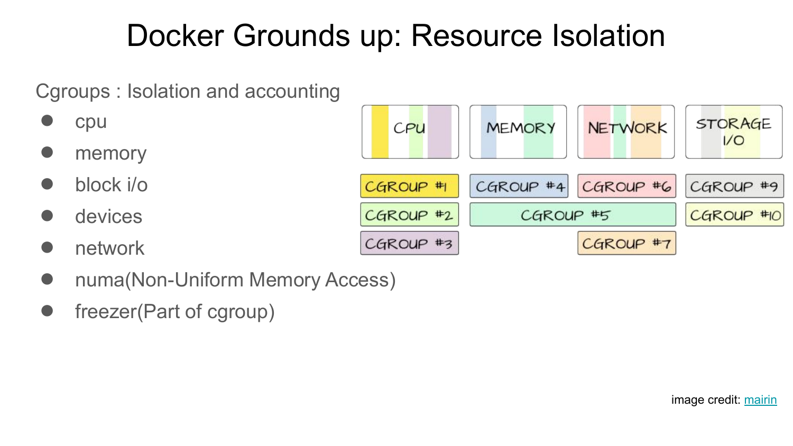
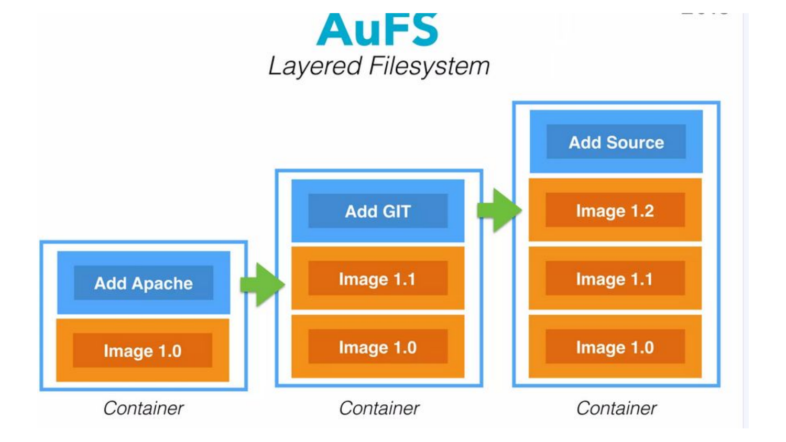
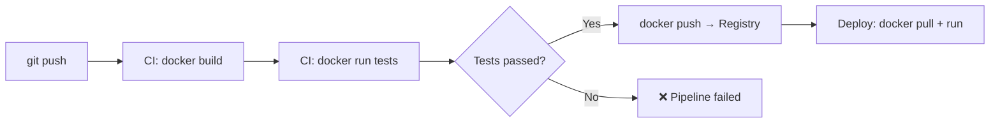

# Лекція 9: Docker & Containerization. «It works on my machine» — більше не аргумент

**Аудиторія:** 2-й курс (Junior Strong)
**Ціль:** Розібратись, що таке контейнер і чому він вирішив одну з найстаріших проблем розробки. Навчитись писати Dockerfile і розуміти lifecycle образу.

> **English version:** [English](en/09_docker.md)

---

## 1. Відкрита дискусія (Warm-up)

Класична ситуація в команді:

> Розробник: «У мене все працює!»
> Тестувальник: «А у мене не запускається.»
> Розробник: «Ну значить у тебе щось не так налаштовано.»

Питання до групи: чому так відбувається? І чи це технічна чи людська проблема?

<details markdown="1">
<summary>Розгорнути відповідь</summary>

Це технічна проблема: середовища різняться. На машині розробника стоїть Java 21, у тестувальника — Java 17. У розробника PostgreSQL 15, у тестувальника — 14. У розробника змінна `DATABASE_URL` в `.bashrc`, у тестувальника — немає.

«It works on my machine» — це симптом відсутності відтворюваного середовища. Якщо запуск застосування залежить від стану конкретної машини — це архітектурна проблема, а не людська.

Docker вирішує це радикально: середовище пакується разом із застосуванням. Якщо образ запускається на вашій машині — він запуститься на сервері, у колеги та в CI/CD.

</details>

---

## 2. Контейнер vs Віртуальна машина

Два підходи до ізоляції середовищ — різні компроміси.

```
Віртуальна машина (VM):           Контейнер (Docker):
┌─────────────────────┐            ┌─────────────────────┐
│    Application A    │            │    Application A     │
├─────────────────────┤            ├─────────────────────┤
│    Guest OS (Linux) │            │   Container Runtime  │
├─────────────────────┤            ├─────────────────────┤
│    Hypervisor       │            │    Host OS (Linux)   │
├─────────────────────┤            ├─────────────────────┤
│    Host OS          │            │    Hardware          │
├─────────────────────┤            └─────────────────────┘
│    Hardware         │
└─────────────────────┘
```

| Характеристика | VM | Container |
| :--- | :--- | :--- |
| Час запуску | Хвилини | Секунди |
| Розмір образу | Гігабайти | Мегабайти |
| Ізоляція | Повна (окреме ядро) | Процесна (спільне ядро) |
| Overhead | Великий | Мінімальний |
| Де використовують | Різні OS, повна ізоляція | Мікросервіси, CI/CD |

Контейнери не замінюють VM — вони вирішують різні задачі. У хмарі часто поєднують: VM як інфраструктура, контейнери як спосіб деплою застосувань.

### Контейнер — це ще один рівень абстракції над OS

Контейнер не є нічим принципово новим. Це абстракція над двома механізмами ядра Linux, що існують з 2006–2008 років:

**cgroups (Control Groups)** — обмежують ресурси процесу:
- скільки CPU може використати контейнер (`--cpus=0.5`)
- скільки RAM (`--memory=512m`)
- скільки disk I/O і мережевої пропускної здатності

**Namespaces** — ізолюють видимість:
- `pid` namespace: контейнер бачить тільки свої процеси, не бачить процеси хоста
- `net` namespace: власний мережевий стек, свій IP
- `mnt` namespace: власна файлова система (не бачить файлів хоста)
- `uts` namespace: власне hostname



Docker — це зручний CLI і daemon поверх цих механізмів. Коли ви запускаєте `docker run`, ядро Linux:
1. Створює нові namespaces для ізоляції процесу.
2. Встановлює cgroup-ліміти на ресурси.
3. Монтує union filesystem (overlay2) для шарів образу.

```
Рівні абстракції:
┌─────────────────────────────┐
│  docker run my-app          │ ← Docker CLI (зручність)
├─────────────────────────────┤
│  containerd / runc          │ ← Container Runtime
├─────────────────────────────┤
│  cgroups + namespaces       │ ← Linux Kernel механізми
├─────────────────────────────┤
│  Linux Kernel               │ ← Ядро (спільне для всіх контейнерів)
├─────────────────────────────┤
│  Hardware                   │
└─────────────────────────────┘
```

Практичний наслідок: Docker-контейнер на Linux — це звичайний процес на хості з обмеженим «видом». Якщо зайти на сервер і виконати `ps aux` — побачите process id вашого Java-застосування серед інших процесів машини. Жодної магії.

---

## 3. Ключові концепції Docker

### Image (Образ)

Image — незмінний (immutable) шаблон для контейнера. Містить ОС, залежності, код.

Image складається зі шарів (layers). Кожна інструкція в Dockerfile — новий шар.

```
Layer 4: COPY app.jar /app.jar          ← ваш код
Layer 3: RUN apt-get install curl       ← залежності
Layer 2: FROM eclipse-temurin:21-jre    ← базовий образ
Layer 1: debian:bookworm                ← база базового образу
```



Шари кешуються. Якщо шар не змінився — Docker не перезбирає його. Тому важливий порядок: рідко змінюване (залежності) — вгорі, часто змінюване (код) — внизу.

### Container (Контейнер)

Container — запущений екземпляр Image. Image:Container = Клас:Об'єкт у ООП.

З одного Image можна запустити 100 ідентичних контейнерів. Вони ізольовані один від одного, але спільно використовують шари Image.

### Registry

Registry — сховище для Image. Docker Hub — публічний. Використовується також приватний registry (AWS ECR, Google Artifact Registry, GitHub Container Registry).

```
Lifecycle образу:
  docker build  → Image на локальній машині
  docker push   → Image у Registry
  docker pull   → Image на іншу машину / сервер
  docker run    → Container з Image
```

---

## 4. Dockerfile: збірка образу крок за кроком

### Базовий Dockerfile для Spring Boot

```dockerfile
# Stage 1: Build
FROM eclipse-temurin:21-jdk AS builder
WORKDIR /build
COPY pom.xml .
COPY src ./src
RUN ./mvnw package -DskipTests

# Stage 2: Runtime
FROM eclipse-temurin:21-jre
WORKDIR /app
COPY --from=builder /build/target/*.jar app.jar
EXPOSE 8080
ENTRYPOINT ["java", "-jar", "app.jar"]
```

### Multi-stage build: чому це важливо

Single-stage build: фінальний образ містить JDK (700MB), Maven, вихідний код. Ви відправляєте в production інструменти, що там не потрібні.

Multi-stage build: stage `builder` використовує JDK для компіляції. Stage `runtime` бере тільки скомпільований `.jar` і мінімальний JRE (~200MB). У фінальному образі немає Maven, JDK, вихідного коду.

Менший образ = швидше завантажується з Registry, менше поверхня атаки для вразливостей.

### Оптимізація кешування шарів

```dockerfile
# ❌ Погано: при зміні коду перекачуємо всі залежності
COPY . .
RUN mvn package

# ✅ Добре: залежності кешуються окремо від коду
COPY pom.xml .
RUN mvn dependency:go-offline   # ← кешується, якщо pom.xml не змінився
COPY src ./src
RUN mvn package -DskipTests     # ← перезбирається тільки при зміні src
```

Коли змінюється тільки `src/main/java/MyClass.java` — Docker не перезавантажує залежності, бо шар з `pom.xml` не змінився. Збірка на 30-60 секунд швидша.

---

## 5. Команди Docker: базовий мінімум

```bash
# Збірка образу з поточної директорії
docker build -t my-app:1.0 .

# Запустити контейнер (порт 8080 host → 8080 container)
docker run -p 8080:8080 my-app:1.0

# Запустити у фоні (detached mode)
docker run -d -p 8080:8080 --name my-app my-app:1.0

# Переглянути запущені контейнери
docker ps

# Логи контейнера
docker logs my-app
docker logs -f my-app  # follow (стримінг)

# Зайти всередину контейнера (для дебагу)
docker exec -it my-app /bin/sh

# Зупинити і видалити
docker stop my-app
docker rm my-app

# Видалити образ
docker rmi my-app:1.0
```

---

## 6. Docker Compose: кілька сервісів разом

Реальне застосування рідко живе самотньо. Йому потрібні БД, черга, кеш. Docker Compose дозволяє описати всі сервіси в одному файлі:

```yaml
# docker-compose.yml
version: "3.9"

services:
  app:
    build: .
    ports:
      - "8080:8080"
    environment:
      SPRING_DATASOURCE_URL: jdbc:postgresql://db:5432/mydb
      SPRING_DATASOURCE_USERNAME: postgres
      SPRING_DATASOURCE_PASSWORD: secret
    depends_on:
      db:
        condition: service_healthy

  db:
    image: postgres:15
    environment:
      POSTGRES_DB: mydb
      POSTGRES_USER: postgres
      POSTGRES_PASSWORD: secret
    volumes:
      - postgres_data:/var/lib/postgresql/data
    healthcheck:
      test: ["CMD-SHELL", "pg_isready -U postgres"]
      interval: 5s
      timeout: 5s
      retries: 5

  redis:
    image: redis:7-alpine
    ports:
      - "6379:6379"

volumes:
  postgres_data:
```

```bash
# Запустити всі сервіси
docker compose up -d

# Зупинити і видалити контейнери
docker compose down

# Зупинити, видалити контейнери І volume (всі дані)
docker compose down -v
```

З цим файлом будь-який розробник в команді запускає повне середовище однією командою. Без «та ти ж маєш встановити PostgreSQL і Redis».

---

## 7. Змінні середовища і секрети

Жодного секрету в Dockerfile або в коді. Конфігурація — через змінні середовища.

```dockerfile
# ❌ Ніколи так не робіть
ENV DATABASE_PASSWORD=mypassword123

# ✅ Значення передається при запуску
ENV DATABASE_PASSWORD=""
```

```bash
# Передати при запуску
docker run -e DATABASE_PASSWORD=secret my-app

# Або через .env файл (не комітимо в Git!)
docker run --env-file .env my-app
```

`.env` файл додаємо до `.gitignore`. В README пишемо `.env.example` з описом змінних без значень. Так секрети ніколи не потрапляють в репозиторій.

---

## 8. Docker у CI/CD пайплайні



Типовий пайплайн GitHub Actions:

```yaml
name: Build and Deploy

on: [push]

jobs:
  build:
    runs-on: ubuntu-latest
    steps:
      - uses: actions/checkout@v4

      - name: Build Docker image
        run: docker build -t my-app:${{ github.sha }} .

      - name: Run tests in container
        run: |
          docker run --rm \
            -e SPRING_PROFILES_ACTIVE=test \
            my-app:${{ github.sha }} \
            java -jar app.jar --run-tests

      - name: Push to Registry
        run: |
          docker tag my-app:${{ github.sha }} ghcr.io/org/my-app:latest
          docker push ghcr.io/org/my-app:latest
```

---

## 9. Екзаменаційний пул (Exam Questions)

**Питання 1: У чому різниця між Docker Image і Docker Container?**

<details markdown="1">
<summary>Еталонна відповідь</summary>

Image — незмінний (read-only) шаблон. Містить ОС, залежності, код. Це як клас у ООП.

Container — запущений екземпляр Image, має власний writable шар поверх Image. Це як об'єкт у ООП.

З одного Image можна запустити кілька ізольованих контейнерів. Зупинений контейнер можна видалити — Image залишається. Видалений Image не впливає на вже запущені контейнери (вони мають свою копію шарів).

</details>

**Питання 2: Що таке Multi-Stage Build і為什麼він важливий для безпеки?**

<details markdown="1">
<summary>Еталонна відповідь</summary>

Multi-Stage Build дозволяє використовувати кілька базових образів в одному Dockerfile. Типово: перший stage — збірка (JDK, Maven, компілятор), другий stage — runtime (тільки JRE, без інструментів збірки).

Важливість для безпеки: інструменти збірки (JDK, Maven, curl) збільшують поверхню атаки. Кожен додатковий пакет — потенційна CVE. Мінімальний runtime-образ містить тільки те, що потрібно для роботи програми.

Практичний ефект: образ зменшується з ~700MB (JDK) до ~200MB (JRE). Менший образ — швидше деплоїться і менше вразливостей.

</details>

**Питання 3: Чому порядок інструкцій у Dockerfile впливає на час збірки?**

<details markdown="1">
<summary>Еталонна відповідь</summary>

Docker кешує шари (layers). Якщо шар не змінився після попередньої збірки — Docker використовує кеш і не виконує інструкцію повторно. Кеш інвалідується для всіх наступних шарів, якщо змінився поточний.

Правило: те, що змінюється рідко (залежності, `pom.xml`), — на початку. Те, що змінюється часто (вихідний код) — в кінці.

Якщо скопіювати весь проєкт (`COPY . .`) першим — зміна будь-якого файлу інвалідує весь кеш і завантажує всі залежності заново.

</details>

**Питання 4: Як правильно передавати секрети (паролі, API-ключі) у Docker-контейнер?**

<details markdown="1">
<summary>Еталонна відповідь</summary>

Секрети ніколи не вбудовуються в Image через `ENV` або `COPY`. Причина: вони видимі через `docker inspect` і назавжди залишаються в history шарів.

Правильні способи:
1. Передавати через змінні середовища при `docker run -e KEY=value` або через `--env-file .env`.
2. У production — через оркестратор (Kubernetes Secrets, Docker Swarm Secrets, AWS Secrets Manager).

`.env` файл зі значеннями не комітимо в Git — тільки `.env.example` з описом без значень.

</details>

---

**[⬅️ Лекція 8: Test Cases](08_test_cases.md)** | **[Лекція 10: Distributed Systems ➡️](10_distributed_systems.md)**

**[⬅️ Повернутися до головного меню курсу](index.md)**
