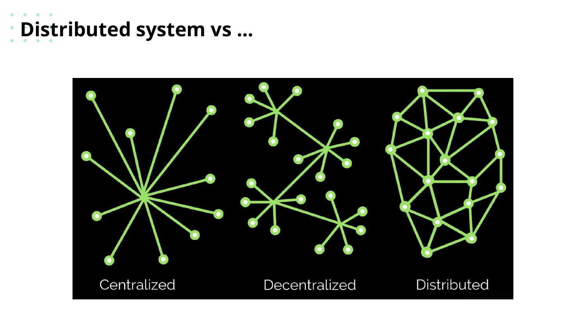
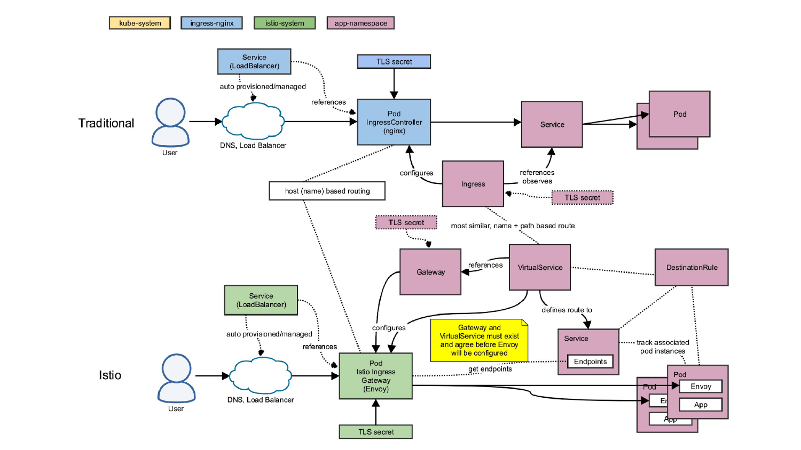

# Лекція 10: Розподілені Системи. Чому мережа завжди бреше

**Аудиторія:** 2-й курс (Junior Strong)
**Ціль:** Зрозуміти, чим розподілена система відрізняється від монолітної. Навчитись виявляти типові патерни відмов, розбиратись в Observability і вміти troubleshootити реальні проблеми в Kubernetes.

> **English version:** [English](en/10_distributed_systems.md)

---

## 1. Відкрита дискусія (Warm-up)

Ваш моноліт успішно обробляє 500 RPS. Бізнес росте, і ви розбиваєте його на 10 мікросервісів. Кожен сервіс ідеально написаний і покритий тестами.

Питання: чому після декомпозиції система стала менш надійною?

<details markdown="1">
<summary>Розгорнути відповідь</summary>

У моноліті виклик між модулями — це виклик функції. Він або виконується, або падає з виключенням. Час: мікросекунди.

У розподіленій системі виклик між сервісами — це HTTP або gRPC через мережу. Мережа може: затриматися, пропасти на секунду, повернути помилку без причини, успішно виконати запит, але втратити відповідь.

10 мікросервісів із надійністю 99.9% кожен дають загальну надійність: 0.999¹⁰ = 99%. Що означає в 10 разів більше downtime, ніж у кожного сервісу окремо.

Розподіленість вирішує проблеми масштабування, але створює нові проблеми надійності. Ваша задача — проєктувати з урахуванням цього.

</details>



---

## 2. Вісім хибних припущень (Fallacies of Distributed Computing)

Peter Deutsch і James Gosling (Sun Microsystems) описали помилки, які роблять архітектори-початківці. Ці помилки актуальні й у 2024 році.

**1. Мережа надійна.**
Реальність: пакети губляться, TCP-з'єднання рвуться без попередження, DNS fails. Рішення: Retry з Exponential Backoff + Jitter, Dead Letter Queue для повідомлень.

**2. Latency нульова.**
Реальність: виклик між сервісами в одному дата-центрі — 0.5–5мс. Через океан — 120–200мс. N+1 викликів у циклі перетворює мілісекунди в секунди. Рішення: Data Locality, Batch requests, кешування.

**3. Пропускна здатність безмежна.**
Реальність: 1 Gbps канал легко забити нестиснутим JSON або логами. Рішення: Protobuf/gRPC (бінарні формати), Compression (Gzip), Pagination.

**4. Мережа безпечна.**
Реальність: Sniffing, MITM-атаки, злом маршрутизаторів. Рішення: mTLS (Mutual TLS), Zero Trust Architecture — жодного «довіряємо внутрішній мережі».

**5. Топологія стабільна.**
Реальність: у Kubernetes pod'и — ефемерні. IP змінюються при редеплої. Рішення: Service Discovery (Consul, K8s DNS), будь-який сервіс звертається тільки до імені, не до IP.

**6. Є один адміністратор.**
Реальність: у мікросервісній архітектурі кожна команда керує своїм сервісом. Немає єдиного «хто контролює все». Рішення: стандартизовані протоколи (OpenAPI, AsyncAPI), Contract Testing.

**7. Транспортна вартість нульова.**
Реальність: серіалізація/десеріалізація JSON коштує CPU. Мережевий I/O — найдорожчий ресурс після disk. Рішення: профілювання, Flamegraph, вибір ефективних форматів даних.

**8. Мережа однорідна.**
Реальність: різні частини системи можуть бути на різних cloud-провайдерах, в різних регіонах, з різними MTU і bandwidth. Рішення: не передбачати і не хардкодити мережеві параметри.

---

## 3. CAP-теорема: фізичний компроміс

Eric Brewer (2000): розподілена система не може одночасно гарантувати всі три властивості:

- **C (Consistency)** — кожен запит отримує найновіші дані або помилку.
- **A (Availability)** — кожен запит отримує відповідь (можливо, застарілу).
- **P (Partition Tolerance)** — система продовжує працювати при мережевому поділі.

Мережевий поділ (P) у реальних системах неминучий. Тому вибір — між C і A.

| Тип | Приклади | Поведінка при partition | Де застосовують |
| :--- | :--- | :--- | :--- |
| CP | HBase, Zookeeper, etcd | Стає недоступним, але дані свіжі | Банківські транзакції, конфігурація |
| AP | Cassandra, DynamoDB, CouchDB | Відповідає, але дані можуть бути старими | Стрічка новин, лічильники лайків |

**Eventual Consistency** — стан AP-систем: рано чи пізно всі вузли відображатимуть однакові дані. «Рано чи пізно» — це від мілісекунд до секунд.

<details markdown="1">
<summary>Приклад: Amazon Shopping Cart і Eventual Consistency</summary>

Amazon Shopping Cart використовує AP-архітектуру. Якщо виникне мережевий поділ між двома дата-центрами — система дозволить додавати товари до кошика в обох.

Ціна: при синхронізації виникне конфлікт. Amazon вирішує його «merge обох версій» — обидва товари будуть у кошику. Краще мати зайвий товар у кошику, ніж не дозволити купити.

Це свідоме архітектурне рішення. Бізнес-логіка дозволяє таку неконсистентність.

</details>

---

## 4. Патерни надійності: як не падати каскадно

### Circuit Breaker (Автоматичний вимикач)

Проблема: Сервіс A викликає Сервіс B. B починає відповідати повільно (5–30 сек). Всі потоки A зайняті очікуванням. A теж «падає». Каскадний збій.

Рішення: Circuit Breaker моніторить виклики. При перевищенні порогу помилок — «розмикає ланцюг» і одразу повертає помилку без очікування.

```
Стани:
  CLOSED  → нормальна робота, запити проходять
  OPEN    → помилок забагато, одразу повертаємо fallback
  HALF-OPEN → тест: пропускаємо один запит, перевіряємо відновлення
```

Бібліотеки: Resilience4j (Java), Hystrix (deprecated).

### Bulkhead (Водонепроникна перебирання)

Ізоляція пулів потоків між сервісами. Якщо Сервіс B деградує і з'їдає всі потоки — Сервіс C (інший downstream) не постраждає.

```
❌ Без Bulkhead:     ✅ З Bulkhead:
Загальний пул        Thread Pool A (для Сервісу B): 10 потоків
100 потоків          Thread Pool B (для Сервісу C): 10 потоків
                     B деградує → тільки pool A заблокований
```

### Retry з Jitter

Проблема: 1000 сервісів одночасно отримали помилку і одночасно роблять retry. «Thundering Herd» — навантаження в 1000x.

Рішення: Exponential Backoff + Jitter (випадкова затримка):

```
Attempt 1: wait = 1s + random(0, 0.5s)
Attempt 2: wait = 2s + random(0, 1s)
Attempt 3: wait = 4s + random(0, 2s)
```

Клієнти розподіляються в часі, пік навантаження зникає.

### Graceful Degradation

Якщо залежний сервіс недоступний — показати щось корисне замість помилки:

- Рекомендації недоступні → показати «Топ продажів».
- Сервіс персоналізації впав → показати загальний контент.
- Пошук повільний → показати кешований результат з позначкою «оновлюється».

---

## 5. Messaging Patterns: асинхронна комунікація

Синхронний REST-виклик: якщо отримувач недоступний — запит губиться.
Асинхронне повідомлення в черзі: якщо отримувач недоступний — повідомлення чекає.

### Point-to-Point (Черга)

```
Producer → [Queue] → Consumer
```

Одне повідомлення, один консюмер. Використовують для: обробки замовлень, відправки email, фонових задач.

### Publish-Subscribe (Топік)

```
Producer → [Topic] → Consumer A
                   → Consumer B
                   → Consumer C
```

Одне повідомлення, кілька підписників. Використовують для: аналітики, аудит-логів, реплікації подій між сервісами.

### Dead Letter Queue (DLQ)

Якщо консюмер не може обробити повідомлення (помилка, невалідні дані) — після N спроб повідомлення йде в DLQ. Звідти його аналізують вручну або через окремий процес.

DLQ — це «ловушка помилок», яка запобігає нескінченному циклу retry.

---

## 6. Observability: бачити, що відбувається

Observability — здатність зрозуміти внутрішній стан системи за зовнішніми даними. Три стовпи:

### Metrics (Метрики)

Числові показники в часі. Зазвичай — Prometheus + Grafana.

Модель RED (для сервісів):
- **R**ate — кількість запитів за секунду (RPS).
- **E**rror — відсоток помилок.
- **D**uration — latency (P50, P95, P99).

Модель USE (для ресурсів):
- **U**tilization — завантаженість (CPU 80%).
- **S**aturation — черга (disk I/O queue length).
- **E**rrors — помилки (network drops, disk errors).

### Logs (Логи)

Структуровані логи (JSON) замість текстових рядків:

```json
{
  "timestamp": "2024-03-15T10:30:00Z",
  "level": "ERROR",
  "service": "order-service",
  "trace_id": "abc123",
  "user_id": 42,
  "message": "Payment failed",
  "error_code": "INSUFFICIENT_FUNDS"
}
```

Structured logging дозволяє фільтрувати і агрегувати логи за будь-яким полем. ELK Stack (Elasticsearch + Logstash + Kibana) або Grafana Loki — типові рішення.

Централізований logging: всі логи з усіх сервісів — в одному місці. Без цього troubleshoot розподіленої системи нереальний.

### Distributed Tracing (Розподілене трасування)

Проблема: запит проходить через 10 сервісів. Де затримка? Який сервіс повільний?

Рішення: кожен запит отримує унікальний `TraceID`. Кожен сервіс додає свій `Span` (відрізок роботи) з часом початку і кінця. В кінці — повна картина шляху запиту.

```
TraceID: abc123
  ├── api-gateway        [0ms → 5ms]
  ├── order-service      [5ms → 45ms]
  │     ├── postgres     [6ms → 40ms]  ← тут затримка!
  └── notification       [45ms → 50ms]
```

**OpenTelemetry** — vendor-neutral стандарт для трасування. Підтримує Java, Go, Python та ін. Основні концепції:
- **Span** — одиниця роботи (один виклик, один запит до БД).
- **Trace** — набір пов'язаних Span, що описують повний шлях запиту.
- **Baggage** — контекст, який передається між Span.
- **Exporters** — відправляють трейси в Jaeger, Zipkin або Tempo.

---

## 7. Kubernetes: практичний troubleshooting

Kubernetes (K8s) — де запускаються більшість мікросервісів у production. Треба вміти діагностувати проблеми без доступу до сервера.



### Pod Lifecycle

```
Pending → ContainerCreating → Running → (Succeeded | Failed)
                                  ↓
                              Terminating
```

- **Pending**: Pod не може стартувати — немає ресурсів (CPU/RAM) або не знайдено підходящий вузол.
- **Running**: контейнер запущений, але це не означає «здоровий» (Readiness probe може бути failing).
- **CrashLoopBackOff**: контейнер падає при старті, K8s повторює спроби з backoff.

### Типові помилки Pod'ів

**ImagePullBackOff:** K8s не може завантажити Docker-образ. Причини:
- невірна назва образу або тег.
- Registry недоступний.
- відсутні credentials.

**CrashLoopBackOff:** контейнер запускається і одразу падає. Причини:
- помилка в застосуванні при старті.
- некоректна конфігурація (відсутня env variable).
- Liveness probe занадто агресивна.

```bash
# Дивимось, що відбувається:
kubectl logs pod-name
kubectl logs pod-name --previous   # логи попереднього (впалого) контейнера
kubectl describe pod pod-name      # events і стан
```

### Troubleshooting 4xx помилок

```
Чек-ліст:
1. kubectl logs <pod> | grep ERROR
2. kubectl get svc — чи правильний port?
3. kubectl describe endpoints <сервіс> — чи є pod'и в endpoints?
4. kubectl exec -it <pod> -- curl localhost:8080/health — чи відповідає зсередини?
```

### Troubleshooting 5xx помилок

```
Чек-ліст:
1. kubectl logs <pod> — application stack trace
2. kubectl top pod — чи не перевищено CPU/Memory limits?
3. kubectl describe pod — чи не було OOMKilled?
4. kubectl get events --sort-by='.lastTimestamp' — останні події кластера
```

### Pod Exit Codes: що означає кожен

| Exit Code | Причина | Що робити |
| :--- | :--- | :--- |
| 0 | Штатне завершення | Норма |
| 1 | Помилка застосування | Дивитись логи |
| 137 | SIGKILL (OOMKilled) | Збільшити memory limit або знайти memory leak |
| 139 | Segmentation fault | Bug у JVM або native коді |
| 143 | SIGTERM (graceful stop) | Норма при rolling update |

### QoS Classes: хто виживе при нестачі ресурсів

Kubernetes евікує Pod'и в порядку від BestEffort до Guaranteed:

| QoS Class | Умова | Стійкість до евікції |
| :--- | :--- | :--- |
| Guaranteed | requests == limits для CPU і RAM | Найвища |
| Burstable | requests < limits | Середня |
| BestEffort | requests і limits не вказані | Перший на евікцію |

Production-сервіси мають бути **Guaranteed** або **Burstable** з чітко заданими `limits`.

---

## 8. Інженерний insight: математика ненадійності

<details markdown="1">
<summary>Availability в ланцюзі залежностей</summary>

Якщо сервіс A залежить від сервісу B, а B — від C:

$$\text{Availability}_{total} = A_A \times A_B \times A_C$$

При $A = 99.9\%$ для кожного:

$$0.999 \times 0.999 \times 0.999 = 99.7\%$$

Що означає: 26 годин downtime на рік замість 8.7.

При 10 залежностях: $0.999^{10} = 99\%$ → 87 годин downtime.

Висновок: кожна нова залежність знижує загальну надійність. Це не привід уникати мікросервісів, але привід реалізовувати Circuit Breaker і Graceful Degradation для кожного downstream-виклику.

</details>

---

## 9. Екзаменаційний пул (Exam Questions)

**Питання 1: Поясніть CAP-теорему. Яку властивість і чому неможливо пожертвувати?**

<details markdown="1">
<summary>Еталонна відповідь</summary>

CAP: Consistency (всі вузли бачать однакові дані), Availability (система завжди відповідає), Partition Tolerance (система продовжує працювати при мережевому поділі).

Partition Tolerance пожертвувати неможливо: мережевий поділ в реальних розподілених системах неминучий. Вибір завжди між C і A при виникненні partition.

CP-системи (HBase, Zookeeper): при partition стають недоступними, але дані консистентні. Підходять для транзакцій.
AP-системи (Cassandra, DynamoDB): при partition відповідають застарілими даними. Підходять для соцмереж, аналітики.

</details>

**Питання 2: Що таке Circuit Breaker і яку проблему він вирішує?**

<details markdown="1">
<summary>Еталонна відповідь</summary>

Circuit Breaker запобігає каскадним збоям. Якщо downstream-сервіс відповідає повільно або з помилками — без CB усі потоки upstream-сервісу заблоковані очікуванням, і upstream теж падає.

CB моніторить кількість помилок. При перевищенні порогу «розмикає ланцюг» — одразу повертає помилку (або fallback) без мережевого виклику. Через деякий час «напів-відкривається» для тестового запиту — чи відновився downstream.

Три стани: CLOSED (норма), OPEN (ланцюг розімкнений), HALF-OPEN (тест).

</details>

**Питання 3: Чим Distributed Tracing відрізняється від звичайного logging?**

<details markdown="1">
<summary>Еталонна відповідь</summary>

Logging фіксує події всередині одного сервісу. Щоб знайти проблему, яка виникає на межі кількох сервісів, треба вручну корелювати логи різних сервісів — довго і ненадійно.

Distributed Tracing прив'язує всі операції по ланцюгу сервісів до одного TraceID. Можна візуально побачити: скільки часу провів запит у кожному сервісі, де bottleneck, де помилка. Jaeger або Zipkin показують це у вигляді Gantt-діаграми.

</details>

**Питання 4: Pod у Kubernetes знаходиться в стані CrashLoopBackOff. Ваш план дій?**

<details markdown="1">
<summary>Еталонна відповідь</summary>

1. `kubectl logs <pod> --previous` — логи впалого контейнера (не поточного). Шукаємо stack trace.
2. `kubectl describe pod <pod>` — розділ Events: чи є OOMKilled, чи Liveness probe fails.
3. Якщо OOMKilled — збільшити `memory: limits` або шукати memory leak через heap dump.
4. Якщо помилка конфігурації — перевірити environment variables, secretRef, configMapRef.
5. Якщо Liveness probe — розслабити thresholds (`failureThreshold`, `initialDelaySeconds`).

</details>

---

**[⬅️ Лекція 9: Docker](09_docker.md)** | **[Лекція 11: System Design ➡️](11_system_design.md)**

**[⬅️ Повернутися до головного меню курсу](index.md)**
