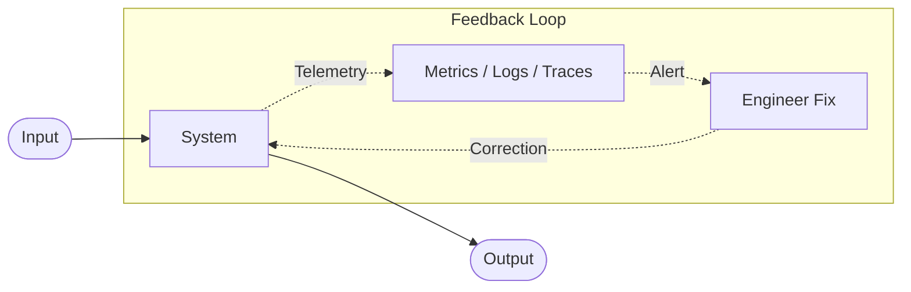

# Лекція 10: Розподілені Системи. Чому мережа завжди бреше

**Аудиторія:** 2-й курс (Junior Strong)
**Ціль:** Зрозуміти, чим розподілена система відрізняється від монолітної. Навчитись виявляти типові патерни відмов, розбиратись в Observability і вміти усувати несправності в реальних проблемах в Kubernetes.

> **English version:** [English](en/10_distributed_systems.md)

---

## 1. Відкрита дискусія (Warm-up)

Ваш моноліт успішно обробляє 500 RPS. Бізнес росте, і ви розбиваєте його на 10 мікросервісів. Кожен сервіс ідеально написаний і покритий тестами.

Питання: чому після декомпозиції система стала менш надійною?

<details markdown="1">
<summary>Розгорнути відповідь</summary>

У моноліті виклик між модулями — це виклик функції. Він або виконується, або падає з виключенням. Час: мікросекунди.

У розподіленій системі виклик між сервісами — це HTTP або gRPC через мережу. Мережа може: затриматися, пропасти на секунду, повернути помилку без причини, успішно виконати запит, але втратити відповідь.

10 мікросервісів із надійністю 99.9% кожен дають загальну надійність: 0.999¹⁰ = 99%. Що означає в 10 разів більше downtime, ніж у кожного сервісу окремо.

> **Математика downtime на рік (8760 годин):**
> * **1 сервіс (99.9% uptime):** 0.1% downtime = ~8.76 годин простою.
> * **Система з 10 сервісів (99.0% загального uptime):** 1.0% downtime = ~87.6 годин простою.
> * `87.6 / 8.76 = 10` разів.
> 
> *Чому так?* Якщо сервіси "падають" у різний час (незалежні збої), їхні часи простою додаються. У розподілених системах із синхронними викликами (де сервіси чекають один на одного) відмова будь-якого одного компонента призводить до відмови всієї операції.

Розподіленість вирішує проблеми масштабування, але створює нові проблеми надійності. Ваша задача — проєктувати з урахуванням цього.

</details>


## 2. Топології систем: Централізовані, Децентралізовані, Розподілені

Зображення вище добре демонструє три основні підходи до побудови систем:

**1. Централізована система (Centralized)**
Усі вузли (клієнти) підключені до єдиного центрального сервера.
* **Переваги:** Проста розробка, легко забезпечити консистентність даних (все в одному місці).
* **Недоліки:** Single Point of Failure (SPOF). Падає центр — падає все. Погано масштабується.
* **Приклад:** Класичний веб-сайт із базою даних на одному сервері. Традиційний банківський Mainframe.

**2. Децентралізована система (Decentralized)**
Система розбита на кілька "суб-центрів", до яких підключаються клієнти. Немає єдиного центру управління, є ієрархія або регіональні хаби.
* **Переваги:** Немає єдиної точки відмови. Якщо падає один хаб, інші продовжують працювати.
* **Недоліки:** Складніша синхронізація між хабами. Можлива неконсистентність.
* **Приклад:** Мережа серверів електронної пошти. Багатокористувацькі ігри з серверами у різних регіонах (EU, US, ASIA).

**3. Розподілена система (Distributed)**
Усі вузли рівноправні або виконують спеціалізовані ролі, але працюють як єдине ціле. Дані та обчислення розподілені по всій мережі.
* **Переваги:** Висока відмовостійкість, безмежне горизонтальне масштабування.
* **Недоліки:** Екстремальна складність розробки, мережеві затримки, CAP-теорема.
* **Приклад:** Сучасний мікросервісний бекенд Netflix, розподілені бази даних (Cassandra), Blockchain.

---

## 3. Коротко про Kubernetes (Оркестрація)

Коли система стає розподіленою і містить десятки чи сотні мікросервісів у Docker-контейнерах, виникає проблема управління: хто перезапускає впавші сервіси? Як балансувати трафік?

**Kubernetes (K8s)** — це оркестратор контейнерів. Це "операційна система" для кластера серверів, яка бере на себе рутину:
* **Self-healing:** K8s автоматично перезапускає контейнери, якщо вони падають.
* **Scaling:** K8s може автоматично піднімати нові копії сервісу при зростанні навантаження.
* **Service Discovery:** Надає сервісам внутрішні DNS-імена, щоб вони знаходили одне одного (вирішує проблему стабільності топології).
* **Load Balancing:** Розподіляє запити між усіма живими копіями мікросервісу.

### Міні-архітектура Kubernetes

Кластер K8s фізично поділяється на два типи серверів (вузлів):

1. **Master Node (Control Plane):** "Мозок" кластера. Він не запускає ваші додатки. Його задача — приймати команди (через API), стежити за загальним станом, планувати, де запустити нові контейнери (Scheduler), та надійно зберігати конфігурацію (в базі etcd).
2. **Worker Node:** "Робочі конячки". Це сервери, на яких фізично працюють ваші Docker-контейнери (упаковані в K8s-абстракцію, що називається *Pod*). На кожному Worker-вузлі працює `kubelet` — системний агент, який слухає вказівки від Master Node і безпосередньо керує контейнерами на своїй машині.

**Як вони взаємодіють:**
Ви (як інженер) кажете Master Node: *"Я хочу, щоб завжди працювало 3 копії мого сервісу 'Кошик'"*. Master Node записує це як бажаний стан (desired state). Далі він знаходить найменш завантажені Worker Nodes і наказує їхнім `kubelet`-ам запустити контейнери. Якщо один Worker Node раптово вимикається (апаратний збій), Master Node помічає, що живих копій залишилося менше трьох, і миттєво дає команду іншому, живому Worker Node підняти відсутню копію. Так працює Self-healing.

---

## 4. Вісім хибних припущень (Fallacies of Distributed Computing)

Peter Deutsch і James Gosling (Sun Microsystems) описали помилки, які роблять архітектори-початківці. Ці помилки актуальні й у 2024 році.

### I. Мережа

**1. Мережа надійна.**
> **Проблема (Thundering Herd):** Уявіть, що база даних "моргнула" на 1 секунду. 1000 мікросервісів одночасно отримали помилку. Якщо всі вони зроблять звичайний Retry рівно через 1 секунду, вони створять пік навантаження у 1000x і гарантовано "докують" базу даних. Фізики називають це резонансом.
> 
> **Архітектурне рішення:** Exponential Backoff + Jitter. Щоб згладити графік навантаження, ми вводимо стохастику (випадковість).
> - **Exponential Backoff:** Затримка зростає експоненційно ($2^n$). Перший повтор через 1с, другий через 2с, третій через 4с.
> - **Jitter (Тремтіння):** Додавання випадкової змінної R до базового часу очікування.
> 🧮 *Формула:* `wait_time = base * 2^n + random(0, base)`
> **Результат:** Замість одного руйнівного удару від 1000 сервісів, запити розподіляються у часі у вигляді нормального розподілу (дзвону). Система встигає відновитися.

**2. Latency нульова.**
> **Проблема (N+1 Query over Network):** Уявіть, що ви виводите список із 50 товарів. У моноліті це був би один SQL JOIN (1 мілісекунда). У мікросервісах ви робите 1 запит за списком товарів, а потім 50 окремих запитів до сервісу відгуків (по 50мс кожен). Замість 1мс ви отримуєте 2.5 секунди очікування на екрані користувача.
> 
> **Архітектурне рішення:** Batching, Data Locality & Caching. 
> - **Batch requests:** Замість 50 запитів по 1 ID, відправляємо 1 запит із масивом `[ID1, ID2... ID50]`.
> - **Data Locality:** Тримати дані, що часто читаються разом, фізично поруч (кеш або денормалізація).

**3. Мережа безпечна.**
> **Проблема (The Inside Threat):** Уявіть, що хакер знайшов вразливість у вашому "неважливому" сервісі генерації PDF, який крутиться у внутрішній мережі (VPC). Оскільки всі внутрішні сервіси історично довіряють один одному без паролів, хакер з PDF-генератора отримує повний доступ до бази платежів.
> 
> **Архітектурне рішення:** Zero Trust Architecture & mTLS. Жодних припущень про довіру на основі того, що сервіс "всередині периметра". Кожен мікросервіс має свій сертифікат і криптографічно автентифікує інший під час кожного запиту.

**4. Мережа однорідна.**
> **Проблема (The Fragmentation Bug):** Ваш сервіс у Франкфурті відправляє пакет даних (1500 байт) до сервісу в Токіо через VPN-тунель. VPN додає свої заголовки, пакет стає 1520 байт. Маршрутизатор провайдера дропає його без сповіщення, бо його ліміт MTU — 1500. Ваш додаток просто зависає (Blackhole).
> 
> **Архітектурне рішення:** Resilient Protocols. Не передбачати константні параметри мережі. Використовувати протоколи, що вміють адаптуватись до зміни умов (наприклад, TCP Path MTU Discovery).

### II. Топологія та Управління

**5. Топологія стабільна.**
> **Проблема (The Ghost IP):** Сервіс "Кошик" хардкодить IP-адресу 10.0.1.5 для зв'язку з сервісом "Склад". Вночі Kubernetes автоматично перезапускає (редеплоїть) "Склад" на іншому сервері. Він отримує новий ефемерний IP 10.0.2.15. Сервіс "Кошик" продовжує стукати у старий IP. Замовлення губляться.
> 
> **Архітектурне рішення:** Service Discovery (Consul, K8s DNS) та Client-side Load Balancing. Будь-який сервіс звертається тільки до логічного імені (наприклад `inventory-service`), а DNS автоматично маршрутизує на актуальні IP-адреси.

**6. Є один адміністратор.**
> **Проблема (The Breaking Contract):** Команда "Оплата" в суботу викатує нову версію, де поле `total_amount` стало називатись `amount_cents`. Команда "Кошик", яка не знала про це, починає сипати помилками 500, бо їхній парсер очікує старе поле.
> 
> **Архітектурне рішення:** Consumer-Driven Contract Testing. Використовувати стандартизовані протоколи (OpenAPI) та Contract Testing (напр. Pact). Команда "Кошик" пише тести на свої очікування, які автоматично крутяться в CI/CD команди "Оплата", не даючи зламати контракт.

### III. Транспорт та Ресурси

**7. Пропускна здатність безмежна.**
> **Проблема (The Log Flood):** Під час "Чорної П'ятниці" трафік зріс у 10 разів. Ваші сервіси почали активно писати DEBUG логи у вигляді великих JSON-об'єктів і відправляти їх до ElasticSearch. Мережевий канал (1 Gbps) повністю забився логами, і критичні фінансові транзакції перестали проходити.
> 
> **Архітектурне рішення:** Rate Limiting, Compression (Gzip) & Pagination. Динамічне управління рівнем логування та стиснення великих payloads.

**8. Транспортна вартість нульова.**
> **Проблема (The CPU Burner):** Ваш високонавантажений сервіс приймає 50,000 повідомлень за секунду у форматі JSON. Ви дивитесь на Flamegraph і бачите, що сервіс витрачає 70% всього процесорного часу (CPU) просто на серіалізацію/десеріалізацію тексту.
> 
> **Архітектурне рішення:** Binary Formats (Protobuf/gRPC). Замість текстового JSON переходимо на бінарні формати. Вони серіалізуються в рази швидше, займають менше місця і економлять найдорожчі ресурси: CPU та мережевий I/O.

---

## 5. CAP-теорема: фізичний компроміс

Eric Brewer (2000): розподілена система не може одночасно гарантувати всі три властивості:

- **C (Consistency)** — кожен запит отримує найновіші дані або помилку.
- **A (Availability)** — кожен запит отримує відповідь (можливо, застарілу).
- **P (Partition Tolerance)** — система продовжує працювати при мережевому поділі.

Мережевий поділ (P) у реальних системах неминучий. Тому вибір — між C і A.

| Тип | Приклади | Поведінка при partition | Де застосовують |
| :--- | :--- | :--- | :--- |
| CP | HBase, Zookeeper, etcd | Стає недоступним, але дані свіжі | Банківські транзакції, конфігурація |
| AP | Cassandra, DynamoDB, CouchDB | Відповідає, але дані можуть бути старими | Стрічка новин, лічильники лайків |

**Eventual Consistency** — стан AP-систем: рано чи пізно всі вузли відображатимуть однакові дані. «Рано чи пізно» — це від мілісекунд до секунд.

<details markdown="1">
<summary>Приклад: Amazon Shopping Cart і Eventual Consistency</summary>

Amazon Shopping Cart використовує AP-архітектуру. Якщо виникне мережевий поділ між двома дата-центрами — система дозволить додавати товари до кошика в обох.

Ціна: при синхронізації виникне конфлікт. Amazon вирішує його «merge обох версій» — обидва товари будуть у кошику. Краще мати зайвий товар у кошику, ніж не дозволити купити.

Це свідоме архітектурне рішення. Бізнес-логіка дозволяє таку неконсистентність.

</details>

<details markdown="1">
<summary>Інженерний insight: Проблема часу та стратегія LWW</summary>

Якщо ви обираєте Eventual Consistency, при злитті конфліктів системі потрібно зрозуміти, яка дія відбулася "останньою". Для цього часто використовується стратегія **LWW (Last Write Wins — перемагає останній запис)**. 

**Проблема:** якщо годинники на серверах розсинхронізовані (Clock Skew) навіть на мілісекунди, сервер із "поспішаючим" годинником збереже старі дані, які затруть більш нові дані із сервера, чий годинник "відстає". Це руйнує логіку бізнесу, адже система спирається на фізичний час, який у мережі є відносним і ненадійним. Саме тому покладатися на фізичний час серверів для вирішення конфліктів — це відомий антипатерн.
</details>

<details markdown="1">
<summary>Кейс: Як Google підкорив час (Spanner & TrueTime)</summary>

Класичні протоколи синхронізації часу (наприклад, NTP) мають похибку від мілісекунд до десятків мілісекунд. Для глобальної розподіленої бази даних це унеможливлює гарантування суворої консистентності без довгих блокувань.

**Рішення Google:** Для своєї бази даних **Spanner** вони створили хардверний **TrueTime API**. У кожному дата-центрі встановлено власні сервери часу, оснащені двома незалежними технологіями: **GPS-приймачами** та **атомними годинниками** (на основі рубідію).

TrueTime API повертає не точний час, а інтервал `[earliest, latest]`, гарантуючи, що справжній фізичний час знаходиться строго в цьому діапазоні (похибка зазвичай 1-7 мс). Якщо транзакції A потрібно переконатися, що транзакція B відбулася строго після неї, Spanner просто чекає (sleep) ці кілька мілісекунд, поки інтервали перестануть перетинатися. Це дозволило Google розв'язати фундаментальну проблему CAP-теореми (а саме проблему часу) на апаратному рівні.
</details>

---

## 6. Патерни надійності: як не падати каскадно

### Circuit Breaker (Автоматичний вимикач)

Проблема: Сервіс A викликає Сервіс B. B починає відповідати повільно (5–30 сек). Всі потоки A зайняті очікуванням. A теж «падає». Каскадний збій.

Рішення: Circuit Breaker моніторить виклики. При перевищенні порогу помилок — «розмикає ланцюг» і одразу повертає помилку без очікування.

```
Стани:
  CLOSED  → нормальна робота, запити проходять
  OPEN    → помилок забагато, одразу повертаємо fallback
  HALF-OPEN → тест: пропускаємо один запит, перевіряємо відновлення
```

Бібліотеки: Resilience4j (Java), Hystrix (deprecated).

### Bulkhead (Водонепроникна перебирання)

Ізоляція пулів потоків між сервісами. Якщо Сервіс B деградує і з'їдає всі потоки — Сервіс C (інший downstream) не постраждає.

```
❌ Без Bulkhead:     ✅ З Bulkhead:
Загальний пул        Thread Pool A (для Сервісу B): 10 потоків
100 потоків          Thread Pool B (для Сервісу C): 10 потоків
                     B деградує → тільки pool A заблокований
```

### Retry з Jitter

Проблема: 1000 сервісів одночасно отримали помилку і одночасно роблять retry. «Thundering Herd» — навантаження в 1000x.

Рішення: Exponential Backoff + Jitter (випадкова затримка):

```
Attempt 1: wait = 1s + random(0, 0.5s)
Attempt 2: wait = 2s + random(0, 1s)
Attempt 3: wait = 4s + random(0, 2s)
```

Клієнти розподіляються в часі, пік навантаження зникає.

### Graceful Degradation

Якщо залежний сервіс недоступний — показати щось корисне замість помилки:

- Рекомендації недоступні → показати «Топ продажів».
- Сервіс персоналізації впав → показати загальний контент.
- Пошук повільний → показати кешований результат з позначкою «оновлюється».

---

## 7. Messaging Patterns: Історія одного замовлення (Асинхронна комунікація)

Уявіть, що ви — архітектор популярного інтернет-магазину в день «Чорної п'ятниці». Клієнт натискає кнопку «Купити».

**Сцена 1: Синхронна катастрофа (REST)**
Спочатку ви вирішили, що сервіс `Checkout` (Каса) буде напряму викликати сервіс `Inventory` (Склад), потім `Payment` (Оплата), а потім `Email` (Розсилка) через звичайні HTTP REST-запити. 
Клієнт чекає перед екраном. Каса стукає до Складу — все окей. Каса стукає до Оплати — транзакція проходить. Каса стукає до сервісу Email... а він "лежить", бо не витримав навантаження. Оскільки виклик *синхронний*, Каса не може завершити замовлення і повертає клієнту `500 Internal Server Error`. Гроші списано, замовлення втрачено, клієнт у люті.

**Сцена 2: Поява поштової скриньки (Асинхронність)**
Ви розумієте, що Касі не обов'язково *чекати*, поки відправиться лист. Каса може просто залишити записку: *"Замовлення #42 успішно оплачено"*. 
Ви ставите посеред системи **Брокер Повідомлень (Message Broker)** — надійну "поштову скриньку" (наприклад, RabbitMQ або Kafka). Тепер Каса просто кидає туди записку і миттєво каже клієнту: *"Дякуємо, замовлення прийнято!"*. Навіть якщо сервіс Email зараз лежить, записка нікуди не зникне. Вона спокійно чекатиме, поки сервіс Email підніметься, забере її і відправить лист. Це і є асинхронна комунікація.

### Point-to-Point (Черга за кавою)

```text
Каса (Producer) → [Черга на відправку] → Email-сервіс (Consumer)
```

Це класична **Черга (Queue)**. Уявіть чергу за кавою: бариста (Consumer) бере перше замовлення, готує його, потім бере наступне. Якщо поставити трьох барист (три інстанси Email-сервісу), вони будуть розбирати одну чергу паралельно. Головне правило: одне повідомлення обробляється **тільки одним** консюмером. Ніхто не робить дві кави для одного чека.
*Використовують для:* обробки платежів, відправки email, генерації звітів (робота, яку треба зробити рівно один раз).

### Publish-Subscribe (Гучномовець на вокзалі)

```text
Каса (Producer) → [Топік "Замовлення"] → Email-сервіс (Consumer A)
                                      → Аналітика (Consumer B)
                                      → Програма лояльності (Consumer C)
```

Але що, коли про нове замовлення хочуть знати одразу кілька відділів? Каса не повинна бігати до кожного. Вона просто бере гучномовець і кричить у **Топік (Topic)**: *"Увага! Створено замовлення #42!"*. 
Усі, кому це цікаво, "підписуються" на цей топік і отримують **свою власну копію** повідомлення. Email-сервіс шле лист, Аналітика малює графік, а Програма лояльності нараховує бонуси — всі працюють незалежно і паралельно.
*Використовують для:* Event-Driven архітектури, реплікації даних, трансляції подій.

### Dead Letter Queue (DLQ): Стіл знахідок

Що відбудеться, якщо в записці вказано неіснуючий email `user@null`? Email-сервіс спробує відправити лист, отримає жорстку помилку, і... що далі? Якщо він просто поверне записку в чергу, він візьме її знову, знову отримає помилку, і так нескінченно (це називається *Poison Pill*). 
Щоб цього уникнути, створюється **Dead Letter Queue (DLQ)** — своєрідний "стіл знахідок". Якщо повідомлення не вдалося обробити 3 рази, воно автоматично падає в DLQ. Черга не блокується, а інженери вранці розбирають DLQ вручну і з'ясовують причину поломки. Це надійний запобіжник від нескінченних циклів retry.

---

## 8. Observability: бачити, що відбувається

> **TL;DR:** Observability — це **зворотний зв'язок** (Feedback Loop) вашої системи. Без нього ви керуєте літаком з вимкненими приладами.

🎓 **Для ПМ:** У Теорії автоматичного керування будь-яка стабільна система має контур зворотного зв'язку: вихід системи вимірюється, порівнюється з еталоном, і різниця (помилка) подається назад на вхід для корекції. Observability — це саме той **вимірювальний контур** для розподіленої системи.


```mermaid
flowchart LR
    In([Input]) --> Sys[System]
    Sys --> Out([Output])

    subgraph Feedback Loop
        Sys -.->|Telemetry| Obs[Metrics / Logs / Traces]
        Obs -.->|Alert| Act[Engineer Fix]
        Act -.->|Correction| Sys
    end
```

Три стовпи Observability — **Metrics**, **Logs**, **Traces** — це три незалежних «датчики» цього контуру.

---

### 📊 Metrics (Метрики) — числові показники в часі

Інструменти: Prometheus (збір) + Grafana (візуалізація).

Є дві моделі метрик. Вони відповідають на **різні питання**:

#### 🔴 **RED — метрики для сервісів** (Що бачить користувач?)

> *Людською мовою:* «Скільки запитів? Скільки з них зламаних? Як довго чекати?»

| Літера | Метрика | Що вимірює | Приклад |
| :---: | :--- | :--- | :--- |
| **R** | **Rate** | Кількість запитів/сек (RPS) | `order-service`: 250 RPS |
| **E** | **Error** | % помилкових відповідей | 0.5% запитів → HTTP 500 |
| **D** | **Duration** | Час відповіді (latency) | P50=12ms, P95=80ms, P99=350ms |

> 💡 **P95 = 350ms** означає: 95% запитів швидші за 350мс, але 5% — повільніші. Саме P99 показує «хвіст» розподілу, де ховаються проблеми.

#### 🟡 **USE — метрики для ресурсів** (Як почувається сервер?)

> *Людською мовою:* «Наскільки завантажений? Чи є черга? Чи щось ламається?»

| Літера | Метрика | Що вимірює | Приклад |
| :---: | :--- | :--- | :--- |
| **U** | **Utilization** | Завантаженість ресурсу | CPU 85%, RAM 72% |
| **S** | **Saturation** | Довжина черги (є запити, що чекають?) | Disk I/O queue: 15 операцій |
| **E** | **Errors** | Апаратні/системні помилки | Network packet drops: 42/sec |

> 🎓 **Для ПМ:** Saturation — це пряма аналогія з Теорії масового обслуговування (ТМО). Коли інтенсивність вхідного потоку λ наближається до пропускної здатності μ, довжина черги зростає нелінійно: $L_q = \frac{\rho^2}{1-\rho}$, де $\rho = \lambda/\mu$. При ρ → 1 черга → ∞.

**Мнемоніка запам'ятовування:**
- 🔴 **RED** → дивишся на **сервіс** очима користувача
- 🟡 **USE** → дивишся на **залізо** очима SRE-інженера

---

### 📝 Logs (Логи) — робота з часовими рядами

Структуровані логи (JSON) замість текстових рядків:

```json
{
  "timestamp": "2024-03-15T10:30:00Z",
  "level": "ERROR",
  "service": "order-service",
  "trace_id": "abc123",
  "user_id": 42,
  "message": "Payment failed",
  "error_code": "INSUFFICIENT_FUNDS"
}
```

Structured logging дозволяє фільтрувати і агрегувати логи за будь-яким полем. ELK Stack (Elasticsearch + Logstash + Kibana) або Grafana Loki — типові рішення.

> 🎓 **Для ПМ:** Кожен лог-запис — це точка у **часовому ряді** (Time Series) з міткою часу $t_i$ і набором атрибутів. Аналіз логів — це, по суті, задачі фільтрації, агрегації та виявлення аномалій у часових рядах. Ті самі методи, що працюють у статистиці (ковзне середнє, z-score для anomaly detection), працюють і тут.

**Централізований logging:** всі логи з усіх сервісів — в одному місці. Без цього troubleshoot розподіленої системи нереальний.

> ⚠️ **Критичність узгодженого часу:** При агрегації логів з різних серверів вони сортуються за `timestamp`. Якщо годинники на вузлах розбігаються хоча б на кілька мілісекунд, причинно-наслідковий зв'язок руйнується (наприклад, лог-відповідь може з'явитися раніше за лог-запит). Тому точний час (через NTP) є абсолютним фундаментом для Observability.

---

### 🔍 Distributed Tracing (Розподілене трасування)

Проблема: запит проходить через 10 сервісів. Де затримка? Який сервіс повільний?

Рішення: кожен запит отримує унікальний `TraceID`. Кожен сервіс додає свій `Span` (відрізок роботи) з часом початку і кінця. В кінці — повна картина шляху запиту.

```
TraceID: abc123
  ├── api-gateway        [0ms → 5ms]
  ├── order-service      [5ms → 45ms]
  │     ├── postgres     [6ms → 40ms]  ← тут затримка!
  └── notification       [45ms → 50ms]
```

> 🎓 **Для ПМ:** Trace — це **зважений орієнтований ациклічний граф (DAG)**, де вузли — Span (операції), ребра — причинно-наслідкові зв'язки, а ваги — час виконання. Пошук bottleneck = пошук критичного шляху в DAG.
> 
> ⚠️ **Проблема розсинхронізації:** Якщо час на різних машинах відрізняється (Clock Skew), відрізок `Span` може показати від'ємну тривалість (закінчився швидше, ніж почався), або граф викликів спотвориться. Це унеможливлює аналіз та пошук реальних проблем.

**OpenTelemetry** — vendor-neutral стандарт для трасування. Підтримує Java, Go, Python та ін. Основні концепції:
- **Span** — одиниця роботи (один виклик, один запит до БД).
- **Trace** — набір пов'язаних Span, що описують повний шлях запиту.
- **Baggage** — контекст, який передається між Span.
- **Exporters** — відправляють трейси в Jaeger, Zipkin або Tempo.

---

## 9. Kubernetes: Детективне агентство K8s (Практичний troubleshooting)

Kubernetes (K8s) — це величезне місто, де живуть ваші мікросервіси. Коли стається злочин (сервіс падає), ви стаєте детективом. У вас немає прямого доступу до квартири підозрюваного (сервера), тому ви маєте розслідувати все через систему міського спостереження.


### Справа 1: Зниклий безвісти (Pod Lifecycle)
Життя будь-якого жителя (Pod'а) складається з кількох станів:
`Pending → ContainerCreating → Running → (Succeeded | Failed)`

Якщо ви бачите, що Pod "завис", перевірте його статус:
- **Pending**: Сервіс навіть не народився. Місто K8s не може знайти для нього вільної кімнати (немає вільного CPU/RAM на жодному вузлі).
- **Running**: Сервіс живий, але це ще не означає, що він "при тямі". Він може дихати, але відмовлятися говорити (Readiness probe failing).
- **CrashLoopBackOff**: Сервіс прокидається і одразу вмирає. K8s намагається реанімувати його знову і знову (з експоненційною затримкою).

### Справа 2: Вбивство при народженні (Типові помилки)

Викликаємо інспектора:
```bash
# Допитуємо свідків (що зараз пише сервіс):
kubectl logs pod-name
# Допитуємо привида (логи попередньої копії, яка вже вмерла):
kubectl logs pod-name --previous
# Читаємо поліцейський протокол (загальні події кластера):
kubectl describe pod pod-name
```

Головні підозрювані у смерті при старті:
* **ImagePullBackOff:** K8s не зміг знайти "паспорт" жителя. Або ви помилилися в тезі Docker-образу, або ваш Registry закритий на замок (немає credentials).
* **CrashLoopBackOff:** Зазвичай це самогубство. Сервіс впав через помилку в своєму ж коді, або йому не дали ключі від бази даних (відсутня `env` змінна), або вбивця — сама система K8s, бо `Liveness probe` була занадто суворою.

### Справа 3: Глухий кут (Troubleshooting 4xx помилок)
Клієнт каже: *"Я стукаю, але мені відповідають 404 або 403!"*. 
**Чек-ліст детектива:**
1. `kubectl logs <pod> | grep ERROR` — чи взагалі сервіс бачив цей запит?
2. `kubectl get svc` — чи правильний номер телефону (port) ми дали клієнту?
3. `kubectl describe endpoints <сервіс>` — чи підключений телефон до квартири (чи є Pod'и в endpoints)?
4. `kubectl exec -it <pod> -- curl localhost:8080/health` — заходимо всередину і стукаємо зсередини кімнати.

### Справа 4: Внутрішня кровотеча (Troubleshooting 5xx помилок)
Система повертає 500-ті помилки. Хтось всередині не витримав напруги.
**Чек-ліст детектива:**
1. `kubectl logs <pod>` — шукаємо application stack trace (передсмертну записку).
2. `kubectl top pod` — чи не переїдав сервіс ресурсів (Memory/CPU)?
3. `kubectl describe pod` — чи не вбив його K8s за перевищення лімітів пам'яті (OOMKilled)?
4. `kubectl get events --sort-by='.lastTimestamp'` — дивимося хронологію всіх подій у місті.

### Розтин тіла: Що каже Exit Code?
Коли контейнер помирає, коронер залишає на бірці код:

| Exit Code | Висновок коронера | Рекомендація |
| :--- | :--- | :--- |
| **0** | Помер від старості (Штатне завершення) | Все нормально. |
| **1** | Застрелився (Помилка застосування) | Читати логи коду. |
| **137** | Страчений системою (OOMKilled / SIGKILL) | Сервіс з'їв занадто багато пам'яті. Знайти memory leak або збільшити ліміти. |
| **139** | Несумісність із життям (Segmentation fault) | Баг у JVM або native коді. |
| **143** | Евтаназія (SIGTERM) | K8s ввічливо попросив сервіс зупинитися (норма при rolling update). |

### Справа 5: Голодні ігри (QoS Classes)
Коли ресурси на сервері закінчуються, K8s починає "розстрілювати" жителів, щоб врятувати місто. Кого він вб'є першим? Це залежить від кастової системи (QoS):

| Клас (Каста) | Хто потрапляє | Шанси на виживання |
| :--- | :--- | :--- |
| **Guaranteed** (Еліта) | `requests == limits` для CPU і RAM | Найвищі. K8s чіпатиме їх лише у крайньому випадку. |
| **Burstable** (Середній клас) | `requests < limits` | Середні. Можуть бути витіснені, якщо еліті не вистачає місця. |
| **BestEffort** (Безхатьки) | `requests` і `limits` не вказані | Перші в черзі на розстріл при будь-якому браку ресурсів. |

**Мораль історії:** Усі Production-сервіси повинні мати чіткі `limits` і належати до касти **Guaranteed** або хоча б **Burstable**.

---

## 10. Інженерний insight: математика ненадійності

<details markdown="1">
<summary>Availability в ланцюзі залежностей</summary>

Якщо сервіс A залежить від сервісу B, а B — від C:

$$\text{Availability}_{total} = A_A \times A_B \times A_C$$

При $A = 99.9\%$ для кожного:

$$0.999 \times 0.999 \times 0.999 = 99.7\%$$

Що означає: 26 годин downtime на рік замість 8.7.

При 10 залежностях: $0.999^{10} = 99\%$ → 87 годин downtime.

Висновок: кожна нова залежність знижує загальну надійність. Це не привід уникати мікросервісів, але привід реалізовувати Circuit Breaker і Graceful Degradation для кожного downstream-виклику.

</details>

---

## 11. Екзаменаційний пул (Exam Questions)

**Питання 1: Поясніть CAP-теорему. Яку властивість і чому неможливо пожертвувати?**

<details markdown="1">
<summary>Еталонна відповідь</summary>

CAP: Consistency (всі вузли бачать однакові дані), Availability (система завжди відповідає), Partition Tolerance (система продовжує працювати при мережевому поділі).

Partition Tolerance пожертвувати неможливо: мережевий поділ в реальних розподілених системах неминучий. Вибір завжди між C і A при виникненні partition.

CP-системи (HBase, Zookeeper): при partition стають недоступними, але дані консистентні. Підходять для транзакцій.
AP-системи (Cassandra, DynamoDB): при partition відповідають застарілими даними. Підходять для соцмереж, аналітики.

</details>

**Питання 2: Що таке Circuit Breaker і яку проблему він вирішує?**

<details markdown="1">
<summary>Еталонна відповідь</summary>

Circuit Breaker запобігає каскадним збоям. Якщо downstream-сервіс відповідає повільно або з помилками — без CB усі потоки upstream-сервісу заблоковані очікуванням, і upstream теж падає.

CB моніторить кількість помилок. При перевищенні порогу «розмикає ланцюг» — одразу повертає помилку (або fallback) без мережевого виклику. Через деякий час «напів-відкривається» для тестового запиту — чи відновився downstream.

Три стани: CLOSED (норма), OPEN (ланцюг розімкнений), HALF-OPEN (тест).

</details>

**Питання 3: Чим Distributed Tracing відрізняється від звичайного logging?**

<details markdown="1">
<summary>Еталонна відповідь</summary>

Logging фіксує події всередині одного сервісу. Щоб знайти проблему, яка виникає на межі кількох сервісів, треба вручну корелювати логи різних сервісів — довго і ненадійно.

Distributed Tracing прив'язує всі операції по ланцюгу сервісів до одного TraceID. Можна візуально побачити: скільки часу провів запит у кожному сервісі, де bottleneck, де помилка. Jaeger або Zipkin показують це у вигляді Gantt-діаграми.

</details>

**Питання 4: Pod у Kubernetes знаходиться в стані CrashLoopBackOff. Ваш план дій?**

<details markdown="1">
<summary>Еталонна відповідь</summary>

1. `kubectl logs <pod> --previous` — логи впалого контейнера (не поточного). Шукаємо stack trace.
2. `kubectl describe pod <pod>` — розділ Events: чи є OOMKilled, чи Liveness probe fails.
3. Якщо OOMKilled — збільшити `memory: limits` або шукати memory leak через heap dump.
4. Якщо помилка конфігурації — перевірити environment variables, secretRef, configMapRef.
5. Якщо Liveness probe — розслабити thresholds (`failureThreshold`, `initialDelaySeconds`).

</details>

---

**[⬅️ Лекція 9: Docker](09_docker.md)** | **[Лекція 11: System Design ➡️](11_system_design.md)**

**[⬅️ Повернутися до головного меню курсу](index.md)**
