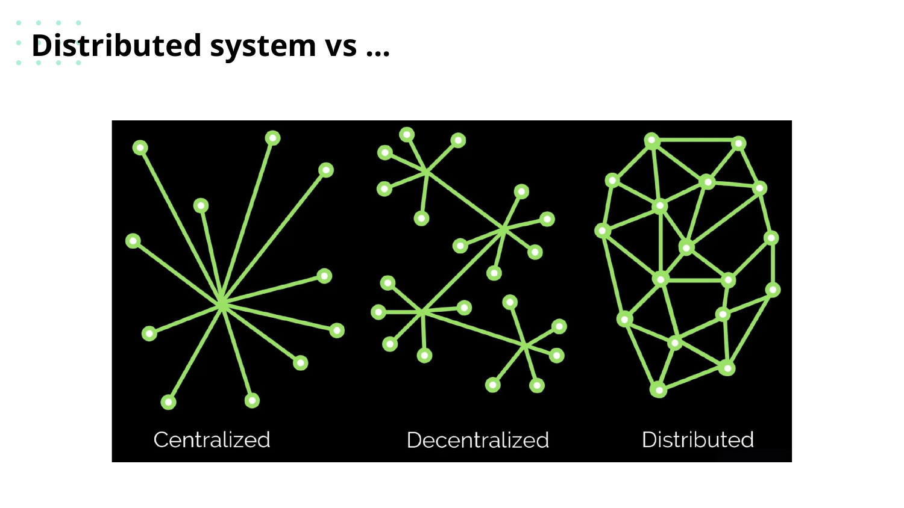
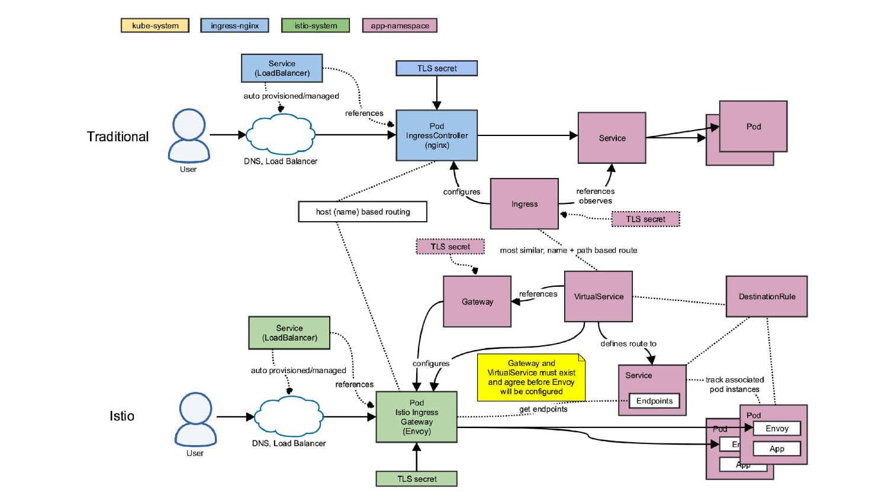

# Лекція 10: Розподілені Системи. Чому мережа завжди бреше

**Аудиторія:** 2-й курс (Junior Strong)
**Ціль:** Зрозуміти, чим розподілена система відрізняється від монолітної. Навчитись виявляти типові патерни відмов, розбиратись в Observability і вміти усувати несправності в реальних проблемах в Kubernetes.

> **English version:** [English](en/10_distributed_systems.md)

---

## 1. Відкрита дискусія (Warm-up)

Ваш моноліт успішно обробляє 500 RPS. Бізнес росте, і ви розбиваєте його на 10 мікросервісів. Кожен сервіс ідеально написаний і покритий тестами.

Питання: чому після декомпозиції система стала менш надійною?

<details markdown="1">
<summary>Розгорнути відповідь</summary>

У моноліті виклик між модулями — це виклик функції. Він або виконується, або падає з виключенням. Час: мікросекунди.

У розподіленій системі виклик між сервісами — це HTTP або gRPC через мережу. Мережа може: затриматися, пропасти на секунду, повернути помилку без причини, успішно виконати запит, але втратити відповідь.

10 мікросервісів із надійністю 99.9% кожен дають загальну надійність: 0.999¹⁰ = 99%. Що означає в 10 разів більше downtime, ніж у кожного сервісу окремо.

> **Математика downtime на рік (8760 годин):**
> * **1 сервіс (99.9% uptime):** 0.1% downtime = ~8.76 годин простою.
> * **Система з 10 сервісів (99.0% загального uptime):** 1.0% downtime = ~87.6 годин простою.
> * `87.6 / 8.76 = 10` разів.
> 
> *Чому так?* Якщо сервіси "падають" у різний час (незалежні збої), їхні часи простою додаються. У розподілених системах із синхронними викликами (де сервіси чекають один на одного) відмова будь-якого одного компонента призводить до відмови всієї операції.

Розподіленість вирішує проблеми масштабування, але створює нові проблеми надійності. Ваша задача — проєктувати з урахуванням цього.

</details>



## 2. Топології систем: Централізовані, Децентралізовані, Розподілені

Зображення вище добре демонструє три основні підходи до побудови систем:

**1. Централізована система (Centralized)**
Усі вузли (клієнти) підключені до єдиного центрального сервера.
* **Переваги:** Проста розробка, легко забезпечити консистентність даних (все в одному місці).
* **Недоліки:** Single Point of Failure (SPOF). Падає центр — падає все. Погано масштабується.
* **Приклад:** Класичний веб-сайт із базою даних на одному сервері. Традиційний банківський Mainframe.

**2. Децентралізована система (Decentralized)**
Система розбита на кілька "суб-центрів", до яких підключаються клієнти. Немає єдиного центру управління, є ієрархія або регіональні хаби.
* **Переваги:** Немає єдиної точки відмови. Якщо падає один хаб, інші продовжують працювати.
* **Недоліки:** Складніша синхронізація між хабами. Можлива неконсистентність.
* **Приклад:** Мережа серверів електронної пошти. Багатокористувацькі ігри з серверами у різних регіонах (EU, US, ASIA).

**3. Розподілена система (Distributed)**
Усі вузли рівноправні або виконують спеціалізовані ролі, але працюють як єдине ціле. Дані та обчислення розподілені по всій мережі.
* **Переваги:** Висока відмовостійкість, безмежне горизонтальне масштабування.
* **Недоліки:** Екстремальна складність розробки, мережеві затримки, CAP-теорема.
* **Приклад:** Сучасний мікросервісний бекенд Netflix, розподілені бази даних (Cassandra), Blockchain.

---

## 3. Коротко про Kubernetes (Оркестрація)

Коли система стає розподіленою і містить десятки чи сотні мікросервісів у Docker-контейнерах, виникає проблема управління: хто перезапускає впавші сервіси? Як балансувати трафік?

**Kubernetes (K8s)** — це оркестратор контейнерів. Це "операційна система" для кластера серверів, яка бере на себе рутину:
* **Self-healing:** K8s автоматично перезапускає контейнери, якщо вони падають.
* **Scaling:** K8s може автоматично піднімати нові копії сервісу при зростанні навантаження.
* **Service Discovery:** Надає сервісам внутрішні DNS-імена, щоб вони знаходили одне одного (вирішує проблему стабільності топології).
* **Load Balancing:** Розподіляє запити між усіма живими копіями мікросервісу.

### Міні-архітектура Kubernetes

Кластер K8s фізично поділяється на два типи серверів (вузлів):

1. **Master Node (Control Plane):** "Мозок" кластера. Він не запускає ваші додатки. Його задача — приймати команди (через API), стежити за загальним станом, планувати, де запустити нові контейнери (Scheduler), та надійно зберігати конфігурацію (в базі etcd).
2. **Worker Node:** "Робочі конячки". Це сервери, на яких фізично працюють ваші Docker-контейнери (упаковані в K8s-абстракцію, що називається *Pod*). На кожному Worker-вузлі працює `kubelet` — системний агент, який слухає вказівки від Master Node і безпосередньо керує контейнерами на своїй машині.

**Як вони взаємодіють:**
Ви (як інженер) кажете Master Node: *"Я хочу, щоб завжди працювало 3 копії мого сервісу 'Кошик'"*. Master Node записує це як бажаний стан (desired state). Далі він знаходить найменш завантажені Worker Nodes і наказує їхнім `kubelet`-ам запустити контейнери. Якщо один Worker Node раптово вимикається (апаратний збій), Master Node помічає, що живих копій залишилося менше трьох, і миттєво дає команду іншому, живому Worker Node підняти відсутню копію. Так працює Self-healing.

---

## 4. Вісім хибних припущень (Fallacies of Distributed Computing)

Peter Deutsch і James Gosling (Sun Microsystems) описали помилки, які роблять архітектори-початківці. Ці помилки актуальні й у 2024 році.

### I. Мережа

**1. Мережа надійна.**
> **Проблема (Thundering Herd):** Уявіть, що база даних "моргнула" на 1 секунду. 1000 мікросервісів одночасно отримали помилку. Якщо всі вони зроблять звичайний Retry рівно через 1 секунду, вони створять пік навантаження у 1000x і гарантовано "докують" базу даних. Фізики називають це резонансом.
> 
> **Архітектурне рішення:** Exponential Backoff + Jitter. Щоб згладити графік навантаження, ми вводимо стохастику (випадковість).
> - **Exponential Backoff:** Затримка зростає експоненційно ($2^n$). Перший повтор через 1с, другий через 2с, третій через 4с.
> - **Jitter (Тремтіння):** Додавання випадкової змінної R до базового часу очікування.
> 🧮 *Формула:* `wait_time = base * 2^n + random(0, base)`
> **Результат:** Замість одного руйнівного удару від 1000 сервісів, запити розподіляються у часі у вигляді нормального розподілу (дзвону). Система встигає відновитися.

**2. Latency нульова.**
> **Проблема (N+1 Query over Network):** Уявіть, що ви виводите список із 50 товарів. У моноліті це був би один SQL JOIN (1 мілісекунда). У мікросервісах ви робите 1 запит за списком товарів, а потім 50 окремих запитів до сервісу відгуків (по 50мс кожен). Замість 1мс ви отримуєте 2.5 секунди очікування на екрані користувача.
> 
> **Архітектурне рішення:** Batching, Data Locality & Caching. 
> - **Batch requests:** Замість 50 запитів по 1 ID, відправляємо 1 запит із масивом `[ID1, ID2... ID50]`.
> - **Data Locality:** Тримати дані, що часто читаються разом, фізично поруч (кеш або денормалізація).

**3. Мережа безпечна.**
> **Проблема (The Inside Threat):** Уявіть, що хакер знайшов вразливість у вашому "неважливому" сервісі генерації PDF, який крутиться у внутрішній мережі (VPC). Оскільки всі внутрішні сервіси історично довіряють один одному без паролів, хакер з PDF-генератора отримує повний доступ до бази платежів.
> 
> **Архітектурне рішення:** Zero Trust Architecture & mTLS. Жодних припущень про довіру на основі того, що сервіс "всередині периметра". Кожен мікросервіс має свій сертифікат і криптографічно автентифікує інший під час кожного запиту.

**4. Мережа однорідна.**
> **Проблема (The Fragmentation Bug):** Ваш сервіс у Франкфурті відправляє пакет даних (1500 байт) до сервісу в Токіо через VPN-тунель. VPN додає свої заголовки, пакет стає 1520 байт. Маршрутизатор провайдера дропає його без сповіщення, бо його ліміт MTU — 1500. Ваш додаток просто зависає (Blackhole).
> 
> **Архітектурне рішення:** Resilient Protocols. Не передбачати константні параметри мережі. Використовувати протоколи, що вміють адаптуватись до зміни умов (наприклад, TCP Path MTU Discovery).

### II. Топологія та Управління

**5. Топологія стабільна.**
> **Проблема (The Ghost IP):** Сервіс "Кошик" хардкодить IP-адресу 10.0.1.5 для зв'язку з сервісом "Склад". Вночі Kubernetes автоматично перезапускає (редеплоїть) "Склад" на іншому сервері. Він отримує новий ефемерний IP 10.0.2.15. Сервіс "Кошик" продовжує стукати у старий IP. Замовлення губляться.
> 
> **Архітектурне рішення:** Service Discovery (Consul, K8s DNS) та Client-side Load Balancing. Будь-який сервіс звертається тільки до логічного імені (наприклад `inventory-service`), а DNS автоматично маршрутизує на актуальні IP-адреси.

**6. Є один адміністратор.**
> **Проблема (The Breaking Contract):** Команда "Оплата" в суботу викатує нову версію, де поле `total_amount` стало називатись `amount_cents`. Команда "Кошик", яка не знала про це, починає сипати помилками 500, бо їхній парсер очікує старе поле.
> 
> **Архітектурне рішення:** Consumer-Driven Contract Testing. Використовувати стандартизовані протоколи (OpenAPI) та Contract Testing (напр. Pact). Команда "Кошик" пише тести на свої очікування, які автоматично крутяться в CI/CD команди "Оплата", не даючи зламати контракт.

### III. Транспорт та Ресурси

**7. Пропускна здатність безмежна.**
> **Проблема (The Log Flood):** Під час "Чорної П'ятниці" трафік зріс у 10 разів. Ваші сервіси почали активно писати DEBUG логи у вигляді великих JSON-об'єктів і відправляти їх до ElasticSearch. Мережевий канал (1 Gbps) повністю забився логами, і критичні фінансові транзакції перестали проходити.
> 
> **Архітектурне рішення:** Rate Limiting, Compression (Gzip) & Pagination. Динамічне управління рівнем логування та стиснення великих payloads.

**8. Транспортна вартість нульова.**
> **Проблема (The CPU Burner):** Ваш високонавантажений сервіс приймає 50,000 повідомлень за секунду у форматі JSON. Ви дивитесь на Flamegraph і бачите, що сервіс витрачає 70% всього процесорного часу (CPU) просто на серіалізацію/десеріалізацію тексту.
> 
> **Архітектурне рішення:** Binary Formats (Protobuf/gRPC). Замість текстового JSON переходимо на бінарні формати. Вони серіалізуються в рази швидше, займають менше місця і економлять найдорожчі ресурси: CPU та мережевий I/O.

---

## 5. CAP-теорема: фізичний компроміс

Eric Brewer (2000): розподілена система не може одночасно гарантувати всі три властивості:

- **C (Consistency)** — кожен запит отримує найновіші дані або помилку.
- **A (Availability)** — кожен запит отримує відповідь (можливо, застарілу).
- **P (Partition Tolerance)** — система продовжує працювати при мережевому поділі.

Мережевий поділ (P) у реальних системах неминучий. Тому вибір — між C і A.

| Тип | Приклади | Поведінка при partition | Де застосовують |
| :--- | :--- | :--- | :--- |
| CP | HBase, Zookeeper, etcd | Стає недоступним, але дані свіжі | Банківські транзакції, конфігурація |
| AP | Cassandra, DynamoDB, CouchDB | Відповідає, але дані можуть бути старими | Стрічка новин, лічильники лайків |

**Eventual Consistency** — стан AP-систем: рано чи пізно всі вузли відображатимуть однакові дані. «Рано чи пізно» — це від мілісекунд до секунд.

<details markdown="1">
<summary>Приклад: Amazon Shopping Cart і Eventual Consistency</summary>

Amazon Shopping Cart використовує AP-архітектуру. Якщо виникне мережевий поділ між двома дата-центрами — система дозволить додавати товари до кошика в обох.

Ціна: при синхронізації виникне конфлікт. Amazon вирішує його «merge обох версій» — обидва товари будуть у кошику. Краще мати зайвий товар у кошику, ніж не дозволити купити.

Це свідоме архітектурне рішення. Бізнес-логіка дозволяє таку неконсистентність.

</details>

---

## 6. Патерни надійності: як не падати каскадно

### Circuit Breaker (Автоматичний вимикач)

Проблема: Сервіс A викликає Сервіс B. B починає відповідати повільно (5–30 сек). Всі потоки A зайняті очікуванням. A теж «падає». Каскадний збій.

Рішення: Circuit Breaker моніторить виклики. При перевищенні порогу помилок — «розмикає ланцюг» і одразу повертає помилку без очікування.

```
Стани:
  CLOSED  → нормальна робота, запити проходять
  OPEN    → помилок забагато, одразу повертаємо fallback
  HALF-OPEN → тест: пропускаємо один запит, перевіряємо відновлення
```

Бібліотеки: Resilience4j (Java), Hystrix (deprecated).

### Bulkhead (Водонепроникна перебирання)

Ізоляція пулів потоків між сервісами. Якщо Сервіс B деградує і з'їдає всі потоки — Сервіс C (інший downstream) не постраждає.

```
❌ Без Bulkhead:     ✅ З Bulkhead:
Загальний пул        Thread Pool A (для Сервісу B): 10 потоків
100 потоків          Thread Pool B (для Сервісу C): 10 потоків
                     B деградує → тільки pool A заблокований
```

### Retry з Jitter

Проблема: 1000 сервісів одночасно отримали помилку і одночасно роблять retry. «Thundering Herd» — навантаження в 1000x.

Рішення: Exponential Backoff + Jitter (випадкова затримка):

```
Attempt 1: wait = 1s + random(0, 0.5s)
Attempt 2: wait = 2s + random(0, 1s)
Attempt 3: wait = 4s + random(0, 2s)
```

Клієнти розподіляються в часі, пік навантаження зникає.

### Graceful Degradation

Якщо залежний сервіс недоступний — показати щось корисне замість помилки:

- Рекомендації недоступні → показати «Топ продажів».
- Сервіс персоналізації впав → показати загальний контент.
- Пошук повільний → показати кешований результат з позначкою «оновлюється».

---

## 7. Messaging Patterns: асинхронна комунікація

Синхронний REST-виклик: якщо отримувач недоступний — запит губиться.
Асинхронне повідомлення в черзі: якщо отримувач недоступний — повідомлення чекає.

### Point-to-Point (Черга)

```
Producer → [Queue] → Consumer
```

Одне повідомлення, один консюмер. Використовують для: обробки замовлень, відправки email, фонових задач.

### Publish-Subscribe (Топік)

```
Producer → [Topic] → Consumer A
                   → Consumer B
                   → Consumer C
```

Одне повідомлення, кілька підписників. Використовують для: аналітики, аудит-логів, реплікації подій між сервісами.

### Dead Letter Queue (DLQ)

Якщо консюмер не може обробити повідомлення (помилка, невалідні дані) — після N спроб повідомлення йде в DLQ. Звідти його аналізують вручну або через окремий процес.

DLQ — це «ловушка помилок», яка запобігає нескінченному циклу retry.

---

## 8. Observability: бачити, що відбувається

Observability — здатність зрозуміти внутрішній стан системи за зовнішніми даними. Три стовпи:

### Metrics (Метрики)

Числові показники в часі. Зазвичай — Prometheus + Grafana.

Модель RED (для сервісів):
- **R**ate — кількість запитів за секунду (RPS).
- **E**rror — відсоток помилок.
- **D**uration — latency (P50, P95, P99).

Модель USE (для ресурсів):
- **U**tilization — завантаженість (CPU 80%).
- **S**aturation — черга (disk I/O queue length).
- **E**rrors — помилки (network drops, disk errors).

### Logs (Логи)

Структуровані логи (JSON) замість текстових рядків:

```json
{
  "timestamp": "2024-03-15T10:30:00Z",
  "level": "ERROR",
  "service": "order-service",
  "trace_id": "abc123",
  "user_id": 42,
  "message": "Payment failed",
  "error_code": "INSUFFICIENT_FUNDS"
}
```

Structured logging дозволяє фільтрувати і агрегувати логи за будь-яким полем. ELK Stack (Elasticsearch + Logstash + Kibana) або Grafana Loki — типові рішення.

Централізований logging: всі логи з усіх сервісів — в одному місці. Без цього troubleshoot розподіленої системи нереальний.

### Distributed Tracing (Розподілене трасування)

Проблема: запит проходить через 10 сервісів. Де затримка? Який сервіс повільний?

Рішення: кожен запит отримує унікальний `TraceID`. Кожен сервіс додає свій `Span` (відрізок роботи) з часом початку і кінця. В кінці — повна картина шляху запиту.

```
TraceID: abc123
  ├── api-gateway        [0ms → 5ms]
  ├── order-service      [5ms → 45ms]
  │     ├── postgres     [6ms → 40ms]  ← тут затримка!
  └── notification       [45ms → 50ms]
```

**OpenTelemetry** — vendor-neutral стандарт для трасування. Підтримує Java, Go, Python та ін. Основні концепції:
- **Span** — одиниця роботи (один виклик, один запит до БД).
- **Trace** — набір пов'язаних Span, що описують повний шлях запиту.
- **Baggage** — контекст, який передається між Span.
- **Exporters** — відправляють трейси в Jaeger, Zipkin або Tempo.

---

## 9. Kubernetes: практичний troubleshooting

Kubernetes (K8s) — де запускаються більшість мікросервісів у production. Треба вміти діагностувати проблеми без доступу до сервера.



### Pod Lifecycle

```
Pending → ContainerCreating → Running → (Succeeded | Failed)
                                  ↓
                              Terminating
```

- **Pending**: Pod не може стартувати — немає ресурсів (CPU/RAM) або не знайдено підходящий вузол.
- **Running**: контейнер запущений, але це не означає «здоровий» (Readiness probe може бути failing).
- **CrashLoopBackOff**: контейнер падає при старті, K8s повторює спроби з backoff.

### Типові помилки Pod'ів

**ImagePullBackOff:** K8s не може завантажити Docker-образ. Причини:
- невірна назва образу або тег.
- Registry недоступний.
- відсутні credentials.

**CrashLoopBackOff:** контейнер запускається і одразу падає. Причини:
- помилка в застосуванні при старті.
- некоректна конфігурація (відсутня env variable).
- Liveness probe занадто агресивна.

```bash
# Дивимось, що відбувається:
kubectl logs pod-name
kubectl logs pod-name --previous   # логи попереднього (впалого) контейнера
kubectl describe pod pod-name      # events і стан
```

### Troubleshooting 4xx помилок

```
Чек-ліст:
1. kubectl logs <pod> | grep ERROR
2. kubectl get svc — чи правильний port?
3. kubectl describe endpoints <сервіс> — чи є pod'и в endpoints?
4. kubectl exec -it <pod> -- curl localhost:8080/health — чи відповідає зсередини?
```

### Troubleshooting 5xx помилок

```
Чек-ліст:
1. kubectl logs <pod> — application stack trace
2. kubectl top pod — чи не перевищено CPU/Memory limits?
3. kubectl describe pod — чи не було OOMKilled?
4. kubectl get events --sort-by='.lastTimestamp' — останні події кластера
```

### Pod Exit Codes: що означає кожен

| Exit Code | Причина | Що робити |
| :--- | :--- | :--- |
| 0 | Штатне завершення | Норма |
| 1 | Помилка застосування | Дивитись логи |
| 137 | SIGKILL (OOMKilled) | Збільшити memory limit або знайти memory leak |
| 139 | Segmentation fault | Bug у JVM або native коді |
| 143 | SIGTERM (graceful stop) | Норма при rolling update |

### QoS Classes: хто виживе при нестачі ресурсів

Kubernetes витісняє Pod'и в порядку від BestEffort до Guaranteed:

| QoS Class | Умова | Стійкість до витіснення |
| :--- | :--- | :--- |
| Guaranteed | requests == limits для CPU і RAM | Найвища |
| Burstable | requests < limits | Середня |
| BestEffort | requests і limits не вказані | Перший на витіснення |

Production-сервіси мають бути **Guaranteed** або **Burstable** з чітко заданими `limits`.

---

## 10. Інженерний insight: математика ненадійності

<details markdown="1">
<summary>Availability в ланцюзі залежностей</summary>

Якщо сервіс A залежить від сервісу B, а B — від C:

$$\text{Availability}_{total} = A_A \times A_B \times A_C$$

При $A = 99.9\%$ для кожного:

$$0.999 \times 0.999 \times 0.999 = 99.7\%$$

Що означає: 26 годин downtime на рік замість 8.7.

При 10 залежностях: $0.999^{10} = 99\%$ → 87 годин downtime.

Висновок: кожна нова залежність знижує загальну надійність. Це не привід уникати мікросервісів, але привід реалізовувати Circuit Breaker і Graceful Degradation для кожного downstream-виклику.

</details>

---

## 11. Екзаменаційний пул (Exam Questions)

**Питання 1: Поясніть CAP-теорему. Яку властивість і чому неможливо пожертвувати?**

<details markdown="1">
<summary>Еталонна відповідь</summary>

CAP: Consistency (всі вузли бачать однакові дані), Availability (система завжди відповідає), Partition Tolerance (система продовжує працювати при мережевому поділі).

Partition Tolerance пожертвувати неможливо: мережевий поділ в реальних розподілених системах неминучий. Вибір завжди між C і A при виникненні partition.

CP-системи (HBase, Zookeeper): при partition стають недоступними, але дані консистентні. Підходять для транзакцій.
AP-системи (Cassandra, DynamoDB): при partition відповідають застарілими даними. Підходять для соцмереж, аналітики.

</details>

**Питання 2: Що таке Circuit Breaker і яку проблему він вирішує?**

<details markdown="1">
<summary>Еталонна відповідь</summary>

Circuit Breaker запобігає каскадним збоям. Якщо downstream-сервіс відповідає повільно або з помилками — без CB усі потоки upstream-сервісу заблоковані очікуванням, і upstream теж падає.

CB моніторить кількість помилок. При перевищенні порогу «розмикає ланцюг» — одразу повертає помилку (або fallback) без мережевого виклику. Через деякий час «напів-відкривається» для тестового запиту — чи відновився downstream.

Три стани: CLOSED (норма), OPEN (ланцюг розімкнений), HALF-OPEN (тест).

</details>

**Питання 3: Чим Distributed Tracing відрізняється від звичайного logging?**

<details markdown="1">
<summary>Еталонна відповідь</summary>

Logging фіксує події всередині одного сервісу. Щоб знайти проблему, яка виникає на межі кількох сервісів, треба вручну корелювати логи різних сервісів — довго і ненадійно.

Distributed Tracing прив'язує всі операції по ланцюгу сервісів до одного TraceID. Можна візуально побачити: скільки часу провів запит у кожному сервісі, де bottleneck, де помилка. Jaeger або Zipkin показують це у вигляді Gantt-діаграми.

</details>

**Питання 4: Pod у Kubernetes знаходиться в стані CrashLoopBackOff. Ваш план дій?**

<details markdown="1">
<summary>Еталонна відповідь</summary>

1. `kubectl logs <pod> --previous` — логи впалого контейнера (не поточного). Шукаємо stack trace.
2. `kubectl describe pod <pod>` — розділ Events: чи є OOMKilled, чи Liveness probe fails.
3. Якщо OOMKilled — збільшити `memory: limits` або шукати memory leak через heap dump.
4. Якщо помилка конфігурації — перевірити environment variables, secretRef, configMapRef.
5. Якщо Liveness probe — розслабити thresholds (`failureThreshold`, `initialDelaySeconds`).

</details>

---

**[⬅️ Лекція 9: Docker](09_docker.md)** | **[Лекція 11: System Design ➡️](11_system_design.md)**

**[⬅️ Повернутися до головного меню курсу](index.md)**
