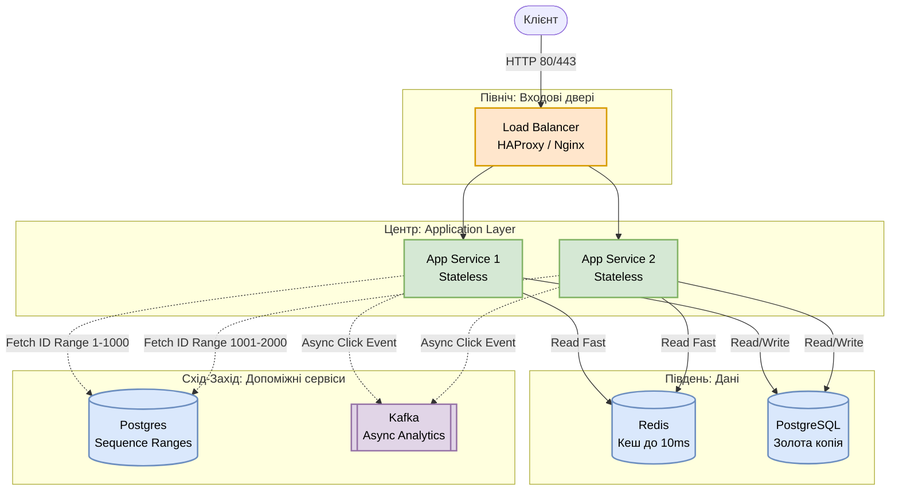

# Практикум P01: System Design Workshop. URL Shortener від нуля

**Аудиторія:** 2-й курс (Junior Engineers)
**Формат:** Live Design Session
**Ціль:** Пройти шлях від абстрактної ідеї «зроби мені як bit.ly» до конкретної схеми бази даних та вибору алгоритмів, використовуючи AI як партнера в проєктуванні.

> **English version:** [English](en/p01_system_design_workshop.md)

---

## Активація: Що ми будуємо?

Всі знають сервіси типу `bit.ly`. Вставляєш довге посилання — отримуєш коротке.
Здається, це завдання для студента першого курсу на 15 хвилин.

**Питання:** Якщо це так просто, чому інженери на співбесідах у Google провалюються на цьому завданні?

<details markdown="1">
<summary>Розгорнути відповідь</summary>

Тому що написати код, який працює для одного користувача — легко.
Написати систему, яка працює для 30 мільйонів людей, не падає при збоях мережі та гарантує унікальність посилань — це інженерія.

</details>

### Ментальна модель: Двері ліфта і що таке «швидко»

Уявіть: ви підходите до ліфта, двері починають зачинятись, сенсор бачить вас і має їх відчинити. Скільки часу є у системи?

- Сенсор (Detect): 5–15 мс.
- Контролер (Software Logic): 16–48 мкс.
- Механіка дверей (Motor Drive): 300–500 мс.

Загальний час реакції: 305–515 мс.

Людина не помічає затримку < 100 мс. Але для CPU (L1-кеш = 1 нс) це вічність. Ваші 200 мс на генерацію посилання — це компроміс між «миттєво для людини» і «достатньо довго для сервера».

<details markdown="1">
<summary>Чому 100 мс — це межа: біологія і кіберспорт</summary>

**Ефект моргання (Saccadic Masking):** одне моргання ока — 100–150 мс. Мозок «вимикає» зоровий вхід на цей час і домальовує пропущений кадр. Затримка інтерфейсу до 100 мс сприймається як «миттєва», бо вписується в природний сліпий проміжок мозку.

**Кіберспорт:** середній час реакції людини — 215–250 мс. Топові кіберспортсмени (s1mple, Faker) — 130–150 мс. Це фізична межа нервового імпульсу. Якщо ваш бекенд «думає» 200 мс через довгий GC pause — ви повільніші за нервовий імпульс людини.

Висновки:
- Web UI: < 100 мс (норма).
- Game Server: < 30 мс (інакше відчувається «лаг»).
- HFT (Trading): < 1 мс (тут змагаються роботи).

</details>

---

## Етап 1: Requirements Engineering

*Симуляція: Ви — Архітектор. Я — Замовник (Product Owner).*
Не починайте малювати квадратики. Починайте з цифр і бізнес-цілей.

### 1.0 Feasibility Study

Перш ніж кодити, зрозуміймо: чи варто це будувати взагалі?

Аналіз альтернатив:
- Option A: Build from scratch (власна розробка).
- Option B: Buy SaaS (готове API типу Bitly Enterprise).
- Option C: Serverless (AWS Lambda) vs Dedicated Clusters.

Артефакт: Scope of Work (SOW) — документ з обґрунтуванням вибору.

### 1.1 Функціональні вимоги

1. **Shorten:** система приймає довгий URL і повертає унікальний короткий ключ (7 символів).
2. **Redirect:** при переході за коротким посиланням користувач потрапляє на оригінальний ресурс.

### 1.2 Нефункціональні вимоги: Capacity Planning

Виконуємо розрахунки разом з AI (Back-of-the-envelope):

```
AI Prompt:
"Ти — System Architect. Порахуй навантаження для URL Shortener.
Вхідні дані: 30 мільйонів користувачів на місяць.
Зберігаємо посилання 5 років.
Розрахуй: 1) RPS, 2) загальний обсяг сховища."
```

**Валідація розрахунків:**

```
Трафік:
  30M / 30 днів / 86,400 сек ≈ 11.6 RPS середнє
  Читання (Redirect) : Запис (Shorten) = 10:1
  Read RPS ≈ 116, Write RPS ≈ 12

Сховище:
  1 запис ≈ 2 КБ (URL + метадані)
  Записів за 5 років ≈ 1.8 млрд
  Total ≈ 3.6 ТБ
```

**Архітектурні висновки з цих цифр:**

1. 3.6 ТБ не влізе в RAM одного сервера → потрібна БД на диску.
2. Шукати в 3.6 ТБ на кожен клік — повільно → потрібен кеш (Redis).
3. 30M користувачів → Availability 99.9% (максимум 8 годин простою на рік).

---

## Етап 2: Алгоритм скорочення

Як перетворити довгий URL на `Abz21TY`?

### Варіант А: Хешування (MD5)

MD5 від URL, обрізаємо до 7 символів. Проблема: обрізання 128-бітного хешу призводить до колізій. Відхилено.

### Варіант Б: Base62 + Random

Генеруємо випадкові 7 символів, перевіряємо в БД, чи вільні. Поки база порожня — працює. Коли заповнена на 70% — кожна друга спроба колізія. Latency росте експоненційно. Це алгоритмічний аналог проблеми **Thundering Herd** (з Лекції 10) — виникає лавина повторних запитів (**Retry storm**), яка "вбиває" базу даних. Архітектурна помилка.

### Варіант В (переможець): Base62 + Counter

Кожній URL даємо унікальний числовий ID (Auto-increment): 1, 2, 3... Конвертуємо число з десяткової системи в 62-кову (0–9, a–z, A–Z).

```
Чому 62? → 10 цифр + 26 малих + 26 великих = 62
Ємність 7 символів: 62^7 = 3.5 трильйона комбінацій
Вистачить на 100 років при поточних темпах зростання
```

> Vibe Coding Task: попросіть AI написати `base62Encode(long id)` на Java. Перевірте, чи обробляє вона від'ємні числа.

<details markdown="1">
<summary>Чому Auto-increment ID небезпечний для бізнесу</summary>

Конкуренти можуть перебирати `bit.ly/1`, `bit.ly/2`... і дізнатись точну кількість посилань у вашій системі. Це розкриває бізнес-метрики.

Рішення: Snowflake ID (рандомізований, але впорядкований) або додаємо «сіль» до числа перед кодуванням.

</details>

### Аналітика без затримки: Алгоритм обробки подій

Ми не просто редіректимо — збираємо аналітику. Як зробити це, не сповільнюючи користувача?

```
1. Receive:    Отримуємо запит на редірект.
2. Validate:   Перевіряємо, чи існує посилання. Додаємо Timestamp.
               *(⚠️ Увага: пам'ятаємо про Clock Skew з Лекції 10! Якщо годинники серверів розсинхронізовані, події в Kafka матимуть зламану хронологію. Аналітика має враховувати цей дрейф часу).*
3. Route:      Миттєво повертаємо 301 Redirect (Latency < 100мс).
4. Async:      Далі подія йде в Kafka.
   ├── Filter:    Відкидаємо ботів за правилами.
   ├── Analyze:   Визначаємо GEO, User-Agent.
   ├── Correlate: Прив'язуємо до User ID та кампанії.
   └── Generate:  Створюємо чисту подію «Click» для звіту.
```

Користувач отримує редірект миттєво. Аналітика обробляється асинхронно.

---

## Етап 3: High-Level Design

Малюємо карту системи, використовуючи сторони світу.



**Принципи перед малюванням:**
- KEEP IT SIMPLE: не будуйте космоліт для велосипеда.
- YAGNI: не додавайте ML, якщо потрібен простий `if`.
- DRY: спільну логіку — в бібліотеки.

### Північ: входові двері

Load Balancer (HAProxy/Nginx) — приймає удар першим. Розподіляє трафік між екземплярами додатку.

### Центр: Application Layer

App Service (Java/Spring Boot) — «мозок» системи. 
> **Інженерна пастка:** Ми називаємо його Stateless для HTTP-балансувальника (можна кидати запит на будь-який інстанс). Але насправді, кешуючи діапазон ID `1-1000` в RAM (див. нижче), сервіс **має внутрішній стан (Stateful)**. Втрата цього стану при CrashLoopBackOff — наш свідомий компроміс.

Можна запустити 50 паралельних екземплярів.
API: `shortenURL(longUrl)`, `decodeURL(shortUrl)`.

### Південь: дані

- PostgreSQL — зберігає «золоту копію» (Mapping: ID → Long URL).
- Redis — «гарячі» посилання для миттєвого доступу (< 10ms). In-memory processing — ключ до High Performance.

### Схід-Захід: допоміжні сервіси

ID Generator (Postgres Sequence з кроком 1000): Сервер A бере діапазон 1–1000, Сервер B — 1001–2000. Ніякого Zookeeper.

<details markdown="1">
<summary>Чому ми відмовились від Zookeeper на користь Postgres?</summary>

**Головна проблема:** Як зробити так, щоб при горизонтальному масштабуванні Server A і Server B не згенерували однаковий ID одночасно?

**Опція 1: Масштабування з Zookeeper (Ідеальний, але складний шлях)**
Zookeeper — це "диригент" кластера, який використовує складні алгоритми консенсусу, щоб гарантувати ексклюзивну видачу ID.
*   **Плюс:** Ідеальна точність, немає "дірок" у нумерації.
*   **Мінус (чому відмовили):** Це важкий інфраструктурний компонент. Ops-команді доведеться розгортати і підтримувати окремий кластер Zookeeper лише заради генерації ID. Це оверінжиніринг.

**Опція 2: Postgres Sequence Ranges (Обраний шлях)**
Використовуємо існуючу БД, але беремо ID великими блоками.
*   **Як це працює:** Server A просить у БД діапазон і отримує `1–1000`. Server B отримує `1001–2000`. Далі сервери генерують ID *абсолютно незалежно* в оперативній пам'яті (RAM). Жодних мережевих запитів для кожного лінку, затримка < 1 мс.
*   **Trade-off:** Якщо Server A впаде, використавши лише 10 номерів, решта 990 зникнуть. У базі буде "дірка".
*   **Чому це нормально:** Алгоритм Base62 (7 символів) дає **3.5 трильйона комбінацій**. Втратити навіть кілька мільйонів потенційних ID через рестарти — це математична похибка, яка не шкодить бізнесу. Ми розмінюємо ці порожні ID на шалену швидкість і простоту інфраструктури.

</details>

**Формули архітектора:**
```
Scalability = Partitioning (Sharding)
Reliability = Replication
```

---

## Етап 4: Data Design

```sql
CREATE TABLE urls (
    id         BIGINT PRIMARY KEY GENERATED ALWAYS AS IDENTITY,
    long_url   VARCHAR(2048) NOT NULL,
    short_url  VARCHAR(7) NOT NULL UNIQUE,  -- результат Base62
    created_at TIMESTAMP WITH TIME ZONE DEFAULT NOW()
);

CREATE INDEX idx_short_url ON urls(short_url);  -- головний індекс
```

SQL vs NoSQL trade-off: PostgreSQL дає ACID і надійність для «золотої копії». Redis (Key-Value) ідеальний для кешу «гарячих» посилань.

---

## Етап 5: Teamwork & Friction

Архітектура готова. Тепер вступає реальна команда з реальними конфліктами.

```
Конфлікт: Dev Team хоче Zookeeper для ідеальної генерації ID.
          Ops Team блокує — складно підтримувати.

ADR рішення:
  Замість Zookeeper → Postgres Sequence з кроком 1000.
  Сервер A: діапазон 1-1000. Сервер B: 1001-2000.
  Trade-off: при падінні сервера втрачаємо невикористаний діапазон.
  Це допустимо — у нас їх 3.5 трильйона.
```

**Traceability Matrix:** перевіряємо, чи всі вимоги з Етапу 1 покриті дизайном. Що не покрито?

**Technical Debt Tracking:** якщо приймаємо швидке рішення (наприклад, хардкод замість конфіга) — одразу відкриваємо тікет з міткою «Technical Debt».

---

## Етап 6: Runtime Reality

### Observability

Не деплоїмо наосліп. Перед релізом система має:
- Metrics: Traffic, Latency, Errors, Saturation (CPU/RAM).
- Continuous Profiling: Flamegraph — де саме в коді втрачаємо CPU.
- Memory Patterns: чи стабільний Young GC? Немає росту пам'яті (potential leak)?

### Системні ліміти

```bash
ulimit -n          # скільки відкритих сокетів дозволяє Linux?
                   # якщо 1024 (дефолт) — впадемо при 1025-му користувачі

sysctl net.core.somaxconn   # розмір черги нових TCP-з'єднань
                            # якщо малий → Connection Refused при піках
```

---

## Етап 7: FinOps

Спроєктована система має бути не лише робочою, а й прибутковою.

### Storage Tiering (3.6 ТБ)

```
Naive: всі дані в PostgreSQL на SSD (gp3)
  Ціна: $0.08/GB × 3,600 GB = $288/міс
  Проблема: 90% посилань ніхто не відкриває через місяць

Smart: Tiering
  Свіжі посилання (3 місяці) → PostgreSQL
  Старі → S3 Object Storage
  Ціна S3: $0.023/GB = $82/міс (економія 3.5x)
  Trade-off: посилання 5-річної давнини — 200мс замість 20мс. Допустимо.
```

### Cloud vs On-Prem

Serverless (Lambda): платимо тільки при трафіку. Ідеально для старту, але **несумісно з нашою архітектурою генерації ID**.
> ⚠️ **Архітектурний конфлікт:** Ми вирішили кешувати діапазони ID (1-1000) в RAM. Lambda — це ефемерні контейнери, які "вмирають" після обробки запиту. Якщо Лямбда візьме 1000 ID, згенерує 1 лінк і помре — ми "спалимо" 999 ID і згенеруємо лавину запитів до бази. 
> Тому наша архітектура вимагає довгоживучих процесів (Dedicated/K8s). Якщо бізнес наполягає на Serverless, доведеться змінювати алгоритм на Snowflake ID.

Dedicated (EC2/K8s): фіксована ціна. Вигідно при стабільному навантаженні 24/7. Це наш вибір.

---

## Фінальний чек-лист архітектора

| NFR | Рішення | Де реалізовано |
| :--- | :--- | :--- |
| Scalability | Horizontal scaling App-серверів, Sharding БД по ID | Load Balancer + App Layer |
| Performance | Redis-кеш для read (< 10ms), async analytics | Redis + Kafka |
| Availability | LB + Master-Slave Postgres + Redis Replica | Infrastructure layer |

> 🧮 **Перевірка математики надійності (з Лекції 10):**
> Вище ми заклали ціль Availability 99.9% (~8 годин простою).
> Але наша транзакція послідовна: $LB \rightarrow App \rightarrow Redis \rightarrow DB$.
> Якщо кожен компонент має типовий хмарний SLA 99.9%, реальна надійність: $0.999 \times 0.999 \times 0.999 \times 0.999 \approx 99.6\%$. 
> Це ~35 годин простою на рік! Щоб досягти 99.9% для всієї системи, кожен компонент повинен мати надійність $\approx 99.975\%$. Архітектор має прораховувати це до старту розробки.

---

## Домашнє завдання: Vibe Coding Challenge

За допомогою AI (Gemini/ChatGPT) згенеруйте OpenAPI (Swagger) специфікацію для цього сервісу.

**Умови:**

1. AI генерує YAML-файл.
2. Знайдіть помилки, які AI зробить: часто забуває HTTP-коди 404 та 429.
3. Знайдіть хибні припущення: де AI вважав, що «мережа надійна» або «latency нульова».
4. Додайте поле `expiration_date` у запит — AI його пропустить.

**Артефакт:** посилання на GitHub Gist з виправленим Swagger + коментар «Які Wrong Assumptions зробив AI і як я їх виправив».

---

**[⬅️ Лекція 11: System Design Foundations](11_system_design.md)**

**[⬅️ Повернутися до головного меню курсу](index.md)**
