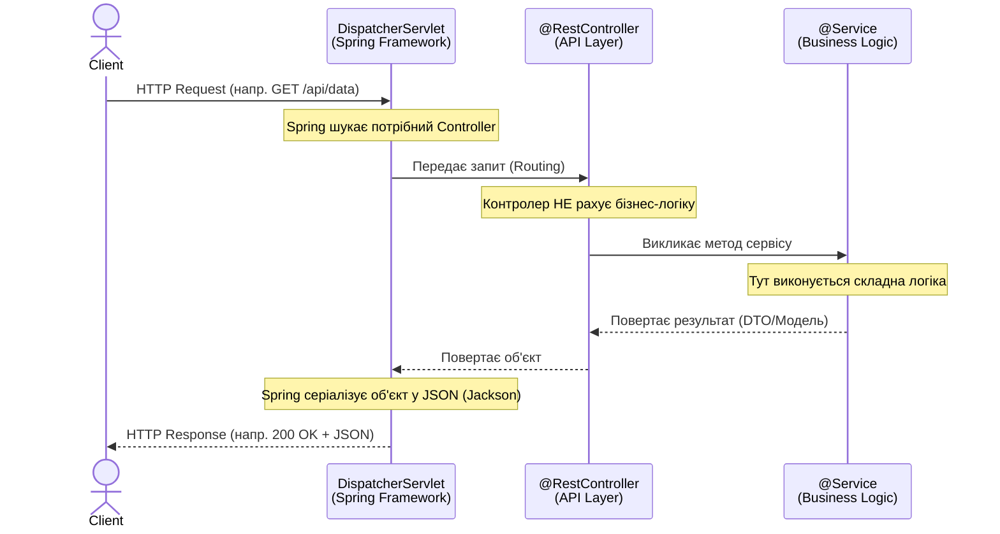

# Практикум 2: Архітектура Шарів та Dependency Injection

**Тип:** Hands-on Lab
**Рівень:** Junior Strong
**Попередні вимоги:** Робочий проєкт з Практикуму 1.
**Інженерна мета:** Навчитись розділяти відповідальність (Separation of Concerns). Зрозуміти, чому код у Контролері — це архітектурний борг.
**Бізнес-задача:** Реалізувати сервіс конвертації валют.

---

##  Експрес-опитування: Перевірка зв'язку

1.  **Life Cycle:** Хто створює об'єкти контролерів у Spring Boot: ви через `new` чи фреймворк?
2.  **Testing:** Якщо ви написали логіку нарахування відсотків прямо в контролері, чи зможете ви її протестувати, не запускаючи Tomcat?
3.  **Core Concept:** Що таке "Bean" у термінології Spring?

<details markdown="1">
<summary>Відповіді (Самоперевірка)</summary>

1.  **Фреймворк (Spring Container).** Це суть IoC (Inversion of Control).
2.  **Ні.** Вам доведеться піднімати весь контекст (Integration Test), що довго і ресурсоємно. Unit-тест неможливий.
3.  **Об'єкт, яким керує Spring.** Це будь-який Java-об'єкт, який ініціалізується, збирається та знищується Spring IoC контейнером.

</details>

---

## Архітектура запиту (Request Flow)

Перш ніж писати код, давайте подивимось на правильний життєвий цикл обробки запиту (Request Lifecycle) у тришаровій архітектурі Spring:



---

## Частина 1: Створення Service Layer (Business Logic) (15 хв)

### Бізнес-сценарій: Проблема "Товстого Контролера"
Уявіть, що нам треба написати логіку конвертації валют з комісією, яка залежить від дня тижня. Студент-новачок напише це прямо в методі контролера (`@GetMapping`).

> [!CAUTION]
> **Чому це архітектурна помилка (Engineering Flaw)?**
> 1.  **Testing:** Щоб протестувати математику комісії, вам доведеться піднімати весь веб-сервер. Це повільно (секунди замість мілісекунд).
> 2.  **Reusability:** Якщо цей код знадобиться в мобільному додатку або в Telegram-боті — ви не зможете його викликати, бо він "зашитий" у веб-контролер.
> 3.  **Single Responsibility:** Контролер — це "секретар" (прийняв запит, віддав відповідь). Він не повинен бути "бухгалтером" (рахувати гроші).

### Завдання 1.1: Створення Сервісу
Ми виносимо логіку в окремий клас. У Spring це називається **Service**.

1.  Створіть пакет `ua.edu.demoservice.service`.
2.  Створіть клас `CurrencyService`.

**Файл: src/main/java/ua/edu/demoservice/service/CurrencyService.java**
```java
package ua.edu.demoservice.service;

import org.springframework.stereotype.Service;

@Service // Кажемо Spring: "Це бізнес-логіка. Створи цей об'єкт і тримай у пам'яті".
public class CurrencyService {

    private static final double USD_RATE = 38.5;

    public double convertUsdToUah(double amount) {
        // Тут могла бути складна логіка звернення до НБУ
        return amount * USD_RATE;
    }
}
```

---

## Частина 2: Dependency Injection — Правильне "Зв'язування" (15 хв)

### Бізнес-сценарій
Тепер найважливіший момент. Контролеру потрібен Сервіс, щоб рахувати гроші. Як їх з'єднати так, щоб код залишився стабільним і тестованим?

> [!CAUTION]
> **Legacy Way: Field Injection (Заборонено)**
> ```java
> @Autowired
> private CurrencyService currencyService; 
> ```
> Не робіть так! Це унеможливлює Unit-тестування без підняття всього фреймворку.

### Завдання 2.1: Constructor Injection
Ми передаємо залежність через конструктор. Це робить клас стабільним, а його залежності — явними.

**Файл: src/main/java/ua/edu/demoservice/controller/CurrencyController.java**
```java
package ua.edu.demoservice.controller;

import org.springframework.web.bind.annotation.*;
import ua.edu.demoservice.service.CurrencyService;

@RestController
@RequestMapping("/api/currency")
public class CurrencyController {

    private final CurrencyService currencyService;

    // Spring автоматично знайде потрібний сервіс і передасть його сюди
    public CurrencyController(CurrencyService currencyService) {
        this.currencyService = currencyService;
    }

    @GetMapping("/convert")
    public double convert(@RequestParam double amount) {
        // Контролер делегує роботу професіоналу (Сервісу)
        return currencyService.convertUsdToUah(amount);
    }
}
```

> [!IMPORTANT]
> **Engineering Deep Dive: Чому Constructor Injection?**
> Чому ми пишемо більше коду замість одного `@Autowired`?
> 1. **Immutability:** Поле `currencyService` можна зробити `final`. Ніхто не підмінить сервіс посеред роботи програми.
> 2. **Testing without Spring:** У Unit-тестах ви можете створити контролер вручну: `new CurrencyController(new MockService())`. Швидко і просто.
> 3. **Circular Dependencies:** Якщо Сервіс А залежить від Б, а Б від А — конструктор впаде одразу при запуску програми, явно вказавши на помилку проєктування. Field Injection приховує це до моменту першого виклику.

---

## Частина 3: Data Transfer Objects (DTO) (10 хв)

### Бізнес-сценарій
Хороший API не повертає клієнту просто число `1540.0`. Фронтенд-розробникам потрібні структуровані дані з контекстом (що це за валюта, яка була оригінальна сума).

### Завдання 3.1: Створення DTO
Створіть запис (Record) — це сучасний аналог POJO для незмінних носіїв даних.

**Файл: src/main/java/ua/edu/demoservice/dto/CurrencyResponse.java**
```java
package ua.edu.demoservice.dto;

public record CurrencyResponse(
    String currency,
    double originalAmount,
    double convertedAmount
) {}
```

### Завдання 3.2: Оновлення Контролера
Додайте новий ендпоінт, який повертатиме об'єкт.

**Файл: src/main/java/ua/edu/demoservice/controller/CurrencyController.java**
```java
    @GetMapping("/convert-details")
    public CurrencyResponse convertWithDetails(@RequestParam double amount) {
        double result = currencyService.convertUsdToUah(amount);
        return new CurrencyResponse("UAH", amount, result);
    }
```

---

## Частина 4: Завдання "На захист" (Challenge) (15 хв)

### Завдання: "Обмінний пункт"
Самостійно реалізуйте логіку обмінного пункту з комісією:

1. Додайте в `CurrencyService` метод `buyEuro(double uahAmount)`, який рахує курс (наприклад, 42.0) і знімає 1% комісії.
2. Додайте валідацію: якщо сума переказу менше 100 грн — кидайте виключення `IllegalArgumentException("Minimum amount is 100 UAH")`.
3. Додайте відповідний метод у контролер.
4. Продемонструйте результат через браузер або Postman.

> [!NOTE]
> **Питання для захисту:**
> Якщо я зміню бізнес-логіку комісії з 1% на 2%, скільки файлів у проєкті вам доведеться редагувати?

<details markdown="1">
<summary>Відповідь</summary>

**Один.** Тільки `CurrencyService`.
Контролер (API Layer) не знає про комісію, він лише транслює запит. Це і є "Separation of Concerns".

</details>

---

##  Контрольні питання
1. У чому різниця між `@RestController` та `@Service` для JVM? Чи це різні об'єкти?
2. Чому поле сервісу в контролері позначено як `final`?
3. Ви бачите проєкт, де логіка написана в контролері. Назвіть 3 метрики, які погіршуються від такого рішення.

<details markdown="1">
<summary>Відповіді</summary>

1. Для JVM це просто об'єкти. Різниця лише в семантиці для програміста та в тому, як Spring їх обробляє (Controller реєструє ендпоінти, Service — ні). Технічно це все "Spring Beans".
2. Щоб гарантувати **Immutability** (незмінність). Після створення контролера залежність (сервіс) не може бути змінена. Це Thread-safe підхід.
3. **Testability** (складніше писати Unit-тести), **Maintainability** (важче читати та змінювати код), **Reusability** (код неможливо використати в іншому місці).

</details>
---

**[⬅️ P03: Zero to Hero](p03_spring_zero_to_hero.md)** | **[P05: Production Ready ➡️](p05_spring_production_ready.md)**

**[⬅️ Повернутися до головного меню курсу](index.md)**
