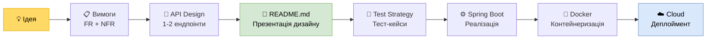

# P01: Фінальний Проєкт — Від Ідеї до Хмари

**Тип:** Final Project Execution Guide
**Аудиторія:** 2-й курс (Junior Engineers)
**Формат:** Self-paced + Mentor Reviews
**Мета:** Провести студента через повний цикл розробки продукту — від питання «що будуємо?» до живого URL у хмарі.

> [!IMPORTANT]
> Цей документ — ваша **карта виконання фінальної роботи курсу**. Проходьте кроки послідовно. Кожен крок має **Quality Gate** — без його проходження рухатись далі не можна.
> Перед початком прочитайте [Філософію проєкту: Agentic Pipeline vs Vibe Coding](vibe_coding.md).

---

## Загальна карта проєкту



> Кроки **1–5** оформлюються у вигляді **README.md у вашому GitHub-репозиторії** і є артефактом для перевірки ментором _до_ початку кодування.

---

## Крок 1 — 💡 Ідея та Постановка Проблеми

**Ціль:** Сформулювати, яку реальну проблему вирішує ваш застосунок.

**Задача:**
Знайдіть проблему зі свого повсякденного життя або навчання, яку можна вирішити невеликим web-застосунком.

> [!TIP]
> Хороша ідея — це не «я хочу зробити соціальну мережу». Хороша ідея — це «студенти забувають здати домашнє завдання, бо дедлайни розкидані по різних каналах. Хочу один агрегатор».

**Шаблон для README.md (Секція 1):**
```markdown
## Ідея

**Назва проєкту:** [назва]
**Проблема:** [1-2 речення — яка реальна проблема існує?]
**Рішення:** [1 речення — як ваш застосунок її вирішує?]
**Цільовий користувач:** [хто буде користуватись?]
```

**Зв'язок з курсом:** [Л0 — Engineering Mindset](../../00_intro.md)

---

## Крок 2 — 📋 Збір Вимог: FR та NFR

**Ціль:** Перетворити ідею на конкретні, перевірювані вимоги.

### 2.1 Функціональні вимоги (FR)

Опишіть, **що** система робить. Формат: User Story або список `Система повинна...`.

```markdown
## Функціональні вимоги

| # | Вимога | Пріоритет |
|---|---|---|
| FR-01 | Система дозволяє користувачу зареєструватись | Must Have |
| FR-02 | Система показує список дедлайнів | Must Have |
| FR-03 | Система надсилає email-нагадування | Nice to Have |
```

### 2.2 Нефункціональні вимоги (NFR)

Опишіть **обмеження** системи. Мінімум 3 NFR:

```markdown
## Нефункціональні вимоги

| NFR | Вимога | Обґрунтування |
|---|---|---|
| Availability | 99.5% uptime | Студенти заходять перед дедлайнами |
| Security | Паролі — bcrypt, конфіги — env variables | Захист персональних даних |
| Performance | API відповідає < 500ms | UX стандарт |
```

> [!NOTE]
> NFR — це не «побажання». Це **вимірювані обмеження**, які впливають на архітектуру. Якщо ви написали «система має бути швидкою» — це не NFR.

**Зв'язок з курсом:**
- [Л3 — Definition of Requirements](../../03_requirements.md) — User Stories, Acceptance Criteria
- [Л4 — NFRs](../../04_nfr.md) — Scalability, Availability, Security
- [Л5 — NFR Late Discovery](../../05_nfr_late_discovery.md) — чому NFR краще виявляти зараз, ніж після релізу

---

## Крок 3 — 🔌 Проєктування 1-2 API-ендпоінтів

**Ціль:** Спроєктувати HTTP-контракт до того, як написати рядок коду.

Виберіть **1-2 найважливіші** ендпоінти вашого застосунку і опишіть їх за шаблоном:

```markdown
## API Design

### POST /api/deadlines
**Призначення:** Створити новий дедлайн

**Request Body:**
```json
{
  "title": "Здати курсову",
  "dueDate": "2025-06-01T23:59:00Z",
  "courseId": 42
}
```

**Response 201 Created:**
```json
{
  "id": 101,
  "title": "Здати курсову",
  "dueDate": "2025-06-01T23:59:00Z"
}
```

**Response 400 Bad Request:** якщо `title` порожній або `dueDate` у минулому.

---

### GET /api/deadlines
**Призначення:** Отримати список дедлайнів поточного користувача

**Response 200 OK:** масив об'єктів з полями `id`, `title`, `dueDate`, `status`
```

> [!IMPORTANT]
> **Quality Gate #1:** Перед тим як іти далі — покажіть API-дизайн ментору. Після схвалення цей контракт стає «законом». Змінювати його під час реалізації — порушення інженерної дисципліни.

**Зв'язок з курсом:**
- [Л7 — API Design](../../07_api_design.md) — REST, HTTP коди, версіонування
- [P08 — API Practice](p08_api_practice.md) — практичне застосування: URL-структура, статуси, OpenAPI

---

## Крок 4 — 📄 README.md як Проєктна Документація

**Ціль:** Зібрати кроки 1–3 в єдиний документ, що є точкою входу до вашого GitHub-репозиторію.

Це не просто «опис проєкту». Це **інженерний документ**, який демонструє що ви думаєте перед тим, як кодити.

**Мінімальна структура README.md:**

```markdown
# [Назва проєкту]

> [Одне речення — суть продукту]

## Проблема та Рішення
[Крок 1 — ваша ідея]

## Функціональні вимоги
[Крок 2.1]

## Нефункціональні вимоги
[Крок 2.2]

## API Design
[Крок 3 — ваші ендпоінти]

## Тестова стратегія
[Крок 5 — заповнюється після Кроку 5]

## Як запустити
[Заповнюється після Кроку 7]

## Deployment
[Посилання на живий URL після Кроку 8]
```

> [!TIP]
> Хороший README читається як технічне завдання. Якщо новий розробник прочитає його та зрозуміє систему — ви зробили все правильно.

**Зв'язок з курсом:**
- [Л1 — SDLC](../../01_sdlc.md) — документація як частина lifecycle
- [Workshop: System Design](../workshop_03_system_design.md) — приклад того, як виглядає архітектурне мислення на папері

---

## Крок 5 — 🧪 Стратегія Тестування

**Ціль:** Описати, **як ви перевірите**, що система працює правильно — до того як написати тести.

Опишіть мінімум **3 тест-кейси** у форматі:

```markdown
## Тестова стратегія

| ID | Назва | Given | When | Then | Тип |
|---|---|---|---|---|---|
| TC-01 | Успішне створення дедлайну | Авторизований користувач | POST /api/deadlines з валідними даними | 201 Created + тіло з `id` | Integration |
| TC-02 | Порожній title | - | POST з `"title": ""` | 400 Bad Request | Unit |
| TC-03 | Отримання порожнього списку | Новий користувач без дедлайнів | GET /api/deadlines | 200 OK + пустий масив `[]` | Integration |
```

> [!NOTE]
> На цьому кроці ви пишете **не код тестів**, а описуєте логіку перевірки. Код тестів — у Кроці 6.

**Зв'язок з курсом:**
- [Л6 — QA Strategy](../../06_qa_strategy.md) — піраміда тестування, Quality Gates
- [Л8 — Test Cases & Coverage](../../08_test_cases.md) — BVA, Decision Table, Given/When/Then
- [P09 — Testing Practice](p09_testing_practice.md) — Unit (Mockito), MockMvc

---

> [!IMPORTANT]
> **Quality Gate #2:** Кроки 1–5 у README.md мають бути у вашому GitHub PR / комміті до того, як ви відкриєте IDE для написання коду. Ментор перевіряє README і підтверджує: «Починайте реалізацію».

---

## Крок 6 — ⚙️ Реалізація на Spring Boot

**Ціль:** Реалізувати спроєктований API, дотримуючись архітектурних принципів курсу.

**Чеклист реалізації:**

- [ ] Проєкт створено через [Spring Initializr](https://start.spring.io) (Web, Validation, актуальна версія Boot)
- [ ] Шарова архітектура: `Controller → Service` (дані зберігаються у `List<T>` або `Map<Long, T>` всередині Service)
- [ ] Використання **DTO** (record або клас) у відповідях API — не внутрішні об'єкти сервісу
- [ ] **Constructor Injection** (не `@Autowired` на полі)
- [ ] Глобальна обробка помилок через `@ControllerAdvice`
- [ ] Валідація вхідних даних через `@Valid` + `@NotBlank`, `@NotNull`
- [ ] Реалізовані тест-кейси з Кроку 5 (Unit + Integration)
- [ ] **Swagger UI** доступний за `/swagger-ui.html` _(обов'язково)_
- [ ] _(Бонус)_ Проста Landing Page або мінімальний SPA _(необов'язково)_

> [!TIP]
> **Agentic Prompting** для кожного компонента:
> ❌ «Напиши контролер для моїх дедлайнів»
> ✅ «Напиши `@RestController` для `Deadline`. Метод `create` приймає `DeadlineRequest` (record з `title`, `dueDate`). Повертає `DeadlineResponse` (record з `id`, `title`, `dueDate`). Обробляй `NotFoundException` через `@ControllerAdvice`. Використовуй Constructor Injection.»

**Зв'язок з курсом:**
- [P02 — Web Architecture](p02_spring_web_arch.md) — SSR vs SPA, IoC, DI
- [P03 — Zero to Hero](p03_spring_zero_to_hero.md) — перший Spring Boot сервіс
- [P04 — Architecture & DI](p04_spring_architecture_di.md) — шари, Constructor Injection, DTO
- [P05 — Production Ready](p05_spring_production_ready.md) — конфіги, Exception Handling, HTTP статуси
- [P08 — API Practice](p08_api_practice.md) — OpenAPI, статуси, Breaking Changes
- [P09 — Testing Practice](p09_testing_practice.md) — Unit, Integration, MockMvc

---

## Крок 7 — 🐳 Docker та Локальне Середовище

**Ціль:** Застосунок має запускатись в ізольованому Docker-середовищі командою `docker compose up`.


> [!NOTE]
> Для фінального проєкту використовуємо **in-memory сховище** (H2 або `ArrayList` у Service). Це спрощує деплоймент і дозволяє зосередитись на архітектурі API, а не на налаштуванні бази даних.

**Мінімальний `docker-compose.yml`:**

```yaml
services:
  app:
    build: .
    ports:
      - "8080:8080"
```

**`application.properties` для in-memory:**

```properties
# Жодних налаштувань БД не потрібно.
# Дані зберігаються у List/Map всередині @Service — Spring Boot готовий до роботи за замовчуванням.
```

**Чеклист Docker:**

- [ ] `Dockerfile` з multi-stage build (окремий build stage і runtime stage)
- [ ] `docker compose up` піднімає застосунок
- [ ] `README.md` оновлено: секція «Як запустити»

**Зв'язок з курсом:**
- [Л9 — Docker & Containerization](../../09_docker.md) — Dockerfile, cgroups, multi-stage
- [P06 — Docker Practice](p06_docker_practice.md) — Dockerfile, Docker Compose + PostgreSQL, Debugging

---

## Крок 8 — ☁️ Деплоймент у хмару

**Ціль:** Застосунок має бути доступний за публічним URL, не лише на вашому комп'ютері.

**Рекомендований шлях для старту:** [Render.com](https://render.com) (безкоштовний план для навчання).

**Чеклист деплойменту:**

- [ ] Сервіс задеплоєний і доступний за публічним URL
- [ ] Environment variables налаштовані в панелі хмарного провайдера (не в коді!)
- [ ] Health check endpoint `/actuator/health` повертає `{"status":"UP"}`
- [ ] `README.md` оновлено: секція «Deployment» з посиланням на живий URL
- [ ] Базовий моніторинг: логи доступні у хмарній консолі

> [!NOTE]
> Cold Start на Render.com (безкоштовний план) може займати 30-60 секунд після простою. Це нормально для навчального проєкту. Поясніть це в README — демонстрація розуміння trade-off між вартістю та latency.

**Зв'язок з курсом:**
- [P07 — Cloud Deployment](p07_spring_cloud_deployment.md) — PaaS, CI/CD, Cold Start, Environment Variables
- [Л10 — Distributed Systems](../../10_distributed_systems.md) — Observability, Health Checks

---

## Фінальний Чеклист Здачі

Перед презентацією ментору переконайтесь, що всі пункти виконані:

### GitHub Repository
- [ ] README.md містить: Ідею, FR, NFR, API Design, Test Strategy, інструкцію запуску, посилання на деплоймент
- [ ] Код організований шарово: Controller → Service → Repository
- [ ] Немає захардкоджених паролів чи секретів
- [ ] Є тести (мінімум Unit + 1 Integration)

### Запуск
- [ ] `docker compose up` піднімає всю систему локально
- [ ] Є публічний URL у хмарі

### Захист
- [ ] Ви можете пояснити **кожне** архітектурне рішення
- [ ] Ви можете пояснити **кожен** рядок ключового коду
- [ ] Ви можете описати, як система поведе себе під навантаженням

> [!CAUTION]
> Фраза *«AI так згенерував, я не знаю чому»* — автоматичний **REJECTED**.
> Ви несете **повну відповідальність** за кожне рішення в системі.
> Детальніше про критерії: [Agentic Pipeline vs Vibe Coding](vibe_coding.md)

---

**[⬅️ Повернутися до головного меню курсу](../../index.md)**
