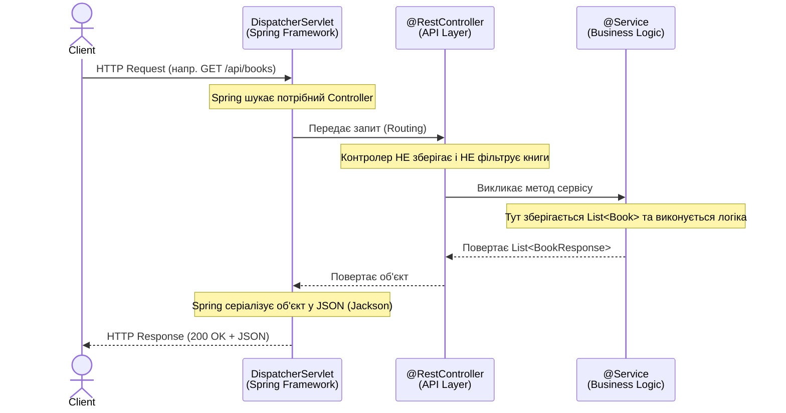

# Практикум 2: Архітектура Шарів та Dependency Injection

**Тип:** Hands-on Lab
**Рівень:** Junior Strong
**Попередні вимоги:** Робочий проєкт з Практикуму 1 (`library-service` з `BookController` та `BookResponse`).
**Інженерна мета:** Навчитись розділяти відповідальність (Separation of Concerns). Зрозуміти, чому код у Контролері — це архітектурний борг.
**Бізнес-задача:** Перенести логіку роботи з книгами у `BookService`, реалізувати додавання книги через POST.

> [!NOTE]
> **Продовження проєкту `library-service`** 📚
> У P03 ви створили `BookController`, який повертав статичний список книг прямо зі свого методу. Це тимчасовий компроміс, і зараз ми його виправимо: винесемо зберігання та логіку в `BookService`.

---

##  Експрес-опитування: Перевірка зв'язку

1.  **Life Cycle:** Хто створює об'єкти контролерів у Spring Boot: ви через `new` чи фреймворк?
2.  **Testing:** Якщо ви написали логіку пошуку книг прямо в контролері, чи зможете ви її протестувати, не запускаючи Tomcat?
3.  **Core Concept:** Що таке «Bean» у термінології Spring?

<details markdown="1">
<summary>Відповіді (Самоперевірка)</summary>

1.  **Фреймворк (Spring Container).** Це суть IoC (Inversion of Control).
2.  **Ні.** Вам доведеться піднімати весь контекст (Integration Test), що довго і ресурсоємно. Unit-тест неможливий.
3.  **Об'єкт, яким керує Spring.** Це будь-який Java-об'єкт, який ініціалізується, збирається та знищується Spring IoC контейнером.

</details>

---

## Архітектура запиту (Request Flow)

Перш ніж писати код, давайте подивимось на правильний життєвий цикл обробки запиту (Request Lifecycle) у двошаровій архітектурі:



---

## Частина 1: Створення Service Layer (Business Logic) (15 хв)

### Бізнес-сценарій: Проблема «Товстого Контролера»
У P03 ми залишили статичний список книг прямо в методі контролера. Уявіть, що тепер нам треба: фільтрувати книги за автором, шукати за назвою, додавати нові. Студент-новачок напише всю цю логіку прямо в методах `@GetMapping`.

> [!CAUTION]
> **Чому це архітектурна помилка (Engineering Flaw)?**
> 1.  **Testing:** Щоб протестувати логіку пошуку, вам доведеться піднімати весь веб-сервер. Це повільно (секунди замість мілісекунд).
> 2.  **Reusability:** Якщо та сама логіка знадобиться в іншому контролері — ви дублюєте код.
> 3.  **Single Responsibility:** Контролер — це «секретар» (прийняв запит, віддав відповідь). Він не повинен бути «бібліотекарем» (знати де що лежить).

### Завдання 1.1: Створення `BookService`
Виносимо логіку зберігання та роботи з книгами в окремий клас.

1.  Створіть пакет `ua.edu.libraryservice.service`.
2.  Створіть клас `BookService`.

**Файл: src/main/java/ua/edu/libraryservice/service/BookService.java**
```java
package ua.edu.libraryservice.service;

import org.springframework.stereotype.Service;
import ua.edu.libraryservice.dto.BookResponse;

import java.util.ArrayList;
import java.util.List;
import java.util.concurrent.atomic.AtomicLong;

@Service // Кажемо Spring: «Це бізнес-логіка. Створи цей об'єкт і тримай у пам'яті».
public class BookService {

    // In-memory сховище: дані живуть поки живе процес
    private final List<BookResponse> books = new ArrayList<>();
    private final AtomicLong idCounter = new AtomicLong(1);

    public BookService() {
        // Початкові дані (seed)
        books.add(new BookResponse(idCounter.getAndIncrement(), "Clean Code", "Robert C. Martin"));
        books.add(new BookResponse(idCounter.getAndIncrement(), "The Pragmatic Programmer", "David Thomas"));
    }

    public List<BookResponse> findAll() {
        return List.copyOf(books); // Повертаємо незмінну копію
    }

    public BookResponse addBook(String title, String author) {
        BookResponse book = new BookResponse(idCounter.getAndIncrement(), title, author);
        books.add(book);
        return book;
    }
}
```

---

## Частина 2: Dependency Injection — Правильне «Зв'язування» (15 хв)

### Бізнес-сценарій
Контролеру потрібен Сервіс, щоб отримувати та додавати книги. Як їх з'єднати так, щоб код залишився стабільним і тестованим?

> [!CAUTION]
> **Legacy Way: Field Injection (Заборонено)**
> ```java
> @Autowired
> private BookService bookService; 
> ```
> Не робіть так! Це унеможливлює Unit-тестування без підняття всього фреймворку.
> 
> *(Сноска: `@Autowired` — це анотація, яка вказує Spring автоматично знайти та підставити потрібний об'єкт (бін) у це поле. Це і є механізм Dependency Injection).*

### Завдання 2.1: Оновлення `BookController` — Constructor Injection

Ми передаємо залежність через конструктор. Це робить клас стабільним, а його залежності — явними.

**Файл: src/main/java/ua/edu/libraryservice/controller/BookController.java** — повна версія:
```java
package ua.edu.libraryservice.controller;

import org.springframework.web.bind.annotation.*;
import ua.edu.libraryservice.dto.BookResponse;
import ua.edu.libraryservice.service.BookService;

import java.util.List;

@RestController
@RequestMapping("/api/books")
public class BookController {

    private final BookService bookService;

    // Spring автоматично знайде потрібний сервіс і передасть його сюди
    public BookController(BookService bookService) {
        this.bookService = bookService;
    }

    @GetMapping("/ping")
    public String ping() {
        return "Library Service: OK";
    }

    @GetMapping
    public List<BookResponse> getAllBooks() {
        // Контролер делегує роботу Сервісу — він не знає де і як зберігаються книги
        return bookService.findAll();
    }
}
```

> [!IMPORTANT]
> **Engineering Deep Dive: Чому Constructor Injection?**
> Чому ми пишемо більше коду замість одного `@Autowired`?
> 1. **Immutability:** Поле `bookService` можна зробити `final`. Ніхто не підмінить сервіс посеред роботи програми.
> 2. **Testing without Spring:** У Unit-тестах ви можете створити контролер вручну: `new BookController(new BookService())`. Швидко і просто.
> 3. **Circular Dependencies:** Якщо Сервіс А залежить від Б, а Б від А — конструктор впаде одразу при запуску, явно вказавши на помилку проєктування. Field Injection приховує це до моменту першого виклику.

---

## Частина 3: Додавання POST-ендпоінту (10 хв)

### Бізнес-сценарій
Наш API наразі тільки читає. Хороша бібліотека дозволяє також додавати нові книги. Реалізуємо `POST /api/books`.

### Завдання 3.1: Створення `BookRequest` DTO

**Файл: src/main/java/ua/edu/libraryservice/dto/BookRequest.java**
```java
package ua.edu.libraryservice.dto;

public record BookRequest(String title, String author) {}
```

### Завдання 3.2: Додати POST-метод у `BookController`

```java
import org.springframework.http.HttpStatus;
import org.springframework.web.bind.annotation.ResponseStatus;

    @PostMapping
    @ResponseStatus(HttpStatus.CREATED) // Повертаємо 201, а не 200
    public BookResponse addBook(@RequestBody BookRequest request) {
        return bookService.addBook(request.title(), request.author());
    }
```

> [!NOTE]
> **Чому 201, а не 200?**
> `200 OK` означає «запит виконано». `201 Created` означає «ресурс створено». Це різні семантики HTTP. Правильний статус-код — частина контракту API. Детальніше — у [P08: API Practice](p08_api_practice.md).

---

## Частина 4: Розбір коду — Пошук за автором (15 хв)

### Бізнес-сценарій
Давайте розглянемо, як правильно реалізувати пошук книг за автором, не порушуючи архітектурних принципів. Де має знаходитись логіка фільтрації?

### Крок 1: Логіка в `BookService`
Алгоритм пошуку та валідація — це бізнес-логіка, тому вона розміщується виключно в Сервісі:

```java
    public List<BookResponse> findByAuthor(String author) {
        if (author == null || author.isBlank()) {
            throw new IllegalArgumentException("Author must not be blank");
        }
        
        return books.stream()
                .filter(b -> b.author().equalsIgnoreCase(author))
                .toList();
    }
```

### Крок 2: Ендпоінт у `BookController`
Контролер лише приймає HTTP-запит з параметром (`@RequestParam`) і делегує виконання сервісу:

```java
    // Приклад запиту: GET /api/books/search?author=Martin
    @GetMapping("/search")
    public List<BookResponse> searchBooks(@RequestParam String author) {
        return bookService.findByAuthor(author);
    }
```

> [!NOTE]
> **Архітектурне питання:**
> Якщо ми вирішимо змінити логіку фільтрації (наприклад, шукати не за точним співпадінням, а за частковим збігом — підрядком), скільки файлів нам доведеться редагувати?

<details markdown="1">
<summary>Відповідь</summary>

**Один.** Тільки `BookService`.
Контролер (API Layer) нічого не знає про деталі алгоритму пошуку, він лише передає дані. Це яскравий приклад принципу **Separation of Concerns** (Розділення відповідальності).

</details>

---

## Частина 5: Оновлення автотестів для перевірки POST (10 хв)

### Бізнес-сценарій
Новий функціонал (додавання книг) має бути покритий тестами. Необхідно переконатися, що API коректно обробляє `POST` запити та повертає правильні статус-коди.

### Розбір коду: Написання тесту для POST /api/books

Оскільки ми додали новий функціонал, необхідно перевірити його працездатність. Ось приклад того, як можна протестувати створення книги за допомогою `MockMvc`:

```java
import org.junit.jupiter.api.Test;
import org.springframework.beans.factory.annotation.Autowired;
import org.springframework.boot.test.autoconfigure.web.servlet.AutoConfigureMockMvc;
import org.springframework.boot.test.context.SpringBootTest;
import org.springframework.http.MediaType;
import org.springframework.test.web.servlet.MockMvc;

import static org.springframework.test.web.servlet.request.MockMvcRequestBuilders.post;
import static org.springframework.test.web.servlet.result.MockMvcResultMatchers.status;
import static org.springframework.test.web.servlet.result.MockMvcResultMatchers.jsonPath;

@SpringBootTest
@AutoConfigureMockMvc
class BookControllerTest {

    @Autowired
    private MockMvc mockMvc;

    @Test
    void shouldCreateNewBook() throws Exception {
        // Формуємо тіло запиту (JSON)
        String newBookJson = """
                {
                    "title": "Spring in Action",
                    "author": "Craig Walls"
                }
                """;

        // Виконуємо POST-запит та перевіряємо результат
        mockMvc.perform(post("/api/books")
                .contentType(MediaType.APPLICATION_JSON)
                .content(newBookJson))
                .andExpect(status().isCreated())          // Перевіряємо статус 201 Created
                .andExpect(jsonPath("$.id").exists())     // Перевіряємо, що сервер згенерував ID
                .andExpect(jsonPath("$.title").value("Spring in Action"));
    }
}
```

> [!TIP]
> **Тестування через термінал (cURL)**
> Якщо у вас не встановлено Postman або Insomnia, ви можете перевірити створення книги прямо з терміналу:
> ```bash
> curl -X POST http://localhost:8080/api/books \
>      -H "Content-Type: application/json" \
>      -d '{"title": "Spring in Action", "author": "Craig Walls"}'
> ```

---

##  Контрольні питання
1. У чому різниця між `@RestController` та `@Service` для JVM? Чи це різні об'єкти?
2. Чому поле сервісу в контролері позначено як `final`?
3. Ви бачите проєкт, де логіка написана в контролері. Назвіть 3 метрики, які погіршуються від такого рішення.

<details markdown="1">
<summary>Відповіді</summary>

1. Для JVM це просто об'єкти. Різниця лише в семантиці для програміста та в тому, як Spring їх обробляє (Controller реєструє ендпоінти, Service — ні). Технічно це все «Spring Beans».
2. Щоб гарантувати **Immutability** (незмінність). Після створення контролера залежність (сервіс) не може бути змінена. Це Thread-safe підхід.
3. **Testability** (складніше писати Unit-тести), **Maintainability** (важче читати та змінювати код), **Reusability** (код неможливо використати в іншому місці).

</details>

---

**[⬅️ P03: Zero to Hero](p03_spring_zero_to_hero.md)** | **[P05: Production Ready ➡️](p05_spring_production_ready.md)**

**[⬅️ Повернутися до головного меню курсу](../../index.md)**
