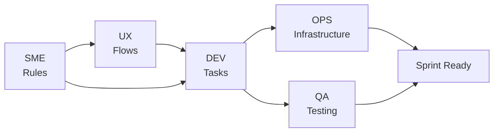

# План воркшопу: Децентралізована команда (VARTA)

**Зв'язок з теорією:** [Лекція 3: Requirements](../03_requirements.md) | [Воркшоп: Scrum Ceremonies](../workshop_02_agile.md) | [Product Backlog](product_backlog.md)
**Ціль:** Пройти повний цикл розробки вимог та планування через симуляцію ролей у децентралізованих сквадах.

---

## 👥 Структура Сквадів
Група ділиться на **3 автономні Сквади**:
- **Alpha** (Альфа)
- **Beta** (Бета)
- **Gamma** (Гамма)

**Склад кожного скваду:** ~7-9 осіб.
**Ролі всередині (з ротацією):** Dev, QA, Ops, SME, UX.
**PO / Scrum Master:** Викладач.

---

## 🗓 Дорожня карта (Multi-week Roadmap)

Воркшоп розрахований на декілька тижнів з поступовим зануренням у ролі та зміною фокусу.

### Етап 1: Старт та Орієнтація (День 1)
- **Презентація проєкту VARTA:** Цілі, технічні виклики (Mesh, Offline-first, CRDT).
- **Реєстрація:** Створення команд, розподіл по сквадах Alpha/Beta/Gamma.
- **Ознайомлення:** Аналіз [Product Backlog](product_backlog.md).

### Етап 2: Аналіз та Уточнення (Тиждень 2)
- **Фокус:** **SME (Subject Matter Experts)** та **UX/Design**.
- **Діяльність:** 
    - Сквади проводять **Sprint Planning**.
    - SME уточнюють доменні правила та BAU (Business As Usual).
    - UX малюють Lo-fi flow для критичних User Stories.
- **Результат:** Оновлені вимоги з AC та візуальними схемами.

### Етап 3: Синхронізація (Тиждень 3)
- **Фокус:** Церемонії та вирівнювання.
- **Діяльність:**
    - Симуляція **Daily Scrum** (синхронізація прогресу уточнення).
    - Проведення **Sprint Retrospective** за результатами фази аналізу.
    - Підготовка до технічної деталізації.

### Етап 4: Технічна деталізація та Ротація (Тиждень 4+)
- **Зміна ролей:** Студенти змінюють спеціалізацію всередині скваду.
- **Фокус:** **DEV** (Технічні таски), потім **OPS** (Інфраструктура), потім **QA** (Тест-плани).
- **Діяльність:** Поступове наповнення технічними тасками згідно з ролями.

---

## 🛠 Матриця відповідальності (по фазах)

| Фаза (Тиждень) | Пріоритетна Роль | Що створюється | Шаблон / Артефакт |
| :--- | :--- | :--- | :--- |
| **1: Startup** | PO / All | Формування сквадів | [Backlog](product_backlog.md) |
| **2: Analysis** | **SME + UX** | Domain Logic + User Flow | [SME](sme_template.md) / [UX](ux_template.md) |
| **3: Engineering** | **DEV** | Technical Tasks + API | [Dev](dev_template.md) |
| **4: Platform** | **OPS** | CI/CD + Environment | [Ops](ops_template.md) |
| **5: Quality** | **QA** | Acceptance Criteria + Tests | [QA](qa_template.md) |

---

## 🔄 Механіка Ротації
Кожні 1-2 тижні (після проведення Ретроспективи) сквад може перерозподілити ролі. Це дозволяє кожному студенту:
1. Побути в ролі того, хто *ставить* вимоги (SME/UX).
2. Побути в ролі того, хто *виконує* таски (DEV).
3. Побути в ролі того, хто *забезпечує* стабільність (OPS/QA).

---

## Граф залежностей (Flow)

---

## 📝 Конвенція оформлення тікетів (GitHub Project)

Усі тікети створюються в [GitHub Project](https://github.com/users/vplanto/projects/1).

### Naming Convention (заголовок тікету)

Формат: `ТИП-## EP-XX US-YY | Короткий опис англійською`

| Тип | Префікс | Приклад заголовку |
| :--- | :--- | :--- |
| Доменне правило | `DR-##` | `DR-01 EP-02 US-06 \| Quota transfer requires Trust ≥ 2` |
| BAU-процес | `BAU-##` | `BAU-01 EP-02 US-07 \| Local ledger on Mesh disconnect` |
| Edge Case | `EC-##` | `EC-01 EP-04 US-14 \| Medical vs Comms priority conflict` |
| User Story | `US-##` | `US-01 EP-01 \| Offline device registration` |
| Technical Task | `TT-##` | `TT-01 EP-02 US-07 \| CRDT merge algorithm for quotas` |
| Test Case | `TC-##` | `TC-01 EP-05 US-20 \| Multi-hop delivery at-least-once` |
| Ops Task | `OPS-##` | `OPS-01 EP-03 US-13 \| Telemetry buffer rotation policy` |

### Тіло тікету (описується українською)

Тіло кожного тікету містить:
- **Тип** — категорія (Domain Rule / BAU / Edge Case / Technical Task / ...)
- **Сквад** — Alpha / Beta / Gamma
- **Пов'язані Stories** — US-XX, US-YY
- **Опис** — детальний опис українською
- **Залежності** — `#<номер>` пов'язаного тікету

### Labels (обов'язкові)

| Label | Значення |
| :--- | :--- |
| `squad:alpha` / `squad:beta` / `squad:gamma` | Приналежність до скваду |
| `domain-rule` / `bau` / `edge-case` / `tech-task` / `test-case` / `ops` | Тип тікету |
| `EP-01` ... `EP-06` | Приналежність до Epic |

---

**[⬅️ Повернутися до Scrum Ceremonies](../workshop_02_agile.md)** | **[⬅️ Повернутися до головного меню курсу](../index.md)**

