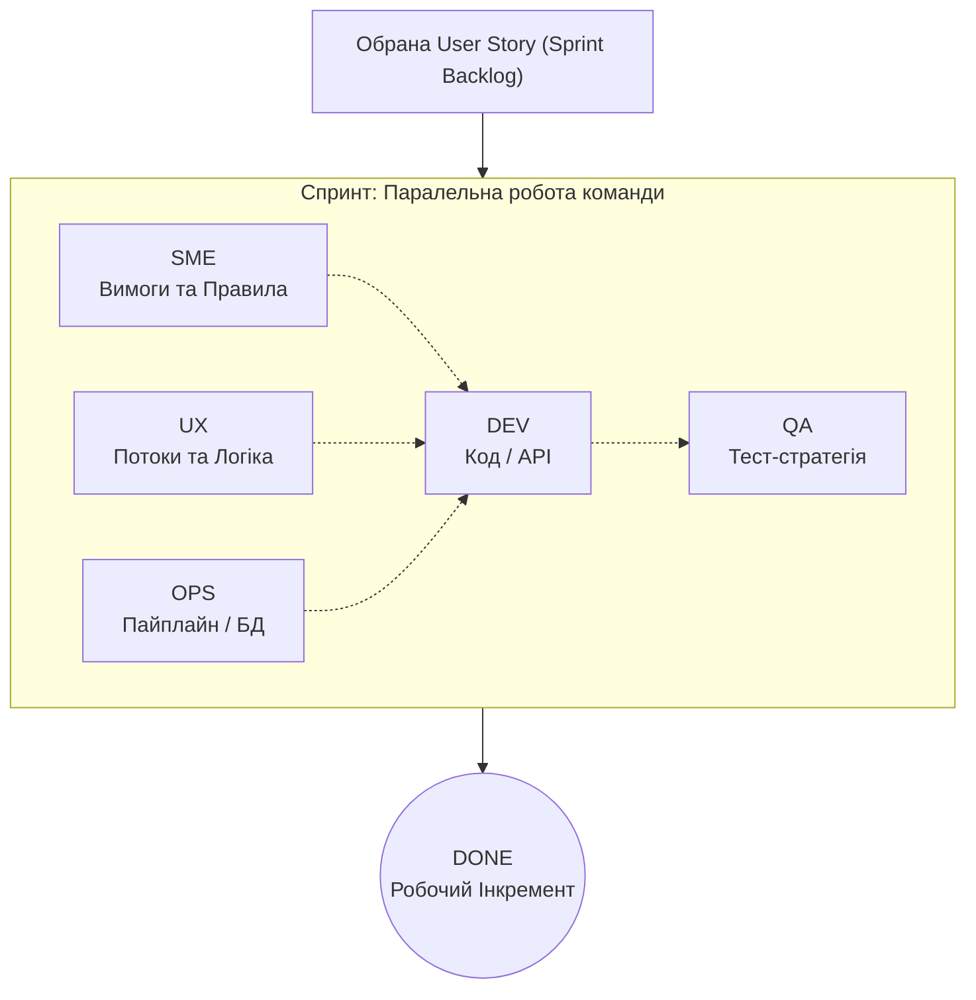

# План воркшопу: Децентралізована команда (VARTA)

**Зв'язок з теорією:** [Лекція 3: Requirements](../03_requirements.md) | [Воркшоп: Scrum Ceremonies](../workshop_02_agile.md) | [Product Backlog](product_backlog.md)
**Ціль:** Пройти повний цикл розробки вимог та планування через симуляцію ролей у децентралізованих сквадах.

---

## 👥 Структура Сквадів
Група ділиться на **3 автономні Сквади**:
- **Alpha** (Альфа)
- **Beta** (Бета)
- **Gamma** (Гамма)

**Склад кожного скваду:** ~7-9 осіб.
**Ролі всередині (з ротацією):** Dev, QA, Ops, SME, UX.
**PO / Scrum Master:** Викладач.

---

## 🗓 Дорожня карта (Multi-week Roadmap)

Воркшоп розрахований на декілька тижнів з поступовим зануренням у ролі та зміною фокусу.

### Етап 1: Старт та Орієнтація (День 1)
- **Презентація проєкту VARTA:** Цілі, технічні виклики (Mesh, Offline-first, CRDT).
- **Реєстрація:** Створення команд, розподіл по сквадах Alpha/Beta/Gamma.
  - **Що потрібно:** визначити координатора скваду на перший спринт, створити канали комунікації (Telegram/Discord), налаштувати доступи до репозиторію та Kanban-дошки (GitHub).
  - **Розподіл по ролях в скваді:** кожен учасник обирає первинну роль (SME, UX, DEV, QA, OPS) для першого спринта. Пам'ятайте про механіку ротації в майбутньому.
- **Ознайомлення:** Аналіз [Product Backlog](product_backlog.md).

### Тиждень 2: Sprint 1 (Базовий Вертикальний Зріз)
- **Фокус:** Поставка першої працюючої (End-to-End) User Story від обраного Епіка.
- **Діяльність:** Усі ролі працюють **паралельно**, утворюючи Вертикальний Зріз:
    - **До Planning:** сквад проводить **Sprint Grooming (Backlog Refinement)** — див. [нижче](#grooming-and-planning).
    - Сквади проводять **Sprint Planning** (зобов’язання на спринт, Sprint Goal, Sprint Backlog).
    - **SME/UX** формують швидкі вимоги, AC та потоки взаємодії.
    - **DEV** створює базове API або код (на основі вимог).
    - **QA/OPS** одночасно з Dev готують тест-плани та план деплою.
- **Результат:** Працюючий код або зріз системи (Increment), а не просто документація чи аналітика.

### Тиждень 3: Sprint 2 (Розширення та Edge Cases)
- **Фокус:** Реалізація складніших зв'язків та обробка виняткових ситуацій (Edge Cases).
- **Діяльність:**
    - Проведення **Daily Scrum** для координації дій паралельних ролей.
    - Реалізація нових складніших User Stories.
    - Проведення **Sprint Retrospective** та узгодження результатів фази.

### Тиждень 4+: Sprint 3 (Масштабування та E2E)
- **Зміна ролей (Ротація):** Студенти змінюють спеціалізацію, щоб кожен спробував нову функцію (DEV стає QA, SME стає DEV тощо).
- **Фокус:** Додавання складної бізнес-логіки (Domain Logic), поліпшення інфраструктури (Ops) та швидкодії. Створення готових Production-ready зрізів.

---

## Sprint Grooming / Backlog Refinement і Sprint Planning

У Scrum **немає окремої «церемонії Grooming» у календарі** — зате є обов’язкова **постійна діяльність**: **Product Backlog Refinement** (те саме, що в індустрії часто називають **Sprint Grooming** або **Backlog Grooming**).

### Що це таке

**Backlog Refinement** — це робота команди з PO над верхівкою Product Backlog: уточнення формулювань User Stories, **Acceptance Criteria**, оцінка складності (Story Points), розбиття завеликих елементів, виявлення залежностей і ризиків. Мета — щоб **перед Sprint Planning** найпріоритетніші елементи були **зрозумілі й «готові до планування»**, а не вперше читались зі списку на самій зустрічі.

### Чим Refinement відрізняється від Sprint Planning

| | **Backlog Refinement (Grooming)** | **Sprint Planning** |
| :--- | :--- | :--- |
| **Питання** | «Чи ми *розуміємо* задачу? Скільки це коштує в SP? Що розбити?» | «Що ми *беремо в цей спринт*? Яка **Sprint Goal**? Хто що робить першим днем?» |
| **Результат** | Уточнений backlog, оцінки, дрібніші шматки, відкриті питання до PO | **Sprint Backlog** + публічне **зобов’язання** команди на інкремент |
| **Хто вирішує пріоритет** | PO пріоритезує; команда уточнює та оцінює | PO пропонує порядок; команда погоджує обсяг за capacity |

Без grooming Planning перетворюється на довге «перше читання ТЗ»; без Planning refinement лишається теорією без спринтового зобов’язання.

### Як це застосовувати на воркшопі VARTA

1. **Коли:** між заняттями або окремим коротким слотом **до** Sprint Planning (наприклад, 30–60 хв або домашня підготовка скваду).
2. **Що робити:** переглянути [Product Backlog](product_backlog.md), для кандидатних US — чернетки тікетів **DR / EC / BAU** ([SME](sme_template.md)), **UF / WF** ([UX](ux_template.md)), питання до PO; за потреби — попередня оцінка в SP (як на [практикумі Scrum](../workshop_02_agile.md)).
3. **Коли зупинитись:** топ-елементи backlog мають достатньо контексту, щоб на **Sprint Planning** лишилось **обрати одну US на вертикальний зріз**, сформулювати Sprint Goal і розкласти роботу по ролях — без винаходу вимог з нуля в залі.

Теоретичне підкріплення: [Лекція 2, Scrum-церемонії](../02_delivery_methodology.md) (Sprint Planning, Daily, Review, Retro), [Лекція 3, INVEST і готовність Story](../03_requirements.md).

---

## 🛠 Матриця кросфункціональної відповідальності

Замість горизонтального порізання (передачі завдань "каскадом" від тижня до тижня), усі ролі працюють **паралельно** над однією User Story протягом одного Спринта (Вертикальне порізання). Кожна роль додає свою експертизу до створення спільного E2E інкременту:

| Роль | Зона відповідальності у Спринті | Шаблон / Артефакт |
| :--- | :--- | :--- |
| **PO** | Пріоритезація Backlog (викладач) | [Backlog](product_backlog.md) |
| **SME** | Визначає "Що розробляємо", доменні правила, Edge Cases | [SME Template](sme_template.md) |
| **UX** | Визначає "Як це виглядає та працює" (User Flows) | [UX Template](ux_template.md) |
| **DEV** | Реалізує логіку, код, API для обраної Story | [DEV Template](dev_template.md) |
| **OPS** | Забезпечує цілісність інфраструктури, пайплайни | [OPS Template](ops_template.md) |
| **QA** | Створює критерії якості, планує автотести | [QA Template](qa_template.md) |

---

## 🔄 Механіка Ротації
Кожні 1-2 тижні (наприкінці Спринта під час Ретроспективи) сквад перерозподіляє ролі. Це дозволяє кожному студенту спробувати себе в усіх аспектах команди: від збору вимог до кодування та інфраструктури, формуючи справжніх кросфункціональних фахівців.

---

## Граф залежностей (Agile Vertical Slicing)

---

## 📝 Конвенція оформлення тікетів (GitHub Project)

Усі тікети створюються в [GitHub Project](https://github.com/users/vplanto/projects/1).

### Naming Convention (заголовок тікету)

Формат: `ТИП-## EP-XX US-YY | Короткий опис англійською`

| Тип | Префікс | Приклад заголовку |
| :--- | :--- | :--- |
| Доменне правило | `DR-##` | `DR-01 EP-02 US-06 \| Quota transfer requires Trust ≥ 2` |
| BAU-процес | `BAU-##` | `BAU-01 EP-02 US-07 \| Local ledger on Mesh disconnect` |
| Edge Case | `EC-##` | `EC-01 EP-04 US-14 \| Medical vs Comms priority conflict` |
| User Story | `US-##` | `US-01 EP-01 \| Offline device registration` |
| Technical Task | `TT-##` | `TT-01 EP-02 US-07 \| CRDT merge algorithm for quotas` |
| Test Case | `TC-##` | `TC-01 EP-05 US-20 \| Multi-hop delivery at-least-once` |
| Ops Task | `OPS-##` | `OPS-01 EP-03 US-13 \| Telemetry buffer rotation policy` |

### Тіло тікету (описується українською)

Тіло кожного тікету містить:
- **Тип** — категорія (Domain Rule / BAU / Edge Case / Technical Task / ...)
- **Сквад** — Alpha / Beta / Gamma
- **Пов'язані Stories** — US-XX, US-YY
- **Опис** — детальний опис українською
- **Залежності** — `#<номер>` пов'язаного тікету

### Labels (обов'язкові)

| Label | Значення |
| :--- | :--- |
| `squad:alpha` / `squad:beta` / `squad:gamma` | Приналежність до скваду |
| `domain-rule` / `bau` / `edge-case` / `tech-task` / `test-case` / `ops` | Тип тікету |
| `EP-01` ... `EP-06` | Приналежність до Epic |

---

**[⬅️ Повернутися до Scrum Ceremonies](../workshop_02_agile.md)** | **[⬅️ Повернутися до головного меню курсу](../index.md)**

