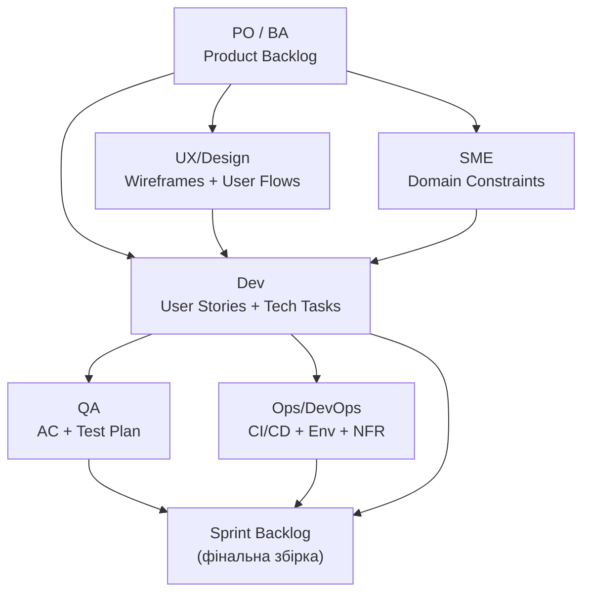

# Воркшоп: Командне планування спринту

**Зв'язок з теорією:** [Лекція 3: Requirements](../03_requirements.md) | [Воркшоп: Scrum Ceremonies](../workshop_02_agile.md)
**Ціль:** Навчитися перетворювати Product Backlog на Sprint Backlog силами спеціалізованих команд.

---

## Суть воркшопу

PO приносить пріоритезований **Product Backlog**. Студенти діляться на команди за ролями. Кожна команда створює свій артефакт, після чого результати збираються у єдиний **Sprint Plan**.

---

## Команди та артефакти

| Команда | Роль | Створює | Шаблон |
| :--- | :--- | :--- | :--- |
| **PO / BA** | Приносить задачі від бізнесу, відповідає на питання | Пріоритезований Product Backlog (User Stories) | [product_backlog.md](product_backlog.md) |
| **Dev** | Деталізує Stories, створює Technical Tasks | User Stories + Technical Tasks (API, DB schema) | [dev_template.md](dev_template.md) |
| **QA** | Пише критерії приймання та план тестування | AC (Given/When/Then) + Test Plan | [qa_template.md](qa_template.md) |
| **Ops / DevOps** | Визначає інфраструктурні залежності | CI/CD Pipeline + Environment + NFR checklist | [ops_template.md](ops_template.md) |
| **SME** | Валідує бізнес-логіку та доменні правила | Domain Constraints + BAU-вимоги | [sme_template.md](sme_template.md) |
| **UX / Design** | Створює wireframes та user flows | Lo-fi wireframes + User Flow diagram | [ux_template.md](ux_template.md) |

> **Примітка:** Залежно від розміру групи, UX/Design і SME можна об'єднати з іншими командами.

---

## Граф залежностей

---

## Flow воркшопу

### Фаза 1: Вхідний документ (5 хв)
PO представляє [Product Backlog](product_backlog.md) (3–5 User Stories різного розміру).
Команди задають уточнюючі питання, використовуючи [контрольні питання з Лекції 3](../03_requirements.md#8-приховані-вимоги-та-bau-business-as-usual).

### Фаза 2: Паралельна робота команд (20 хв)

| Команда | Що робить | Використовує з Лекції 3 |
| :--- | :--- | :--- |
| **Dev** | Деталізує Stories → Technical Tasks | User Stories, INVEST, Декомпозиція |
| **QA** | Пише AC для кожної Story | Acceptance Criteria (Given/When/Then) |
| **Ops** | Визначає env, CI/CD, NFR | FR / NFR / Constraints |
| **SME** | Валідує бізнес-правила, шукає BAU | Приховані вимоги, BAU |
| **UX** | Малює wireframes | User Stories |

### Фаза 3: Cross-review (10 хв)
Команди обмінюються артефактами:
- Dev перевіряє, чи AC від QA покривають edge cases
- QA перевіряє, чи Technical Tasks відповідають User Stories
- Ops перевіряє, чи Dev врахував NFR
- SME валідує, що BAU-процеси не порушені

### Фаза 4: Sprint Planning (10 хв)
- Оцінка задач (Planning Poker — див. [Scrum Ceremonies](../workshop_02_agile.md))
- Формування Sprint Backlog з урахуванням capacity

---

## Зв'язок з Лекцією 3 (Requirements)

| Концепція з Лекції 3 | Де застосовується |
| :--- | :--- |
| User Stories (As / I want / So that) | Dev деталізує Stories |
| Acceptance Criteria (Given/When/Then) | QA пише AC |
| Приховані вимоги / BAU | SME виявляє неочевидні бізнес-правила |
| INVEST критерії | Dev перевіряє Stories перед оцінкою |
| Декомпозиція (Epic → Story → Task) | Dev розбиває великі Stories на Tasks |
| FR / NFR / Constraints | Ops виділяє NFR та Constraints |
| BACCM (Need → Change → Solution) | Всі команди розуміють контекст |

---

**[⬅️ Повернутися до Scrum Ceremonies](../workshop_02_agile.md)** | **[⬅️ Повернутися до головного меню курсу](../index.md)**
