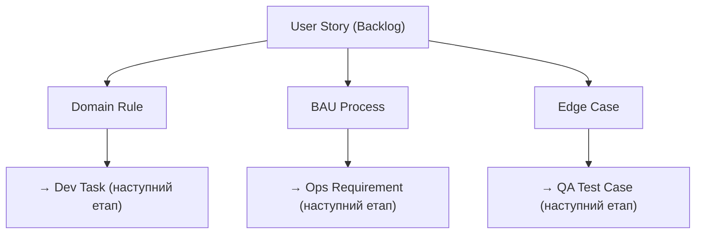

# SME (Subject Matter Expert): Аналіз доменних правил

**Проєкт:** VARTA (Distributed Resilience Orchestrator)
**Сквад:** Alpha / Beta / Gamma *(вказати свій)*
**GitHub Project:** [VARTA Board](https://github.com/users/vplanto/projects/1)
**Зв'язок:** [Product Backlog](product_backlog.md) | [План воркшопу](plan.md) | [QA](qa_template.md) | [Лекція 3: Requirements](../03_requirements.md)

---

## Ціль ролі SME

Ви — **експерт предметної області**. Ваше завдання — виявити **приховані бізнес-правила**, які не записані явно в User Stories, але без яких система працюватиме неправильно або небезпечно.

Кожне виявлене правило, BAU-процес або edge case — це **окремий тікет** у [GitHub Project](https://github.com/users/vplanto/projects/1). Тікет = ваш дизайн-артефакт.

> 🔗 **Що шукаємо?** Див. [Приховані вимоги та BAU](../03_requirements.md#8-приховані-вимоги-та-bau-business-as-usual) з Лекції 3.
> 
> 📝 **Naming Convention:** Див. [Конвенція оформлення тікетів](plan.md#-конвенція-оформлення-тікетів-github-project). Заголовок англійською, тіло українською.

---

## Робочий процес

### Крок 1: Оберіть User Stories для аналізу

З [Product Backlog](product_backlog.md) оберіть **3–5 Stories** зі свого Epic (згідно з розподілом по сквадах).

### Крок 2: Створіть тікети у GitHub Project

Для кожного виявленого правила / BAU / edge case створіть **окремий тікет** (Issue) у [GitHub Project](https://github.com/users/vplanto/projects/1).

---

## Типи тікетів

### 🏷 `domain-rule` — Доменне правило

Бізнес-правило предметної області, яке має бути реалізоване в коді.

**Формат заголовку:** `DR-## EP-XX US-YY | Short English description`

**Тіло тікету (українською):**
```
**Тип:** Domain Rule
**Сквад:** Alpha / Beta / Gamma
**Пов'язані Stories:** US-XX, US-YY
**Labels:** domain-rule, squad:xxx, EP-XX

**Правило:**
<Чітке формулювання правила>

**Чому це важливо:**
<Що станеться, якщо це правило не реалізувати>

**Залежності:** #<номер пов'язаного тікету>
```

<details markdown="1">
<summary>📋 Приклад тікету domain-rule</summary>

**Заголовок:** `DR-01 EP-02 US-06 | Quota transfer requires Trust ≥ 2`

**Тіло:**
```
**Тип:** Domain Rule
**Сквад:** Beta
**Пов'язані Stories:** US-06, US-02
**Labels:** domain-rule, squad:beta, EP-02

**Правило:**
Передача квоти (US-06) можлива лише між вузлами,
які мають рівень довіри ≥ 2 у Web of Trust (US-02).

**Чому це важливо:**
Без цього обмеження зловмисник може зареєструвати
фейковий вузол і вивести квоти інших учасників.

**Залежності:** #12 (US-02 Face-to-Face Trust)
```
</details>

---

### 🏷 `bau` — Business As Usual

Процес, який **вже існує** або **має продовжувати працювати** після впровадження системи.

**Формат заголовку:** `BAU-## EP-XX US-YY | Short English description`

**Тіло тікету (українською):**
```
**Тип:** BAU (Business As Usual)
**Сквад:** Alpha / Beta / Gamma
**Пов'язані Stories:** US-XX
**Labels:** bau, squad:xxx, EP-XX

**Процес:**
<Опис процесу, який має працювати "за замовчуванням">

**Що станеться, якщо забудемо:**
<Наслідки ігнорування>

**Залежності:** #<номер пов'язаного тікету>
```

> 📝 Використовуйте [5 контрольних питань з Лекції 3](../03_requirements.md#контрольні-питання-перед-стартом-розробки), адаптовані для VARTA:
> 1. **Хто буде користуватись?** → Мешканці без технічної освіти на смартфонах Android 8+. Оператори на Raspberry Pi.
> 2. **Якими пристроями?** → Bluetooth LE / Wi-Fi Direct, пропускна здатність ≤ 250 Kbps. Не браузер, а нативний додаток.
> 3. **В яких умовах?** → Відсутність інтернету, нестабільне живлення, стресові ситуації користувачів.
> 4. **Що НЕ повинна робити система?** → Не замінювати екстрені служби (112). Рішення диспетчера — рекомендаційні.
> 5. **Що вважається успіхом через 6 місяців?** → Громада автономно розподіляє ресурси без зовнішнього втручання.

<details markdown="1">
<summary>📋 Приклад тікету bau</summary>

**Заголовок:** `BAU-01 EP-02 US-07 | Local ledger on Mesh disconnect`

**Тіло:**
```
**Тип:** BAU (Business As Usual)
**Сквад:** Alpha
**Пов'язані Stories:** US-07, US-13
**Labels:** bau, squad:alpha, EP-02

**Процес:**
При повному відключенні Mesh — вузол продовжує
локальний облік квот. Синхронізація при відновленні.

**Що станеться, якщо забудемо:**
Дані губляться, довіра до системи падає.
Користувач не знає, скільки квоти залишилось.

**Залежності:** #15 (US-07 CRDT Ledger Sync)
```
</details>

---

### 🏷 `edge-case` — Граничний випадок

Ситуація, яка може **зламати логіку** або створити **етичну дилему**.

**Формат заголовку:** `EC-## EP-XX US-YY | Short English description`

**Тіло тікету (українською):**
```
**Тип:** Edge Case
**Сквад:** Alpha / Beta / Gamma
**Пов'язані Stories:** US-XX
**Labels:** edge-case, squad:xxx, EP-XX

**Ситуація:**
<Опис конфліктної або граничної ситуації>

**Очікувана поведінка:**
<Як система має реагувати>

**Відкрите питання до PO:**
<Що потребує рішення від Product Owner>

**Залежності:** #<номер пов'язаного тікету>
```

<details markdown="1">
<summary>📋 Приклад тікету edge-case</summary>

**Заголовок:** `EC-01 EP-04 US-14 | Medical vs Comms priority conflict at charge < 10%`

**Тіло:**
```
**Тип:** Edge Case
**Сквад:** Gamma
**Пов'язані Stories:** US-14, US-15
**Labels:** edge-case, squad:gamma, EP-04

**Ситуація:**
Медичне обладнання та сервер зв'язку потребують
енергію одночасно, а залишок батареї < 10%.

**Очікувана поведінка:**
Ethical Dispatcher використовує Priority Matrix (US-15).

**Відкрите питання до PO:**
Хто приймає рішення, якщо пріоритети однакові —
людина чи алгоритм? Чи потрібен manual override?

**Залежності:** #20 (US-14 Survival Auto-Dispatch)
```
</details>

---

## Залежності між тікетами

Кожен тікет **має мати залежність** на відповідну User Story або інший тікет. У GitHub це робиться через:
- Посилання `#<номер>` в тілі тікету.
- Поле **Tracks / Tracked by** в GitHub Projects.



---

## Чеклист перед завершенням

- [ ] Обрано 3–5 User Stories для аналізу
- [ ] Створено ≥ 5 тікетів `domain-rule` у GitHub Project
- [ ] Створено ≥ 3 тікети `bau` у GitHub Project
- [ ] Створено ≥ 3 тікети `edge-case` у GitHub Project
- [ ] Всі тікети мають залежності на відповідні User Stories
- [ ] Всі тікети мають лейбл скваду (Alpha / Beta / Gamma)

---

**[⬅️ Повернутися до плану воркшопу](plan.md)** | **[⬅️ Повернутися до головного меню курсу](../index.md)**
