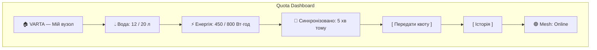
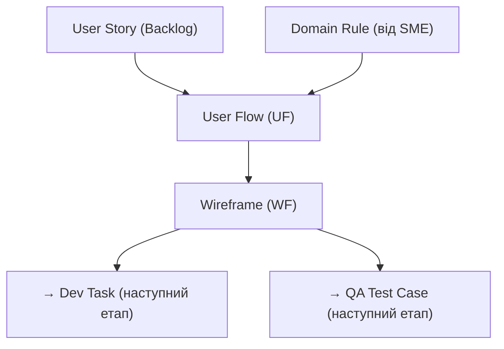

# UX / Design: User Flows та Lo-fi Wireframes

**Проєкт:** VARTA (Distributed Resilience Orchestrator)
**Сквад:** Alpha / Beta / Gamma *(вказати свій)*
**GitHub Project:** [VARTA Board](https://github.com/users/vplanto/projects/1)
**Зв'язок:** [Product Backlog](product_backlog.md) | [План воркшопу](plan.md) | [SME Template](sme_template.md)

---

## Ціль ролі UX

Ви — **дизайнер взаємодії**. Ваше завдання — описати **шлях користувача** (User Flow) через систему та створити **Lo-fi wireframes** (схематичні екрани) для критичних сценаріїв.

Кожен User Flow або Wireframe — це **окремий тікет** у [GitHub Project](https://github.com/users/vplanto/projects/1). Тікет = ваш дизайн-артефакт.

> 📝 **Naming Convention:** Див. [Конвенція оформлення тікетів](plan.md#-конвенція-оформлення-тікетів-github-project). Заголовок англійською, тіло українською.

---

## Робочий процес

### Крок 1: Оберіть User Stories для дизайну

З [Product Backlog](product_backlog.md) оберіть **3–5 Stories** зі свого Epic. Зверніть увагу на Stories з прямою взаємодією користувача (не системні).

### Крок 2: Перевірте Domain Rules від SME

Перед створенням Flow перегляньте тікети `DR-*` та `EC-*` від SME-команди — вони впливають на те, що користувач побачить на екрані.

### Крок 3: Створіть тікети у GitHub Project

Для кожного User Flow або Wireframe створіть **окремий тікет** (Issue) у [GitHub Project](https://github.com/users/vplanto/projects/1).

---

## Типи тікетів

### 🏷 `UF` — User Flow

Опис послідовності кроків користувача для досягнення мети.

**Формат заголовку:** `UF-## EP-XX US-YY | Short English description`

**Тіло тікету (українською):**
```
**Тип:** User Flow
**Сквад:** Alpha / Beta / Gamma
**Пов'язані Stories:** US-XX, US-YY
**Labels:** user-flow, squad:xxx, EP-XX

**Сценарій:**
<Хто і що хоче зробити>

**Кроки:**
1. <Крок 1>
2. <Крок 2>
3. ...

**Альтернативні шляхи:**
- Якщо <умова> → <що відбувається>

**Залежності:** #<номер пов'язаного тікету>
```

<details>
<summary>📋 Приклад тікету user-flow</summary>

**Заголовок:** `UF-01 EP-02 US-06 | Transfer quota to neighbor`

**Тіло:**
```
**Тип:** User Flow
**Сквад:** Beta
**Пов'язані Stories:** US-06, US-02
**Labels:** user-flow, squad:beta, EP-02

**Сценарій:**
Мешканець хоче передати 5 літрів квоти води сусіду,
який перебуває поруч (Bluetooth-радіус).

**Кроки:**
1. Відкриває додаток → Головний екран (залишок квоти)
2. Натискає «Передати квоту»
3. Система сканує Mesh-оточення (BLE)
4. Бачить список довірених сусідів (Trust ≥ 2)
5. Обирає сусіда → вводить кількість (макс 50% залишку)
6. Підтвердження → QR-код для фізичного підтвердження
7. Сусід сканує QR → транзакція записується локально

**Альтернативні шляхи:**
- Якщо Trust < 2 → сусід не відображається у списку
- Якщо залишок = 0 → кнопка «Передати» неактивна
- Якщо Mesh недоступний → повідомлення «Немає з'єднання»

**Залежності:** #DR-01 (Trust ≥ 2), #DR-04 (макс 50%)
```
</details>

---

### 🏷 `WF` — Wireframe

Схематичний макет екрану (Lo-fi). Не потрібен «гарний» дизайн — потрібна **структура та логіка**.

**Формат заголовку:** `WF-## EP-XX US-YY | Short English description`

**Тіло тікету (українською):**
```
**Тип:** Wireframe (Lo-fi)
**Сквад:** Alpha / Beta / Gamma
**Пов'язані Stories:** US-XX
**Labels:** wireframe, squad:xxx, EP-XX

**Екран:**
<Назва екрану>

**Елементи:**
- [ ] <Елемент 1: текст / кнопка / список / графік>
- [ ] <Елемент 2>
- ...

**Стани екрану:**
- Normal: <опис>
- Empty: <опис>
- Error: <опис>
- Loading: <опис>

**Залежності:** #<номер UF-тікету>
```

> 💡 **Як малювати Lo-fi?**
> - **Mermaid** діаграми в Markdown (рекомендовано).
> - **Схема на папері** → фото → прикріпити до тікету.
> - **ASCII-art** прямо в тілі тікету.
> Головне — **структура**, не краса.

<details>
<summary>📋 Приклад тікету wireframe</summary>

**Заголовок:** `WF-01 EP-02 US-05 | Quota balance dashboard`

**Тіло:**
```
**Тип:** Wireframe (Lo-fi)
**Сквад:** Beta
**Пов'язані Stories:** US-05, US-09
**Labels:** wireframe, squad:beta, EP-02

**Екран:** Головний екран (Quota Dashboard)

**Елементи:**
- [ ] Заголовок: «VARTA — Мій вузол»
- [ ] Карточка: Вода (літри) — залишок / добова квота
- [ ] Карточка: Енергія (Вт·год) — залишок / добова квота
- [ ] Індикатор: час останньої синхронізації
- [ ] Кнопка: «Передати квоту»
- [ ] Кнопка: «Історія транзакцій»
- [ ] Статус: Mesh-з'єднання (Online / Offline)

**Стани екрану:**
- Normal: Всі дані актуальні, Mesh Online
- Stale: Синхронізація > 30 хв тому → жовтий індикатор
- Offline: Mesh відсутній → червоний статус, дані локальні
- Empty: Новий користувач, квота ще не розподілена

**Залежності:** #UF-01, #BAU-03 (час синхронізації)
```

**Приклад Lo-fi (Mermaid):**

</details>

---

## Залежності між тікетами



---

## Чеклист перед завершенням

- [ ] Обрано 3–5 User Stories для дизайну
- [ ] Переглянуто тікети від SME (DR, BAU, EC)
- [ ] Створено ≥ 3 тікети `user-flow` у GitHub Project
- [ ] Створено ≥ 3 тікети `wireframe` у GitHub Project
- [ ] Для кожного wireframe описано стани (Normal, Error, Offline, Empty)
- [ ] Всі тікети мають залежності та лейбли скваду

---

**[⬅️ Повернутися до плану воркшопу](plan.md)** | **[⬅️ Повернутися до головного меню курсу](../index.md)**
