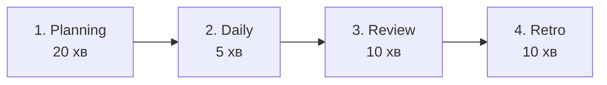
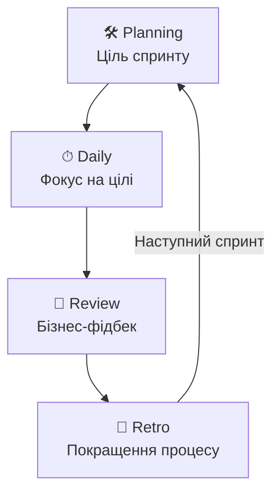

# Практикум: Scrum Ceremonies. Case Study та Воркшоп

**Аудиторія:** 2-й курс (Junior Strong)
**Зв'язок з теорією:** [Лекція 2: Delivery Methodology](02_delivery_methodology.md) | [Лекція 3: Requirements](03_requirements.md)
**Продовження:** [Командне планування спринту](workshop/plan.md) — воркшоп із розподілом на команди (Dev, QA, Ops, SME)
**Ціль:** Провести симуляцію 4 основних Scrum-церемоній (Sprint Planning, Daily Scrum, Sprint Review, Sprint Retrospective) на прикладі реалістичного продуктового проєкту. Зрозуміти механіку виявлення проблем і прийняття рішень командою. Перед Planning на воркшопі VARTA команда має вже пройти **Backlog Refinement** — див. [Sprint Grooming і Planning](workshop/plan.md#grooming-and-planning).

---

## 📚 Кейс: Проєкт "VARTA" (Distributed Resilience Orchestrator)

**Контекст проєкту:** 
Децентралізована мережа управління критичними ресурсами (енергія, вода, зв'язок) для міських громад в умовах ізоляції. 
- [План воркшопу](workshop/plan.md)
- [Повний Product Backlog проекту VARTA](workshop/product_backlog.md)

**Організація команди (Squad Structure):**
Вся аудиторія ділиться на **3 Сквади (Squads)**. Кожен сквад працює над своєю групою вимог/метрик із беклогу.

- **PO (Product Owner) / Scrum Master:** Викладач.
- **Сквад (Squad):** Група з ~7 студентів, що включає ролі Dev, QA, SME та Ops (згідно з [планом](workshop/plan.md)).

**Поточний статус:** 
Спринт триває 2 тижні. Розмір Спринта (Sprint Capacity): ~40 Story Points (оцінюються сквадом самостійно).

> 📝 **Що таке Story Point (SP)?**
> Це відносна одиниця оцінки складності задачі. Вона враховує об'єм роботи, складність та ризики/невизначеність. Замість того, щоб казати "це займе 5 годин" (бо для Junior і Senior це різний час), команда каже "ця задача в 2 рази складніша у порівнянні з нашою базовою задачею". Зазвичай використовують послідовність Фібоначчі: 1, 2, 3, 5, 8, 13, 21.

> 🔗 **Зв'язок з ролями на проєкті ([Лекція 1a](01a_project_roles.md)):**
> * **З ким спілкується Squad?** У цій симуляції викладач виступає "замовником" (PO). Сквад має валідувати свої рішення через SME та враховувати інфраструктурні обмеження від Ops.
> * **Координація:** Хоча сквади працюють автономно, вони мають синхронізуватись, оскільки всі працюють над єдиною екосистемою VARTA (наприклад, зміни в Mesh Trust від EP-01 впливають на квоти в EP-02).

---

## 🎮 Як проходить рольова гра

Воркшоп складається з **4 церемоній Scrum**, які проходять послідовно. Кожна церемонія — це **рольова гра**, де сквад виконує конкретні дії:

| Церемонія | Що робить сквад | Результат |
| :--- | :--- | :--- |
| **Sprint Planning** | Після **refinement**: Poker за потреби, **зобов’язання** на спринт, Sprint Goal, Sprint Backlog | Sprint Backlog (що беремо в спринт) |
| **Daily Scrum** | Синхронізує прогрес, знаходить блокери | Виявлені проблеми |
| **Sprint Review** | Показує результат PO, отримує фідбек | Done / Not Done |
| **Sprint Retrospective** | Аналізує процес, формулює Action Items | Покращення на наступний спринт |

---

## Підготовка: Backlog Refinement (Sprint Grooming)

У **Scrum Guide** це називається **Product Backlog Refinement**; у командах те саме часто називають **grooming**. Це **не четверта «офіційна» церемонія з годиною в календарі**, а **регулярна активність**: уточнення опису задач, AC, залежностей, оцінка в SP, дроблення завеликих story — щоб до Sprint Planning зверху backlog був **готовий до відбору**.

**На воркшопі:** сквад робить refinement **до** рольової гри Planning (див. [план VARTA](workshop/plan.md#grooming-and-planning)): перегляд [беклогу](workshop/product_backlog.md), питання до PO, чернетки вимог за ролями. На **Sprint Planning** не варто витрачати весь час на перше знайомство зі story — там фокус на **виборі** роботи на спринт і **Sprint Goal**.

---

## 🛠 Церемонія 1: Sprint Planning (Планування Спринта)

**Хто бере участь:** PO (викладач), весь Сквад.
**Тривалість:** 4-8 годин (реальність) → **20 хвилин** (воркшоп).

### Що відбувається крок за кроком:

1. **PO нагадує пріоритет і прогрумовані задачі** — показує верхівку [Product Backlog](workshop/product_backlog.md) (топ за пріоритетом); елементи вже **уточнені на refinement**, інакше повертаємось до уточнень (міні-grooming).
2. **Сквад задає короткі уточнювальні питання** — що саме входить у DoD цього спринту (SME — бізнес-правила, UX — user flow).
3. **Planning Poker** — кожен показує карту (1, 2, 3, 5, 8, 13, 21). Хто поставив найбільше/найменше — **пояснює чому**.
4. **Декомпозиція** — якщо задача > 13 SP, сквад розбиває її на менші частини.
5. **Формування Sprint Backlog** — сквад набирає задачі до ліміту **~40 SP**.

🃏 Тренувальний приклад: Planning Poker (Smart Campus)

**Контекст:** Університет створює мобільний додаток "Smart Campus" (розклад, повідомлення, навігація).

**PO приніс задачі:**
1. 🔴 **Інтеграція з розкладом** — підключитись до старої Oracle DB, витягнути розклад і показати в додатку.
2. 🟡 **Push-повідомлення** — сповіщення, якщо пара відмінена (Firebase + адмін-панель).
3. 🟢 **Темна тема** — перемикач теми для всіх екранів.
4. 🟡 **Кешування** — офлайн-доступ до розкладу.

**Оцінка задачі "Інтеграція з розкладом":**

| Роль | Карта | Чому? |
| :--- | :--- | :--- |
| Backend Dev | **21** | "Стара Oracle DB без API. Складні запити через VPN, жахлива структура таблиць." |
| Mobile Dev | **8** | "Я думав, API вже є — мені лише вивести JSON на екран." |
| QA | **13** | "Definition of Done — не тільки код, а й тести. Сотні груп, конфлікти розкладу, автотести." |

**Після обговорення:** Mobile Dev зрозумів складність → всі поставили **21**. Це більше половини спринту — потрібна **декомпозиція**!

💡 Тренувальний приклад: Формування Sprint Backlog

**Backend Dev:** "Інтеграція з Oracle (21 SP) — занадто ризиковано. Давайте для MVP зробимо **парсер CSV-файлу** (8 SP). Деканат буде завантажувати CSV в адмін-панель щодня."

**PO:** "Згоден! Це вирішить 80% проблем. А push-повідомлення (13 SP) та офлайн-кеш (13 SP)?"

**Mobile Dev:** "Парсер (8) + Push (13) + Кеш (13) = **34 SP**. Залишається 6 SP буферу. Темну тему (8 SP) відкладаємо."

**Результат Sprint Backlog:**

| Задача | SP | Статус |
| :--- | :--- | :--- |
| CSV-парсер розкладу | 8 | ✅ Взяли |
| Push-повідомлення | 13 | ✅ Взяли |
| Офлайн-кеш | 13 | ✅ Взяли |
| Темна тема | 8 | ❌ Наступний спринт |
| **Разом** | **34/40** | 6 SP буфер |

---

## ⏱ Церемонія 2: Daily Scrum (Щоденний мітинг)

**Хто бере участь:** Сквад (SM спостерігає).
**Тривалість:** 15 хвилин. Не для звітів — для **синхронізації**.

### Що відбувається:

Кожен учасник скваду відповідає на **3 питання**:
1. Що я зробив **вчора** для досягнення Sprint Goal?
2. Що я **зроблю сьогодні**?
3. Які є **блокери**?

### Практичне завдання: Знайдіть антипатерн

Читаєте статус розробника і шукаєте, **що не так**:

> *"Вчора я написав 400 рядків коду в модулі інтеграції, сьогодні буду оптимізувати базу даних, бо мені не подобається швидкість запитів, блокерів немає."*

💡 Розбір: 3 помилки в одному звіті

| # | Помилка | Чому це проблема |
| :--- | :--- | :--- |
| 1 | "400 рядків коду" | Метрика **кількості**, а не **цінності**. Скільки рядків — не важливо. Важливо — яку задачу закрив. |
| 2 | "Оптимізувати базу" | Задача, яка **не обговорювалась на Planning** і не наближає до Sprint Goal. Це самовільне рішення. |
| 3 | "Блокерів немає" | Якщо він сам поставив собі нову задачу — це вже **блокер процесу**, бо він відхилився від плану. |

**Правильний формат:**
> "Вчора я закінчив парсер CSV-розкладу (передав на тестування QA). Сьогодні розпочну роботу над API для мобільного додатку. Блокерів немає."

---

## 🎯 Церемонія 3: Sprint Review (Огляд результатів)

**Хто бере участь:** PO, Сквад, Стейкхолдери.
**Мета:** Показати **працюючий** продукт (не слайди!). Отримати фідбек. Оновити Backlog.

### Практичне завдання

**Ситуація:** Команда демонструє додаток. Розклад відображається, але **тільки для одного факультету**. Під час демо парсер для інших факультетів впав з помилкою.

**Питання до скваду:** Чи буде задача "Імпорт CSV розкладу" вважатися **Done**?

💡 Аналіз: що робити, коли демо зламалось

**Відповідь: НІ.** Задача **не виконує Definition of Done** (DoD).

| Аспект | Що сталося |
| :--- | :--- |
| **Функціонал** | Працює частково (1 з 5 факультетів) |
| **DoD** | Не покриває реальні юзкейси |
| **Рішення PO** | Повертає в Backlog з **високим пріоритетом** |

**Правильна реакція команди:**
- ✅ Чесно визнати баг перед стейкхолдерами.
- ✅ Зібрати фідбек по тому факультету, що працює.
- ✅ Пояснити план виправлення на наступний спринт.
- ❌ НЕ намагатися сховати проблему. Довіра > ілюзія.

---

## 🔄 Церемонія 4: Sprint Retrospective (Ретроспектива)

**Хто бере участь:** SM, PO, Сквад.
**Мета:** Аналіз **ПРОЦЕСУ** (не продукту). Що було добре → зберігаємо. Що було погано → Action Item.

### Ситуація

Після спринту на дошці з'явились такі проблеми:

| 😡 Проблема | Наслідок |
| :--- | :--- |
| "Два дні чекали доступ до сервера від адмінів" | Втрачено 20% часу спринту |
| "Баг парсера виліз прямо на демо" | Незавершена задача, підірвана довіра |
| "QA отримав фічі на перевірку в останній день" | Немає часу на тестування, баги йдуть у production |

### Практичне завдання

Оберіть **одну** найкритичнішу проблему та сформулюйте **Action Item** — конкретну, вимірювану дію.

💡 Хороший vs Поганий Action Item

**Проблема:** "QA отримав всі фічі в останній день."

| ❌ Поганий Action Item | ✅ Хороший Action Item |
| :--- | :--- |
| "Будемо розробляти швидше." | "Вводимо **WIP Limit = 2** для колонки Development." |
| *Чому погано:* Не конкретно. Не вимірюється. Не можна перевірити. | *Конкретика:* Dev не бере нову задачу, поки попередня не пройшла Code Review і не перейшла до QA. SM контролює ліміт на Daily. |

---

## 📋 Висновок

Всі 4 церемонії — єдиний механізм:
- **Planning** → дає ціль.
- **Daily** → тримає фокус (запобігає розпорошенню).
- **Review** → дає зворотний зв'язок від бізнесу.
- **Retro** → «лагодить» саму команду, роблячи наступний спринт ефективнішим.

---

**[⬅️ Повернутися до Лекції 2](02_delivery_methodology.md)** | **[⬅️ Повернутися до головного меню курсу](index.md)**
