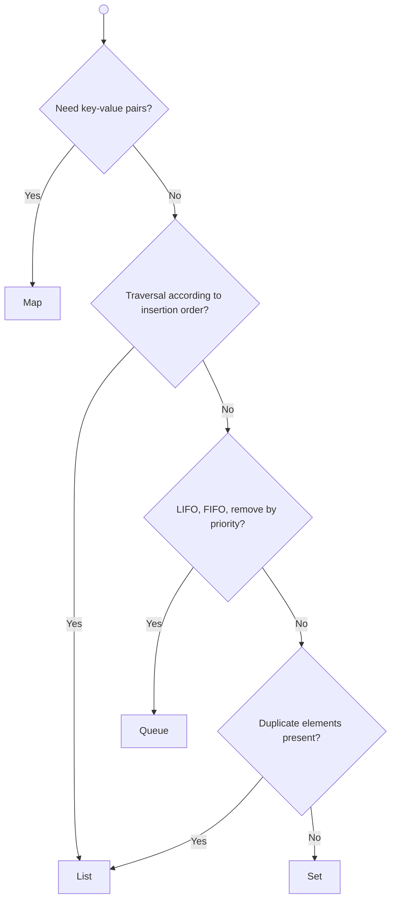
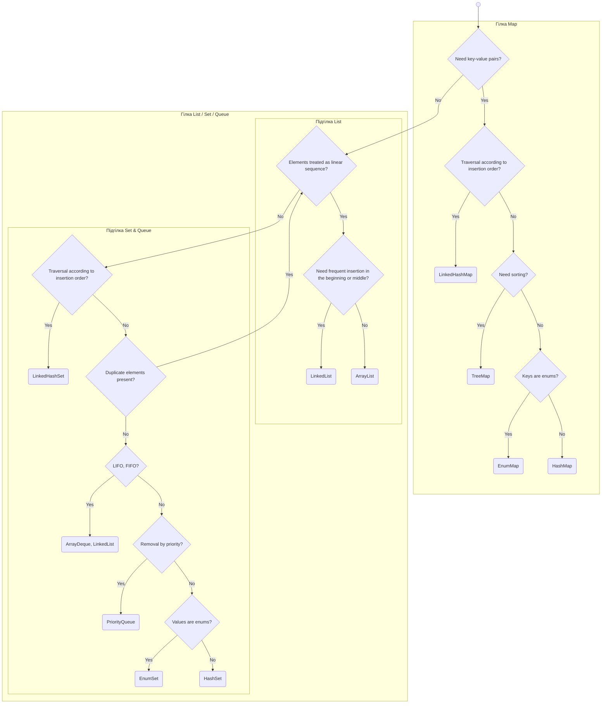

# Лекція 3: Як обрати правильну колекцію

## Алгоритм вибору інтерфейсу

Вибір правильної колекції — це двокроковий процес. Спочатку ми обираємо найбільш відповідний **інтерфейс** (`List`, `Set`, `Map`, `Queue`) на основі логічних вимог задачі, а потім — найкращу **конкретну реалізацію** цього інтерфейсу, враховуючи очікувану продуктивність.

Ось проста схема, що допоможе обрати правильний інтерфейс:

-----

### Опис схеми вибору інтерфейсу

Ця схема є алгоритмом для вибору правильного базового інтерфейсу з Java Collections Framework на основі вимог вашої задачі. Процес прийняття рішень виглядає так:

1.  **Потреба у зберіганні пар "ключ-значення"**:
      * **Так**: Ваш вибір — **`Map`**. На цьому вибір інтерфейсу завершено.
      * **Ні**: Переходьте до наступного кроку.
2.  **Потреба у збереженні порядку додавання елементів**:
      * **Так**: Ваш вибір — **`List`**.
      * **Ні**: Переходьте до наступного кроку.
3.  **Потреба у специфічному доступі (LIFO, FIFO, за пріоритетом)**:
      * **Так**: Ваш вибір — **`Queue`**.
      * **Ні**: Переходьте до наступного кроку.
4.  **Потреба у зберіганні дублікатів**:
      * **Так**: Ваш вибір — **`List`**.
      * **Ні**: Ваш вибір — **`Set`**.

-----

### Схема у форматі Mermaid

**Ключові питання для вибору інтерфейсу:**
* Вам потрібно зберігати пари "ключ-значення"? → **`Map`**
* Вам потрібна послідовність елементів зі збереженням порядку вставки? → **`List`**
* Вам потрібна структура для обробки елементів (FIFO, LIFO, за пріоритетом)? → **`Queue`**
* Вам потрібно зберігати унікальні елементи? → **`Set`**

---

## Порівняння реалізацій: List

#### Внутрішня структура
* **`ArrayList`** всередині використовує звичайний **масив**. Це робить доступ до елемента за індексом миттєвим, але вставка чи видалення елементів з середини списку є повільною операцією, оскільки вимагає копіювання частини масиву.
* **`LinkedList`** використовує структуру **зв'язаного списку**, де кожен елемент (вузол) зберігає посилання на сусідні елементи. Це робить вставку та видалення елементів дуже швидкими, але доступ за індексом вимагає послідовного проходження по ланцюжку.

#### Таблиця продуктивності (Big O)

| Реалізація | Додавання/видалення на початку/середині | Додавання/видалення в кінці | Отримання i-го елемента (доступ за індексом) | Пошук елемента | Порядок обходу |
| :--- | :--- | :--- | :--- | :--- | :--- |
| **`ArrayList`** | `O(n)` | `O(1)` | `O(1)` | `O(n)` (або `O(log n)`, якщо відсортовано) | Порядок вставки |
| **`LinkedList`** | `O(1)` | `O(1)` | `O(n)` | `O(n)` | Порядок вставки |

---

## Порівняння реалізацій: Set

#### Внутрішня структура
* **`HashSet`** використовує **хеш-таблицю**. Це забезпечує найвищу швидкість додавання та пошуку, але не гарантує жодного порядку елементів.
* **`LinkedHashSet`** — це гібрид **хеш-таблиці та зв'язаного списку**. Він такий же швидкий, як `HashSet`, але додатково підтримує порядок вставки елементів.
* **`TreeSet`** використовує **червоно-чорне дерево**. Це гарантує, що елементи завжди зберігаються у відсортованому вигляді. Швидкість операцій дещо нижча (`O(log n)`).
* **`EnumSet`** — високооптимізована реалізація для зберігання значень `enum`.

#### Таблиця продуктивності (Big O)

| Реалізація | Додавання | Видалення | Пошук | Порядок обходу |
| :--- | :--- | :--- | :--- | :--- |
| **`HashSet`** | амортизований `O(1)` | амортизований `O(1)` | `O(1)` | Випадковий (залежить від хеш-функції) |
| **`LinkedHashSet`** | амортизований `O(1)` | амортизований `O(1)` | `O(1)` | Порядок вставки |
| **`TreeSet`** | `O(log n)` | `O(log n)` | `O(log n)` | Відсортований (за критерієм порівняння) |
| **`EnumSet`** | `O(1)` | `O(1)` | `O(1)` | Порядок визначення `enum` |

---

## Порівняння реалізацій: Queue

Реалізації черг можна розділити на дві групи:
* **`LinkedList`**, **`ArrayDeque`**: Універсальні реалізації, що можуть працювати як черга (FIFO), стек (LIFO) або двостороння черга (deque). Загалом, **`ArrayDeque` є швидшим**, ніж `LinkedList`, і є кращим вибором за замовчуванням.
* **`PriorityQueue`**: Спеціалізована черга, що базується на структурі даних **бінарна купа**. Вона дозволяє дуже швидко (`O(1)`) отримувати елемент з найвищим пріоритетом. Додавання та видалення елементів працює за `O(log n)`.

---

## Порівняння реалізацій: Map

| Реалізація | Додавання | Видалення | Пошук | Порядок обходу |
| :--- | :--- | :--- | :--- | :--- |
| **`HashMap`** | амортизований `O(1)` | амортизований `O(1)` | `O(1)` | Випадковий (залежить від хеш-функції) |
| **`LinkedHashMap`** | амортизований `O(1)` | амортизований `O(1)` | `O(1)` | Порядок вставки |
| **`TreeMap`** | `O(log n)` | `O(log n)` | `O(log n)` | Відсортований (за ключами) |
| **`EnumMap`** | `O(1)` | `O(1)` | `O(1)` | Порядок визначення `enum` (за ключами) |

---

## Детальна схема вибору реалізації

Ця схема узагальнює процес вибору конкретної реалізації, враховуючи більш детальні вимоги.

-----

### Опис детальної схеми вибору реалізації

Ця схема є розширеним алгоритмом, що допомагає обрати конкретну реалізацію колекції після того, як ви визначились із базовим інтерфейсом.

#### **Якщо вам потрібен `Map` (зберігання "ключ-значення"):**

  * **Чи важливий порядок обходу елементів відповідно до порядку їх додавання?**
      * **Так:** Ваш вибір — **`LinkedHashMap`**.
      * **Ні:** Переходьте до наступного питання.
  * **Чи потрібно, щоб елементи були відсортовані (за ключами)?**
      * **Так:** Ваш вибір — **`TreeMap`**.
      * **Ні:** Переходьте до наступного питання.
  * **Чи є ваші ключі перелічуваним типом (`enum`)?**
      * **Так:** Ваш вибір — **`EnumMap`**.
      * **Ні:** Ваш вибір — **`HashMap`** (найшвидший універсальний варіант).

#### **Якщо вам не потрібен `Map`:**

  * **Чи розглядаєте ви елементи як лінійну послідовність (як у `List`)?**
      * **Так (тобто вам потрібен `List`):**
          * **Чи потрібні часті вставки/видалення елементів на початку або в середині списку?**
              * **Так:** Ваш вибір — **`LinkedList`**.
              * **Ні:** Ваш вибір — **`ArrayList`** (швидший для доступу за індексом).
      * **Ні (тобто вам потрібен `Set` або `Queue`):**
          * **Чи важливий порядок обходу елементів відповідно до порядку їх додавання?**
              * **Так:** Ваш вибір — **`LinkedHashSet`**.
              * **Ні:** Переходьте до наступного питання.
          * **Чи дозволені у вашій колекції дублікати?**
              * **Так:** Поверніться до питання про лінійну послідовність (швидше за все, вам потрібен `List`).
              * **Ні:** Переходьте до наступного питання.
          * **Чи потрібна поведінка черги (LIFO/FIFO)?**
              * **Так:** Ваш вибір — **`ArrayDeque`** або **`LinkedList`**.
              * **Ні:** Переходьте до наступного питання.
          * **Чи потрібне видалення елементів за пріоритетом?**
              * **Так:** Ваш вибір — **`PriorityQueue`**.
              * **Ні (тобто вам потрібен `Set`):**
                  * **Чи є ваші значення перелічуваним типом (`enum`)?**
                      * **Так:** Ваш вибір — **`EnumSet`**.
                      * **Ні:** Ваш вибір — **`HashSet`**.

-----

### Схема у форматі Mermaid

---

## Порівняння колекцій на рівність

* Колекція може бути рівною лише іншій колекції того ж типу (`List` до `List`, `Set` до `Set`).
* `SortedSet` може бути рівним `Set`, а `SortedMap` — `Map`.
* Для перевірки на рівність за певним критерієм може знадобитися конвертація одного типу колекції в інший.

| Якщо важливий... | Тип для порівняння |
| :--- | :--- |
| Впорядкований вміст з дублікатами | `List` |
| Невпорядкований вміст з дублікатами | `Map` (частот) |
| Відсортований вміст з дублікатами | `List` (попередньо відсортований) |
| Унікальний вміст | `Set` |

---

## Контрольні питання

1.  **Сценарій.** Вам потрібно зберігати історію дій користувача в тому порядку, в якому вони відбувалися. Дії можуть повторюватися. Який **інтерфейс** та яку **конкретну реалізацію** ви оберете і чому?

2.  **Продуктивність.** Чому операція додавання елемента в середину `ArrayList` має складність O(n), а в `LinkedList` — O(1)? Поясніть, базуючись на їхній внутрішній структурі.

3.  **Концепція.** Ви хочете зберігати унікальні об'єкти, але вам важливо обходити їх у тому порядку, в якому ви їх додали. Яку реалізацію `Set` ви оберете і чому?