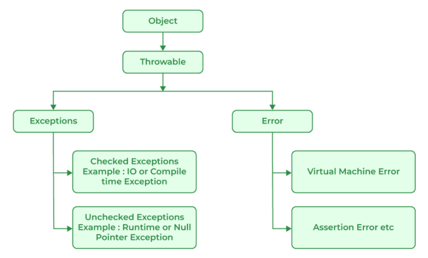
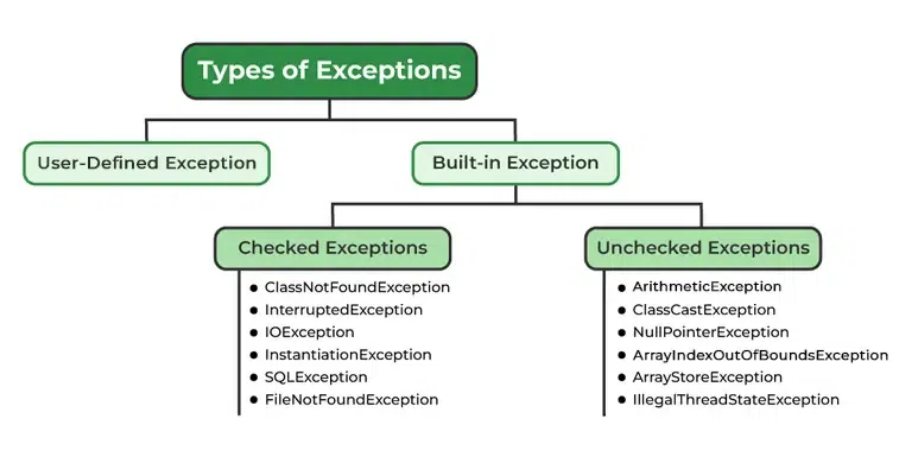
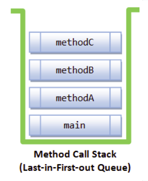
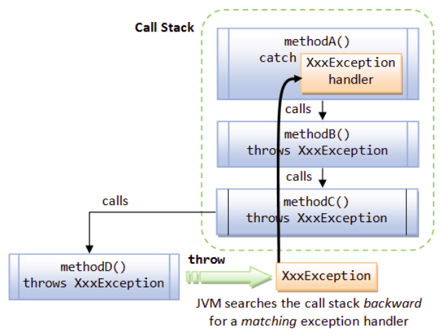
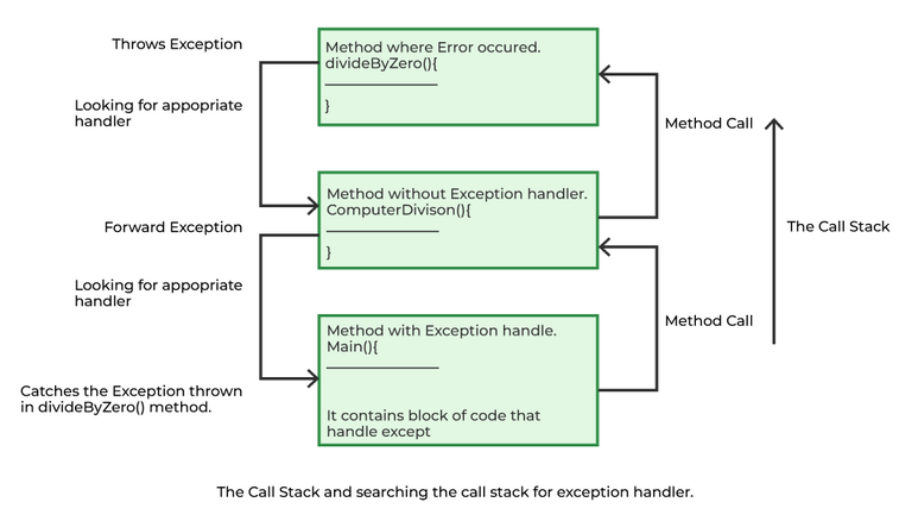

# Лекція 4: Обробка винятків в Java

## Що таке виняток?

**Виняток (Exception)** в Java — це небажана або неочікувана подія, яка виникає під час виконання програми (в runtime) і порушує її нормальний потік інструкцій. Механізм обробки винятків дозволяє коректно реагувати на такі помилки часу виконання, зберігаючи стабільність роботи додатку.

Коли в методі виникає виняткова ситуація, створюється спеціальний об'єкт, який називається **об'єктом винятку**. Цей об'єкт містить детальну інформацію про помилку: її ім'я, опис та стан програми на момент виникнення.

**Основні причини виникнення винятків:**
* **Зовнішні фактори:**
    * Некоректні дані, введені користувачем.
    * Збій у роботі пристрою (наприклад, диска).
    * Втрата мережевого з'єднання.
    * Фізичні обмеження (недостатньо пам'яті на диску).
* **Помилки в коді:**
    * Вихід за межі масиву (`ArrayIndexOutOfBoundsException`).
    * Звернення до об'єкта за `null`-посиланням (`NullPointerException`).
    * Неправильне приведення типів (`ClassCastException`).
    * Арифметичні помилки (ділення на нуль).
    * Спроба відкрити файл, що не існує.

---

## Ієрархія винятків: `Throwable`, `Error` та `Exception`

Усі помилки та винятки в Java наслідуються від класу `Throwable`. Цей клас має два основних нащадки: `Error` та `Exception`.



#### `Error`
Клас `Error` представляє **критичні, невідновлювані помилки**, які зазвичай виникають у самій JVM. Додаток не повинен намагатися їх перехоплювати чи обробляти.
* **Приклади:** `OutOfMemoryError` (не вистачає пам'яті), `StackOverflowError` (переповнення стеку через нескінченну рекурсію), `VirtualMachineError`.

#### `Exception`
Клас `Exception` представляє умови, які додаток **може і повинен** намагатися обробити. Ці винятки, в свою чергу, поділяються на дві великі категорії.

---

## Типи винятків: Checked vs. Unchecked



#### Checked Exceptions (Перевірювані винятки)
* Це винятки, які **перевіряються компілятором**.
* Якщо метод може кинути такий виняток, він **зобов'язаний** або обробити його за допомогою `try-catch`, або оголосити, що він його "прокидає" далі за допомогою ключового слова `throws`.
* Зазвичай представляють помилки, що залежать від зовнішніх умов.
* **Приклади:** `IOException`, `SQLException`, `FileNotFoundException`.

#### Unchecked Exceptions (Неперевірювані винятки)
* Це винятки, які **не перевіряються компілятором**. Їх не обов'язково обробляти чи оголошувати.
* До них належать всі нащадки `RuntimeException`.
* Зазвичай представляють логічні помилки в програмі, яких можна було уникнути.
* **Приклади:** `NullPointerException`, `ArrayIndexOutOfBoundsException`, `ArithmeticException`.

---

## Як працює механізм винятків: Стек викликів

Коли програма виконується, JVM веде облік послідовності викликів методів у структурі даних, що називається **стеком викликів (Method Call Stack)**. Це структура типу LIFO (Last-In, First-Out).



Коли в методі виникає виняток, відбувається наступне:
1.  Створюється об'єкт винятку.
2.  JVM **припиняє** нормальне виконання і починає шукати обробник цього винятку.
3.  Пошук починається в поточному методі. Якщо відповідний `catch`-блок не знайдено, метод **негайно завершується**, і JVM "розкручує" стек, переходячи до методу, який його викликав.
4.  Цей процес повторюється для кожного методу в стеку, поки не буде знайдено обробник.
5.  Якщо обробник так і не знайдено аж до методу `main()`, програма **аварійно завершується**, а JVM викликає обробник за замовчуванням, який друкує **стек-трейс (stack trace)** помилки.



---

## Обробка винятків: `try`, `catch`, `finally`

Для керування винятками в Java використовуються п'ять ключових слів: `try`, `catch`, `finally`, `throw`, `throws`.

#### Синтаксис `try-catch-finally`
```java
try {
    // Код, який може кинути виняток
} catch (ТипВинятку1 ex1) {
    // Блок для обробки винятку типу ТипВинятку1
} catch (ТипВинятку2 ex2) {
    // Блок для обробки винятку типу ТипВинятку2
} finally {
    // Код, який виконається ЗАВЖДИ,
    // незалежно від того, був виняток чи ні
}
````

  * **`try`**: Блок, у який поміщається потенційно небезпечний код.
  * **`catch`**: Блок-обробник. Він "ловить" об'єкт винятку певного типу. Можна мати кілька `catch`-блоків для різних типів винятків.
  * **`finally`**: Необов'язковий блок, код якого **гарантовано виконається** після завершення блоку `try` (і `catch`, якщо він був викликаний). Зазвичай використовується для звільнення ресурсів (закриття файлів, з'єднань з базою даних).



-----

## Найкращі практики та User-Defined Exceptions

#### Переваги правильної обробки винятків

  * **Завершення роботи програми:** Дозволяє програмі коректно завершити роботу, навіть якщо сталася помилка.
  * **Відокремлення коду:** Чітко розділяє основну логіку від коду обробки помилок.
  * **Поширення помилок:** Дозволяє передавати інформацію про помилку вгору по стеку викликів.
  * **Осміслені звіти про помилки:** Надає детальну інформацію для діагностики.

#### Власні винятки (User-Defined Exceptions)

Іноді стандартних винятків недостатньо для моделювання специфічних помилок вашого додатку. У таких випадках ви можете створювати власні класи винятків, наслідуючись від `Exception` (для checked) або `RuntimeException` (для unchecked). Це робить код більш читабельним та специфічним для вашої бізнес-логіки.

-----

## Assertions (Твердження)

**Assertion** — це інструмент для відладки, що дозволяє перевіряти припущення у вашому коді.

  * **Синтаксис:** `assert умова;` або `assert умова : "повідомлення";`
  * **Принцип роботи:** Якщо умова є `false`, кидається виняток `AssertionError`.
  * **Важливо:** За замовчуванням твердження вимкнені. Щоб їх увімкнути, JVM потрібно запускати з прапором `-ea` (enable assertions). Вони не повинні використовуватися для перевірки даних, що надходять від користувача, а лише для перевірки внутрішніх інваріантів програми.

### Приклад використання Assertions

Розглянемо простий приклад: метод, який обчислює якусь величину (наприклад, вартість зі знижкою), і ми хочемо бути впевнені, що вхідне значення (ціна) завжди є додатним. Ми припускаємо, що перевірка на від'ємні значення вже відбулася десь раніше (наприклад, на етапі вводу даних), і `assert` тут слугує як додаткова "запобіжна сітка" для виявлення логічних помилок розробника.

```java
// AssertExample.java
public class AssertExample {

    /**
     * Метод для обчислення знижки.
     * Він припускає, що ціна завжди буде додатним числом.
     */
    public static double calculateDiscount(double price) {
        // Перевіряємо внутрішню умову (інваріант).
        // Ми, як розробники, припускаємо, що цей метод НІКОЛИ не буде викликаний
        // з від'ємною ціною. Assertion - це спосіб перевірити це припущення під час розробки.
        assert (price >= 0) : "Помилка в логіці: ціна не може бути від'ємною. Price = " + price;

        // Якщо умова виконана, продовжуємо роботу
        double discount = price * 0.1; // 10% знижка
        return price - discount;
    }

    public static void main(String[] args) {
        // 1. Коректний виклик
        System.out.println("Виклик з ціною 100.0...");
        double result1 = calculateDiscount(100.0);
        System.out.println("Ціна зі знижкою: " + result1);

        System.out.println("\n----------------\n");

        // 2. Некоректний виклик, який спричинить AssertionError
        System.out.println("Виклик з ціною -50.0...");
        double result2 = calculateDiscount(-50.0);
        System.out.println("Ціна зі знижкою: " + result2);
    }
}
```
-----

### Як це скомпілювати та запустити

1.  **Компіляція (як зазвичай):**

    ```bash
    javac AssertExample.java
    ```

2.  **Запуск БЕЗ увімкнених тверджень:**
    Якщо запустити програму звичайною командою, твердження будуть проігноровані.

    ```bash
    java AssertExample
    ```

    **Результат:**

    ```
    Виклик з ціною 100.0...
    Ціна зі знижкою: 90.0

    ----------------

    Виклик з ціною -50.0...
    Ціна зі знижкою: -45.0
    ```

    Як бачимо, програма відпрацювала без помилок, але повернула логічно некоректний результат.

3.  **Запуск З увімкненими твердженнями:**
    Щоб увімкнути перевірку, використовуйте прапор **`-ea`** (enable assertions).

    ```bash
    java -ea AssertExample
    ```

    **Результат:**

    ```
    Виклик з ціною 100.0...
    Ціна зі знижкою: 90.0

    ----------------

    Виклик з ціною -50.0...
    Exception in thread "main" java.lang.AssertionError: Помилка в логіці: ціна не може бути від'ємною. Price = -50.0
        at AssertExample.calculateDiscount(AssertExample.java:9)
        at AssertExample.main(AssertExample.java:27)
    ```

    Тепер програма аварійно завершилася, кинувши `AssertionError`, і точно вказала на місце логічної помилки, яку можна виправити на етапі розробки.
-----

## Контрольні питання

1.  **Концепція.** У чому полягає ключова різниця між `Error` та `Exception` в Java? Наведіть по одному прикладу для кожного.
2.  **Класифікація.** Що таке `Checked` та `Unchecked` exceptions? Наведіть по одному прикладу. Чому компілятор змушує обробляти одні, але не змушує обробляти інші?
3.  **Механізм.** Опишіть, що відбувається, коли в методі виникає виняток, і жоден `catch`-блок у стеку викликів не може його обробити.
4.  **Застосування.** Для чого використовується блок `finally`? Напишіть короткий приклад коду, де використання `finally` є доцільним.