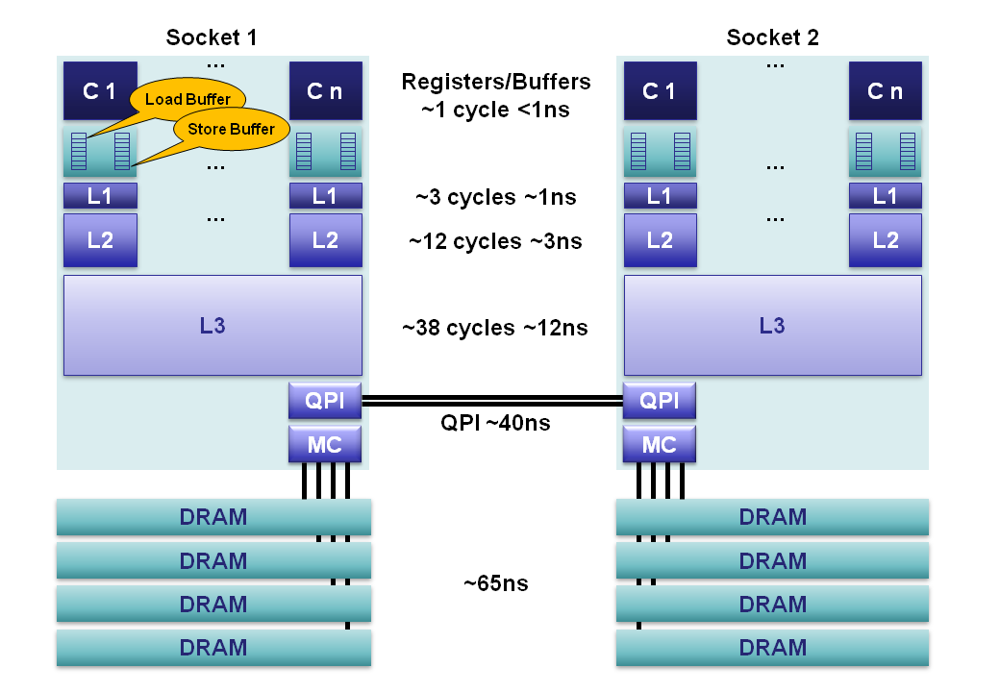
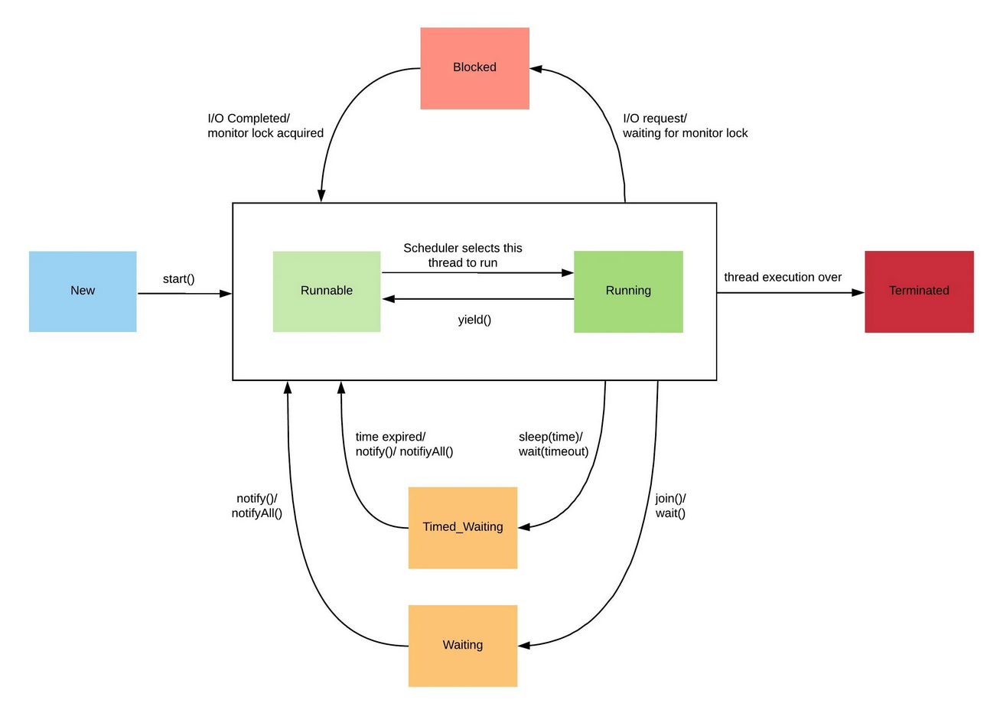
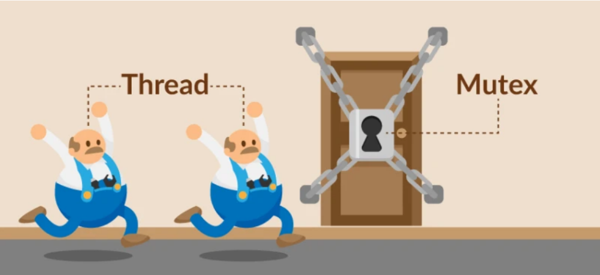
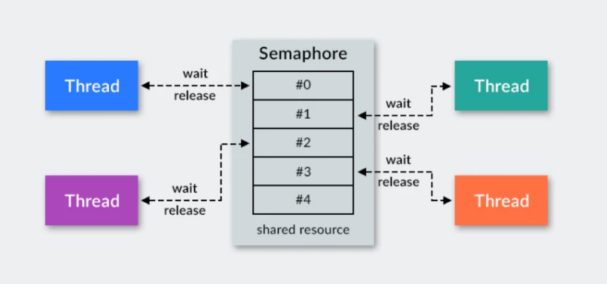
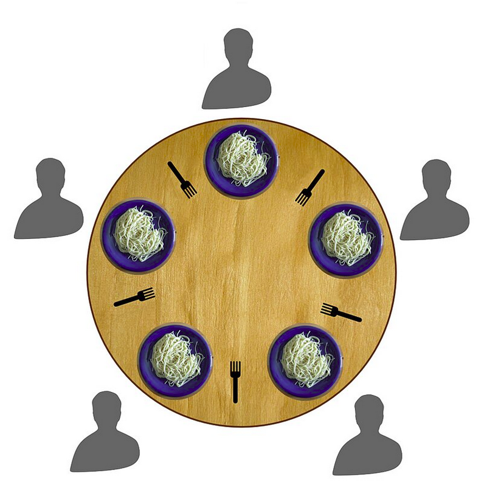

# Лекція 6: Подорож у світ паралельних обчислень

## Вступ

Привіт усім\! Сьогодні ми говоримо про одну з найпотужніших, але й найскладніших тем у Java — багатопотоковість. Наша мета — не просто завчити визначення, а зрозуміти, *чому* це важливо і *як* це працює "під капотом" сучасного заліза.

-----

## Навіщо нам усе це? Продуктивність та відгукливість

Уявіть, що ви користуєтеся програмою: клікаєте на кнопку, і весь інтерфейс "зависає" на 10 секунд, поки йде складне обчислення або завантаження даних. Неприємно, правда? Багатопотоковість дозволяє виконувати такі важкі задачі у фоні, залишаючи інтерфейс програми відгукливим.

Друга причина — швидкість. Сучасні комп'ютери не стільки збільшують тактову частоту одного ядра, скільки додають нові ядра. Щоб змусити вашу програму працювати швидше, потрібно навчитися ефективно використовувати їх усі одночасно.

-----

## Як працюють сучасні процесори?

Щоб зрозуміти паралелізм, давайте заглянемо всередину процесора (CPU).

Сучасний процесор має декілька **ядер** (Cores). Кожне ядро — це, по суті, самостійний обчислювальний блок. Якщо у вас 4-ядерний процесор, він може одночасно виконувати чотири різні задачі.

Але це ще не все. Більшість сучасних ядер підтримують технологію **Hyper-Threading** (або аналогічну). Це означає, що одне фізичне ядро може представлятися операційній системі як два логічних ядра. Кожне таке логічне ядро може виконувати свій **потік** (Thread) інструкцій.

**Кеші (L1, L2, L3):** Щоб не звертатися постійно до повільної оперативної пам'яті (Main Memory), процесори мають власну надшвидку пам'ять — кеш.

  * **L1 Cache:** Найшвидший і найменший, індивідуальний для кожного ядра. Розділяється на кеш інструкцій та кеш даних.
  * **L2 Cache:** Більший за об'ємом, але трохи повільніший. Також зазвичай індивідуальний для ядра.
  * **L3 Cache:** Найбільший і "найповільніший" з кешів, спільний для всіх ядер процесора.

Коли Java-програма створює потік, віртуальна машина (JVM) разом з операційною системою "призначає" цей потік на одне з доступних логічних ядер для виконання. І саме тут починається магія паралелізму.



### Переваги (Benefits)

Використання багатопотоковості в Java надає кілька ключових переваг для розробки програмного забезпечення:

  * **Покращена продуктивність:** Програми можуть працювати значно швидше, оскільки різні їх частини виконуються одночасно на кількох ядрах процесора.
  * **Ефективне використання ресурсів:** Додатки можуть краще задіювати доступне апаратне забезпечення, що особливо важливо для інтенсивних завдань, як-от обробка відео чи наукові обчислення.
  * **Підвищена відгукливість:** Дозволяє виконувати довготривалі операції (наприклад, роботу з мережею чи диском) у фоновому режимі, завдяки чому інтерфейс користувача не "зависає" і залишається активним.
  * **Масштабованість:** Додатки, спроєктовані для багатопотоковості, легше масштабувати, особливо в хмарних середовищах, де ресурси можна додавати динамічно.

-----

### Недоліки (Drawbacks)

Попри переваги, розробка багатопотокових додатків пов'язана зі значними викликами:

  * **Складність розробки:** Написання коректного багатопотокового коду є складним завданням. Такі проблеми, як **взаємні блокування (deadlocks)**, **стани гонитви (race conditions)** та **ресурсне голодування (starvation)**, можуть призвести до непередбачуваної поведінки програми.
  * **Підвищене споживання ресурсів:** Хоча багатопотоковість покращує продуктивність, вона також може призводити до більшого використання пам'яті та ресурсів процесора.
  * **Складність налагодження (Debugging):** Виявлення та виправлення помилок у багатопотокових програмах є значно складнішим, оскільки проблеми можуть виникати нерегулярно і залежати від timing-у виконання потоків.
  * **Накладні витрати на блокування:** Механізми синхронізації, необхідні для запобігання конфліктам даних, можуть створювати "вузькі місця", де потоки змушені простоювати, очікуючи на звільнення блокувань, що знижує переваги паралелізму.
  * **Неправильне використання пулів потоків:** Некоректне налаштування пулів потоків (наприклад, занадто велика або мала кількість) може призвести до зниження продуктивності або вичерпання ресурсів системи. Саме тому в реальних проєктах ручне створення потоків (new Thread()) майже ніколи не використовується. Як правильно керувати потоками за допомогою пулів, ми детально розбираємо тут: [Практикум 9: Не створюйте потоки вручну! Сила ExecutorService](p09_executors.md)

-----

## Що таке потік у Java?

У Java потік — це найменша одиниця виконання коду.

-----

## Створення та запуск потоків: `Runnable` vs `Thread`

Історично в Java є два способи створити потік:

1.  Успадкувати клас `Thread`.
2.  Реалізувати інтерфейс `Runnable`.

Сьогодні **рекомендованим підходом є реалізація `Runnable`**. Це гнучкіше: ваш клас може успадковувати інший корисний клас і при цьому виконуватися в окремому потоці.

Код, який має виконатися в новому потоці, розміщується в методі `run()`.

**Найважливіша помилка новачка: `run()` vs `start()`**

Завжди запускайте потік методом `start()`\!

  * `thread.start()`: Повідомляє JVM, що потрібно виділити новий потік і в ньому виконати метод `run()`.
  * `thread.run()`: Просто виконає код з методу `run()` у поточному, головному потоці. Ніякої паралельності не буде\!

**Приклад створення потоків¹**

```java
package org.example;

// Класичний підхід через наслідування
class HelloThread extends Thread {
    public void run() {
        System.out.println("Hello from a thread!");
    }
}

// Сучасний підхід через Runnable
class HelloRunnable implements Runnable {
    public void run() {
        System.out.println("Hello from a Runnable!");
    }
}

public class Main {
    public static void main(String[] args) {
        // Запуск потоків
        new Thread(new HelloRunnable()).start();
        new HelloThread().start();
    }
}
```

**Лямбда-синтаксис для `Runnable`²**

```java
package org.example;

public class MyLambda {
    public static void main(String[] args) {
        Runnable runnable =
                () -> { System.out.println("Lambda Runnable running"); };
        Thread thread = new Thread(runnable);
        thread.start();
    }
}
```

¹ `Main.java`
² `MyLambda.java`

-----

## Життєвий цикл потоку

Потік не просто "працює" або "не працює". Він проходить через декілька станів:

  * **NEW:** Потік створено, але ще не запущено.
  * **RUNNABLE:** Потік готовий до виконання або вже виконується, але очікує на виділення ресурсів планувальником.
  * **BLOCKED:** Потік заблокований, оскільки очікує на звільнення монітора (замка), щоб увійти до `synchronized` блоку.
  * **WAITING:** Потік нескінченно очікує, поки інший потік виконає певну дію.
  * **TIMED\_WAITING:** Потік очікує на дію іншого потоку, але не довше зазначеного проміжку часу.
  * **TERMINATED:** Потік завершив своє виконання.

### Як потік рухається між станами?

Перехід між цими станами — це керований процес:

  * Початковий перехід відбувається при виклику методу **`start()`**, який переводить потік зі стану **`NEW`** у **`RUNNABLE`**.
  * У стані **`RUNNABLE`** потік може бути як готовим до роботи (`READY`), так і безпосередньо виконуватися (`RUNNING`). Цим процесом керує планувальник операційної системи, і програміст не може на нього прямо вплинути.
  * Зі стану виконання потік може перейти в інші стани:
      * **`TIMED_WAITING`**: через виклик `sleep(time)`, `wait(time)` або `join(time)`. Потік повертається в `RUNNABLE`, коли час очікування спливає.
      * **`WAITING`**: через виклик `join()` або `wait()` без таймауту. Повернення в `RUNNABLE` відбувається після виклику `notify()` або `notifyAll()` іншим потоком.
      * **`BLOCKED`**: коли потік намагається увійти в `synchronized` блок, але монітор об'єкта зайнятий. Він повернеться в `RUNNABLE`, як тільки отримає доступ до монітора.
  * Коли метод **`run()`** потоку завершує свою роботу, потік переходить у фінальний стан **`TERMINATED`**.



## Проблеми синхронізації

Коли кілька потоків одночасно намагаються змінити спільні дані, виникає хаос, відомий як **стан гонитви (race condition)**. Для вирішення цієї та інших проблем існують механізми синхронізації.

Але спочатку розглянемо ключові проблеми, які виникають без належної синхронізації.

### Ключові проблеми: Deadlock та Starvation

  * **Deadlock (Взаємне блокування):**
    Це ситуація, коли два (або більше) потоки назавжди блокують один одного, оскільки кожен з них чекає на ресурс, який захоплений іншим потоком. Це "клінч", з якого **немає виходу**.
      * **Чому це погано:** Програма або вся система "зависає". Потоки, що потрапили у deadlock, ніколи не завершать свою роботу, і ресурси, які вони тримають, ніколи не звільняться.
  * **Resource Starvation (Ресурсне голодування):**
    Це ситуація, коли потік не може отримати доступ до необхідного ресурсу протягом тривалого часу (або вічно), оскільки інші потоки постійно "перехоплюють" цей ресурс.
      * **Приклад:** Уявіть систему з багатьма потоками. Якщо потоки з високим пріоритетом постійно забирають час CPU, потік з низьким пріоритетом може ніколи не отримати можливості виконатись. Це **CPU starvation**.

### Інструменти синхронізації: Mutex, Monitor

#### Mutex (М'ютекс)

**М'ютекс (або замок)** — це спеціальний механізм для синхронізації потоків. Його назва походить від англійського **MUTual EXclusion (взаємне виключення)**, що ідеально описує його призначення. Він "прикріплений" до кожного об'єкта в Java, незалежно від того, чи це стандартний клас, чи створений вами.

Головна задача м'ютекса — гарантувати, що лише один потік одночасно може отримати доступ до об'єкта. Популярна аналогія з реального життя — це вбиральня: коли людина заходить у кабінку, вона замикає двері зсередини, і всі інші змушені чекати.

М'ютекс має кілька важливих особливостей:

  * **Два стани:** Він може перебувати лише у двох станах: "заблоковано" (locked) та "незаблоковано" (unlocked).
  * **Непряме керування:** Ви не можете керувати станом м'ютекса напряму.



#### Monitor (Монітор)

У Java м'ютекси реалізовані через механізм **моніторів**. Монітор — це, по суті, надбудова над м'ютексом, яка дозволяє потокам не тільки блокувати доступ до ресурсу, а й взаємодіяти через методи `wait()`, `notify()` та `notifyAll()`. Найпростіший спосіб використати монітор — це ключове слово `synchronized`.

-----

## Вирішення Race Condition: Три підходи

Давайте подивимось на класичну проблему лічильника (яку ми бачили в `MutexSample.java`) і вирішимо її трьома різними способами. Проблема одна: операція `count++` не є атомарною.

Загальний код для запуску буде однаковим для всіх трьох прикладів:

```java
// Main.java (для запуску будь-якого з лічильників)
public class Main {
    public static void main(String[] args) throws InterruptedException {
        // Тут ми створюємо один з трьох варіантів Counter
        Counter counter = new Counter(); // Або ReentrantCounter, або AtomicCounter

        Runnable task = () -> {
            for (int i = 0; i < 1000; i++) {
                counter.increment();
            }
        };

        Thread t1 = new Thread(task);
        Thread t2 = new Thread(task);

        t1.start();
        t2.start();

        t1.join(); // Чекаємо завершення потоків
        t2.join();

        System.out.println("Final count: " + counter.getCount());
    }
}
```

-----

### Підхід 1: `synchronized` метод (Використання монітора)

Це найпростіший спосіб, який використовує вбудований монітор об'єкта (`this`).

```java
// SynchronizedCounter.java
class SynchronizedCounter {
    private int count = 0;

    // "synchronized" блокує весь метод
    public synchronized void increment() {
        count++;
    }

    public int getCount() {
        return count;
    }
}
```

**Пояснення:** Ключове слово `synchronized` автоматично захоплює м'ютекс об'єкта перед входом в метод і звільняє його після виходу. Це просто, але іноді недостатньо гнучко.

Найкращий спосіб побачити **стан гонитви (race condition)** в дії та зрозуміти, як synchronized вирішує цю проблему — це наш наступний практикум:
[Практикум 7: Чому "Банка" Monobank не губить ваші донати?](p07_race_condition.md)

-----

### Підхід 2: `ReentrantLock` (Явний м'ютекс)

**`ReentrantLock`** — це явна реалізація м'ютекса з пакету `java.util.concurrent.locks`. Він набагато гнучкіший, ніж `synchronized`, оскільки дозволяє явно керувати процесами `lock()` (захопити) та `unlock()` (звільнити).

```java
// ReentrantCounter.java
import java.util.concurrent.locks.ReentrantLock;

class ReentrantCounter {
    private int count = 0;
    private final ReentrantLock lock = new ReentrantLock();

    public void increment() {
        lock.lock(); // 1. Захоплюємо замок
        try {
            count++; // 2. Критична секція
        } finally {
            lock.unlock(); // 3. Гарантовано звільняємо замок
        }
    }

    public int getCount() {
        return count;
    }
}
```

**Пояснення:** Ми завжди повинні звільняти замок у блоці `finally`. Це гарантує, що навіть якщо в "критичній секції" станеться помилка, замок не залишиться "завислим" (що призвело б до deadlock).

-----

### Підхід 3: `AtomicInteger` (Безблокувальний підхід)

Класи з пакету **`java.util.concurrent.atomic`** (як-от `AtomicInteger`) надають "безблокувальні" (lock-free) альтернативи.

Вони побудовані на низькорівневих, апаратних операціях, таких як **Compare-And-Swap (CAS)**. Суть CAS: "перевір, чи поточне значення в пам'яті дорівнює X; якщо так, то встанови його в Y, інакше нічого не роби". Це відбувається як одна неподільна інструкція процесора.

```java
// AtomicCounter.java
import java.util.concurrent.atomic.AtomicInteger;

class AtomicCounter {
    // Створюємо атомарну змінну
    private AtomicInteger count = new AtomicInteger(0);

    public void increment() {
        // Виконуємо атомарну операцію
        count.incrementAndGet();
    }

    public int getCount() {
        return count.get();
    }
}
```

**Пояснення:** Це найефективніший підхід для простих операцій (лічильники, прапорці). Замість блокування потоків (що є дорогою операцією), `incrementAndGet()` використовує CAS-цикл, щоб гарантувати оновлення без конфліктів.

-----

#### Semaphore (Семафор)

**Семафор** — це інструмент для синхронізації доступу до ресурсу, який використовує лічильник для керування доступом. Цей лічильник вказує, скільки потоків можуть одночасно отримати доступ до спільного ресурсу.

При створенні семафора в конструктор можна передати два основні параметри:

  * `int permits` — початкове і максимальне значення лічильника. Цей параметр визначає, скільки потоків можуть одночасно отримати дозвіл.
  * `boolean fair` — встановлює порядок, у якому потоки отримують доступ. Якщо `true`, доступ надається в порядку черги (FIFO). Якщо `false`, порядок визначається планувальником потоків.

Основні методи для роботи з семафором:

  * `semaphore.acquire()`: Потік запитує дозвіл. Якщо лічильник \> 0, дозвіл надається, а лічильник зменшується. Інакше потік блокується.
  * `semaphore.release()`: Потік повертає раніше отриманий дозвіл, збільшуючи лічильник.

М'ютекс — це, по суті, семафор з одним дозволом (`new Semaphore(1)`).



#### Проблема філософів, що обідають

Це класична задача, яка ілюструє проблеми **дедлоку (deadlock)** та **ресурсного голодування (starvation)**.


**Контекст:** Уявіть п'ять філософів за столом з п'ятьма виделками. Щоб поїсти, кожному потрібні дві виделки.
**Проблема (дедлок):** Що, як кожен філософ одночасно візьме ліву виделку? Усі виделки будуть зайняті, і кожен буде вічно чекати на праву. Ніхто не зможе поїсти — система "зависла".

У нашому прикладі ця проблема вирішується за допомогою семафора, який обмежує кількість філософів за столом.

**Приклад з філософами⁴**

```java
// Philosopher.java
class Philosopher extends Thread {
    private Semaphore sem;
    private boolean full = false;
    private String name;
    // ... конструктор ...
    public void run() {
        try {
            if (!full) {
                sem.acquire();
                System.out.println(name + " takes a seat at the table");
                sleep(300);
                full = true;
                System.out.println(name + " has eaten! He leaves the table");
                sem.release();
                sleep(300);
            }
        } catch(InterruptedException e) { /* ... */ }
    }
}

// PhilosopherDining.java
public class PhilosopherDining {
    public static void main(String[] args) {
        Semaphore sem = new Semaphore(2); // Стіл на 2 місця
        new Philosopher(sem, "Socrates").start();
        new Philosopher(sem,"Plato").start();
        new Philosopher(sem,"Aristotle").start();
        new Philosopher(sem, "Thales").start();
        new Philosopher(sem, "Pythagoras").start();
    }
}
```

⁴ `Philosopher.java`, `PhilosopherDining.java`

-----

## Методи управління потоками

  * `Thread.sleep(millis)`: Призупиняє поточний потік на вказаний час
  * `thread.join()`: Призупиняє поточний потік, доки не завершиться потік `thread`. Це спосіб дочекатися результату роботи іншого потоку.
  * `object.wait()`: Потік звільняє монітор об'єкта `object` і переходить у стан очікування.
  * `object.notify()`: "Будить" один випадковий потік, що чекає на моніторі цього об'єкта.
  * `object.notifyAll()`: "Будить" усі потоки, що чекають.

**Приклад `wait` та `notify`⁵**

```java
package org.example;

public class WaitNotifyExample {
    public static void main(String[] args) {
        Object lock = new Object();

        Thread waiter = new Thread(() -> {
            synchronized (lock) {
                try {
                    System.out.println("Waiting thread is waiting...");
                    lock.wait(); // Засинає і відпускає замок
                    System.out.println("Waiting thread woke up!");
                } catch (InterruptedException e) { e.printStackTrace(); }
            }
        });

        Thread notifier = new Thread(() -> {
            synchronized (lock) {
                System.out.println("Notifier thread is sending a signal.");
                lock.notify(); // Будить інший потік
                System.out.println("Notifier thread sent the signal.");
            }
        });

        waiter.start();
        try { Thread.sleep(1000); } catch (InterruptedException e) {}
        notifier.start();
    }
}
```

⁵ `WaitNotifyExample.java`

-----

## Потоки-демони (Daemon Threads)

Це фонові потоки, які не заважають завершенню роботи програми. Якщо всі звичайні (не-демони) потоки завершили роботу, JVM примусово зупинить усі потоки-демони і завершить програму. Типовий приклад — Garbage Collector.

-----

## Майбутнє: віртуальні потоки (Project Loom / Fibers)

Наостанок, варто згадати про **Fibers** (або віртуальні потоки), які з'явилися в нових версіях Java. Це справжня революція, яка змінює підходи до конкурентного програмування в Java.

-----

## Контрольні питання

1.  **Основи:**
      * Назвіть дві головні причини використання багатопотоковості в сучасних програмах.
      * У чому полягає ключова відмінність між викликом методу `thread.start()` та `thread.run()`?
2.  **Архітектура та "Залізо":**
      * Поясніть своїми словами, як наявність декількох ядер та кешів впливає на виконання багатопотокової програми.
3.  **Синхронізація:**
      * Що таке "стан гонитви" (race condition)?
      * У чому різниця між `ReentrantLock` та `synchronized` методом? Чому `ReentrantLock` потрібно звільняти в `finally`?
      * Що таке CAS і чому `AtomicInteger` часто є більш продуктивним рішенням, ніж блокування?
4.  **Проблеми:**
      * У чому полягає різниця між Deadlock та Starvation? Наведіть приклад Starvation.
      * Опишіть суть проблеми "філософів, що обідають" і яку проблему вона ілюструє.
5.  **Взаємодія:**
      * Яке завдання виконує метод `thread.join()`?
      * Поясніть механізм роботи методів `wait()` та `notify()`.