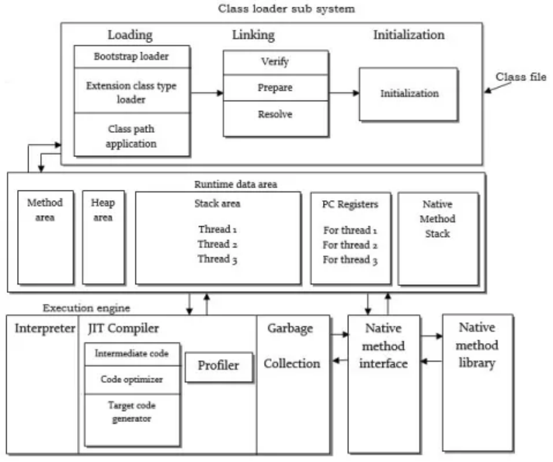
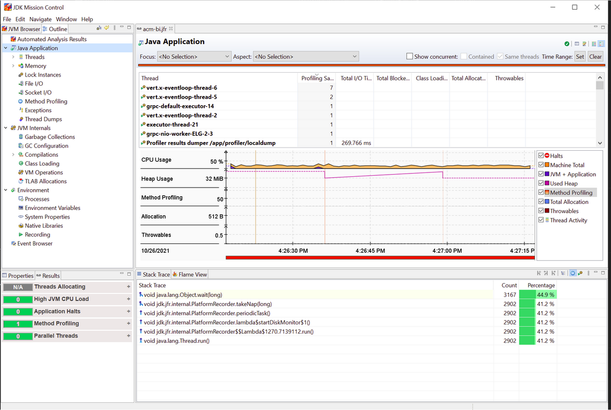
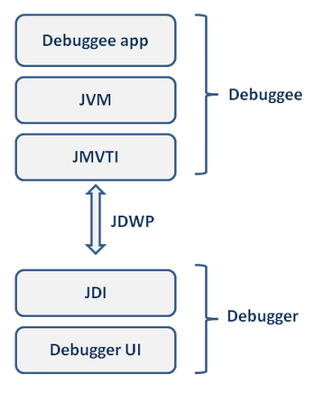
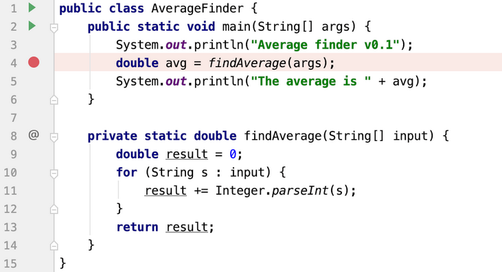
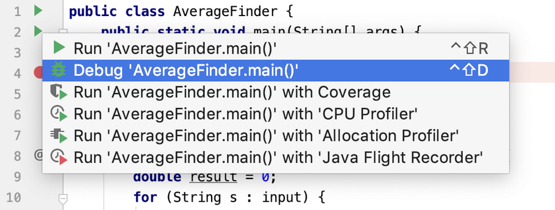
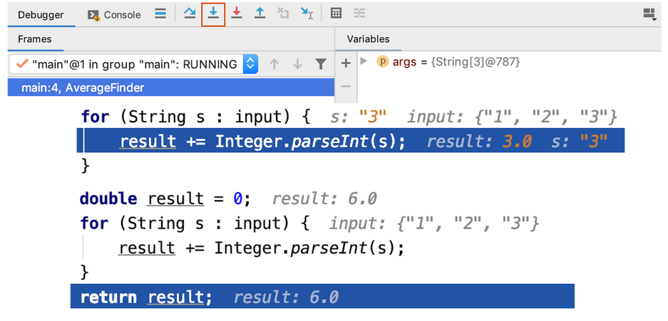

# Лекція 7: Пошук та усунення несправностей (Troubleshooting)

## ⚡ Експрес-опитування: Активація знань

Ми щойно вивчили багатопотоковість. Давайте подумаємо, які проблеми це створює:

1.  У [Лекції 6](06_threads.md) ми бачили приклад "Deadlock". Уявіть, що ваша програма "зависла". Як ви думаєте, як виглядає цей "завис" для JVM?
2.  Ви запустили симулятор "Банки" з [Практикуму 7](p07_race_condition.md) з 50 000 потоків. Програма впала. Яку помилку ви очікуєте побачити? (Підказка: це `Error`).
3.  Ваш додаток раптом почав сильно "гальмувати". Як ви думаєте, що може бути причиною з точки зору управління пам'яттю?

<details markdown="1">
<summary>Наші очікування (відповідь)</summary>

1.  Для JVM потоки не "зависли", вони перебувають у стані **`BLOCKED`**. Вони коректно чекають на монітор (замок), який ніколи не буде звільнено. Ми маємо навчитися "зазирати" всередину JVM, щоб побачити це.
2.  Створення 50 000 потоків (кожен з яких вимагає пам'яті під свій стек) найімовірніше призведе до **`OutOfMemoryError`**. Це критична помилка JVM.
3.  Найімовірніша причина — **Garbage Collector (GC)**. Якщо програма створює занадто багато "сміття" (короткоживучих об'єктів), GC може почати працювати безперервно, "зупиняючи світ" (Stop-the-World), щоб очистити пам'ять, що і викликає "гальмування".

</details>

## Вступ: У розробці немає магії, є лише інтерпретація

Привіт усім\! У розробці немає ніякої "магії" — є лише **розуміння системи та коректна інтерпретація її поведінки**. Помилки, збої, "зависання" — це не магія, це просто симптоми, які потрібно вміти правильно прочитати.

Пошук та усунення несправностей (debugging, troubleshooting) — це невід'ємна частина нашої роботи. Найкращий спосіб боротьби з помилками — це створювати такий дизайн коду, який мінімізує їхню появу. В основі такого дизайну лежить **Розмежування повноважень (Separation of Concerns, SoC)**.

### Що таке Розмежування повноважень?

Це загальна концепція, яка дозволяє розділити складність однієї великої проблеми на легші для вирішення підпроблеми. Вперше цю ідею сформулював Едсгер Дейкстра. На практиці цей принцип відповідає пошуку правильної **декомпозиції** або **модуляризації** проблеми.

Протягом багатьох років це призвело до появи таких підходів, як об'єктно-орієнтоване програмування (про яке ми говорили в лекції про SOLID).

Останнім часом цей принцип застосовують для розділення **функціональних** (що програма робить) та **нефункціональних** (як вона це робить) вимог. Прикладами нефункціональних вимог є логування, безпека, відмовостійкість.

Такі "наскрізні" (cross-cutting) проблеми важко виділити в окремі модулі. Код, що відповідає за логування, наприклад, не знаходиться в одному класі, а "пронизує" десятки класів і методів. Коли цей принцип порушено, код стає "магічним" у поганому сенсі: незрозумілим, заплутаним, і пошук помилок у ньому перетворюється на пекло.

Одним з рішень цієї проблеми є **Аспектно-орієнтоване програмування (AOP)**, яке дозволяє виносити таку наскрізну логіку в окремі модулі (аспекти).

Але що робити, коли помилки вже трапились? Сьогодні ми розглянемо основні методи та інструменти, щоб "декодувати" симптоми і знайти причину.

-----

## Перш ніж почати: Карта JVM



Щоб шукати проблеми, треба знати, *де* шукати. Більшість проблем у Java-додатку трапляються в одному з компонентів віртуальної машини Java (JVM).

Ось головні області, за якими ми будемо "полювати":

1.  **Class Loader Subsystem (Завантажувач класів):** Відповідає за завантаження ваших `.class` файлів (байткоду) в пам'ять.
2.  **Runtime Data Area (Область даних часу виконання):**
      * **Heap (Купа):** Головна "проблемна" зона. Тут живуть *усі* ваші об'єкти. Якщо вона переповнюється, ви отримуєте `OutOfMemoryError` .
      * **Stack (Стек):** Створюється для *кожного* потоку. Тут живуть локальні змінні та посилання на об'єкти в купі. Якщо стек переповнюється (наприклад, через нескінченну рекурсію), ви отримуєте `StackOverflowError` .
      * **Method Area:** Зберігає метадані про ваші класи.
3.  **Execution Engine (Механізм виконання):**
      * **JIT Compiler (JIT-компілятор):** Перетворює байткод на швидкий машинний код .
      * **Garbage Collector (GC, Збирач сміття):** "Прибиральник", який чистить купу (Heap) від об'єктів, що більше не використовуються.

-----

## Інструмент 1: "Моделювання в голові" (Аналіз Stack Trace)

Це ваш основний інструмент. Коли програма "падає" з винятком (Exception), вона виводить **Stack Trace** — "звіт про те, що трапилось".

Ваше завдання — навчитися його читати.

Давайте розберемо цей приклад:

```
ERROR main c.z.h.p.HikariPool HikariPool-1 Excencion during pool initialization.
org.postgresql.util.PSQLException: The connection attempt failed.
	at org.postgresql.core.v3.ConnectionFactoryImpl.openConnectionImpl(ConnectionFactoryImpl.java:292)
	at org.postgresql.core.ConnectionFactory.openConnection(ConnectionFactory.java:49)
	at org.postgresql.jdbc.PgConnection.<init>(PgConnection.java:195)
	at org.postgresql.Driver.makeConnection(Driver.java:458)
	at org.postgresql.Driver.connect(Driver.java:260)
	at com.zaxxer.hikari.util.DriverDataSource.getConnection(DriverDataSource.java:136)
	at com.zaxxer.hikari.pool.PoolBase.newConnection(PoolBase.java:369)
	at com.zaxxer.hikari.pool.PoolBase.newPoolEntry(PoolBase.java:198)
	at com.zaxxer.hikari.pool.HikariPool.createPoolEntry(HikariPool.java:467)
	at com.zaxxer.hikari.pool.HikariPool.checkFailFast(HikariPool.java:541)
	at com.zaxxer.hikari.pool.HikariPool.<init>(HikariPool.java:115)
	at com.zaxxer.hikari.HikariDataSource.<init>(HikariDataSource.java:81)
```

**Як це читати (знизу вгору):**

1.  Все почалося в `HikariDataSource` (конструктор, рядок 81).
2.  Він викликав конструктор `HikariPool` (рядок 115).
3.  Той викликав `checkFailFast` (рядок 541)...
4.  ...і так далі, аж до самого верху...
5.  **Де сталася помилка:** У методі `openConnectionImpl` (рядок 292).
6.  **Що сталося (Тип + Повідомлення):** `PSQLException: The connection attempt failed` (Не вдалося підключитися до бази даних PostgreSQL).

**Висновок:** Програма не запустилася, бо не змогла підключитися до бази даних.

-----

## Інструмент 2: Логування (Application Logging)

`System.out.println` — це не логування. У реальних проєктах використовуються спеціальні бібліотеки.

  * **Facade (Фасад):** **SLF4J**. Ваш код має залежати *тільки* від нього. Це просто "адаптер", який дозволяє підключити будь-який фреймворк логування.
  * **Framework (Фреймворк):** **Logback** або **Log4j**. Це реальні бібліотеки, які виконують роботу (пишуть у файл, ротують логи тощо) .

### Рівні, Апендери та Шаблони

  * **Рівні (Levels):** Дозволяють фільтрувати повідомлення за важливістю (TRACE, DEBUG, INFO, WARN, ERROR, FATAL).
  * **Апендер (Appender):** Визначає, *куди* писати лог (у консоль, у файл, в базу даних).
  * **Шаблон (Layout):** Визначає, *як* виглядає повідомлення (наприклад, `[2025-11-04] [ERROR] [main] ...`).
  * **MDC/NDC:** Дозволяє додавати до логів контекст (наприклад, `requestId`), щоб відстежити повний шлях запиту через різні сервіси.

### Стилі логування

  * **ПОГАНО (Конкатенація `+`):** `LOG.debug("Notifications: " + notifications);` 
      * **Чому?** Рядок `"Notifications: " + notifications` буде створено *завжди*, навіть якщо рівень логування `INFO` і цей `DEBUG` нікому не потрібен. Це марна трата пам'яті.
  * **ДОБРЕ (Плейсхолдери `{}`):** `LOG.debug("Notifications: {}", notifications);` 
      * **Чому?** Рядок буде відформатовано, *тільки якщо* рівень логування `DEBUG` увімкнено.
  * **НАДТО ДЕТАЛЬНО (Обгортка `if`):** `if (LOG.isDebugEnabled()) { ... }` 
      * **Чому?** Це вирішує проблему конкатенації, але робить код громіздким. Плейсхолдери `{}` роблять те саме автоматично.

### Золоті правила логування 

**1. Логуйте примітиви, а не об'єкти** 

  * **ПОГАНО:** `LOG.debug("salesOrderNotification: {}", salesOrderNotification);` 
      * **Чому?** Викликається `salesOrderNotification.toString()`. Цей метод може бути повільним, "завалити" лог тисячами рядків, або навіть викликати рекурсію і `StackOverflowError`.
  * **ДОБРЕ:** `LOG.debug("SalesOrderName: {}", salesOrderName);` (String — це окей) 
  * **ДОБРЕ:** `LOG.debug("locationsAmount: {}", locations.size());` (Примітиви — ідеально) 

**2. Використовуйте плейсхолдери `{}` (як зазначено вище)**

Логування — це настільки важливий інструмент, що ми присвятили йому цілу окрему лекцію, де детально розбираємо сучасний стек SLF4J + Logback: [Лекція 8: "Чорна скринька" вашого додатку. Вступ до логування](08_logging.md)

-----

## Інструменти 3 та 4: Аналіз пам'яті (GC Logs, Heap Dumps)

### OOM — це не збій, а проблема дизайну

**Проблема:** `OutOfMemoryError` (OOM).
**Важливо:** OOM — це не випадковий збій, це **функціональна проблема**. В 99% випадків це означає помилку у вашому дизайні або коді (наприклад, "витік пам'яті" — memory leak).

Щоб керувати розміром купи (Heap), використовуються два основні прапорці JVM:

  * `-Xms<Size>` (наприклад, `-Xms2G`): Встановлює **початковий** (і мінімальний) розмір купи.
  * `-Xmx<Size>` (наприклад, `-Xmx8G`): Встановлює **максимальний** розмір купи.

### Коротко про пам'ять (Heap)

Купа ділиться на покоління:

  * **Young Generation (Молоде покоління):** Тут об'єкти народжуються (в області **Eden**). Ті, що виживають після "малого" GC, переїжджають у **Survivor Space** (S0, S1) .
  * **Old Generation (Старе покоління):** Сюди переїжджають об'єкти, що "довго живуть". Очищується під час "великого" (`Full GC`).
  * **Metaspace:** (З Java 8) Замінив старий PermGen, тут зберігаються метадані класів .

### Типи посилань (Reference Types)

Збирач сміття (GC) видаляє об'єкти, на які немає посилань. Але посилання бувають різними:

  * **Strong (Сильні):** Звичайне посилання (`MyObject obj = new MyObject()`). Поки воно існує, GC не видалить об'єкт.
  * **Soft (М'які):** Використовуються для кешів. GC видалить такий об'єкт, *тільки* якщо пам'ять закінчується, але до OOM.
  * **Weak (Слабкі):** GC видалить такий об'єкт при наступній збірці сміття, як тільки зникнуть сильні посилання.
  * **Phantom (Фантомні):** Використовуються, щоб дізнатися, коли об'єкт *точно* був видалений.

### Інструменти для аналізу:

1.  **GC Log:** Це текстовий лог, який пише збирач сміття. Його можна відкрити в програмі **GCViewer** і подивитися, як часто відбуваються `Full GC`. Якщо занадто часто — у вас проблеми.
2.  **Heap Dump (Дамп купи):** Це "фотографія" *всієї* пам'яті (купи) в момент часу. Зазвичай файл `.hprof` створюється автоматично при OOM.
      * **Як отримати:** `jcmd <pid> GC.heap_dump <filename>` або `jmap`.
      * **Аналіз:** Дамп відкривається в програмі **MAT (Memory Analyzer Tool)**. Вона дозволяє знайти, які об'єкти займають найбільше місця і *чому* GC не може їх видалити. Для аналізу можна використовувати мову запитів **OQL**.

-----

## Інструмент 5: Java Flight Recorder (JFR)

Це "швейцарський ніж" для діагностики. Це вбудований у JVM профіль, який збирає дані про *все* з мінімальними накладними витратами.




JFR використовується разом з **JDK Mission Control (JMC)** і дозволяє аналізувати:

  * Використання пам'яті та цикли GC.
  * Стани потоків та блокування.
  * Операції вводу-виводу (Файли, Сокети) .
  * Винятки, що найчастіше трапляються.

-----

## Інструмент 6: Thread Dump (Дамп потоків)

**Що це?** Миттєвий знімок стану *всіх* потоків у JVM.
**Коли?** Коли програма "зависла" або працює аномально повільно (високе навантаження на CPU) .
**Як створити?**

  * Linux/macOS: `kill -3 <pid>` 
  * Windows: `Ctrl + Break` у консолі 
  * Універсально: `<jdk>/bin/jstack <pid>` 

### Як читати Thread Dump (Структура)

Ось типовий заголовок :

```
2020-07-18 09:55:42
Full thread dump OpenJDK 64-Bit Server VM (13.0.2+8 mixed mode, sharing):

"main" #1 prio=5 os_prio=31 cpu=103.5 elapsed=19.55s tid=0x00007fb2b0008800 nid=0x2803 waiting on condition [0x0000700004e2e000]
   java.lang.Thread.State: TIMED_WAITING (sleeping)
	at java.lang.Thread.sleep(java.base@13.0.2/Native Method)
	at com.pv.drafts.threaddump.simple.SingleMainThreadProgram.main(SingleMainThreadProgram.java:5)
```

Що ми тут бачимо:

  * **"main"**: Ім'я потоку.
  * **`#1`**: ID потоку.
  * **`prio=5`**: Пріоритет Java.
  * **`tid=...`**: Адреса в пам'яті JVM.
  * **`nid=0x2803`**: **Native ID**. Це ID потоку на рівні операційної системи. (Дуже важливо\!)
  * **`java.lang.Thread.State: TIMED_WAITING (sleeping)`**: Стан потоку.
  * `at ...`: Стек викликів (Stack Trace) цього потоку.

### Аналіз станів потоків (Приклади)

**1. Приклад: `BLOCKED (on object monitor)`** 

```
"blocked-thread" #23 ... waiting for monitor entry [0x0000700002659000]
   java.lang.Thread.State: BLOCKED (on object monitor)
	at com.pv.drafts.threaddump.blocked.BlockedThreadProgram$SyncRunnable.run(BlockedThreadProgram.java:30)
	- waiting to lock <0x000000070fe85508> (a java.lang.Object)
...
"blocking-thread" #21 ...
   java.lang.Thread.State: TIMED_WAITING (sleeping)
	at java.lang.Thread.sleep(java.base@13.0.2/Native Method)
	at com.pv.drafts.threaddump.blocked.BlockedThreadProgram$SyncRunnable.run(BlockedThreadProgram.java:31)
	- locked <0x000000070fe85508> (a java.lang.Object)
```

  * **Інтерпретація:** Потік `#23` (`blocked-thread`) у стані `BLOCKED`, бо він `waiting to lock <...5508>` . Потік `#21` (`blocking-thread`) у стані `TIMED_WAITING`, але він `locked <...5508>`.
  * **Висновок:** Потік 21 "спить" і при цьому тримає замок, на який чекає потік 23. Це "вузьке місце".

**2. Приклад: `DEADLOCK`** 

```
Found one Java-level deadlock:
=============================
"Thread-0":
  waiting to lock monitor ... (object 0x...65f8),
  which is held by "Thread-1"
"Thread-1":
  waiting to lock monitor ... (object 0x...65b0),
  which is held by "Thread-0"
```

  * **Інтерпретація:** `jstack` одразу каже нам про дедлок. Потік-0 чекає на замок, який тримає Потік-1. А Потік-1 чекає на замок, який тримає Потік-0 . Вони ніколи не продовжать роботу.

**3. Приклад: `RUNNABLE` (Високе навантаження CPU)** 
Ви помітили в `top`, що процес (PID `12897`) вантажить CPU .

1.  Запускаєте `top -H -p <pid>`, щоб побачити потоки:
    ```
    PID   USER    ... %CPU  ... COMMAND
    12897 pv      ... 87.3  ... HIGH
    12898 pv      ...  4.5  ... MEDIUM
    ```
    
2.  Берете "проблемний" PID потоку: `12897`.
3.  Переводите його в шістнадцяткове значення (HEX): `12897` -> `0x3261`. Це `nid`.
4.  Шукаєте `nid=0x3261` у вашому Thread Dump:
    ```
    "HIGH" #12 ... nid=0x3261 runnable [0x00007f7ee61b5000]
       java.lang.Thread.State: RUNNABLE
    	at com.pv.drafts.threaddump.RunningTread.run(HighCpuThreadProgram.java:48)
    ```
    

<!-- end list -->

  * **Інтерпретація:** Ми знайшли\! Потік "HIGH" знаходиться у стані `RUNNABLE` (тобто працює) і "крутиться" у методі `run` в файлі `HighCpuThreadProgram.java` на рядку 48 . Ймовірно, там нескінченний цикл.

### Швидкі поради (Tips & Tricks)

  * **Підрахувати потоки:** `ps -o nlwp <pid>` (покаже загальну кількість потоків процесу) .
  * **Сортувати за станом (Linux):** `grep 'java.lang.Thread.State' dump.txt | sort | uniq -c | sort -n` (покаже, скільки потоків в `RUNNABLE`, `BLOCKED` тощо) .

**Можливі причини проблем:**

  * **Висока затримка (High latency):**
      * Занадто багато потоків.
      * Потоки масово заблоковані на одній `synchronized` секції.
  * **Періодична логіка не працює:**
      * Потік, що відповідав за цю логіку, завершив роботу (наприклад, через виняток).
  * **Високе навантаження CPU:**
      * Потік у стані `RUNNABLE` з нескінченним циклом.
      * "Поганий" код (неефективні алгоритми).

-----

## Інструмент 7: Live Debugging (JDWP та IDE)

Це те, що ви робите щодня у вашій IDE. Ви підключаєтесь до JVM "наживо" через протокол JDWP (Java Debug Wire Protocol).



Процес простий:

1.  **Set Breakpoint (Точка зупину):** Ви кажете IDE: "Зупини виконання програми тут".
2.  **Run Debug Mode:** Запускаєте програму в режимі відладки.
3.  **Step Thru (Покрокове виконання):** Ви рухаєтесь по коду рядок за рядком, спостерігаючи за станом усіх змінних .





-----

## ✅ Контрольні питання

1.  **SoC:** Як принцип "Розмежування повноважень" пов'язаний з "Аспектно-орієнтованим програмуванням"? Наведіть приклад наскрізної проблеми.
2.  **JVM:** У чому ключова різниця між Heap (Купою) та Stack (Стеком)? Де живуть об'єкти, а де — посилання на них?
3.  **Stack Trace:** Якщо ви бачите довгий Stack Trace, де ви шукатимете *причину* помилки — нагорі чи внизу списку?
4.  **Logging:** Чому `LOG.debug("User data: {}", user)` вважається гіршою практикою, ніж `LOG.debug("User ID: {}", user.getId())`?
5.  **Logging Styles:** Чому використання `+` для конкатенації в логах (`LOG.debug("Data: " + data)`) є неефективним?
6.  **Memory:** Що таке `OutOfMemoryError`? Який інструмент (`.hprof` файл) використовується для його аналізу, і який прапорець JVM встановлює максимальний розмір купи?
7.  **Threads:** Як пов'язати потік, що споживає 100% CPU у `top -H`, з конкретним записом у Thread Dump?
8.  **Threads:** Ваша програма "зависла". Ви зробили Thread Dump і бачите багато потоків у стані `BLOCKED (on object monitor)`. Що це означає?
9.  **JFR:** Як називається інструмент, що є "швейцарським ножем" для профілювання JVM, та програма для його аналізу?

<details markdown="1">
<summary>Відповіді (спробуйте спочатку відповісти самі)</summary>

1.  **SoC та AOP:** Принцип "Розмежування повноважень" (SoC) — це ідея розділення програми на окремі частини, кожна з яких вирішує одну проблему. Однак деякі проблеми (наприклад, логування, безпека, транзакції) є "наскрізними" і їхній код "пронизує" багато модулів. "Аспектно-орієнтоване програмування" (AOP) — це техніка, яка дозволяє реалізувати SoC для цих наскрізних проблем, виділяючи їх в окремі "аспекти".

2.  **Heap vs Stack:**

      * **Стек (Stack):** Приватний для кожного потоку. Зберігає локальні змінні примітивних типів та **посилання** на об'єкти. Життєвий цикл змінної прив'язаний до життєвого циклу методу.
      * **Купа (Heap):** Спільна для всіх потоків. Зберігає **самі об'єкти** та масиви. Пам'ять звільняється Збирачем сміття (GC).

3.  **Stack Trace:** Причину помилки (місце, де вона *виникла*) потрібно шукати **нагорі** списку (це перший рядок з `Exception`). Нижня частина стеку (`at ... HikariDataSource.<init>`) показує *послідовність викликів*, яка призвела до помилки.

4.  **Logging (Об'єкти vs Примітиви):** Виклик `LOG.debug("User data: {}", user)` змушує Java викликати метод `user.toString()`. Цей метод може бути повільним (наприклад, якщо він лізе в базу даних або форматує 100 полів), або може викликати рекурсію (`StackOverflowError`), або просто "заспамити" лог. Логування примітивів (як `user.getId()`) є швидким, безпечним і передбачуваним.

5.  **Logging Styles:** Конкатенація (`"Data: " + data`) створює новий об'єкт `String` *завжди*, навіть якщо рівень логування `DEBUG` вимкнений. Це марна трата ресурсів та пам'яті. Плейсхолдери (`"Data: {}"`) форматують рядок *тільки* якщо логування цього рівня увімкнене.

6.  **Memory:** `OutOfMemoryError` — це критична помилка `Error`, яка означає, що в Купі (Heap) не залишилося місця для створення нових об'єктів. Для аналізу використовується **Heap Dump** (файл `.hprof`), який можна відкрити в **MAT (Memory Analyzer Tool)**. Максимальний розмір купи встановлюється прапорцем **`-Xmx`** (напр., `-Xmx8G`).

7.  **Threads (CPU):**

    1.  Використовуйте `top -H -p <pid>`, щоб знайти **PID** потоку, який навантажує CPU.
    2.  Переведіть цей PID у шістнадцятковий (HEX) формат. Це буде **`nid`** (Native ID).
    3.  Зробіть `jstack <pid>` (Thread Dump).
    4.  Знайдіть у дампі потік, у якого `nid` збігається з вашим HEX-значенням. Його стан, найімовірніше, буде `RUNNABLE`.

8.  **Threads (BLOCKED):** Це означає, що всі ці потоки намагаються отримати доступ до одного й того ж **`synchronized`** блоку або методу. Один потік "захопив" монітор (замок) і утримує його, а всі інші змушені чекати у стані `BLOCKED`. Це "вузьке місце" (contention) у вашій програмі.

9.  **JFR:** Інструмент називається **Java Flight Recorder (JFR)**, а програма для його аналізу — **JDK Mission Control (JMC)**.

</details>