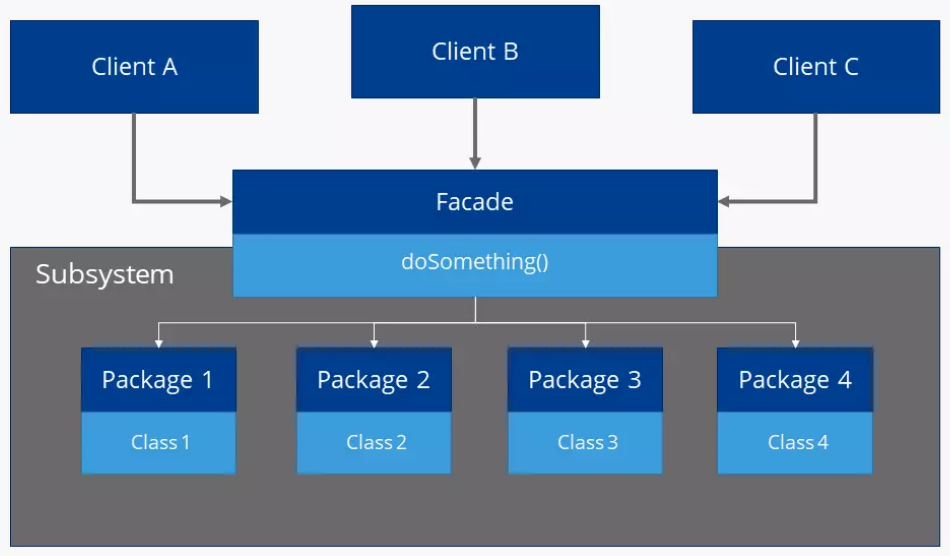
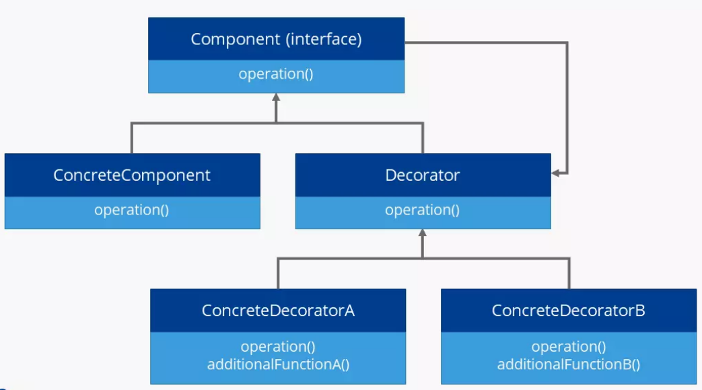

# 📄 Лекція 10: Патерни Програмування (Design Patterns)

### **Мета Лекції:**

Вивчити найбільш поширені та критично важливі патерни проєктування, які дозволяють створювати гнучкі, розширювані та легко підтримувані системи. Ми сфокусуємося не на теорії, а на практичних сценаріях, коли ці патерни є єдиним елегантним рішенням для реальних проблем.

> **Філософія:** Зрозуміти, як патерни втілюють принципи **SOLID** у робочий "продукт", а не просто завчити назви.

-----

## ⚡ Експрес-опитування

*Питання, щоб "розбудити" мозок на початку заняття.*

1.  Назвіть будь-який із п'яти принципів **SOLID**.
2.  Який принцип SOLID порушується, коли ми використовуємо велику конструкцію `if/else if/else` для визначення поведінки об'єкта?
3.  Що таке **інтерфейс** у Java і чим він відрізняється від **абстрактного класу**?

<details markdown="1">
<summary>⚡ Експрес-опитування (Відповіді)</summary>

1.  **Назвіть будь-який із п'яти принципів SOLID.**
      * Single Responsibility Principle (SRP)
      * Open/Closed Principle (OCP)
      * Liskov Substitution Principle (LSP)
      * Interface Segregation Principle (ISP)
      * Dependency Inversion Principle (DIP)
2.  **Який принцип SOLID порушується, коли ми використовуємо велику конструкцію `if/else if/else` для визначення поведінки об'єкта?**
      * **OCP** (Open/Closed Principle). Об'єкт не відкритий для розширення (додавання нових варіантів поведінки) і закритий для модифікації (доводиться змінювати код `if/else`).
3.  **Що таке інтерфейс у Java і чим він відрізняється від абстрактного класу?**
      * **Інтерфейс** описує контракт, який має реалізувати клас; він може мати лише абстрактні методи (до Java 8) та константи. Клас може реалізовувати багато інтерфейсів.
      * **Абстрактний клас** може мати як абстрактні, так і реалізовані методи, а також поля. Клас може успадковувати лише один абстрактний клас.
</details>
-----

## Вступ: Навіщо потрібні Патерни?

Кожен досвідчений розробник стикається з типовими проблемами: як керувати створенням об'єктів? Як змінити поведінку класу, не змінюючи його код? Як уникнути "спагеті-коду" при інтеграції складних підсистем?

**Патерни проєктування** — це перевірені, формалізовані та багаторазово використані рішення типових проблем, що виникають у процесі проєктування програмного забезпечення. Вони слугують спільною мовою для розробників.

-----

## I. Породжувальні Патерни (Creational Patterns)

Вони контролюють процес створення об'єктів, роблячи його більш гнучким та безпечним.

### 1 Singleton (Одинак)

**🤔 Проблема:** Нам потрібен один, і лише один, екземпляр певного класу (наприклад, для керування конфігурацією, логування, пулом з'єднань). Створення другого екземпляра може призвести до хаосу та конфліктів.

**✅ Рішення:** Гарантувати, що клас матиме лише один екземпляр, і надати глобальну точку доступу до нього.

  * **Приклад:** Клас `DatabaseConnectionPool` або `Logger`.
  * **Зв'язок з актуальністю:** Уявіть, що ви розробляєте бекенд для **Банки Monobank**. Вам потрібен єдиний `MonobankAPIClient` для всіх запитів, щоб керувати лімітами Rate Limiting.
  * **Антипатерн?** Часто вважається антипатерном, оскільки порушує принцип єдиної відповідальності (**SRP** — керує як своєю логікою, так і життєвим циклом) і ускладнює тестування. Використовувати з обережністю!
  * **⚠️ Singleton у еру Мікросервісів:**
  Пам'ятайте: Singleton гарантує один екземпляр лише в межах **однієї JVM**.
  Якщо ваша архітектура — це мікросервіси, і ви запустите 5 екземплярів (реплік) сервісу "OrderService", ви отримаєте **5 різних "Сінґлтонів"**.
    * **Помилка:** Зберігати глобальний стан (наприклад, лічильник замовлень) у Singleton-класі. У кожній репліці він буде свій, і загальні дані будуть некоректними.
    * **Рішення:** Для стану в розподілених системах використовуйте зовнішні сховища (Redis, Database), а не Singleton.

```java
// service/GameConfig.java
public class GameConfig {
    // 1. Статичне поле для зберігання єдиного екземпляра
    private static GameConfig instance;
    
    // 2. Приватний конструктор (забороняє new GameConfig())
    private GameConfig() {
        // Завантаження налаштувань...
    }

    // 3. Публічний статичний метод доступу
    public static GameConfig getInstance() {
        if (instance == null) {
            instance = new GameConfig();
        }
        return instance;
    }
}
```

**🤔 Питання до групи / Давайте поміркуємо:**
У контексті гри "Блекджек", який об'єкт може бути реалізований як Singleton, і чому?

<details markdown="1">
<summary>🤔 Питання до Групи (Відповіді)</summary>

*  **У контексті гри "Блекджек", який об'єкт може бути реалізований як Singleton, і чому?**
      * Найкращий кандидат — **Генератор випадкових чисел** (`Random`) або **Логер** (`GameLogger`). Логер повинен мати єдиний екземпляр, щоб централізовано керувати записом до одного файлу/потоку і уникнути конфліктів.
</details>

-----

### 2 Factory Method (Фабричний Метод)

**🤔 Проблема:** Ми маємо створювати об'єкти, але не хочемо, щоб код, який їх використовує, знав про їхні конкретні класи. Це порушує принцип **DIP** (Dependency Inversion Principle), коли високорівневі модулі залежать від низькорівневих.

**✅ Рішення:** Перенести логіку створення об'єктів у спеціальні **фабричні методи** або класи. Це дозволяє підкласам (або самій фабриці) вирішувати, який саме клас створювати.

  * **Приклад з проєкту: Створення гравців**
    Ми створюємо `PlayerFactory` для централізованого керування створенням різних типів гравців.

```java
// service/PlayerFactory.java
public class PlayerFactory {
    public static Player create(PlayerType type) {
        PlayerStrategy strategy;
        
        switch (type) {
            case HUMAN:
                // HumanPlayer може мати стратегію, що читає з консолі
                strategy = new ConsoleInputStrategy(); 
                break;
            case DEALER_AI:
                strategy = new DealerStrategy();
                break;
            case AGGRESSIVE_AI:
                strategy = new AggressivePlayerStrategy();
                break;
            default:
                throw new IllegalArgumentException("Unknown player type: " + type);
        }
        // Фабрика повертає налаштований об'єкт
        return new Player(strategy); 
    }
}
```

  * **Використання:** `Main` клас просто каже `PlayerFactory.create(PlayerType.DEALER_AI)`, не знаючи, як саме влаштований дилер.

-----

## II. Структурні Патерни (Structural Patterns)

Вони стосуються композиції класів та об'єктів для формування більших структур.

### 3 Adapter (Адаптер)

**🤔 Проблема:** У вас є клас, який ви хочете використати, але його інтерфейс не відповідає вашому. Класи несумісні, і ви не можете змінити ні власний, ні чужий код.

**✅ Рішення:** Створити проміжний клас (**Adapter**), який перетворює інтерфейс одного класу на інший інтерфейс, який очікує клієнт.

  * **Приклад:** Уявіть, що ваша система очікує інтерфейс `Logger`, але є стара бібліотека, яка має клас `OldConsoleWriter` з методом `writeToLog()`. Адаптер візьме `OldConsoleWriter` і зробить його сумісним з `Logger`.
  * **Зв'язок з актуальністю:** У волонтерському проєкті вам потрібно інтегрувати старий XML-файл з даними до нової системи, яка працює лише з JSON. Ви пишете **XMLtoJSONAdapter**.

```java
// 1. Target (Інтерфейс, який очікує наша нова система)
interface Logger {
    void logInfo(String message);
}

// 2. Adaptee (Старий клас, який ми хочемо використати)
class OldConsoleWriter {
    void writeToConsole(String text, int level) {
        System.out.println("[" + level + "] " + text);
    }
}

// 3. Adapter (Обгортка)
class ConsoleWriterAdapter implements Logger {
    private OldConsoleWriter oldWriter;

    public ConsoleWriterAdapter(OldConsoleWriter oldWriter) {
        this.oldWriter = oldWriter;
    }

    @Override
    public void logInfo(String message) {
        // Перетворюємо виклик нового інтерфейсу на виклик старого
        oldWriter.writeToConsole(message, 1);
    }
}
```

### 4 Facade (Фасад)

**🤔 Проблема:** Складна підсистема складається з десятків класів. Пряма взаємодія з нею вимагає знання всіх цих класів і правильного порядку викликів. Це створює жорстку зв'язаність.

**✅ Рішення:** Створити єдиний клас (**Facade**), який надає спрощений та уніфікований інтерфейс до всієї складної підсистеми.

  * **Приклад з проєкту:** У грі "Блекджек" є класи `Deck`, `Dealer`, `Table`, `ScoringEngine`. Замість того, щоб клієнт викликав їх усі, ми створюємо `GameManagerFacade`, який має простий метод `startGame()`, `makeMove(player, card)` і `calculateWinner()`.
  * **Перевага:** Фасад значно знижує залежність клієнтського коду від внутрішньої реалізації складної системи.



```java
// Facade: Простий вхід у складну систему
public class GameManagerFacade {
    private Deck deck;
    private Dealer dealer;
    private ScoreCalculator scorer;

    public GameManagerFacade() {
        this.deck = new Deck();
        this.dealer = new Dealer();
        this.scorer = new ScoreCalculator();
    }

    // Клієнт викликає лише цей метод, не знаючи про Deck/Dealer/Scorer
    public void startNewRound(Player player) {
        deck.shuffle();
        dealer.resetHand();
        player.resetHand();
        dealer.dealInitialCards(deck, player);
        System.out.println("Round started!");
    }
}
```

### 5 Decorator (Декоратор)

**🤔 Проблема:** Нам потрібно додати нову поведінку до об'єкта **динамічно** (під час виконання) і робити це гнучко. Використання наслідування (успадкування) призвело б до вибуху кількості підкласів.

**✅ Рішення:** Обгортати (wrap) об'єкт-компонент іншими об'єктами-декораторами, які додають нову поведінку, але зберігають той самий інтерфейс. Цей патерн є класичною реалізацією принципу **OCP** (Open/Closed Principle).



  * **Приклад з проєкту:** Карта в "Блекджеку" (`Card`). Може бути `CardDecorator` для тимчасового "бонусу" (наприклад, "карта подвійного виграшу"). Декоратор додає функціонал, не змінюючи сам клас `Card`.

```java
// 1. Component Interface
interface Card {
    String getDescription();
    int getPoints();
}

// 2. Concrete Component (Звичайна карта)
class StandardCard implements Card {
    public String getDescription() { return "Seven of Hearts"; }
    public int getPoints() { return 7; }
}

// 3. Decorator (Карта з бонусом)
class GoldenCardDecorator implements Card {
    private Card originalCard; // Wraps original

    public GoldenCardDecorator(Card originalCard) {
        this.originalCard = originalCard;
    }

    @Override
    public String getDescription() {
        return originalCard.getDescription() + " (GOLD Edition)";
    }

    @Override
    public int getPoints() {
        return originalCard.getPoints() * 2; // Подвійні очки!
    }
}
```

**🤔 Питання до групи / Давайте поміркуємо:**
Чим Decorator відрізняється від наслідування? І чому він кращий для динамічного додавання функціоналу?

<details markdown="1">
<summary>🤔 Питання до Групи (Відповіді)</summary>

*  **Чим Decorator відрізняється від наслідування? І чому він кращий для динамічного додавання функціоналу?**
      * **Наслідування** (**Inheritance**) додає функціонал статично (на етапі компіляції) і створює жорстку ієрархію. Кожен новий функціонал вимагає створення нового підкласу, що швидко призводить до **"вибуху класів"**.
      * **Decorator** (**Композиція**) додає функціонал динамічно (на етапі виконання), обгортаючи об'єкт. Це дозволяє комбінувати багато функціональних можливостей в різних порядках без створення величезної кількості підкласів, повністю реалізуючи **OCP**.
</details>

-----

## III. Поведінкові Патерни (Behavioral Patterns)

Вони зосереджені на ефективній комунікації та розподілі відповідальності між об'єктами.

### 6 Strategy (Стратегія)

**🤔 Проблема:** У нас є об'єкт, який може поводитися по-різному залежно від ситуації, але ми не хочемо жорстко кодувати ці варіанти поведінки всередині самого об'єкта.

**✅ Рішення:** Винести кожен варіант поведінки (алгоритм) в окремий клас, що реалізує спільний **інтерфейс стратегії**. Об'єкт-клієнт може динамічно змінювати свою стратегію. Цей патерн є найчистішою реалізацією **OCP**.

  * **Приклад з проєкту:** Поведінка AI.

```java
// 1. Інтерфейс (Абстракція)
public interface PlayerStrategy {
    Action decideAction(Hand myHand, Card dealerUpCard);
}

// 2. Конкретна стратегія (Дилер)
public class DealerStrategy implements PlayerStrategy {
    @Override
    public Action decideAction(Hand myHand, Card dealerUpCard) {
        // Дилер завжди бере карту, якщо < 17
        return (myHand.getValue() < 17) ? Action.HIT : Action.STAND;
    }
}

// 3. Конкретна стратегія (Обережний гравець)
public class ConservativeStrategy implements PlayerStrategy {
    @Override
    public Action decideAction(Hand myHand, Card dealerUpCard) {
        // Зупиняється вже на 14
        return (myHand.getValue() < 14) ? Action.HIT : Action.STAND;
    }
}

// 4. Контекст (Гравець)
public class Player {
    private PlayerStrategy strategy; // Has-a relationship

    public Player(PlayerStrategy strategy) {
        this.strategy = strategy;
    }
    
    public Action makeTurn(Hand hand, Card dealerCard) {
        return strategy.decideAction(hand, dealerCard);
    }
}
```

  * **Перевага:** Ми можемо додавати нові стратегії (наприклад, `CheatStrategy`), не чіпаючи клас `Player`.

### 7 Observer (Спостерігач)

**🤔 Проблема:** Коли стан одного об'єкта (Subject, Видавець) змінюється, ми повинні автоматично сповістити групу інших об'єктів (Observers, Спостерігачі), не знаючи конкретних класів цих спостерігачів.

**✅ Рішення:** Видавець підтримує список залежних від нього Спостерігачів і автоматично сповіщає їх про будь-які зміни.

  * **Приклад з проєкту:** У "Блекджеку" об'єкт `Game` (Видавець) сповіщає `GUIWindow` (Спостерігач) кожного разу, коли змінюється стан (наприклад, нова карта роздана). Це відділяє логіку гри від інтерфейсу.

```java
// 1. Observer Interface (Хто слухає)
interface GameObserver {
    void onCardDealt(String cardName);
}

// 2. Subject (Хто сповіщає)
class GameTable {
    private List<GameObserver> observers = new ArrayList<>();

    public void addObserver(GameObserver o) {
        observers.add(o);
    }

    public void dealCard() {
        String card = "Ace of Spades";
        // ... логіка роздачі ...
        notifyObservers(card);
    }

    private void notifyObservers(String card) {
        for (GameObserver observer : observers) {
            observer.onCardDealt(card);
        }
    }
}

// 3. Usage: GUI реагує на події
class GameUI implements GameObserver {
    @Override
    public void onCardDealt(String cardName) {
        System.out.println("UI: Малюю анімацію для карти " + cardName);
    }
}
```

**🤔 Питання до групи / Давайте поміркуємо:**
Який патерн краще підходить для сповіщення: Observer чи, можливо, простий метод `update()`? У чому головна перевага Observer, пов'язана зі зв'язаністю?

<details markdown="1">
<summary>🤔 Питання до Групи (Відповіді)</summary>

*  **Який патерн краще підходить для сповіщення: Observer чи, можливо, простий метод `update()`?**
      * **Observer** кращий. Його головна перевага — **низька зв'язаність**. Видавець (`Subject`) знає лише про **інтерфейс** Спостерігача (`Observer`) і не знає про його конкретний клас. Простий метод `update()` вимагав би від Видавця знати конкретний клас, що призвело б до високої зв'язаності та порушення **DIP**.
</details>

-----

## IV. Резюме та Фіналізація

Ми розглянули 7 ключових патернів, які є основою для проєктування будь-якої середньої чи великої системи на Java. Головне — це навчитися бачити типову **проблему** і знати, який патерн дає найкраще **рішення**.

**📚 Що почитати (Класика):**

Якщо ви хочете заглибитися в тему (а це обов'язково для Senior-рівня), я рекомендую першоджерело — книгу, з якої все почалося. Її авторів називають **"Банда Чотирьох" (Gang of Four, GoF)**.

* **Книга:** *"Design Patterns: Elements of Reusable Object-Oriented Software"*
* **Автори:** Erich Gamma, Richard Helm, Ralph Johnson, John Vlissides.
* **Чому читати:** Хоча приклади там на C++ та Smalltalk, це "біблія" патернів. Вона вчить *мисленню* архітектора, а не просто кодуванню.

### 🧩 Погляд у майбутнє (Advanced Level)

Для успішного складання вступних іспитів до магістратури/аспірантури та проходження співбесід на рівень Middle/Senior, окрім розглянутих сьогодні базових патернів, ви також повинні розуміти наступні класичні рішення.

Ми будемо розглядати їх частково в наступних темах (або вони залишаються на самостійне опрацювання):

| Патерн | Тип | Суть та призначення |
| :--- | :--- | :--- |
| **MVC (Model-View-Controller)** | *Архітектурний* | Стандарт де-факто для UI. Розділяє дані (**Model**), відображення (**View**) та обробку дій (**Controller**). |
| **Abstract Factory** | *Породжувальний* | Фабрика фабрик. Дозволяє створювати *сімейства* пов'язаних об'єктів (напр., кнопки та вікна для macOS vs Windows) без прив'язки до конкретних класів. |
| **Proxy (Замісник)** | *Структурний* | Замінник іншого об'єкта для контролю доступу до нього. Використовується для "лінивого" завантаження (Lazy Loading), логування, кешування або перевірки прав доступу. |
| **Chain of Responsibility** | *Поведінковий* | Ланцюжок обов'язків. Дозволяє передавати запит послідовно через ланцюжок обробників, поки один з них не вирішить його обробити (напр., система фільтрації спаму). |
| **Flyweight (Легковаговик)** | *Структурний* | Дозволяє вмістити більше об'єктів у виділену пам'ять. Використовує спільний стан для багатьох об'єктів (напр., відображення 1 мільйона дерев у грі, де текстура дерева одна на всіх). |
| **Visitor (Відвідувач)** | *Поведінковий* | Дозволяє додавати нові операції до об'єктів, не змінюючи самі класи цих об'єктів. Часто використовується при роботі зі складними структурами (напр., обхід XML-дерева). |

### 🔗 Крос-посилання

Ці патерни є критично важливими для проєктування вашого фінального проєкту. Обов'язково перегляньте методичні вказівки:

  * [n01_final_project.md](n01_final_project.md) — використовуйте Strategy та Factory Method для реалізації **SOLID/DIP** у грі "Блекджек".

-----

## ✅ Контрольні питання

1.  Який патерн дозволяє додати нову функціональність до об'єкта під час виконання, не змінюючи його класу? Який принцип SOLID він реалізує?
2.  Ви пишете код, який має створювати різні об'єкти (наприклад, різні типи звіту: PDF, DOCX, TXT), але ви не хочете, щоб клієнтський код знав про їхні конкретні класи. Який патерн ви використаєте?
3.  Потрібно спростити роботу з комплексом із 15 класів бібліотеки, щоб мати лише один метод `processData()`. Який патерн проєктування підходить?
4.  Ваша програма має різні алгоритми для розрахунку податку. Потрібно мати можливість легко додавати та змінювати ці алгоритми. Який патерн забезпечить цю гнучкість?
5.  Чому Singleton часто називають антипатерном?

<details markdown="1">
<summary>✅ Контрольні питання (Відповіді)</summary>

1.  **Який патерн дозволяє додати нову функціональність до об'єкта під час виконання, не змінюючи його класу? Який принцип SOLID він реалізує?**
      * **Decorator** (Декоратор). Реалізує **OCP** (Open/Closed Principle).
2.  **Ви пишете код, який має створювати різні об'єкти (...). Який патерн ви використаєте?**
      * **Factory Method** (Фабричний Метод).
3.  **Потрібно спростити роботу з комплексом із 15 класів бібліотеки (...). Який патерн проєктування підходить?**
      * **Facade** (Фасад).
4.  **Ваша програма має різні алгоритми для розрахунку податку. Потрібно мати можливість легко додавати та змінювати ці алгоритми. Який патерн забезпечить цю гнучкість?**
      * **Strategy** (Стратегія).
5.  **Чому Singleton часто називають антипатерном?**
      * Він порушує **SRP** (Single Responsibility Principle), оскільки клас відповідає як за свою логіку, так і за керування власним життєвим циклом (гарантує єдиний екземпляр). Також він ускладнює тестування, оскільки створює приховані залежності та глобальний стан.

</details>