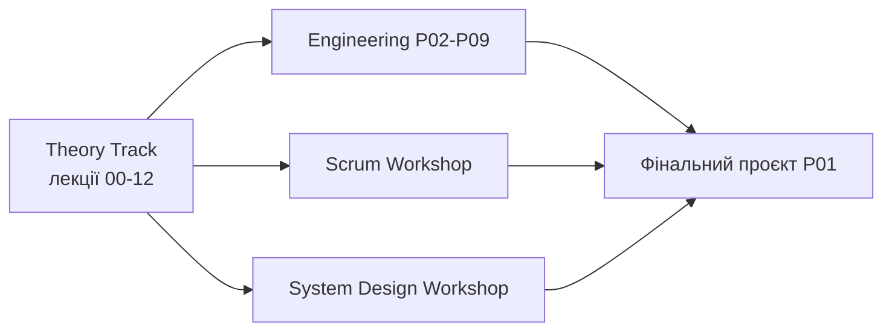

# Методологія курсу Java Engineering

Короткий опис траєкторії, семестрів і компонентів оцінювання. Детальні критерії practica та фінальних проєктів — у відповідних guide-файлах (див. розділ 4).

---

## 1. Аудиторія та передумови

- **Студенти:** 2-й курс ОНУ, спеціальності 12x (ІТ) та 113 (прикладна математика).
- **Передумови:** базове програмування на C++ (цикли, умови, функції, базове ООП).
- **Тривалість:** два семестри навчального року.

Покриття програм ЄФВВ (1-й семестр): [n03_coverage_01.md](n03_coverage_01.md).

---

## 2. Траєкторія семестрів

### Семестр 1 — Основи Java Engineering (`docs/`)

| Компонент | Обсяг | Зміст |
|-----------|-------|-------|
| Лекції | 11 (`00`–`10`) | JVM, колекції, винятки, SOLID, потоки, troubleshooting, логування, JDBC, патерни |
| Practica | 10 (`p00`–`p09`) | Git, Maven, ООП, generics, колекції, SOLID, DI, concurrency, executors |
| Ритм | 1 лекція/тиждень; practica раз на 2 тижні | |
| Фінальна робота | [n01_final_project.md](n01_final_project.md) | Консольна гра (проєктування + ООП) |

**Мета семестру:** перейти від синтаксису Java до інженерного мислення — надійний код, тести, Git, збірка Maven.

### Семестр 2 — Від вимог до розподілених систем (`docs/02_semester/`)

| Компонент | Обсяг | Зміст |
|-----------|-------|-------|
| Лекції | 15 (`00`–`12`, `01a`, `02a`) | SDLC, Agile, вимоги, NFR, QA, API, Docker, distributed systems, system design, refactoring |
| Engineering track | P02–P09 | Spring Boot, DI, production-ready API, Docker, cloud deploy, testing |
| Scrum / design workshops | `workshop_02_agile`, `workshop_03_system_design` | Церемонії Scrum, live system design |
| Фінальна робота | [p01_final_project_guide.md](02_semester/workshop/engineering/p01_final_project_guide.md) | REST API → Docker → хмара |

**Мета семестру:** повний цикл інженерії — від User Story до production-ready сервісу з CI/CD і захистом архітектури.

Філософія роботи з ШІ: [Agentic Pipeline vs Vibe Coding](02_semester/workshop/engineering/vibe_coding.md).

---

## 3. Паралельні треки (семестр 2)

- **Theory Track** — обов'язковий порядок лекцій (див. [index семестру 2](02_semester/index.md)).
- **Engineering Track** — технічні лабораторні; P01 (фінальний проєкт) інтегрує всі навички.
- **Scrum Track** — командна симуляція процесів (проєкт VARTA).

---

## 4. Компоненти оцінювання

| Компонент | Семестр | Де критерії | Примітка |
|-----------|---------|-------------|----------|
| Practica / labs | 1 і 2 | у файлах `p00`–`p09`, `p02`–`p09` | Без дублювання rubrics у цьому документі |
| Фінальний проєкт (консоль) | 1 | [n01_final_project.md](n01_final_project.md) | Окремо від іспиту |
| Фінальний проєкт (cloud) | 2 | [p01_final_project_guide.md](02_semester/workshop/engineering/p01_final_project_guide.md) + [vibe_coding.md](02_semester/workshop/engineering/vibe_coding.md) | Критерії оцінювання — лише в `vibe_coding.md` |
| Іспит | 2 (підсумковий) | [Пул екзаменаційних питань](02_semester/exam.md) | Теорія + code review / system design; **не** замінює фінальний проєкт |

**Іспит ≠ фінальний проєкт:** іспит перевіряє розуміння теорії та вміння пояснити чужий/власний код; фінальний проєкт — повний цикл розробки продукту з деплоєм.

---

## 5. Навчально-методичний комплект (НМК)

| Артефакт | Файл |
|----------|------|
| Покриття програм | [n03_coverage_01.md](n03_coverage_01.md) |
| Джерела | [sources.md](sources.md) |
| Академічна доброчесність | [DISCLAIMER.md](DISCLAIMER.md) |
| Пул екзаменаційних питань | [02_semester/exam.md](02_semester/exam.md) |
| Методологія (цей документ) | [methodology.md](methodology.md) |
| Глосарій | [02_semester/glossary.md](02_semester/glossary.md) |

---

## 6. Технічні вимоги

| Інструмент | Версія / примітка |
|------------|-------------------|
| JDK | 17 або 21 LTS |
| IDE | IntelliJ IDEA (Community або Ultimate) |
| Build | Maven |
| VCS | GitHub |
| Семестр 2 | Docker, Spring Boot, Render.com (free tier) |

Деталі — у [index 2-го семестру](02_semester/index.md#технічні-вимоги).

---

**[⬅️ Повернутися до головного меню курсу](index.md)**
