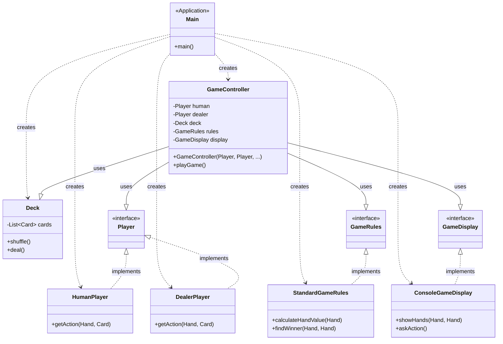

# Фінальний Проєкт: Проєктування Консольної Гри

## Вступ: Ваш "Кінцевий Продукт"

На цьому курсі ми вивчали не просто синтаксис Java, а принципи, що лежать в основі якісного програмного забезпечення. Ми говорили про SOLID, модульність, абстракції та інверсію залежностей.

Настав час застосувати ці знання.

Мета цього проєкту — **не** написати найскладнішу гру. Мета — **спроєктувати** просту систему, яка буде гнучкою, модульною та легкою для тестування. Ваш "кінцевий продукт" — це не стільки `.java` файли, скільки ваш `readme.md`, що пояснює та захищає ваш **дизайн**.

## ⚡ Експрес-опитування: Активація знань

Перш ніж почати, давайте пригадаємо:

1.  Що означає літера "S" у SOLID і чому вона найважливіша?
2.  Що означає "залежати від абстракцій, а не від реалізацій" (DIP)?
3.  Як пов'язані Інверсія Контролю (IoC) та Впровадження Залежностей (DI)?

<details markdown="1">
<summary>Згадати (відповіді)</summary>

1.  **S (Single Responsibility Principle):** Принцип єдиного обов'язку. Кожен клас чи модуль має мати лише *одну* причину для змін. Це змушує нас створювати маленькі, сфокусовані класи (наприклад, окремо логіку гри, окремо введення/виведення, окремо AI).
2.  **DIP:** Це означає, що наш код має "спілкуватися" з іншими частинами системи через **інтерфейси** (абстракції), а не "в лоб" через конкретні класи. Це робить систему гнучкою.
3.  **IoC/DI:** **IoC** — це принцип, за яким клас не створює свої залежності сам, а отримує їх ззовні. **DI** — це техніка реалізації IoC (наприклад, передача залежностей через конструктор).

</details>

-----

## Етапи Роботи над Проєктом

Ось чіткий план, за яким ви будете працювати. Кожен етап є обов'язковим.

### Етап 1: Оберіть гру (та напарника)

  * Ви можете виконувати проєкт **самостійно** або **в парі**.
  * Оберіть **одну** гру зі списку нижче (або запропонуйте свою).
  * **Важливо:** Одну й ту саму гру обирають **не більше 2-х людей** (або однієї пари) з групи.

<details markdown="1">
<summary>Список рекомендованих ігор (натисніть, щоб розгорнути)</summary>

1.  **Гра "Бики і корови"** \* **Опис:** Комп'ютер загадує 4-значне число. Гравець вводить 4-значне число. Комп'ютер повідомляє кількість "биків" (цифра вгадана і на правильному місці) та "корів" (цифра вгадана, але не на своєму місці).

      * **Фокус проєктування:** Абстрагування логіки валідації вводу, логіки генерації числа та алгоритму підрахунку (щоб їх можна було легко замінити).

2.  **Гра "Вгадай число"** \* **Опис:** Комп'ютер загадує число від 1 до 100. Гравець намагається відгадати. Комп'ютер каже "більше" або "менше".

      * **Фокус проєктування:** Абстрагування джерела вводу (гравець або AI) та алгоритму підказок.

3.  **Гра "Камінь, ножиці, папір"** \* **Опис:** Класична гра проти комп'ютера.

      * **Фокус проєктування:** Створення інтерфейсу `Player` з реалізаціями `HumanPlayer` (читає з консолі) та `AIPlayer` (генерує хід). Можливість легко додавати нові стратегії AI (напр., `PredictiveAIPlayer`, що аналізує ходи).

4.  **Гра "Хрестики-нулики"** \* **Опис:** Гра на полі 3х3.

      * **Фокус проєктування:** Розділення відповідальності: `GameBoard` (стан поля), `GameRules` (перевірка переможця), `Player` (інтерфейс для `HumanPlayer` та `AIPlayer`).

5.  **Гра "Вгадай слово" (Шибениця)** \* **Опис:** Комп'ютер загадує слово. Гравець вводить букви.

      * **Фокус проєктування:** Абстрагування "словника" (звідки беруться слова), логіки стану гри (кількість спроб) та відображення (UI).

6.  **Гра "Морський бій" (спрощена)** \* **Опис:** Гравець стріляє по координатах. Програма каже "влучив", "промазав", "потопив".

      * **Фокус проєктування:** Абстракції для `Grid` (ігрове поле), `Ship` (корабель) та `Player` (Human/AI).

7.  **Гра "Три Двері" (Парадокс Монті Голла)** \* **Опис:** Класичний парадокс з трьома дверима, призом та ведучим.

      * **Фокус проєктування:** Створення симулятора, що дозволяє програти тисячі ігор з різними стратегіями гравця (завжди міняти / ніколи не міняти) та зібрати статистику. Абстрагування ролей `Player` та `Host`.

8.  **Гра "Адаптивний Пірат"** \* **Опис:** Економічна симуляція з ресурсами (золото, припаси) та ризикованими діями (плавати, полювати, відпочивати).

      * **Фокус проєктування:** Модуль `GameState` (управління станом/ресурсами), абстрагування "подій" (шторм, скарб) та "дій" гравця.

9.  **Гра "Відгадай Кольори" (Mastermind)** \* **Опис:** Аналог "Биків і корів", але з послідовністю кольорів, що можуть повторюватись.

      * **Фокус проєктування:** Схоже на "Биків і корів", але вимагає більш складної логіки підрахунку "корів".

10. **Гра "Палички: Останній Програв"** \* **Опис:** Гравці беруть палички (1..М) з купи (N). Програє той, хто бере останню.

      * **Фокус проєктування:** Створення гнучкого AI. Інтерфейс `Player` з реалізаціями `HumanPlayer`, `RandomAIPlayer` (легкий) та `WinningStrategyAIPlayer` (складний, що прораховує виграшну позицію).

11. **Гра "Блекджек (21)"**

      * **Опис:** Спрощена версія гри в "Блекджек". Гравець грає проти комп'ютера (дилера). Мета — набрати 21 очко або більше, ніж дилер, але не "перебрати" (bust).
      * **Фокус проєктування:** Розділення гри на `Deck` (колода), `Hand` (рука гравця/дилера), `GameRules` (підрахунок очок, логіка туза, перевірка переможця) та `Player` (інтерфейс для `HumanPlayer` та `DealerAI`).

</details>

### Етап 2: Напишіть Вимоги (у `readme.md`)

  * Створіть у вашому Git-репозиторії файл `readme.md`.
  * Чітко опишіть вимоги до гри: правила, що робить гравець, що робить комп'ютер, умови перемоги та поразки.
  * **Важливо:** На цьому етапі ви чітко **фіксуєте скоуп** (обсяг) вашої "простої імплементації".

### Етап 3: Спроєктуйте Модульний Дизайн

Це **найважливіший етап**. Тут ви застосовуєте SOLID та DIP.

  * Подумайте: які "відповідальності" (SRP) є у вашій грі? (Напр.: логіка гри, введення/виведення, стан, AI).
  * Створіть **інтерфейси** (абстракції) для кожної відповідальності.
  * Опишіть ваш дизайн у `readme.md`. Які класи та інтерфейси ви плануєте створити? Як вони будуть взаємодіяти?
  * **(Додаткові бали)** Намалюйте просту **UML-діаграму класів**, що показує ваші інтерфейси та реалізації, і додайте її зображення у `readme.md`.

### Етап 4: Зробіть Просту Імплементацію

  * Напишіть код, що реалізує ваш дизайн.
  * **Фокус:** Імплементація має бути **простою**, але **відповідати** вашому дизайну (інтерфейсам).

### Етап 5: Захист проєкту

  * Під час захисту ви маєте продемонструвати робочу програму.
  * Головна частина захисту — **це не показ коду**. Це **захист вашого дизайну**.
  * Будьте готові відповісти, чому ви обрали саме таку архітектуру, як ви застосували SOLID, і як ваш дизайн дозволяє легко додати нові "розширення" (наприклад, нового AI або інший UI).

**Розширення гри:** (наприклад, складніший AI, графічний інтерфейс) обговорюються індивідуально після того, як базовий дизайн буде реалізовано та захищено.

-----

## 🤔 Давайте поміркуємо: Приклад проєктування

**Завдання:** Беремо гру "Хрестики-нулики". Які *інтерфейси* (абстракції) тут можна виділити, щоб дотриматися SRP та DIP?

<details markdown="1">
<summary>Приклад відповіді (мій варіант)</summary>

Щоб уникнути "спагеті-коду", де все змішано в `Main.java`, ми можемо виділити щонайменше 4 відповідальності:

1.  **`Player` (Гравець):** Абстракція, що описує "того, хто робить хід".
      * *Реалізації:* `HumanPlayer` (читає хід з консолі), `AIPlayer` (обчислює хід).
2.  **`GameBoard` (Ігрове Поле):** Абстракція, що відповідає за стан поля.
      * *Методи:* `makeMove(int x, int y, char symbol)`, `isCellEmpty(int x, int y)`, `printBoard()`.
3.  **`GameRules` (Правила Гри):** Абстракція, що знає, як перевіряти стан гри.
      * *Методи:* `checkWinner(GameBoard board)`, `isDraw(GameBoard board)`.
4.  **`GameController` (Керівник Гри):** Високорівневий модуль, що керує процесом, залежить *тільки* від трьох попередніх інтерфейсів і нічого не знає про консоль чи конкретні AI-стратегії.

</details>

-----

## 🚀 Приклад Повного Циклу Проєктування: Гра "Блекджек (21)"

Ось як може виглядати виконання проєкту крок за кроком на прикладі гри "Блекджек".

### Етап 2: Вимоги (Початковий `readme.md`)

<details markdown="1">
<summary>Приклад початкового файлу <code>readme.md</code> (натисніть, щоб розгорнути)</summary>

# Проєкт "Консольний Блекджек"

Цей проєкт є простою реалізацією гри "Блекджек (21)" для одного гравця проти комп'ютерного дилера.

## 1\. Вимоги (Проста Імплементація)

### 1.1. Загальні правила

  * **Мета:** Набрати більше очок, ніж Дилер, але не перевищити 21.
  * **Гравці:** 1 Гравець (Людина) проти 1 Дилера (Комп'ютер).
  * **Перемога:** Гравець виграє, якщо його рахунок ближчий до 21, ніж у Дилера, або якщо Дилер "перебрав" (більше 21).
  * **Поразка:** Гравець програє, якщо він "перебрав" (більше 21), або якщо його рахунок менший за рахунок Дилера (який не перебрав).
  * **Нічия (Push):** Якщо у Гравця та Дилера однакова кількість очок (і ніхто не перебрав).

### 1.2. Ігрові Сутності

  * **Колода:** Використовується стандартна колода з 52 карт (4 масті, 13 рангів).
  * **Підрахунок очок:**
      * Карти 2-10: Рахуються за номіналом.
      * Король (K), Дама (Q), Валет (J): Рахуються як 10 очок.
      * Туз (A): Рахується як 11 очок, **але** якщо сума руки перевищує 21, Туз починає рахуватися як 1 очко.

### 1.3. Ігровий Процес

1.  Гра починається. Колода тасується.
2.  Гравець отримує дві карти (лицем догори).
3.  Дилер отримує дві карти (одна лицем догори, одна лицем вниз).
4.  **Хід Гравця:**
      * Гравець бачить свої карти, їхню суму та відкриту карту Дилера.
      * Гравець може обрати "Hit" (Взяти ще) або "Stand" (Зупинитись).
      * Якщо Гравець бере карту і його сума перевищує 21 ("Бюст"), він негайно програє.
      * Гравець продовжує брати карти, доки не скаже "Stand" або не "перебере".
5.  **Хід Дилера:**
      * Якщо Гравець не "перебрав", Дилер відкриває свою другу карту.
      * **Стратегія Дилера:** Дилер завжди бере карту ("Hit"), якщо його сума 16 або менше. Дилер завжди зупиняється ("Stand"), якщо його сума 17 або більше.
      * Якщо Дилер "перебирає", Гравець виграє.
6.  **Визначення переможця:**
      * Якщо ніхто не "перебрав", їхні руки порівнюються. Виграє той, у кого сума ближча до 21.

### 1.4. Поза скоупом (Scope)

У цій простій імплементації **ВІДСУТНІ**:

  * Ставки (Betting).
  * Спліт (Split).
  * Дабл-даун (Double Down).
  * Використання кількох колод (Multiple Decks).

-----

## 2\. Дизайн Системи (Проєктування)

Система буде побудована на принципах SOLID та Інверсії Залежностей (DIP), щоб розділити відповідальності та забезпечити гнучкість.

### 2.1. Архітектурні Принципи

  * **SRP (Single Responsibility):** Логіка розділена на компоненти: `Deck` (керує колодою), `GameRules` (рахує очки), `Player` (приймає рішення), `GameController` (керує грою).
  * **DIP (Dependency Inversion):** `GameController` (високорівневий модуль) не залежатиме від `HumanPlayer` чи `ConsoleDisplay` (низькорівневі модулі), а від їхніх абстракцій (`Player`, `GameDisplay`).

### 2.2. Компоненти (Інтерфейси та Класи)

  * `model.Card` (record): Представляє карту (напр., `ACE of HEARTS`).
  * `model.Hand`: Клас, що зберігає `List<Card>` для гравця.
  * `service.Deck`: Клас, що створює, тасує (`shuffle()`) та роздає (`deal()`) карти.
  * **`interfaces.Player`**: Інтерфейс для гравця.
      * `getAction(Hand myHand, Card dealerUpCard)`: Повертає рішення (`HIT` або `STAND`).
  * `service.HumanPlayer` (implements `Player`): Реалізація, що питає хід у консолі.
  * `service.DealerPlayer` (implements `Player`): Реалізація AI (б'є до 17).
  * **`interfaces.GameRules`**: Інтерфейс для правил.
      * `calculateHandValue(Hand hand)`: Рахує очки (враховуючи логіку Тузів).
      * `findWinner(Hand playerHand, Hand dealerHand)`: Визначає переможця.
  * `service.StandardGameRules` (implements `GameRules`): Конкретна реалізація правил.
  * **`interfaces.GameDisplay`**: Інтерфейс для вводу/виводу.
      * `showWelcome()`, `showHands(...)`, `askAction()`, `showResult(...)`.
  * `service.ConsoleGameDisplay` (implements `GameDisplay`): Реалізація, що пише в консоль.
  * `GameController`: Головний клас, що керує грою. Отримує всі залежності (`Deck`, `Player`, `Dealer`, `GameRules`, `GameDisplay`) через конструктор.

### 2.3. UML-діаграма (спрощена)

*(Тут бажано б додати зображення діаграми)*



</details>

-----

### Етап 3 та 4: Імплементація (Структура Пакетів)

Після проектування, структура пакетів `src/main/java` виглядає так, чітко відображаючи дизайн:

```
com/mygame/blackjack/
├── Main.java                 // "Збирач" (Assembler), створює об'єкти та запускає гру
├── GameController.java       // Високорівневий клас, керує логікою гри

├── interfaces/               // Абстракції (DIP)
│   ├── GameDisplay.java
│   ├── GameRules.java
│   └── Player.java

├── model/                    // Моделі даних (прості класи/записи)
│   ├── Action.java           // enum (HIT, STAND)
│   ├── Card.java             // record (Suit, Rank)
│   ├── Hand.java
│   ├── Rank.java             // enum (ACE, TWO, ... KING)
│   └── Suit.java             // enum (HEARTS, DIAMONDS, ...)

└── service/                  // Низькорівневі реалізації
    ├── ConsoleGameDisplay.java   // Реалізує GameDisplay
    ├── DealerPlayer.java       // Реалізує Player (AI)
    ├── Deck.java
    ├── HumanPlayer.java        // Реалізує Player (ввід з консолі)
    └── StandardGameRules.java  // Реалізує GameRules
```

-----

### Етап 5: Захист та ... Нові Вимоги (Розширення)

Ви успішно захистили проєкт. Тепер бізнес (я) приходить до вас з новими вимогами.

**Нові Вимоги (Розширення):**

1.  **Ставки:** Гравець має починати зі 100 "кредитів" і робити ставку (min 10) перед кожним раундом.
2.  **Новий AI:** Потрібно додати "Агресивного Дилера", який б'є до 17, *тільки якщо* його рахунок менший за рахунок гравця (інакше він зупиняється, сподіваючись, що гравець "перебере").

#### Як наш дизайн допомагає?

Завдяки дотриманню OCP та DIP, нам **не потрібно змінювати** `GameController`, `HumanPlayer`, `Deck`, `StandardGameRules` чи `ConsoleGameDisplay`.

#### Оновлення `readme.md` (Показуємо тільки зміни)

```markdown
... (попередній текст) ...

## 3. Нові Вимоги (Розширення)

1.  **Управління Ставками:**
    * Гравець починає зі 100 кредитів.
    * Перед кожним раундом гравець робить ставку (мін. 10).
    * При виграші ставка подвоюється, при програші — втрачається.
    * Гра закінчується, коли у гравця 0 кредитів.
2.  **Нова Стратегія AI:**
    * Додати "Агресивного Дилера": він б'є до 17, *тільки якщо* його поточний рахунок менший за фінальний рахунок гравця.

## 4. Оновлений Дизайн для Розширень

Архітектура була розроблена з урахуванням Принципу Відкритості/Закритості (OCP).

* **Для Ставок:**
    * Ми вводимо новий компонент `Wallet` (Гаманець) для управління кредитами (SRP).
    * Цей гаманець буде *впроваджено* (DI) в `GameController` та `ConsoleGameDisplay`, щоб вони могли керувати ставками та відображати баланс. `GameController` тепер також керує логікою виплат.
* **Для Нового AI (OCP в дії):**
    * Нам **не потрібно** змінювати існуючий `DealerPlayer`.
    * Ми просто створюємо **новий клас** `AggressiveDealerPlayer`, який реалізує той самий інтерфейс `Player`.
    * У `Main.java` ми просто "впровадимо" нову реалізацію в `GameController`, і вся гра працюватиме по-новому, не знаючи про зміни.

```

#### Оновлена Структура Пакетів (Показуємо тільки зміни)

```
com/mygame/blackjack/
├── Main.java                 // ОНОВЛЕНО (тепер створює AggressiveDealerPlayer та Wallet)
├── GameController.java       // ОНОВЛЕНО (отримує Wallet, керує ставками)

├── interfaces/
│   └── Player.java           // БЕЗ ЗМІН
│   ...

├── model/
│   ├── Wallet.java           // НОВИЙ КЛАС (зберігає баланс, керує ставками)
│   └── ...                   // (інші без змін)

└── service/
    ├── AggressiveDealerPlayer.java // НОВИЙ КЛАС (реалізує Player)
    ├── ConsoleGameDisplay.java   // ОНОВЛЕНО (тепер питає про ставку, показує баланс)
    ├── DealerPlayer.java       // БЕЗ ЗМІН
    ├── HumanPlayer.java        // ОНОВЛЕНО (тепер також керує своїм гаманцем)
    └── StandardGameRules.java  // БЕЗ ЗМІН
```

-----

## ✅ Контрольні питання

1.  У чому полягає "кінцевий продукт" цього проєкту? (Підказка: це не лише `.java` файли).
2.  Ви обрали гру "Палички: Останній Програв". Ваш напарник пропонує логіку AI (вибір ходу комп'ютера) написати прямо всередині головного ігрового циклу в класі `Main`. Який принцип SOLID це порушить в першу чергу і чому?
3.  Навіщо в вимогах є пункт "спроєктувати модульний дизайн" *перед* пунктом "зробити імплементацію"?
4.  Як UML-діаграма (або просто опис інтерфейсів) у `readme.md` допомагає вам на захисті проєкту?

<details markdown="1">
<summary>Відповіді (спробуйте спочатку відповісти самі)</summary>

1.  Кінцевий продукт — це **гнучкий, модульний дизайн**, що дотримується принципів SOLID, та **документація** (`readme.md`), яка пояснює і захищає цей дизайн. Проста імплементація є лише *доказом* того, що дизайн працює.
2.  Це грубо порушить **Принцип єдиного обов'язку (SRP)**. Клас `Main` (або `GameController`) має відповідати *тільки* за *керування потоком гри* (черга ходів, перевірка переможця). Логіка *прийняття рішення* (стратегія AI) — це абсолютно інший обов'язок, який має бути винесений в окремий клас (напр., `AIPlayer`).
3.  Тому що це і є **інженерний підхід**. Спочатку ми проєктуємо систему (думаємо), а потім пишемо код. Це дозволяє створити гнучку архітектуру. Якщо писати код одразу, ви майже гарантовано отримаєте "спагеті-код", який потім неможливо змінити, не переписавши все з нуля.
4.  Діаграма візуально демонструє, що ви думали в термінах **абстракцій** (інтерфейсів), а не просто класів. Вона показує, що ви дотрималися Принципу інверсії залежностей (DIP) і ваша система є гнучкою, оскільки ви можете легко "підмінити" одну реалізацію (напр., `RandomAI`) іншою (`StrategyAI`), не змінюючи решту коду.

</details>