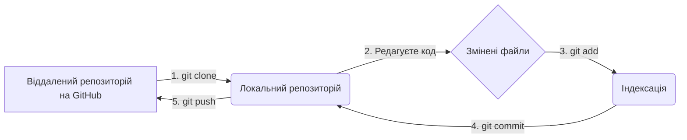

# Практикум 0: Робочий процес з Git та GitHub для завдань з Java

> **Декларація курсу.** Академічна доброчесність та авторство матеріалів — у [DISCLAIMER.md](DISCLAIMER.md).


## ⚡ Експрес-опитування: Навіщо нам це?

На [вступній лекції](00_intro.md) ми говорили про "індустріальний підхід" до розробки.

1.  Як ви думаєте, що станеться, якщо 5 розробників будуть працювати над одним проєктом, просто перекидаючи файли у спільному чаті?
2.  Ви випадково видалили робочий код і хочете повернути версію, яка була "вчора о 17:00". Як це зробити без спеціальних інструментів?
3.  Що таке "система контролю версій", яку ми згадували на лекції?

<details markdown="1">
<summary>Наші очікування (відповідь)</summary>

1.  Почнеться хаос. Хтось затре зміни іншого. Буде неможливо зрозуміти, яка версія файлу є "останньою" та "правильною".
2.  Ніяк. Код втрачено назавжди.
3.  Це і є той самий інструмент, який вирішує обидві ці проблеми. Сьогодні ми навчимося ним користуватися.

</details>

## Навіщо нам Git та GitHub?

На цьому курсі всі завдання ми будемо виконувати та здавати з використанням двох інструментів — Git та GitHub. Важливо розуміти різницю між ними.

  * **Git 📜:** Це **система контролю версій**. Уявіть її як "машину часу" для вашого коду. Вона дозволяє зберігати "знімки" (версії) вашого проєкту, відстежувати всі зміни, повертатися до попередніх версій, якщо щось пішло не так, і бачити, хто і коли змінив код. Це стандарт в індустрії розробки ПЗ.

  * **GitHub ☁️:** Це **веб-сервіс для хостингу Git-репозиторіїв**. Якщо Git — це інструмент, то GitHub — це "хмарне сховище" для проєктів, що використовують Git. Він дозволяє нам зберігати наш код онлайн, ділитися ним та здавати завдання.

-----

## Ключові концепції

Перш ніж почати, давайте розберемося з базовою термінологією.

  * **Репозиторій (Repository / Repo):** Це тека з файлами вашого проєкту, для якої Git відстежує історію змін. Існує **локальний репозиторій** (на вашому комп'ютері) та **віддалений** (на GitHub).
  * **Гілка (Branch):** Це незалежна лінія розробки. За замовчуванням основна гілка називається **`main`**. Всі завдання ми будемо робити в цій гілці.
  * **Клонування (Clone):** Створення локальної копії віддаленого репозиторію з GitHub на вашому комп'ютері.
  * **Коміт (Commit):** Створення "знімку" поточного стану ваших файлів у локальному репозиторії. Кожен коміт має унікальний ID та опис.
  * **Пуш (Push):** Відправка ваших локальних комітів на віддалений репозиторій (GitHub).

**Загальний робочий процес виглядає так:**



-----

## Покрокова інструкція для виконання завдань

### Крок 0: Разова підготовка

Ці дії потрібно виконати лише один раз на початку курсу.

#### 1\. Реєстрація на GitHub

Якщо у вас ще немає акаунта, зареєструйтеся на сайті [github.com](https://github.com).

#### 2\. Створення репозиторію

Створіть новий репозиторій для ваших завдань.

  * У правому верхньому куті натисніть **`+`** і виберіть **New repository**.
  * **Repository name:** Введіть назву, наприклад, `java-course-homeworks`.
  * **Public/Private:** Ви можете обрати **`Private`**, якщо не хочете, щоб інші бачили ваш код.
  * ✅ **Add a README file:** **Обов'язково** поставте цю галочку. Це створить репозиторій з початковим файлом.
  * **Add .gitignore:** Оберіть у шаблоні `Java`. Це допоможе ігнорувати файли, які не потрібно додавати до репозиторія (наприклад, скомпільовані `.class` файли).
  * **Choose a license:** Коротко про вибір ліцензії — для навчальних проєктів найкраще підходить **MIT License**. Вона дуже проста і дозволяє іншим вільно використовувати ваш код.
  * Натисніть **Create repository**.

#### 3\. Клонування репозиторію

Тепер вам потрібно скопіювати цей репозиторій на ваш комп'ютер.

  * На сторінці репозиторію натисніть зелену кнопку **`< > Code`**.
  * Скопіюйте URL (переконайтеся, що обрано HTTPS).
  * Відкрийте термінал (або Git Bash на Windows) і виконайте команду:
    ```bash
    git clone [https://github.com/ВАШЕ_ІМ'Я/java-course-homeworks.git](https://github.com/ВАШЕ_ІМ'Я/java-course-homeworks.git)
    ```

Після цього на вашому комп'ютері з'явиться тека `java-course-homeworks`.

### Крок 1: Робота над завданням (приклад HelloWorld)

1.  **Перейдіть у теку репозиторію:**
    ```bash
    cd java-course-homeworks
    ```
2.  **Створіть файл `HelloWorld.java`** і додайте до нього наступний код:
    ```java
    public class HelloWorld {
        public static void main(String[] args) {
            System.out.println("Hello, World!");
        }
    }
    ```
3.  **Скомпілюйте та перевірте:**
    ```bash
    javac HelloWorld.java
    java HelloWorld
    ```
    Ви маєте побачити напис "Hello, World\!".

### Крок 2: Збереження та відправка роботи

Тепер, коли код працює, потрібно зберегти зміни та відправити їх на GitHub.

1.  **Перевірте статус:** Ця команда покаже, які файли були змінені.
    ```bash
    git status
    ```
2.  **Додайте файли до індексації:** Ця команда готує ваші зміни до "знімку". Крапка (`.`) означає "всі змінені файли".
    ```bash
    git add .
    ```
3.  **Зробіть коміт:** Збережіть "знімок" з коротким описом того, що було зроблено.
    ```bash
    git commit -m "Add HelloWorld task"
    ```
4.  **Відправте зміни на GitHub:**
    ```bash
    git push
    ```
5.  **Перевірте результат:** Зайдіть на сторінку вашого репозиторію на GitHub. Ви побачите там файл `HelloWorld.java` та ваш останній коміт.

-----

## ✅ Контрольні питання

1.  **Концепція.** У чому полягає різниця між Git та GitHub?
2.  **Робочий процес.** Опишіть послідовність з трьох основних Git-команд, які потрібно виконати, щоб відправити готові зміни з вашого локального комп'ютера на GitHub.
3.  **Застосування.** Ви створили новий файл `Task2.java` і змінили існуючий `README.md`. Яку команду потрібно виконати, щоб підготувати до коміту **тільки** файл `Task2.java`?

<details markdown="1">
<summary>Відповіді (спробуйте спочатку відповісти самі)</summary>

1.  **Git** — це *інструмент* (програма), система контролю версій, яка працює локально на вашому комп'ютері та відстежує зміни ("машина часу"). **GitHub** — це *веб-сервіс* (сайт), який надає "хмарний хостинг" для ваших Git-репозиторіїв, щоб ви могли зберігати їх онлайн та ділитися ними.
2.  Послідовність команд:
    1.  `git add .` (або `git add <file>`) — щоб "підготувати" зміни до коміту.
    2.  `git commit -m "Опис змін"` — щоб "зберегти" знімок локально.
    3.  `git push` — щоб "відправити" локальні коміти на GitHub.
3.  Потрібно вказати конкретний файл замість крапки: `git add Task2.java`. Команда `git status` після цього покаже, що `Task2.java` готовий до коміту, а `README.md` все ще залишається "непідготовленим".

</details>